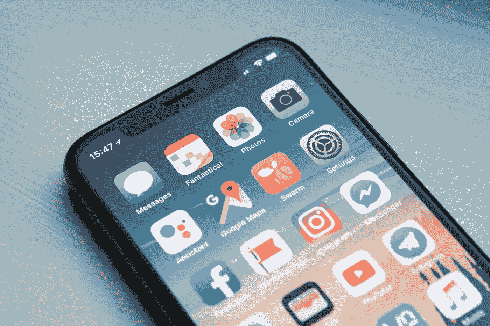
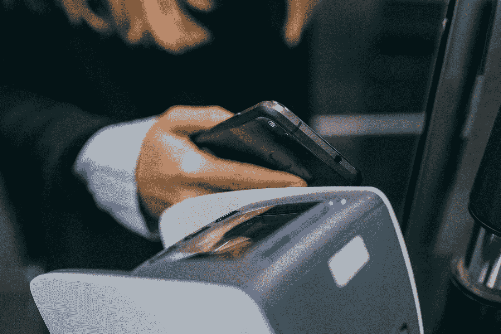
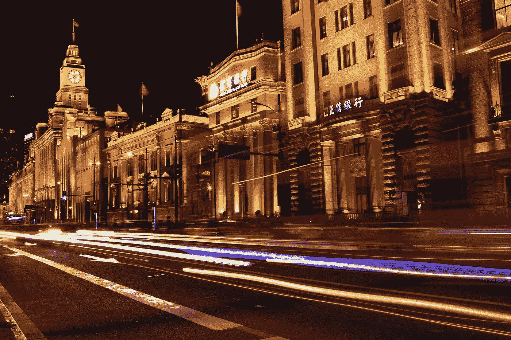

# 为什么我们现在比以往任何时候都更需要善用科技

> 原文：<https://medium.datadriveninvestor.com/why-we-must-use-tech-for-good-now-more-than-ever-b9860389650b?source=collection_archive---------32----------------------->

新冠肺炎从本质上改变了世界的运作方式。至少目前是这样。

世界各地都感受到了病毒的影响，许多国家实施了严格的封锁，以帮助“拉平曲线”，提高“击败”病毒的机会。

我们从根本上被彻底震撼了。

但是并没有失去一切。

科技是来拯救我们的！

这是真的吗？

我本质上是一名技术专家(专门研究我们如何利用数据来改善决策)，但我非常清楚，我只掌握了真正做到名副其实所需的一小部分知识。

 [## 数据驱动始于数据素养|数据驱动的投资者

### 光是听到“数据”这个词就令人生畏。老实说，只有 21%的全球员工对自己的工作充满信心

www.datadriveninvestor.com](https://www.datadriveninvestor.com/2020/03/22/data-driven-starts-with-data-literacy/) 

我知道技术在当今社会中扮演着非常重要的角色，虽然我理解它的优点，但我对我们如何在当前需要的时候使用这一工具深感担忧。

技术既可以用于好的方面，也可以用于坏的方面。

Photo by [William Hook](https://unsplash.com/@williamtm?utm_source=medium&utm_medium=referral) on [Unsplash](https://unsplash.com?utm_source=medium&utm_medium=referral)

# 严重的

看看唐纳德·特朗普(Donald Trump)使用 Twitter 造成的混乱就知道了。

完全不受限制地接触数百万人意味着他能够不受限制地(通常是无意义地)向关注他的人发推特。许多前任美国总统都没有这种机会。

窥探丑闻可以进一步证明技术上的不当行为，谷歌等科技巨头在未经我们同意的情况下，获取了智能手机上记录的数据。

再加上剑桥分析公司(Cambridge Analytica)等公司对选举的干预，人们对大公司和整个科技行业的不信任感越来越强。

# 好的

相反，通过 Zoom(或其他视频会议平台)，技术可以带来的好处是显而易见的。

事实上，汤姆·摩尔船长在 99 岁高龄时还能通过步行 100 米的后花园筹集到 3000 万英镑，如果没有社交媒体，这可能会更难。

这还没有考虑对基因组图谱、疫苗接种测试和感染建模等情况的直接影响。

我绝对相信科技可以改变世界。为了更好。

但是我真的很担心。

当日子艰难时，我们既看到最好的人，也看到最坏的人。

那些利用技术从疫情中获利的人，例如购买大量酒精洗手液以高额加价出售的人——谢天谢地，他被亚马逊屏蔽了，现在坐拥浪费的金钱和大量洗手液。

我认为我们轻率地陷入的困境是:

是的，我们需要拓展现代科学的边界和造福数百万人的能力，但我们如何权衡这一点与“公司应该从如此糟糕的情况中获利吗？”的伦理问题呢？

亚当·斯密开创的资本主义方法意味着，在任何特定的情况下，总会有人想要赚钱。过去，对冲基金因在严峻形势下获利而名声不佳，但我确实相信，它不再局限于这些投资工具。

**进步**意味着我们拓展可能性的边界——去别人从未去过的地方。

据英国媒体上周报道，通常需要 9 个月才能完成的初始疫苗方法，在 4 周的大部分时间里已经实现。

这是惊人的。

我要向每一个为实现这一目标而全天候工作的人致敬。

我真心希望这一由少数人代表数百万人做出的巨大努力能够拯救生命，帮助生活回归(某种)正常。

技术无疑有助于实现这一目标。

先进的计算、建模和复杂的工作，在过去几年需要几个月的时间，在创纪录的时间内完成了。

反之，在同一枚[硬币](https://www.datadriveninvestor.com/glossary/coin/)的另一面，有人会**从中获利**。

当疫苗最终被制造出来并分发到全世界时，制药公司会免费传递吗？

我的猜测可能不是。

这是世界需要的疫苗，应该提供给每个需要的人。没有如果或者但是。

可悲的是，我不相信这会发生。

某个地方的某个人会从这种疫苗中发财。在某种程度上，我不能责怪他们，因为这归结于供求关系。

但是从别人的不幸中获利是对的吗？

道德问题应该在政治家、首席执行官和其他资深政治家和女性的耳朵里大声响起。

我们不能也不应该忽视伦理方面的考虑。

随着世界陷入封锁，许多企业(无论大小)都在努力应对贸易急刹车，独创性和恐慌开始推动决策。

数百万人的生计受到了负面影响。

我们不能低估这造成的破坏，这将需要几十年才能解决。英国政府承诺支持企业和个体户，但使用的资金需要偿还。

在未来的许多年里，我们都将为此付出代价。

但这是必要的。

Photo by [Jonas Leupe](https://unsplash.com/@jonasleupe?utm_source=medium&utm_medium=referral) on [Unsplash](https://unsplash.com?utm_source=medium&utm_medium=referral)

问题是我们如何权衡生命成本和经济成本？

唐纳德·特朗普(Donald Trump)渴望重新开放美国，这损害了许多生病和患病的人。据《泰晤士报》报道，目前的估计表明英国经济每天损失约 24 亿英镑(而经济实际上已经关闭)，重新开放的临界点是什么？

我只能想象这对美国和世界经济的影响！

一个国家每关闭一天，权衡是否需要重新开放(尽管是分阶段的)就变得越来越重要。

因此，看看人们的反应是很有趣的。

因亚马逊而出名的杰夫·贝索斯已经开始脱离亚马逊帝国的日常运营，转而专注于“副业”和更多的慈善事业。冠状病毒迫使他来了个大转弯。

和苹果这样的公司一起，亚马逊有能力改变世界。不仅从财务的角度(每个都有大量的现金储备)，而且从可及的角度。

亚马逊在此期间的反应将决定贝佐斯的遗产。

他想被视为没有竭尽全力拯救世界的人吗？这将在未来几年对亚马逊品牌的价值产生实质性影响吗？

时间和公众情绪会证明一切，但可以说，他现在比以往任何时候都更清楚这一点。

方公司(脸书、亚马逊、网飞和谷歌)有道德责任利用他们建立的平台造福世界。

从历史上看，对大型科技公司的不信任一直很普遍:

*   *通过使用个人数据(如剑桥分析公司)，*
*   *窥探(未经许可在后台捕捉数据的应用，如谷歌)，或*
*   *有针对性的建议(俄罗斯对选举的影响，如脸书)。*

如果我问你，你会想到哪些人会善用科技，你会怎么说？

我相信很多人会说比尔和梅林达盖茨。

这两个国家试图解决世界上最大问题的资金、支持和活力是非常令人钦佩的。

无论是解决发展中国家缺乏卫生设施的问题，还是试图让世界摆脱脊髓灰质炎，这些都是巨大的挑战。

比尔和梅林达·盖茨基金会最令人高兴的是他们正在采取行动。他们没有坐拥如此巨大的财富，认为“这不是我的问题”。

我知道有一个故事，比尔·盖茨的母亲说，她没有把孩子培养成自私的人，作为少数几个能够真正改变世界的人之一，他应该利用他的金钱和影响力来这样做。

没错，他们是慈善事业的领军人物，但他们把钱花在了实处。

最近几天，Twitter 的杰克·多西承诺向#StartSmall 提供超过 10 亿美元的 Square 股票，以帮助击败新冠肺炎。这是一大笔钱，有望加快疫苗的研发进程。

我敏锐地意识到，还有许多人在支持那些不为公众所知或不太为人所知的惊人事业。我感谢他们所有人。

但是我们都必须尽我们所能。

致杰夫·贝索斯、马克·扎克伯格等人。这是你们站出来的时候了。请不要到处乱跑。世界需要你。

你被赋予了一个不可思议的机会去影响这个世界，让它变得“更好”，所以请不要错过它。

技术给了你这个基础。

你现在用它做的事情将会被历史记录下来，并在未来的岁月里被分析。

Photo by [George Liu](https://unsplash.com/@georgeliu93?utm_source=medium&utm_medium=referral) on [Unsplash](https://unsplash.com?utm_source=medium&utm_medium=referral)

少数人影响多数人的能力现在比以往任何时候都更加普遍。“利润在这些技术领袖的心目中排在什么位置？”这样的想法不无道理

我希望他们能帮助把生命放在第一位，但这并不总是一个显而易见的结论。

所以，现在的问题是*“我们如何解决这种没有胜算的局面？”*

**我相信科技会有所帮助，但我们必须把它用在好的方面。**

现在信息传播的速度比过去快了许多倍，我们在建模和科学进步中可以处理的复杂性正在以惊人的速度发展，通过智能助理改善生活是显而易见的。

我真心希望旅行的方向是积极的，为了大众的利益。

技术发挥着越来越重要的作用，但这只是一个方面。

那些掌握和控制大量资源的人就是林奇销。这是他们闪光的时刻，展示他们与我们同在，让世界变得安全，最终变得更好。

但是，当情况开始好转，我们开始重新获得新冠肺炎失去的一些自由时，会发生什么呢？我们会记住危机中的教训吗？

我希望如此，但恐怕不行。

只有时间能证明，在 12 个月的时间里，我们会从这次前所未有的经历中吸取经验教训，让生活变得更好，还是会迅速恢复原状，忽略学到的经验教训？

如果 2008-2009 年的金融危机可以借鉴的话，我内心的悲观主义者认为我们什么也没学到。但我真心希望我错了。

如果你想让我告诉你怎么做，那就别担心，开始做吧 请[点击此处](https://wondrous-knitter-2652.ck.page/c218ea64d6)。

*原载于 2020 年 5 月 5 日 https://www.datadriveninvestor.com***。**