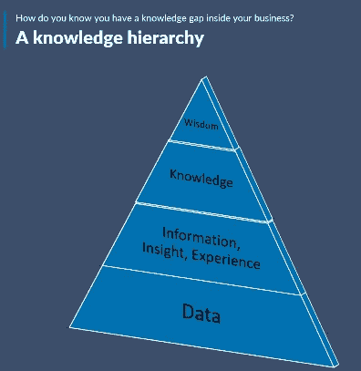

# 为什么我们需要和年龄是我们两倍的人交往

> 原文：<https://medium.datadriveninvestor.com/why-we-need-to-hang-with-people-2x-our-age-9c721a5ca629?source=collection_archive---------32----------------------->

## 生活建议

*   将它们带入我们生活的 5 个策略

Photo by [Vlad Sargu](https://unsplash.com/@vladsargu?utm_source=medium&utm_medium=referral) on [Unsplash](https://unsplash.com?utm_source=medium&utm_medium=referral)

> 智慧和知识是截然不同的。寻找一个而不寻找另一个是潜在的威胁。

我的一生中，我很幸运能和年龄比我大一倍的人保持密切联系。

即使进入我的职业生涯，只要有机会坐在一个明智的、*面前，我都会抓住这个机会。*

*在这个世界上，我们似乎高估了青春，而低估了年龄以及由此而来的智慧和经验，这对我们来说很重要。*

* [## 改善之旅始于福祉|数据驱动的投资者

### 一场普遍的健康危机让人们认识到将健康融入工作文化的重要性。过去的陈词滥调已经…

www.datadriveninvestor.com](https://www.datadriveninvestor.com/2020/06/01/journey-of-improvement-starts-with-well-being/) 

这一点直到最近我才意识到，这些年来，当我思考年龄是我两倍的人对我的生活产生的影响，以及这些人在各个层面上所带来的巨大价值时。

无论是准备结婚、职业转换还是洲转换，这些经验丰富的生活老手分享的智慧和经验帮助我在那一刻做出了最好的决定。

聪明是一回事——这就是为什么我们在像 [Medium](https://medium.com/u/504c7870fdb6?source=post_page-----9c721a5ca629--------------------------------) 这样的平台上阅读文章。我们渴望知识。我们渴望联系。我们渴望能给我们生活带来优势的建议。在一个越来越沉闷的世界里，我们渴望智力上的刺激。

Courtesy: Shaw Academy

当我们继续满足这些渴望时，与年龄是我们两倍的人一起喝虚拟咖啡、打电话或远距离散步，会给我们一些其他同龄人无法提供的东西。

为了从合适的人那里寻求人生旅途中的智慧，这里有 5 个小贴士，可以确保和年龄比你大一倍的人交往是适合你的。* 

# *只寻找你愿意与之交换位置的人*

*不要接受你不愿与之交换位置的人的建议。 这是一个关键性的决定。例如，几年前有人试图给我生活方式的建议，他很肥胖，患有 II 型糖尿病，并经历了离婚。我爱他，但我会接受他的生活方式建议吗？大概不会。*

*当你到了他们的年龄时，找一个你渴望成为的人，然后去寻找他们。*

# *拿起电话*

*如果你真的想和年龄比你大一倍的人交流，建议你拿起电话给他们打个电话。这是一个基本的斯蒂芬·科维的东西— ***先找明白。*** 要明白，年龄比你大一倍的人可能更喜欢听到你的声音，而不是短信或电子邮件。尤其是如果你已经和他们有了某种联系或短暂的关系。*

# *真实可信*

*和上面类似，做真实的，真实的自己。要真诚。一个经验丰富的生活老手会马上感觉到不真实，这对你们都没有好处。花时间和年龄是你两倍的人在一起来推进你的事业不应该是目标。 ***目标应该是去了解他们，并与他们建立能为他们提供多年(甚至几十年)建议的关系。****

# *保持更新*

*一旦你邀请了一位生活中的老手进入你的生活，让他们不时地更新。请记住，你可能正处于人生的繁忙时期，但你寻求建议的那个人可能会让生活节奏慢一点。他们会喜欢不时收到你的来信，看看你在忙些什么。他们出现在你的生活中是有原因的，所以每个季节至少给他们一次生活更新。*

# *寄张卡片*

*没有什么比收到好邮件更好的了——即使在 20 世纪 20 年代。好邮件不是账单、政治备忘录或试图向你推销东西的人。每年在精心挑选的卡片上写下一张便条，让他们知道你在想念他们。*

*正如本杰明·富兰克林曾经说过的那样，“对知识的投资总是会有最好的回报。”智慧就像存款利息带来的红利，我们每个人都有责任为人生的成功打包一个投资组合。*

*我们是我们周围五个人的产物。在这五分钟里给老前辈留出空间，当你继续在职业生涯、工作和人际关系中导航时，他们能为你提供很多。*

## *赖安(男子名)*

## *访问专家视图— [订阅 DDI 英特尔](https://datadriveninvestor.com/ddi-intel)*