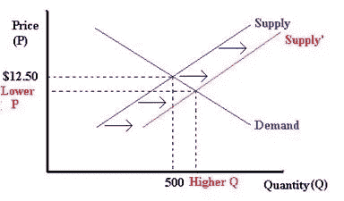

# 为什么我们应该让儿童保育行业倒闭

> 原文：<https://medium.datadriveninvestor.com/why-we-should-let-the-childcare-industry-fail-dc38cec0fec3?source=collection_archive---------13----------------------->

## 让儿童保育失败将如何改善每个人的生活

Photo by [Markus Spiske](https://unsplash.com/@markusspiske?utm_source=medium&utm_medium=referral) on [Unsplash](https://unsplash.com?utm_source=medium&utm_medium=referral)

儿童保育是一种现代现象。

在女性开始进入劳动力市场之前，这是没有必要的。女人抚养孩子，男人去工作。

我们现在处于一个新的时代，女性现在可以有自己的事业，这无疑是一件好事，也是社会所接受的。

但我们不能忽视这种做法明显的经济性和弊端。

## 劳动力增加的负面影响

当更多的人加入劳动力大军时，公司对工人的需求就会降低。这反过来降低了他们愿意支付给员工的工资。

想想看，如果有更多的人可以在你的公司工作，并且他们都有相似的经历和资历，你可能会选择要求最少金钱的候选人。作为一家公司，你对工人有更多的选择和权力。

 [## 对有商业头脑的投资者有用的行为经济学概念|数据驱动的投资者

### 在美国企业界，高斯统计，对我们周围世界的确定性解释，以及理性…

www.datadriveninvestor.com](https://www.datadriveninvestor.com/2020/07/09/helpful-behavioral-economics-concepts-for-the-business-minded/) 

这就是现在正在发生的事情。几个世纪前，在工业革命中，童工也是如此，但现在，女性也是如此。

## 劳动经济学的一课

这是一个简单的数学问题，如图所示(如果你已经知道或者对数学不感兴趣，可以跳过这一部分):

Labor Supply and Demand Curve

此图显示了经济中的工人供给和工人需求，y 轴表示劳动力价格(工资), x 轴表示工人数量。

“供给”代表由于妇女加入劳动力队伍而导致的工人数量的增加。

如你所见，现在工人的数量增加了，而工人的工资却降低了。

## 我们过去不受欢迎的改变？

人类和大多数学科的目标是变得比过去更好、更有效率。

> “1968 年，一个挣最低工资的全职工人实际上可以养活一个生活在贫困线以上的三口之家。今天，同样的工人挣的钱还不到两个家庭的贫困线”(弗吉尼亚宗教间公共政策中心)。

这听起来可能很荒谬，但在劳动力翻倍的情况下，这是有道理的。

1968 年，最低工资为 1.60 美元，一名雇员每周工作 40 小时，一年的收入为 3，328 美元，高于三口之家 2，817 美元的贫困线。

2009 年，联邦每小时最低工资为 7.25 美元(10 多年后仍保持不变)，全职工人的收入为 15，080 美元，低于两个家庭的贫困线，即 15，156 美元。

更多信息，1.60 美元的最低工资相当于今天的 10.75 美元。

奇怪的是，与过去相比，工人们现在的境况更差，购买力也更低。

如果自 1968 年以来，我们的社会在技术上变得更加先进，为什么我们现在没有利用这种效率，让人们的生活变得更好？

## 儿童保育在这场争论中的地位

毫无疑问，以女性的形式引入更多的劳动力使我们的情况变得更糟。

让事情变得复杂的是，曾经不必外包托儿服务的能力现在已经不复存在，因为父母双方都在工作。

更糟糕的是，美国卫生与公众服务部计算出儿童保育的可负担成本是家庭收入的 7%，但大多数家庭平均花费收入的 10%。

现在，妇女不仅要工作来养家，而且还要把收入的很大一部分用来购买以前免费得到的东西。

现在，一个家庭中有两个人必须工作，还要拿出一部分钱来照顾孩子，这只是为了和以前在同一个竞技场上。

对我来说这听起来不像是进步。

有些人会认为儿童保育服务创造了一种新经济，值得为之付出额外的努力。

对此，我认为它没有创造出有价值的经济。儿童保育和较低工资的负面影响并没有超过该部门较高的就业水平。典型的美国儿童保育员每小时挣 11 美元。可以说，这种经济没有足够的存在意义。

## 我们做什么呢

现在有一个明显的儿童保育问题。

随着 COVID 危机的爆发，儿童保育开始破产。

> 专家称，如果没有紧急救助，多达 40%的儿童保育中心将永远关闭。

如果国会不采取任何措施，女性将会以惊人的数量离开劳动力市场。

但是国会应该采取行动吗？

我说绝对不行。

一些人认为女性可能会失去她们多年来积累的进步。男人往往有更高的工资，而且通常是那些继续工作而女人呆在家里的人。

认为只有女性会离开劳动力市场的想法是错误的。

> 五十年前，58%的美国 T2 大学 T3 学生是 T4 男性 T5 学生。教育部的估计显示，今天，56%是女性。

女性现在比男性受教育程度更高，收入也在增加。为什么只有女性会离开职场？

事实并非如此，说事实如此的人就大错特错了。

男人和女人应该离开工作岗位，去照顾他们的孩子。这是人之常情。

当劳动力减少一半时，这也会给员工更多的选择来对抗不断增长的公司，更不用说更高的工资了。

国会不应该采取行动，它应该让儿童保育行业倒闭。

这将引导我们人性的净改善。

**进入专家视角—** [**订阅 DDI 英特尔**](https://datadriveninvestor.com/ddi-intel)