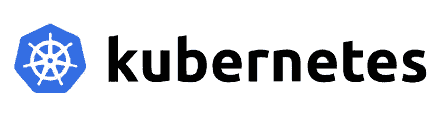
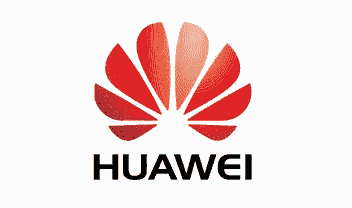

# 为什么我们说库伯内特？

> 原文：<https://medium.datadriveninvestor.com/why-we-talk-kubernetes-a42ff1f2870a?source=collection_archive---------8----------------------->

2013 年，当 docker 首次推出时，它使容器技术非常易于使用，并使应用程序测试和部署非常高效。it 投资的主要贡献给了 IBM、微软、RedHat 和谷歌等科技巨头。

docker 的使用虽然使应用程序的部署变得非常容易，但这也带来了另一个挑战。

挑战在于维护所有这些容器。这意味着 docker 是不够的，因为需要协调来进行部署、服务监控、替换、自动伸缩以及最终组成分布式架构的各种服务的管理。

在各种行业中，有成千上万的容器，不可能从 docker 命令行界面手动维护这些数量的容器。

**那么解决办法是什么呢？**

# 谷歌超前思维

没有容器化，部署和使用效率非常低，因为所有任务都在虚拟机上执行。

自过去十年以来，谷歌一直在集装箱化技术方面进行大量研究，其结果是创建了 Borg，后来 Omega 项目成功了。

谷歌建立了一个名为 **Borg** 的集群管理系统，该系统运行数十万个作业，使计算更加高效，使我们能够以高利用率运行数据中心。

这个项目是 Kubernetes 的诞生。

Kubernetes 随后在 2014 年被谷歌开源。随着越来越多感兴趣的行业研究 kubernetes 带来的可能性，这导致了它的巨大发展。

# 那么为什么它如此有帮助呢？

那么，为什么它如此有帮助，以至于成为各地讨论的热门话题呢？

我想列出 kubernetes 的几个主要特点:

*   能够根据您的资源需求自动放置容器，而不影响可用性
*   **服务发现和负载平衡:**不需要使用外部机制进行服务发现，因为 Kubernetes 会为一组容器分配它们自己的 IP 地址和唯一的 DNS 名称，并且可以平衡它们的负载
*   **启用存储协调:**自动将存储系统设置为公共云提供商。或者本地网络存储系统，如 NFS、iSCSI、格鲁斯特、Ceph、Cinder 等
*   **配置和秘密管理:**密码或 ssh 密钥等敏感信息存储在 Kubernetes 中，隐藏在“秘密”中。应用程序的配置和机密都可以部署和更新，而不必重新构建映像或暴露敏感信息。
*   **自修复**:重启失效容器，在节点死亡时更换并重新编程。另外，删除没有响应的容器，在它们准备好之前不要发布它们。
*   执行自动化部署，逐步实施对应用程序或其配置的更改，同时监控其状态。这可以确保您不会一次删除所有实例。如果出了问题，Kubernetes 会逆转这种变化。

# 改变行业的库伯内特

Kubernetes 最初是 google 的一个项目，现在是自动化计算机应用程序部署、扩展和管理的容器编排系统的主要产品之一。

Kubernetes 不再被认为是一种可以尝试的新事物，它正在获得足够的信任，越来越多地用于生产。事实上，到 2019 年，这一平台已在 78%的公司投入生产。早一年，2018 年，在 58%。Tinder、Reddit、纽约时报、Airbnb 或 Pinterest 等公司已经将这项技术集成到了他们的服务中。

**Kubernetes 为企业提供各种能力:**

*   **多云灵活性:**随着越来越多的企业在多云平台上运行，他们将从 Kubernetes 中受益，因为它可以在任何公共云服务或公共云和私有云的组合上轻松运行任何应用程序。
*   **更快的上市时间:**因为 Kubernetes 可以帮助开发团队分解成更小的单元，以专注于单个的、有针对性的、更小的微服务，这些更小的团队往往更敏捷。
*   **IT 成本优化:** Kubernetes 可以帮助大规模运营的公司大幅降低基础设施成本。
*   **改进的可扩展性和可用性:** Kubernetes 作为一个关键管理系统，可以在工作负载增加时扩展应用程序及其基础架构，并在负载减少时减少它。
*   **向云的有效迁移:** Kubernetes 可以处理重新托管、重新平台化和重构。它提供了一个无缝的途径来有效地将应用程序从设施迁移到云。

现在让我们来讨论一个具体的案例研究

 [## 技术成瘾-是真的吗？数据驱动的投资者

### 通知铃声响起。你很想检查一下。你拿起手机检查了一下。“哇...再来一个喜欢的…

www.datadriveninvestor.com](https://www.datadriveninvestor.com/2020/12/16/technology-addiction-is-it-real/) 

# 容器化 Spotify

Spotify 是一个音频流媒体平台，全球月活跃用户已超过 2 亿。

Spotify 是微服务和 Docker 的早期采用者，Spotify 通过自主开发的容器编排系统将微服务容器化，并在虚拟机上运行。

这也是他们对 kubernetes 感兴趣的原因之一

## kubernetes 提供的解决方案

Spotify 希望从更高的速度和更低的成本中获益，并在最佳实践和工具方面与行业内的其他公司保持一致。同时，该团队希望在繁荣的 Kubernetes 社区贡献自己的专业知识和影响力。

这是一个非常伟大的商业决策

Kubernetes 上目前运行的最大的服务每秒处理大约 1000 万个请求，作为一个聚合服务，它从自动伸缩中受益匪浅。

以前，团队必须等待一个小时才能创建一个新服务，并获得一个可操作的主机来在生产中运行它，但有了 Kubernetes，他们可以在几秒钟和几分钟内完成。

此外，借助 Kubernetes 的装箱和多租户功能，CPU 利用率平均提高了两到三倍。

# 华为

华为有超过 18 万名员工。为了支持其在全球的快速业务发展，[华为](http://www.huawei.com/)为其内部 it 部门建立了八个数据中心，这些数据中心在 10 万多个虚拟机上运行 800 多个应用程序，为这 18 万用户提供服务。随着新应用程序的快速增加，管理和部署基于虚拟机的应用程序的成本和效率都成为业务敏捷性的关键挑战。

在决定使用容器技术后，华为开始将内部信息技术部门的应用转移到 T2 的 Kubernetes T3 上运行。到目前为止，这些应用程序中大约有 30%已经转移到了原生云。

这就是为什么到 2016 年底，华为的内部 it 部门使用基于 Kubernetes 的平台即服务(PaaS)解决方案管理着 4，000 多个节点和数万个容器。

此外，运营支出也大幅削减，在某些情况下削减了 20-30 %,这对企业非常有帮助。

# 结论

集装箱的使用将继续增长。你还可以看到一些围绕 Kubernetes 的标准化。这将带动大量相关开发工具的增长。

容器在软件世界越来越受欢迎，Kubernetes 已经成为将容器部署到产品中的行业标准。此外，预计今年 Kubernetes 的增长率也会很高。

## 获得专家观点— [订阅 DDI 英特尔](https://datadriveninvestor.com/ddi-intel)