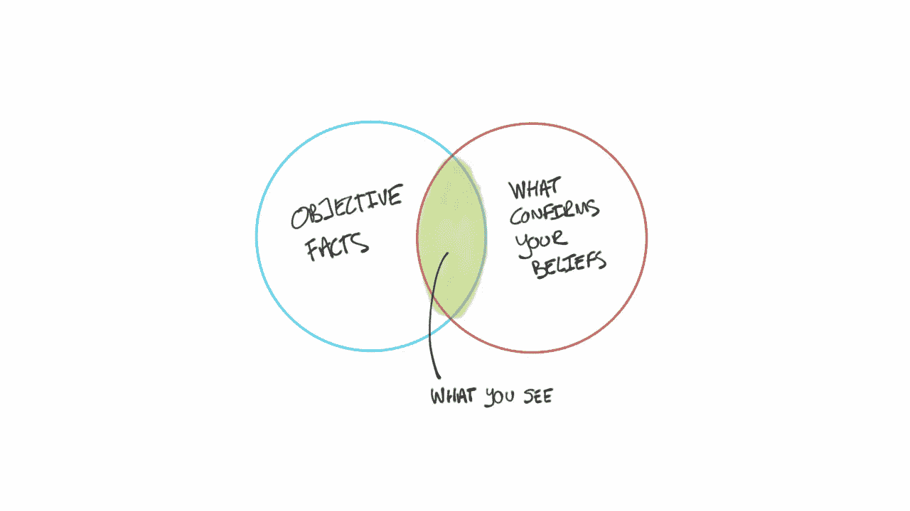
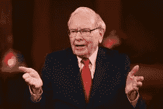
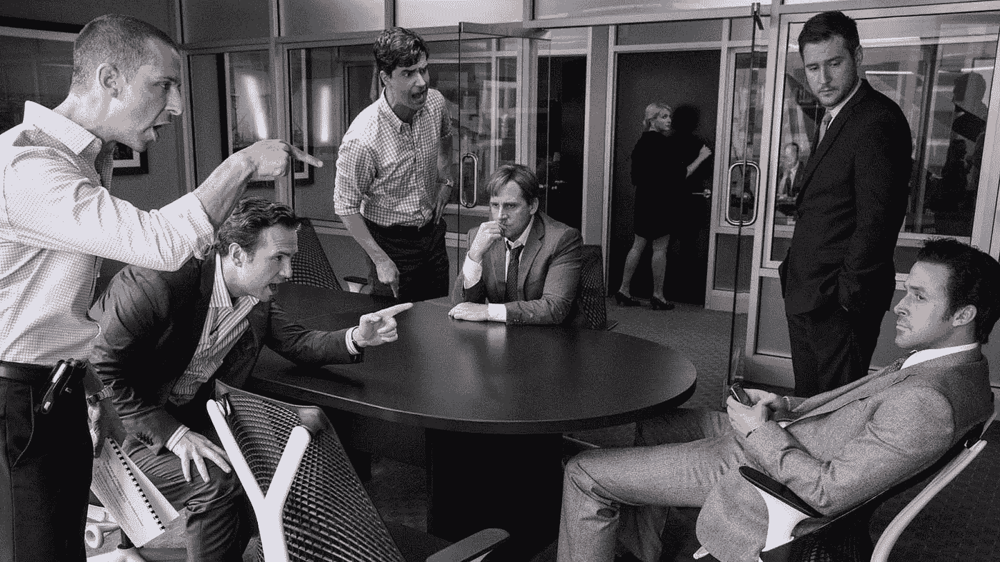
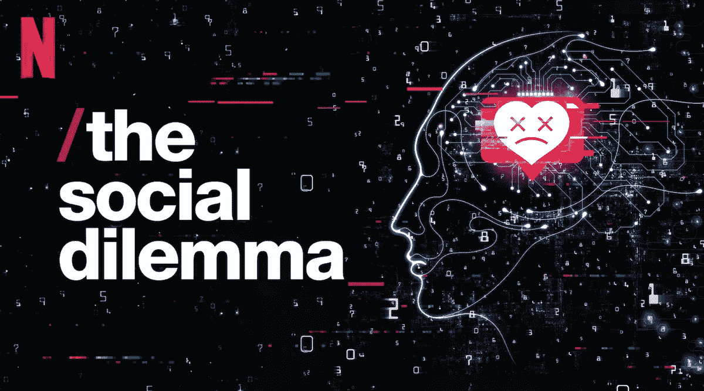

# 为什么我们倾向于坚持我们的信念——确认偏差

> 原文：<https://medium.datadriveninvestor.com/why-we-tend-to-stick-to-our-beliefs-the-confirmation-bias-4bf0921fe69f?source=collection_archive---------3----------------------->

Image Source: Farnam Street

美国房地产市场的崩溃和社交媒体造成的社会两极分化之间有什么共同点？

Ram 是一家初创公司的首席执行官，拥有一个 10 人的小团队。他们现在准备将他们的产品推向市场。Ram 和他的团队坐在一起，设计了同样的策略，并对他们开发的东西非常满意。

Photo by [Bill Jelen](https://unsplash.com/@billjelen?utm_source=medium&utm_medium=referral) on [Unsplash](https://unsplash.com?utm_source=medium&utm_medium=referral)

产品发布几周后，团队庆祝他们战略成功的每一个迹象，任何矛盾的迹象都被视为“例外”而不予理会。然而，他们的销售数字并没有达到他们向投资者承诺的数字和增长率，这被认为是一次失败。

团队做错了什么？为什么呢？

Image Source: CNBC

> 正如著名投资家沃伦·巴菲特所说，“人类最擅长做的，是解读所有新信息，从而保持他们之前的结论不变。”这就是所谓的确认偏差。

Ram 和他的团队对他们开发的策略非常满意，任何相反的证据都被视为无关紧要，最终导致产品发布失败。

这种认知偏差在投资和金融领域也随处可见。

Image Source: Empire

如果你看过《大空头》(The Big Short)，一部关于美国房地产市场崩溃的电影，你就会明白我在说什么。即使有大量证据表明如此多的人拖欠抵押贷款，整个世界也只是漫不经心地将所有违约者视为例外，这与其他几个因素结合在一起，最终导致了世界经济的崩溃。

在同一部电影中，我们可以看到确认偏见的一种极端形式，在布鲁斯·米勒和马克·鲍姆在一次会议上面对面说话的场景中。尽管贝尔斯登的股票一落千丈，布鲁斯·米勒坚持认为一切都很好，事实上他会在辩论后购买更多贝尔斯登的股票。

这些例子显示了我们是多么坚定地坚持自己的观点，并且总是寻找支持我们信念的确凿证据。

Image Source: The Indian Express

确认偏见已经被一个行业——社交媒体——最大限度地利用了。如果你是那些最近看了网飞的“社会困境”的人之一，你肯定知道我在说什么。

Image Source: Facebook

为了让我们尽可能多地参与进来，花尽可能多的时间，社交媒体应用程序用重申我们信念的内容和广告轰炸我们，由于人类大脑喜欢这些不断的肯定，我们无休止地在社交媒体上花费时间。我们花的时间越多，我们就越坚定地坚持我们的信念，最终导致社会的两极分化。

我们总是倾向于排除无关紧要的例外和异常值。那么我们如何克服这种偏见呢？

无论何时你发现了一个“例外”，在忽略它之前，一定要多加注意。寻找不确定的证据。在商业环境中，总是有人对你提出的任何想法唱反调。当你阅读非小说类作品时，确保你在表明立场之前阅读了所有观点。在形成世界观之前，要和许多不同背景的人交谈。

创意致谢:清晰思考的艺术