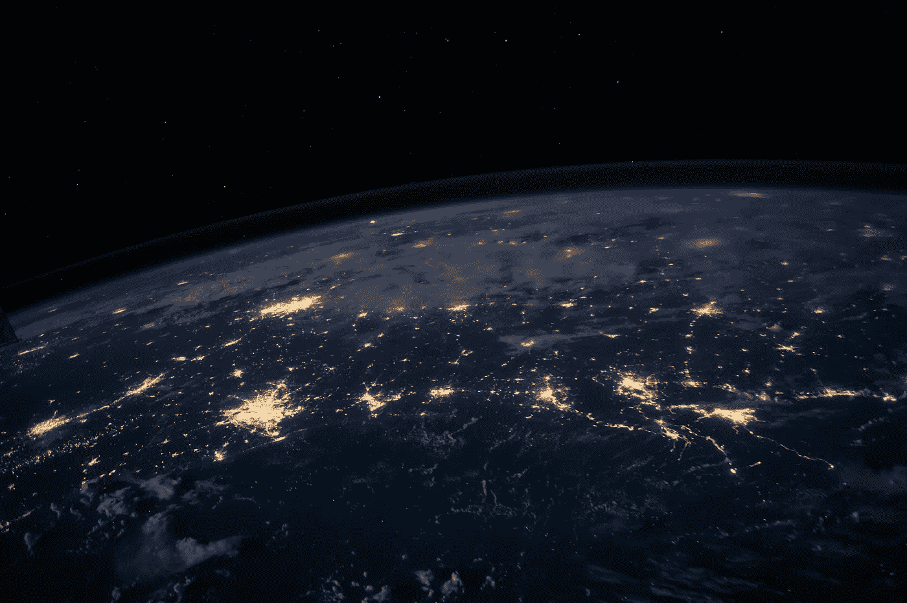

# 为什么我们永远无法上传意识

> 原文：<https://medium.datadriveninvestor.com/why-we-will-never-be-able-to-upload-consciousness-84baceb6bb8e?source=collection_archive---------9----------------------->

Photo by [Joshua Sortino](https://unsplash.com/@sortino?utm_source=unsplash&utm_medium=referral&utm_content=creditCopyText) on [Unsplash](https://unsplash.com/collections/9513244/consciousness-upload?utm_source=unsplash&utm_medium=referral&utm_content=creditCopyText)

## 仔细想想，这个想法非常可笑

没有大的介绍。我将直接进入它。

## 首先，“意识上传”的事情:

对于每一个实例，难以置信的聪明的作者，科学家，播客上的学者，等等。关于意识上传的推测，有 1000 篇点击诱饵文章提到了这个概念，还有 10 倍以上的例子在社交媒体上被提到。

这个想法最大的问题是:当你的意识上传后会发生什么？它会离开你的大脑吗？如果它被上传，而你仍然意识到，仍然有一种体验，猜猜会发生什么？什么都没上传，是吗？不，如果你认为这些“上传”的数据是一份拷贝，它甚至不是。充其量，那是对你大脑在被复制时的活动的近似模拟。那份拷贝没有你的经验，这确实突出了我们实际上正在谈论的东西的基本性质。

 [## 今年值得关注的 5 大人工智能趋势|数据驱动的投资者

### 预计 2019 年人工智能将取得广泛的重大进展。从谷歌搜索到处理复杂的工作，如…

www.datadriveninvestor.com](https://www.datadriveninvestor.com/2019/02/19/artificial-intelligence-trends-to-watch-this-year/) 

…这甚至不是意识上传这一想法的问题根源。不，还有更多。一整篇文章的价值。

> 上传意识的前提是深深植根于对意识的神秘观念的宗教般的信仰。

为什么我们决定意识甚至是一个准确的概念？当我们真正审视所有事物的更深层次、最基本的本质时，意识实际上似乎只是一种近似。这是一种简单的说法，指的是实际上非常非常复杂的东西。

意识有多重？它的体积是多少？速度怎么样？当你移动时，意识也在移动吗？没有答案，因为正如我们所知，意识没有展现出任何品质来衡量或检测它在现实中的存在。

你曾经被问过你所使用的词的定义吗？你一直在用的一个词？你知道如何使用这个词，但你不知道如何定义它。直到今天，关于意识是什么，以及对意识来说更糟糕的是，如果你寻求它的证据，你会得到同一个答案的不同重复:“这是不言自明的”。我的朋友们，这是信念代替证据的最好例子。

与其依赖这种模糊的、未定义的和超自然的“意识”概念，我们可以简单地参考感官体验，这可以更具体地理解为我们环境的反馈回路。你的感觉器官将信息传递到大脑的特定区域进行处理。你现在的体验是一种对刺激做出反应的机制。当你对外部信息作出反应时，你改变了环境的状态，因此，你接收到新的信息、反馈等等，明白吗？

让我们更进一步…

想象你完全没有感觉。想象你是天生完美。没有感官信息作为体验的媒介。你怎么会有关于自我，空间，时间，生命，情感，语言的概念。你为什么会有想法？一个什么都不知道，甚至没有经验的人会有什么想法？

> 感官是大脑描绘现实图景的媒介。

现在，让我们恢复你的理智，把你比作一条虫子。虫子有意识吗？什么时候某物变得有意识？当然没有意义，因为意识是一个不必要的概念。取而代之的是神经元的复杂性，一个非线性的信息系统和相互交流的网络，导致了关于神经组织复杂性的经验的涌现顺序。

Photo by [sippakorn yamkasikorn](https://unsplash.com/@sippakorn?utm_source=unsplash&utm_medium=referral&utm_content=creditCopyText) on [Unsplash](https://unsplash.com/collections/9513244/consciousness-upload?utm_source=unsplash&utm_medium=referral&utm_content=creditCopyText)

与其他物种相比(可能除了一些生活在海洋中的哺乳动物)，人类大脑能够进行更复杂的定性抽象。这一点，加上我们在创造力、交流和社交网络方面的先进能力，导致了一些令人难以置信的新兴现象。我们的反馈回路不仅仅占据更广阔的生态系统。我们拥有庞大的、独有的互动系统，这是其他物种无法感知的。我们有政治、宗教、娱乐、经济等等…

Photo by [NASA](https://unsplash.com/@nasa?utm_source=unsplash&utm_medium=referral&utm_content=creditCopyText) on [Unsplash](https://unsplash.com/collections/9513244/consciousness-upload?utm_source=unsplash&utm_medium=referral&utm_content=creditCopyText)

对于这些创造智慧和/或上传智慧的努力，我们最期待的事情无疑是理解体验的实际意义的范式转变。在试图复制、复制或操纵意识的过程中，我们无疑会发现我们在注视着自己。

也许到那时，这种神秘的、超自然的意识概念将会消失，让位于对生命是什么以及作为生命的一部分而拥有一种体验意味着什么的更全面和功能性的理解。

感谢阅读。我很想听听你们的想法！