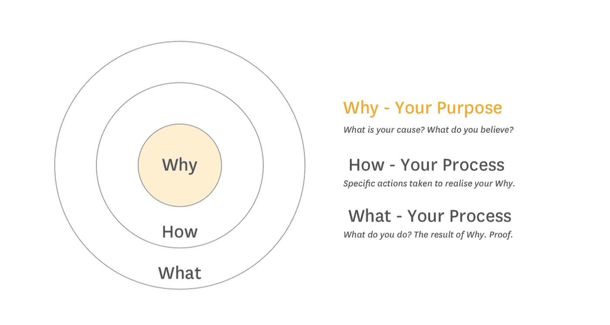
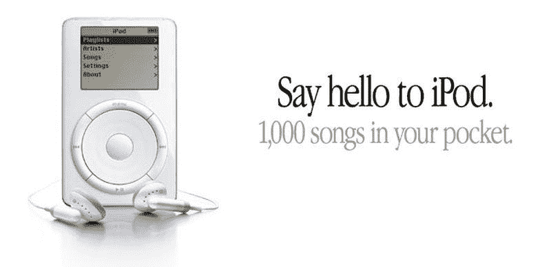

# 为什么我们充满希望:社会影响创业的哲学

> 原文：<https://medium.datadriveninvestor.com/why-were-hopeful-the-philosophy-of-a-social-impact-startup-cf96b33a5ac2?source=collection_archive---------19----------------------->

Credit: [Faxburner](https://www.faxburner.com/blog/wp-content/uploads/2018/07/iStock-860588108.jpg)

在过去的几周里，我的写作特别关注人工智能技术对非营利行业的宏观影响，以及投资者应该如何考虑这种新兴技术对该行业的影响。随着新冠肺炎危机的持续，尽管北美和世界各地的经济开始逐渐重新开放，但我们在霍普一直在密切跟踪疫情对加拿大非营利部门和科技初创公司造成的严重损害。

在这个漫长的周末，我思考着[慈善机构因 COVID 而面临的 90 亿美元以上](https://www.imaginecanada.ca/en/360/covid-19-threatens-devastate-canadas-charities)的潜在损失，同时翻阅着显示我们的增长呈指数趋势上升的标签。在思考这种奇怪的并列关系时，我意识到在“希望”存在的过去一年半时间里，我们已经广泛地讨论了我们的目的和“为什么”背后的意义，但从未真正记录下来。

通过无数次的内部讨论、外部投资者推介、推介比赛和技术会议，我们不断反思霍普的文化、宗旨、使命以及我们继续努力实现目标的总体“原因”。然而，关于“为什么”的对话总是被观众、论坛或问答过早地假定，除非我们直接干预，否则将会有各种解释。

因此，把本周的文章看作是关于“为什么”我们对未来充满希望，我们是如何走到这一步的，以及我们一路上学到了什么的官方文件。

## 框架

Simon Sinek 在他的开创性著作 [*中从为什么*](https://simonsinek.com/product/start-with-why/) 开始，为我们提供了一个很好的框架。本质上，Sinek 认为，伟大的公司以这样一种方式营销自己，以解释他们为什么做某事，而不是如何做或做什么。

[一个重要的例子是苹果公司为 iPod Touch 做的“口袋里有 1000 首歌曲”的广告，](https://medium.com/@chep2m/creative-nomad-vs-ipod-a-case-study-f008b4d9bc40)击败了 22 个月前发布的几乎相同的产品 Creative Technologies，该产品只是作为“6.5GB 存储容量的多媒体播放器，能够存储超过 100 小时的数字音频”进行营销

iPod 成功地突破了主流，因为从一个外行的角度来看，它的描述是直截了当的，而且明显比 CT Creative Nomad 更具消费性。

从技术角度来看，hopped 是一个社交媒体分析平台，可以推动捐赠并降低营销成本，通过向非营利组织领导人提供具体平台上哪些社交媒体内容(图片、文本、标签等)导致人们捐赠的硬数据，帮助他们扩大捐赠基础。但是我们为什么选择这条路线呢？

## 对为什么充满希望

社交媒体每天有 9500 万条 Instagram 帖子，每分钟有 3125 条脸书帖子，每秒钟有 6000 条推文，毫无疑问，社交媒体是现代非营利组织争夺在线存在的关键战场。

然而，自 2008 年以来，该行业本身以[令人瞠目结舌的速度增长，几乎是营利性行业的 4 倍](https://www.forbes.com/sites/forbescoachescouncil/2019/10/02/the-nonprofit-sector-is-growing-why-nonprofits-should-act-now-to-leverage-their-position/#29d58af77b52)，非营利组织发现自己面临着所有营利性企业在社交媒体上管理其品牌时面临的相同问题——当每天都有越来越多的内容添加进来时，你如何消除噪音？

此外，你如何进入一个你所在行业直到最近还在回避的平台？随着传统捐赠者年龄的增长，传统的非营利筹款方式——电子邮件、实体邮件等——失去了效力。这迫使越来越多的非营利组织争相加入社交媒体，这给年轻的千禧一代捐赠者造成了瓶颈，他们被自己可能支持的大量事业所淹没。

> “由于[每天有 9500 万条 Instagram 帖子，每分钟有 3125 条脸书帖子，每秒钟有 6000 条推文](https://www.linkfluence.com/blog/ai-basics-how-ai-machine-learning-supercharge-social-media-marketing)，社交媒体无疑是非营利组织在现代争夺在线存在的关键战场。”

在采访了数百家非营利组织一年后，我和我的团队一遍又一遍地听到同样的事情——非营利组织的董事和营销团队在社交媒体上发布“为了发布”

因此，hopping 的“为什么”现在有两个关键方面——非营利组织需要确定如何有效地进入社交媒体，潜在捐助者需要定制的信息传播来与他们接触，以便他们可以更好地看到与他们产生共鸣的信息。

很少有计划或能力来追踪更好地优化他们的信息以达到新的受众所需的数据——即使世界各地的许多非营利组织都越来越渴望获得新的捐助者，因为重复捐赠减少了。

在营利性部门，信息定位不仅是常态，也是任何营销策略的关键部分，寻求在非营利性领域完全缺乏这种定位不仅令人沮丧，而且非常令人沮丧。非营利组织站在改善人们生活的最前沿，却无法获得在利润至上的世界中已经存在多年的技术。

因此,“为什么”我们做我们所做的事情—**hope 是一家将非营利组织应得的技术带到他们家门口的公司。**以之前的 iPod 为例，我们的任务是帮助非营利组织将 1，000 名捐赠者装进他们的口袋，这些捐赠者正等待支持他们所信仰的事业，但由于缺乏对社交媒体信息的了解、对非营利组织品牌的认识以及缺乏将这些目标结合起来的技术，他们还没有联系上。

本文原载于 [LinkedIn](https://www.linkedin.com/pulse/why-were-hopeful-philosophy-social-impact-startup-alexander-jivov/?published=t)

***免责声明*** *:我是*[*hope Inc*](https://www.hopefulinc.me/)*的首席执行官和联合创始人，这是一家高增长的初创公司，它利用人工智能使非营利组织能够超越喜欢并通过社交媒体和在线捐赠来源获得更多资金。我们自己目前正在筹集种子资金。如需了解更多信息，请发送电子邮件至*[*ajivov @ hopeflinc . me*](http://ajivo@hopefulinc.me/)