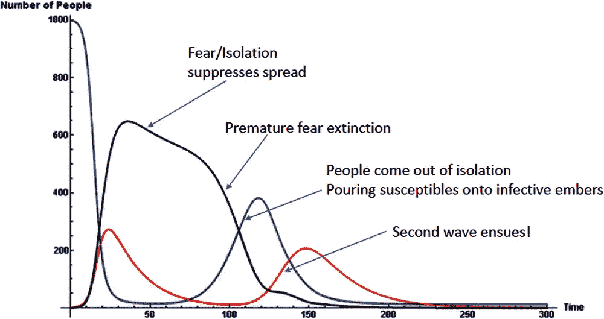

# 为什么有些流行病很容易控制，而有些却不容易？—新闻先生

> 原文：<https://medium.datadriveninvestor.com/why-were-some-pandemics-controlled-easily-and-others-not-newssir-dde1653f7eae?source=collection_archive---------6----------------------->

## 流行病简史

世界在过去和现在都遇到过许多大流行的爆发。医学专家和科学家的理解结束了这一切。因为他们要处理如何诊断、控制和阻止疫情病毒的传播。

疾病也是不同种类的流行病。因为一些病毒会对不同的人造成更有害的影响。新冠肺炎在 65 岁以上的人和身体虚弱的人身上引起严重的症状。而 1918 年的流感病毒影响了年轻健康的人群。

传播率是理解病毒是否能阻止传播的一个重要数据。该报告证实了一些病例，并解释了为什么过去一些病毒容易控制，而另一些却不容易控制。

# 比较各种流行病

据估计，在我们的星球上有 10 亿个单独的病毒。病毒存在于我们自然世界的方方面面。这些非生命实体只能在宿主的帮助下进行复制。这就是为什么有些病毒很强，它们很容易通过空气传播的原因之一，这使得很难阻止

比较流行病并不容易，因为它们都有自己的性质，发生在特定的环境中，并且在疫情生长的环境中有不同的性质。

在过去，病毒很难像现在这样传播，因为人们没有足够的时间去世界各地旅行。如果病毒存在于任何人身上。它将感染最少量的人或物种，然后隔离直至死亡。就像第一次世界大战时疫情发生的 1918 年 H1N1 流感一样，旅行中的士兵在某种程度上是传播它的原因。它可能是在最近的 2020 年新冠肺炎疫情期间被很好地观测到的参数之一

一些流行病被证明容易控制的原因之一是科学的理解。从以前的疫情医学进步有助于保护和阻止大流行。在某些情况下，如果疫情病毒的某些特性与上一种病毒相似，那么这种方法会很有效。

卫生习惯也是阻止流行病传播的主要做法。然而，还不能确定这种做法可以完全避免大流行，因为它仍然存在于环境中。

开发有效疫苗所需的时间也是延长疫情寿命的一个原因。

# 使一些大流行变得容易而另一些变得难以控制的关键参数是:

*   社交距离很容易
*   使用过去有效的方法
*   采取预防措施很容易
*   疫苗不是很快就能生产出来的

# 疾病的传播证明，如果参数不执行，疫情是很难停止

这项研究关注的是世界面临的七大流行病。如果疫情病毒爆发，它会在城市内迅速传播，然后通过它传播到外部世界，正如 2003 年爆发的非典疫情和 2014 年至 2016 年在科纳克里、蒙罗维亚和弗里敦出现的另一种疫情埃博拉病毒。

 [## 疫情期间临床试验的一线希望|数据驱动的投资者

### 没有书本而学医的人航行在未知的大海上，但是没有病人而学医的人不去…

www.datadriveninvestor.com](https://www.datadriveninvestor.com/2020/12/14/the-silver-lining-for-clinical-trials-during-the-pandemic/) 

# 七种主要流行病的不同疾病传播数据:

*   **1918 年和 2009 年甲型 H1N1 流感:**通过呼吸道飞沫感染体表
*   **甲型禽流感(H5N1 和 H7N9):** 通过直接接触受感染的人或任何死亡的家禽和鸟类或长期接触受感染的人传播
*   **淋巴腺鼠疫:**通过跳蚤叮咬
*   **埃博拉:通过**接触受感染的血液或体液传播
*   **MERS-CoV:通过**呼吸道飞沫
*   **SARS-CoV:** **至**呼吸道飞沫
*   **新冠肺炎:通过**呼吸道飞沫或任何种类的身体分泌物。

# 有史以来七大流行病的全球病例率和病死率:

*   **1918 年流感(H1N1):**5000 万人感染；CFR 2%-3%。
*   **甲型禽流感(H5N1 和 H7N9):** H5N1 有 649 人感染；60% CFR；而 H7N9 有 571 例感染病例；37% CFR。
*   **伊波拉:**超过 3 万人感染；平均 50%的 CFR。
*   **MERS-CoV:** 感染病例 2502 例；和 34%的 CFR。
*   **SARS-CoV:** 感染病例 8422 例；和 15%的 CFR。
*   **新冠肺炎:**2020 年 10 月 05 日前记录 3550 万例；到 2020 年 10 月 5 日，死亡人数将达到 104 万

统计数据预测，当参数被制定时，疫情很容易被控制，但在最近几天，很难遵循一些重要的事情，如社会距离，卫生，以及在最短的时间内为如此庞大的人口开发疫苗。

除非采取预防措施，否则疫情不会停止传播，但仍然使用过去的医疗技术可能会变得敏感，而社会距离有助于保持卫生，直到发现疫苗。完全阻止了疫情病毒的传播。

*原载于 2020 年 12 月 24 日 https://newssir.com**[*。*](https://newssir.com/why-were-some-pandemics-controlled-easily-and-others-not.html)*

## *访问专家视图— [订阅 DDI 英特尔](https://datadriveninvestor.com/ddi-intel)*