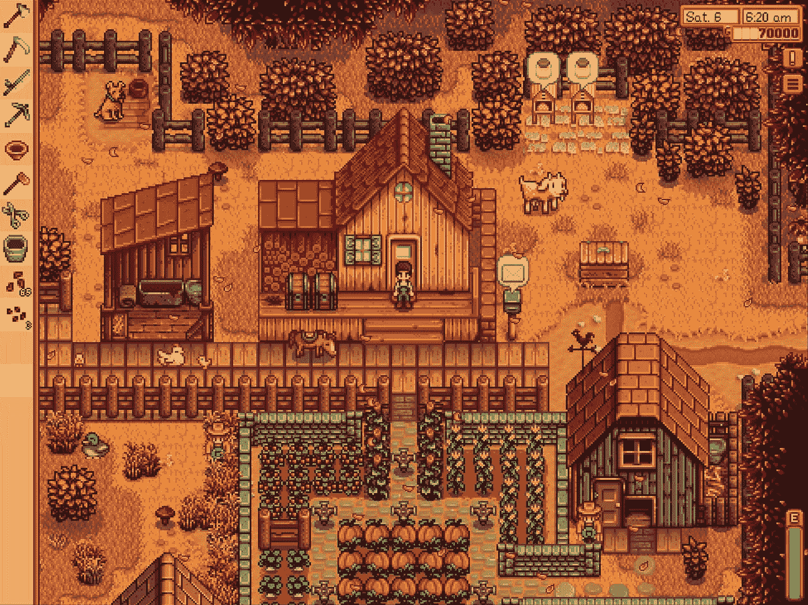
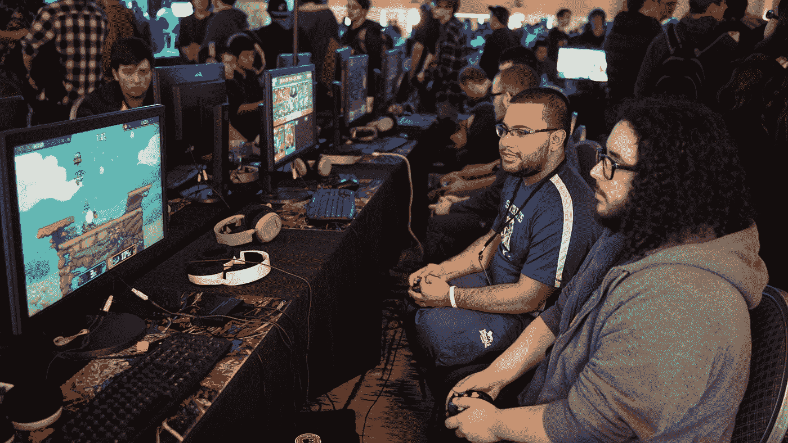

# 为什么你可以依赖游戏开发作为未来几年的副业

> 原文：<https://medium.datadriveninvestor.com/why-you-can-rely-on-game-development-as-a-side-hustle-in-2021-cdd0f3ad67ac?source=collection_archive---------4----------------------->

## 带着游戏计划跃入新的一年，通过游戏开发提高你的被动收入

Is there still a future in game design and development? Photo by [Sean Do](https://unsplash.com/@everywheresean?utm_source=medium&utm_medium=referral) on [Unsplash](https://unsplash.com?utm_source=medium&utm_medium=referral)

无论你是一名**初学者**还是**经验丰富的**、**业余爱好者**还是**专业游戏开发者**，你都希望看到自己的技能得到提高和进步。对于每一个新项目，你都应该提高自己的技能，创造更好、更快的体验。随着进步而来的是更好的回报，这取决于你的辛勤工作和努力。

**是的**，游戏开发是一个**可行的副业**。

**不**，无论怎么想象都不容易。

大多数人的目标是一夜成名，就像《Flappy Bird》或《激情燃烧的单人游戏》的创作者一样，就像《Undertale》、《Stardew Valley》、《T29》或《我们当中的 T30》一样。事实是，这种迅速崛起的成功非常罕见，几乎不可能计划。

Stardew Vallely is the posterchild for solo game development making huge returns. Source, [https://www.stardewvalley.net/press/](https://www.stardewvalley.net/press/)

所以，如果你伟大的游戏创意不是游戏开发者财务成功的关键，那是什么呢？

我们今天要深入探讨的答案，和你从专业企业家那里得到的答案是一样的。是的，一个游戏开发者需要成为一个企业家才能成功。你需要**推销你自己** **和你的产品**，**围绕你的工作室创造一个品牌**，**获得追随者**，**与重要的内容创作者和游戏评论者接触**。如果没有人知道你在做什么，你就不会获得赚钱的动力。

答案是**增量增长**和**多元化收入流**。不要把所有的鸡蛋放在一个篮子里——在通往你的“热门游戏”的道路上有许多步骤，其中许多步骤涉及到创造不仅仅是你热爱的游戏。

# 用玩耍让人们变得更好

当大多数人想到游戏时，他们会想到 FPS、体育和幻想游戏。然而，游戏化融入了我们通常意识不到的生活的许多方面。

一个熟练的游戏设计者可以找到将他们的知识运用到其他领域的方法。**饮食**、**生产力**和**健康**应用将它们的任务游戏化，以吸引玩家，诱使他们建立有益于他们福祉的日常习惯。游戏设计师在创造这些游戏循环中扮演着重要角色，他们有**激励**和**最近开发**。

There is a place for gaming in the wellness and productivity spaces. Photo by [Simon Rae](https://unsplash.com/@simonrae?utm_source=medium&utm_medium=referral) on [Unsplash](https://unsplash.com?utm_source=medium&utm_medium=referral)

随着新的一年即将来临，考虑开发一些游戏来帮助点燃新的一年的乐观情绪。人们普遍认为 2020 年是艰难的一年，许多人将期待在新的一年里重塑自己。创造一些能让玩家在精神上和身体上变得更好的东西。你一定会看到对这个的需求！

# 为游戏开发生态系统做出贡献

2020 年，在线学习爆发了。被困在家里的消费者可以通过低价学习贸易和技能来提升自己——有什么不喜欢的呢？这包括游戏**开发者**、**设计师**和**美工**。简而言之，有很多新的游戏开发者，准备好采取下一步来创造他们梦想的游戏。

Game makers are looking for ways to speed up and improve their dev cycles. Photo by [Felipe Furtado](https://unsplash.com/@furtado?utm_source=medium&utm_medium=referral) on [Unsplash](https://unsplash.com?utm_source=medium&utm_medium=referral)

在赚取额外收入的同时，支持他们的最佳方式是为他们实现梦想搭建脚手架。这意味着**中间类**、 **IDE 工具包、**和**游戏资产**。Unity Asset Store 是一种广受好评的副业收入方式，同时可以为游戏开发者分享你的知识和技能。

走这条路可能比你想象的要容易。如果你的硬盘里有一个游戏项目没有完成，把它变成一个样板文件，作为一项资产发送出去。对于艺术和音乐来说，你可能已经为一个失败的游戏项目做了同样的事情——在资产商店中给它第二次生命来赚一些额外的钱。

开源的强烈支持者可能不喜欢我的建议。但是我喜欢把对资产的支付看作是对为你的利益创造工具的开发者的强制性捐赠！

 [## 取代你的风投？企业家的 5 条原则|数据驱动的投资者

### 在 Tau Ventures，我们建议所有企业家将融资过程中的勤奋过程视为双向的…

www.datadriveninvestor.com](https://www.datadriveninvestor.com/2020/11/29/replacing-your-vc-5-principles-for-entrepreneurs/) 

# 为即将到来的后疫情趋势而设计

随着世界等待疫苗带来疫情的缓慢结束，游戏开发商应该预见到聚会的兴起，并相应地进行规划。《我们中的人》一举成名，因为它非常适合 2020 年的气候，并成为事实上的居家社交游戏。

你认为后大流行时代的视频游戏行业会是什么样子？游戏玩家最终**会走出**重燃**兰党**、**电竞赛事**、**游戏大会**吗？或者他们会继续呆在室内，通过 Twitch 上的 Discord 和 streams 进行交流？

When will we see in-person eSports make a return? Will it be this year? Photo by [Stem List](https://unsplash.com/@stemlist?utm_source=medium&utm_medium=referral) on [Unsplash](https://unsplash.com?utm_source=medium&utm_medium=referral)

无论你认为游戏在 1-2 年内会发展到哪里，都要**为此做好**计划，并**围绕它设计**你的游戏！如果你展望未来，并预测它将存在的环境，你的激情项目，或生产力应用，或资产包将经得起时间的考验。

什么样的游戏能突出回归社交？这是你作为一个未来的设计师来决定！

# 从玩家所在的地方开始

游戏玩家在 **Discord** 、 **Twitch** 、 **Steam** 等应用上。当你计划你的游戏时，从这个开始！涉及这些应用的一些好主意包括:

*   不和谐的机器人和不和谐的游戏
*   **流** - **互动**将观众带入游戏的游戏
*   蒸汽**朋友**和**快接**集成

虽然这些都不是新功能，但严重依赖这些功能的游戏并不普遍。查看游戏玩家在哪里，并将游戏带给他们！现在，要是 Discord 允许在他们的平台上嵌入游戏就好了🤔

2020 年也创造了休闲游戏玩家的复兴。有太多空闲时间的人已经开始玩他们无尽的游戏库和手机游戏。虽然独立游戏场景不像 10 多年前那样蓬勃发展，但休闲游戏玩家在这里寻找一些时间浪费者。

Discord, Twitch, and other apps have brought gamers together in 2020, and don’t seem to be going away any time soon. Photo by [Caspar Camille Rubin](https://unsplash.com/@casparrubin?utm_source=medium&utm_medium=referral) on [Unsplash](https://unsplash.com?utm_source=medium&utm_medium=referral)

# 结论

有很多“有想法的人”希望将他们的游戏变成现实。在新的一年里，做兼职自由职业者可以帮你赚些钱。更多的是作为一份短期合同工作，你可以通过帮助有前途的开发人员来获得一些额外收入，也可以扩大你的投资组合。只要你关注游戏的未来，你一定会成功地让你的项目成为一个有利可图的副业。

如果你做到了这一步，你对游戏开发以及它如何帮助你实现经济独立有着真正的兴趣。看看我的其他一些文章，涉及到这一点和更多！

*   [游戏开发者如何赚钱](https://cjames1.medium.com/how-to-make-money-as-an-indie-game-developer-1f30dd25240a)
*   [如何规划自己的独立游戏项目](https://medium.com/swlh/how-to-effectively-plan-your-indie-game-project-870203a7b670)
*   [如何为你的游戏赢得观众](https://cjames1.medium.com/how-to-build-an-audience-for-your-indie-game-80611db33871)
*   [为什么“饥饿艺术家”的心态对游戏开发者来说是好是坏](https://cjames1.medium.com/why-starving-artist-syndrome-as-a-indie-game-developer-is-bad-but-sometimes-good-d123c22a6e18)

**访问专家视图—** [**订阅 DDI 英特尔**](https://datadriveninvestor.com/ddi-intel)