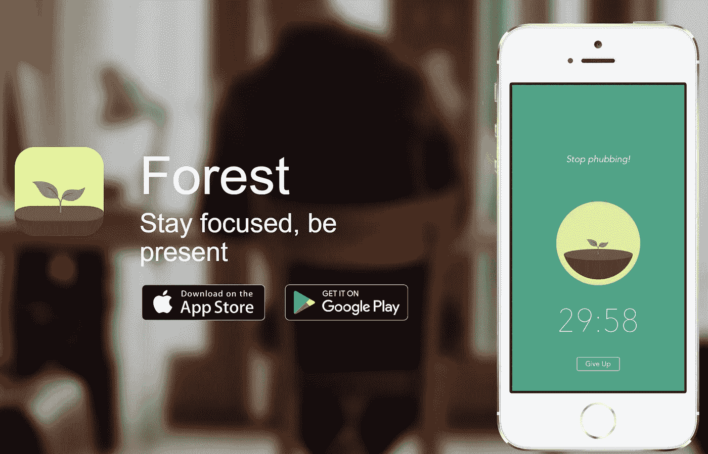
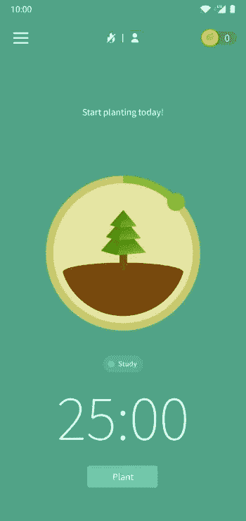
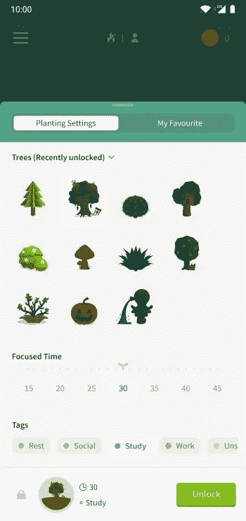
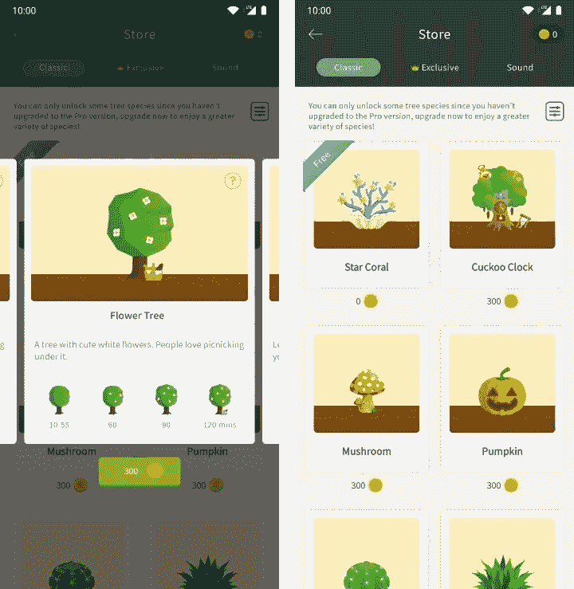

# 为什么在添加游戏化功能之前，你必须重新考虑你的应用程序的目的

> 原文：<https://medium.datadriveninvestor.com/why-you-have-to-reconsider-your-apps-purpose-before-adding-gamification-features-20ec21aeca7d?source=collection_archive---------35----------------------->

## 声称有助于集中注意力的应用程序 Forest 如何让我更加分心

Photo by [Thom Holmes](https://unsplash.com/@thomholmes?utm_source=medium&utm_medium=referral) on [Unsplash](https://unsplash.com?utm_source=medium&utm_medium=referral)

几个星期前，我在亚马逊上找到了以下这本书:**不可分割:如何控制你的注意力和选择你的生活**作者 **Nir Eyal** 。正如人们所料，它是关于我们日常生活中的分心事物，包括但不限于电子邮件、电话和消息应用。这本书是关于管理这些分散注意力的事情，防止它们发生，或者至少定义一个允许它们发生的时间窗口。

> 除非你知道是什么让你分心，否则你不能称之为“分心”。
> 
> 埃亚尔，尼尔。不可分割(第 8 页)。布卢姆斯伯里出版社。Kindle 版。

Nir 写道，过去他也曾因手机而分心。他分享了自己使用应用程序重新掌控生活的经历。他推荐**森林。** Forest 这款应用通过禁用手机的功能来让用户保持专注。在无法访问信使和社交媒体应用的情况下，该应用的目标是防止来自用户手机的外部干扰。用户可以定义多久森林应该阻止访问手机的应用程序。为了鼓励用户尽可能经常地这样做，Forest 在每次被用作看门人时都会生长一棵虚拟树。用户可以给树分配标签，这样，不仅可以种出一棵虚拟的树，还可以种出一片森林。

A screenshot from [https://www.forestapp.cc/](https://www.forestapp.cc/) taken by the author.

过去，我确实觉得有必要减少我花在智能手机上的时间。我也发现这个应用的想法很吸引人，所以我去了应用商店下载了它。这款应用的第一次使用体验很不错。它完全符合我的预期。一棵小树和一个计时器。漂亮又干净。

A screenshot from the Forest Android app taken by the author.

我点开*植物*，一边看着我的树时不时地生长*，一边不停地多读几页 Nir 的书。*第一次失望提前到来:免费版的应用没有把我锁在手机外面。我仍然可以访问已安装的应用程序。不是我想的那样，但事情就是这样，对吗？所以，我用我的谷歌奖励余额购买了高级版。那是第一次罢工。

A screenshot from the Forest Android app taken by the author.

当然，这个应用程序允许我种植不同的树。但实际上只有左上角的树和下面的树篱是免费的。这有点令人惊讶。想要帮助我保持专注的应用程序似乎有非常积极的内容策略？我花钱买了高级看门人功能，现在还只能种一棵树和一个树篱？回想起来，那是第二次罢工。

但我仍然觉得有必要在我的手机里再种一棵树，我也想继续读书。于是我又选择了左上角的免费树。我种下了树，再次专注于我的书。

在接下来的 25 分钟并行阅读和观看树后，我对森林的应用内商店感到好奇。你可以看到下面的选项。也就是说，有不同的树、珊瑚、蘑菇、南瓜。是的，那是一份很长的清单。“如果一个虚拟的森林里有一棵花树，树下有一个南瓜，那会是什么样子呢？”我在想。

Screenshots from the Forest Android app taken by the author.

这就是**的第三次**罢工。实际上，我被这棵不断生长的树吸引住了，我对生长一个拥有各种树木的美丽森林，并把它们和配件放在屏幕上的最佳位置非常感兴趣。比我想象的更感兴趣。毕竟，我想读一本书，而不是种植虚拟森林。由于我对分心的了解，我卸载了这个应用并要求退款。

虽然增加应用内购买通常会在游戏社区引起轩然大波，但我本身并不反对。总的来说，我不反对付费接收额外的内容或功能。开发商也要买单！

实话实说:**森林不只是一个 app 这是一款具有激进的应用内购买策略的手机游戏。**它的突出之处在于，当游戏在前台继续运行时，它可以阻止用户使用手机。是的，它帮助我把手机放在一边。它有助于我保持专注吗？没有。就像我说的，实际上，我很心烦意乱。

> 牵引力帮助我们完成目标；分心会让我们远离他们。
> 
> *Eyal，Nir。不可分割(第 13 页)。布卢姆斯伯里出版社。Kindle 版。*

我仍然喜欢这个应用程序的基本思想。作为不使用智能手机的奖励，一棵正在生长的树听起来仍然很有说服力。但是这个应用程序缺乏我所期望和需要的简单性。我没觉得它帮我把手机收起来了。相反，它也需要我的一部分注意力。所以我卸载了。

目前，在写这最后一段的时候，我正在使用[一加禅模式](https://play.google.com/store/apps/details?id=com.oneplus.brickmode&hl=en&gl=US)应用。它与我的 OnePlus 6 捆绑在一起。它允许我定义我想专注于其他事情的时间；它在下一个屏幕上显示了一个警告，提醒我只有相机和紧急呼叫在时间到之前是可用的，就是这样:没有树，没有应用程序商店，没有其他选择。感觉不错。

结案了。

感谢来到这里，感谢你的阅读，
Stefan， [www.blauspecht.io](https://www.blauspecht.io/) 的创作者👋