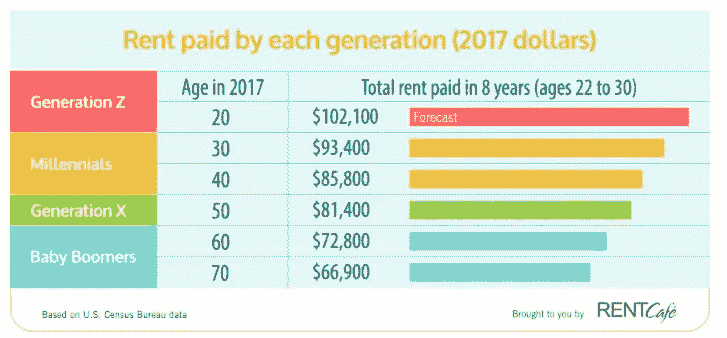
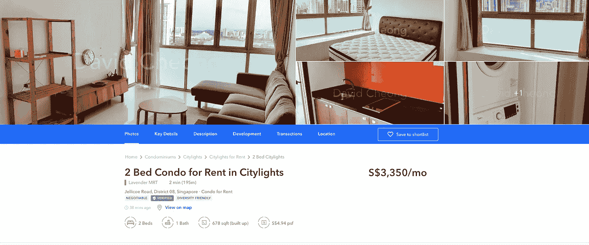
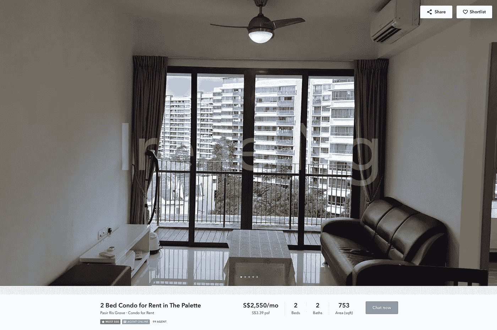
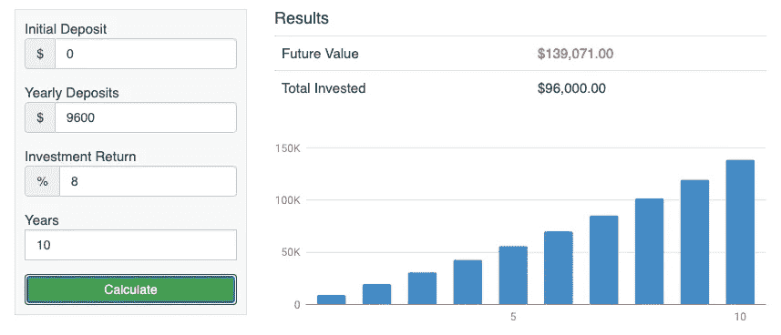

# 为什么你会在住房上花费太多，如何降低住房成本

> 原文：<https://medium.datadriveninvestor.com/why-you-might-spend-too-much-on-housing-and-how-to-reduce-your-housing-cost-8ada4433838d?source=collection_archive---------21----------------------->

## 对我们大多数人来说，我们愿意尽我们所能去拥有一个梦想中的家，不管是出租的还是自有的。在许多国家，它几乎成了一种宗教。通过检查住房成本并降低它，你实际上可以在未来创造更多的财富，并获得你梦想的家园。

Photo by [Nathan Fertig](https://unsplash.com/@nathanfertig?utm_source=unsplash&utm_medium=referral&utm_content=creditCopyText) on [Unsplash](https://unsplash.com/s/photos/apartment?utm_source=unsplash&utm_medium=referral&utm_content=creditCopyText)

# 你在住房上花费多少

全世界大城市的房租价格这些年都在上涨，而且占据了工资的很大比例。比如在伦敦，[房租平均成本超过 2017 年工资](https://www.bbc.com/news/business-44046392)的 41%。根据美国消费者新闻与商业频道 Make It，千禧一代在 30 岁之前会在房租上花掉 97000 美元。

预测显示，Z 世代的支出甚至会更多。除了通货膨胀，为什么我们的房租越来越贵？

根据[商业内幕](https://www.businessinsider.com/the-cost-of-renting-a-home-house-property-in-the-leading-global-cities-2017-3?r=US&IR=T)，以下是租房最贵的十大城市:

1.  旧金山:工资支出在房租上的平均比例是 47%。
2.  伦敦:房租支出占工资的平均比例为 45%。
3.  香港:工资支出在房租上的平均比例为 44%。
4.  东京:房租支出占工资的平均比例为 42%。
5.  纽约市:房租支出占工资的平均比例为 40%。
6.  罗马:房租占工资的平均比例是 40%。
7.  新加坡:房租支出占工资的平均比例为 40%。
8.  阿姆斯特丹:房租支出占工资的平均比例为 37%。
9.  日内瓦:房租支出占工资的平均比例为 33%。
10.  法国尼斯:房租支出占工资的平均比例为 33%。

虽然你可能听说过一般规则是不要把工资的 30%以上花在住房上，但是在那些城市，人们不得不把税前收入的 30%以上花在住房上。在其他不太昂贵的城市可能会有，一些人仍然会花更多的钱来拥有一个漂亮的家。

# 为什么人们在住房上花费这么多

一个最明显的原因是许多人买不起。在纽约、新加坡或旧金山这样的城市，买一套公寓要花费几十万到几百万。有些国家要求很高的首付比例，比如瑞士(20%)，中国(20%，有些城市是 50%)。此外，如果你们国家的利率有些“高”，抵押贷款的负担会很重。然后，每月付款将或多或少与租金相同，但你必须承担长期债务，并预付一大笔钱。

抛开经济原因不谈，拥有一个舒适的家给人一种安全感和平静感。家是你放松的地方。对许多人来说，这种情感上的满足是无法用价格来衡量的。因此，对大多数人来说，如果他们买得起一个让他们真正感到舒适的地方，他们愿意增加预算。因此，有些人甚至将工资的 50%以上用于住房。

 [## 首次创业的 4 个资金管理技巧|数据驱动的投资者

### 超过 82%的企业倒闭是由于财务管理不善和现金流问题。开始新的…

www.datadriveninvestor.com](https://www.datadriveninvestor.com/2020/10/23/4-money-management-tips-for-first-time-entrepreneurs/) 

# 如何降低住房成本

如果你认真对待储蓄和投资，积累财富，你应该重新审视你的住房选择。你真的需要那个完美的家吗？你真的需要额外的房间给客人吗？你真的需要住在那个高档社区吗？

我们有太多错误的理由来抬高我们的住房成本，而这些成本可以投入到工作中，并在未来为我们带来更多的收入。我喜欢回到储蓄计算器。如果你能去除诸如额外房间、黄金地段、豪华标准等膨胀因素。你每个月肯定能省很多钱。然后，你将这些储蓄投入 ETF 或长期投资，平均年回报率为 8%，10 年、20 年后你会有多少钱？

让我们以新加坡为例。

source: 99.co

市中心附近的一套两居室公寓每月租金 3350 新元。

source: 99.co

距离市中心 27 分钟地铁路程的两居室公寓价格为 2550 新元。

如果你从一个地方搬到另一个地方，而不改变公寓标准或其他任何东西，直接的节省是每月 800 新元，每年 9600 新元。让我们将这个数量付诸实施。

source: saving.org

10 年后，你会有 139，071 新元。比方说，你优化了你的上网费用，公用事业费用，并找到一个更便宜的地方租用。你的储蓄投资将会增长到一个更大的数额。10 年后，如果有更好的选择，你甚至可以选择买一套公寓。但如果你每个月在住房上花费这么多，你可能会在未来失去拥有房产或更高净值的潜力，而你并没有降低自己的生活水平。

搬到另一个公寓是一个简单的例子，说明你可以立即节省更多，你可以采取更多的行动来降低住房成本。这只是一次性的努力，但你每个月都会从中受益。

我最喜欢问人们的问题是他们在互联网上花了多少钱。令人惊讶的是，在网速相同的情况下，大多数人的花费是我们的两倍。除非你开始检查它们，否则你永远不知道哪里可以优化。

仔细检查每一项与住房相关的费用，问问自己，你真的需要这些吗？你如何减少它们？

*   租金
*   保险
*   因特网
*   清洁服务
*   园艺
*   …

我总是想到，当我们不得不为我们的房子付出这么多的时候，我们不得不努力工作，赚取高薪来维持他们，那么，既然我们大部分时间都在工作，谁来享受这个家呢？！

让你的钱为你工作，而不是为你的家工作。

你所在城市的平均租金是多少？你花多少薪水在住房上？

相关文章: [<为什么你的实际时薪只有你工资的 50%不到>](https://medium.com/datadriveninvestor/why-your-real-hourly-rate-is-only-less-than-50-of-what-you-are-paid-cf1c8801a69e)

净值跟踪工具:在这里下载一个免费的净值跟踪软件[。](https://bit.ly/2WcaH5Y)

**访问专家视图—** [**订阅 DDI 英特尔**](https://datadriveninvestor.com/ddi-intel)