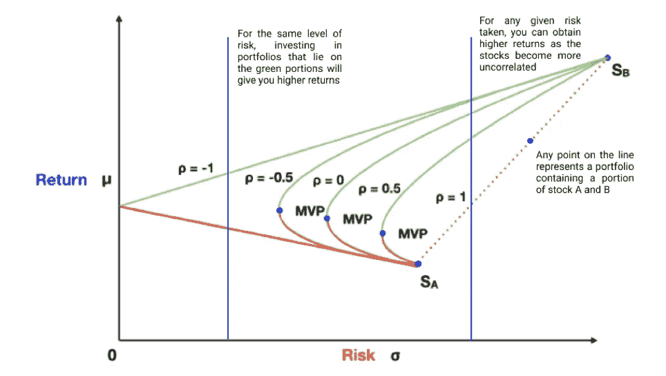

# 为什么你必须在投资前了解投资组合管理

> 原文：<https://medium.datadriveninvestor.com/why-you-must-know-portfolio-management-before-investing-the-finance-brief-54fc835f08b3?source=collection_archive---------12----------------------->

Image Credits: Bridgewater Associates

# 投资不仅仅是选股

当被问及我们对投资了解多少时，我们通常会想到奥马哈圣人沃伦巴菲特，他的投资原则使他成为世界上最成功的投资者之一。也许你读过诸如《聪明的投资者》之类的书，了解了价值投资的概念。诸如“价格是你付出的代价；“价值就是你所得到的”和“如果你不愿意在十年内拥有一只股票，那就别想在十分钟内拥有它”教会了你关注一家公司的长期和内在价值。也许你已经开始把市场视为一个疯狂压抑的市场，被短暂的乐观和悲观所驱动。

虽然这些概念可以作为优秀的心智模型，但如果只关注价值投资和股票选择，我们就有舍本逐末的风险。选股虽然重要，但只是投资的一小部分。我们投资是为了实现我们的财务目标，无论是买房还是在 50 岁前退休。最重要的是，我们希望投资可以帮助我们实现我们梦想和希望的生活。不幸的是，虽然我们似乎有无限的投资机会，但我们缺少的是时间。我们所做的每一个错误的决定都让我们离目标越来越远，直到最终我们耗尽筹码，被踢出人生的赌场。因此，投资的核心是希望以尽可能小的失败风险实现我们的财务目标。这两个愿望构成了投资组合管理的核心动机:最大化投资组合的预期回报，同时最小化风险。

# 现代投资组合理论

现代投资组合理论由哈里·马科维茨(Harry Markowitz)于 1952 年首创，他随后因其工作获得了诺贝尔奖。现代投资组合理论旨在为厌恶风险的投资者提供一个投资组合管理框架，以最大化回报，同时最小化风险。该理论的核心概念是，一项投资的风险和收益特征不应单独解释，而应与整个投资组合一起评估。

我相信你们很多人都听说过，多元化是投资中唯一的免费午餐。然而，多样化背后的原则经常被忽略。因此，我们经常通过购买不同种类的股票来“将鸡蛋放在不同的篮子里”，这并没有充分利用多样化的力量。在这篇文章中，在解释投资组合管理对你的意义之前，我将先浏览一下它的理论。因此，如果你对结果更感兴趣，请直接跳到最后。

# 使用两种资产的示例

假设你有两项资产，股票 A 和 B，它们都有特定的收益和风险。(风险在这里被定义为它的波动性，在数学上是它的方差)你现在可以在下图中绘制和比较这两只股票。

Image from Article: [Demystifying the Magic Of Modern Portfolio Theory](https://medium.com/bearnbull/demystifying-the-magic-of-modern-portfolio-theory-5ed86a03e4dc)

图表上的这些点代表了如果你把 100%的钱投资到这两只股票中的任何一只，你的预期回报和风险。然而，你能预测当你把钱分成这两只股票时会发生什么吗？这是描述结果的图表。(P 代表两种股票之间的相关性)

Lower Correlations Will Increase Returns While Lowering Risks

你注意到的是，随着股票变得越来越不相关(P=1-> P=-1)，直线越来越向左弯曲。这意味着，对于任何给定的风险，你可以获得更高的回报。图中的红色部分代表次优的投资组合，因为存在一个可以为相同风险水平提供更高回报的投资组合。此外，如果你厌恶风险，你可以投资最小方差投资组合(MVP ),这是风险最低的投资组合。

如果你对其背后的数学原理感兴趣，请阅读这篇文章:

[揭开现代投资组合理论的神秘面纱](https://medium.com/bearnbull/demystifying-the-magic-of-modern-portfolio-theory-5ed86a03e4dc)

# 使用无风险资产提高效率

按照这种思路，将越来越多的资产添加到投资组合中，你可以假设构建一组最佳投资组合，在给定的风险水平下提供最高的预期回报。这就形成了经济学家所说的有效边界，如下图所示。

Image of the Capital Market Line

尽管如此，我们可以通过在投资组合中增加无风险资产来获得更低的风险。在现实世界中，最接近无风险投资的替代品是美国财政部发行的债务，如国债。通过将这些债券纳入我们的投资组合，我们形成了用黄色表示的资本市场线。

资本市场线代表具有最高夏普比率的投资组合。此外，它与有效边界相切，与有效边界相交的点就是市场组合。

# 夏普比率是多少？

在我们已经讨论过的基础上，还有一个额外的层面，那就是最大化投资组合相对于风险的回报。这是使用夏普比率计算的，夏普比率衡量的是在调整风险后，投资相对于无风险资产的表现。

Formula of the Sharpe Ratio: Image from Investopedia

夏普比率越高，投资组合相对于所冒风险的表现就越好。

Formula of the Capital Market Line: Image from Investopedia

资本市场线的梯度本质上是夏普比率的公式，这意味着位于资本市场线上的任何投资组合都具有最高的夏普比率。因此，任何理性投资者都应该投资于资本市场线上的投资组合，因为这可以最大化他们的风险调整回报。

# 什么是市场组合？

市场投资组合是产生最高夏普比率的风险资产组合。将资本市场线从 y 轴上移至市场投资组合将意味着增加投资组合在风险资产中的配置，直至达到 100%。然而，现代投资组合理论也假设理性的投资者会以无风险利率借款来平衡他们的投资。通过这样做，你可以让你的资金配置超过 100%，承担更高的风险来增加回报。

# 那么这对你管理投资组合有什么影响呢？

# 利用相关性进行多样化

虽然我们都知道我们需要分散投资，但我们中的许多人都错误地购买了许多不同的股票。现代投资组合理论的核心是对相关性的强调。购买多只股票没有帮助，除非它们相关性很低。不幸的是，主要的价格波动通常会影响整个股票市场，导致它们联动。因此，股票通常是高度相关的，这意味着你分割的两个鸡蛋实际上是在同一个篮子里。解决办法？跨资产类别投资，或者如雷伊·达里奥所说的“15 个不相关的回报流”,这是一张描述资产类别之间相关性的图片。虽然如果你是散户投资者，很难找到这么多的资产类别进行投资，但适度应用这种投资组合管理的概念，可以大大提高你的风险回报。

Asset Correlations: Image from [Guggenheim Investments](https://www.guggenheiminvestments.com/mutual-funds/resources/interactive-tools/asset-class-correlation-map)

# 风险调整回报的重要性

我们经常过于关注投资决策的结果，而不是过程。是的，你今年在比特币上赚了一吨(从 5000 美元涨到 29000 美元)，但你冒了多大的风险？现代投资组合理论的另一个关键要点是风险与回报的重要性。通过应用夏普比率的概念，投资不再被简单地视为“高风险、高回报”或“低风险、低回报”。相反，他们将通过其特定的风险回报特征来考虑:为了实现这一水平的回报，你承担了多大的风险？

我还写了一篇文章，深入探讨了你是否应该投资比特币，请点击这里查看:[你应该购买比特币吗？深入分析](https://thefinancebrief.com/2020/11/25/should-you-buy-bitcoin-an-in-depth-analysis/)

# 你应该如何选择你的投资组合？

从资本分配线，你会注意到，对于任何给定的风险水平，都存在一个投资组合。这意味着，通过改变你在无风险债券中的配置，你可以选择任何适合你的风险水平的投资组合。**因此，投资组合选择的问题现在变成了:你愿意承担多大的风险？**

这个问题有很多答案，但这里是最常见的。

## 1.你多大了？

如果你更年轻，你可以承担更高的风险，因为你有更长的时间来弥补损失。一个常见的投资组合配置规则规定，个人应该持有一定比例的股票，等于 100 减去你的年龄，同时将其余部分配置到债券等低风险资产中。基本上普遍的建议是，随着年龄的增长，加大对低风险资产的投资，以降低风险水平。

## 2.你的风险承受水平如何？

不是每个人都可以在一夜之间失去大量辛苦赚来的钱，这在动荡的股市中经常发生。一个恰当的例子是，疫情的 SNP 500 指数下跌了 30%以上。通过投资更安全的资产，你的投资组合波动性会小得多。此外，当股票下跌时，债券价格往往会上涨，这是保护你的资本的一种制衡力量。和往常一样，“睡眠测试”(拿着投资组合时你是否能睡着)将是一个很好的指标。

## 3.你退休了吗？

退休会稍微改变你投资组合的目标。退休前，你会每月向投资组合缴款，而你的投资组合目标是最大化你的回报。退休后，尽管你的投资组合仍将以回报最大化为首要目标(在适当的风险水平下)，但现在它需要提供定期收入。为了解决这个问题，大多数人开始投资分红股票。然而，在经济低迷时期，股息和股价会下跌，迫使你开始卖出被低估的股票来养活自己。这是退休后债券配置上升的一个巨大原因。这些债券不仅可以降低投资组合的风险，还可以作为“储备”在经济衰退时使用。当债券价格在这种时期上涨时，你不必卖掉你被低估的股票，这样就可以把它们留到经济复苏后再卖掉。

# 杠杆作用

如果你回头看看资本市场线，你会发现在市场投资组合之上还有其他投资组合。这些投资组合可以通过借钱投资来实现，让你的回报成倍增长。散户投资者通常通过保证金购买或购买期权和期货来实现这一目标。所以你可能会想，“我才二十出头，我应该通过使用杠杆来承担更大的风险吗？”投资共识建议散户投资者不要使用杠杆。沃伦·巴菲特最著名的一句话是:“规则№1:永远不要亏钱。规则 2:永远不要忘记规则 1。这并不奇怪，因为一个被称为负几何阻力的数学事实，即损失远比收益重要。例如，如果你赚了 20%,随后又亏了 20%,那么你最后只剩下初始资本的 96%。通过利用杠杆投资，你的损失远远大于收益。此外，杠杆化时利率往往很高。例如，保证金利率最高可升至 10%。资本市场线假设你可以以无风险利率借贷，这是散户投资者无法实现的。这是这条线的样子。

The Capital Market Line Is Kinked if You Cannot Borrow at the Risk-Free Rate

正如你所看到的，在市场投资组合之后，这条线是扭结的，反映了为获得杠杆而支付的更高利率。由于线的梯度是夏普比率，杠杆实际上会导致你的投资组合效率大大降低。

# 投资组合管理的知识会改变你的投资方式

现代投资组合理论受到了相当多的批评，从预测资产回报的困难到不断变化的相关数使得计算最优投资组合变得困难。然而，应用理论的概念允许我们将我们的投资组合相对于有效边界可视化。也许你会注意到，尽管你持有许多不同的股票，但你的投资组合并不多样化。或者你会意识到，就你的年龄而言，你持有的债券太少了。不管计算有效边界有多困难，对投资组合管理的理解将使我们更接近一个经得起时间考验的投资组合，并为我们购买我们想要的生活。

点击这里查看我的其他文章:[金融简报](https://thefinancebrief.com)

*原载于 2021 年 1 月 4 日***。**

***访问专家视图—** [**订阅 DDI 英特尔**](https://datadriveninvestor.com/ddi-intel)*