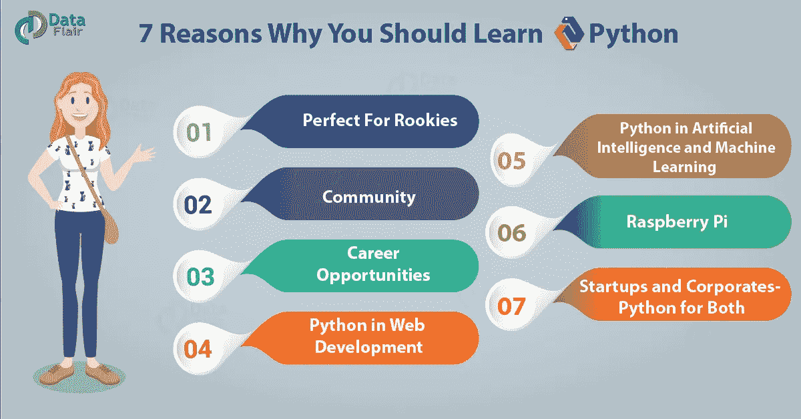
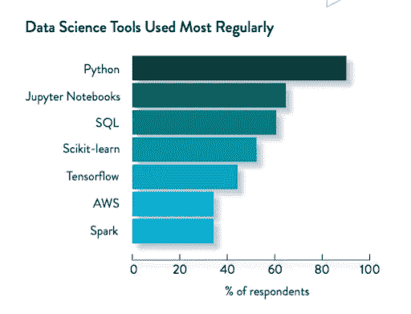

# 为什么 2021 年一定要学 Python？

> 原文：<https://medium.datadriveninvestor.com/why-you-must-learn-python-in-2021-57bf4df84070?source=collection_archive---------10----------------------->

现在是 2020 年 11 月，一年即将结束，全世界都在等待 2021 年的黎明。随之而来的问题是科技爱好者/软件开发人员“2021 年他们应该学习哪种新语言”。Python 是一个很好的学习选择，因为它可以用于软件行业中不同类型的应用程序开发。

Image by [Data Flair](https://data-flair.training/)

# **简单易学**

Python 的语法非常简单，最棒的是可以轻松导入外部库，从而使编写代码更加容易。比如做一个任务，与 Python 相比，大多数情况下需要更多的代码。如果你足够热衷于开始学习 Python，那么看看下面由 freecodecamp 专家讲授的教程-->

## 初学者教程

## 中级教程

# 申请数量

Python 是一种如此强大和广泛的编程语言，它可以用于如此多的技术领域。

 [## Python 中用于图像处理的傅里叶变换从零开始|数据驱动投资者

### 首先，处理数学问题真的很有趣。对吗？我知道答案可以是是也可以不是…

www.datadriveninvestor.com](https://www.datadriveninvestor.com/2020/10/23/fourier-transform-for-image-processing-in-python-from-scratch/) 

## Web 开发

通过使用像 Django 或 Flask 这样的框架，Python 可以用于开发网站。此外，随着越来越多的互联网接入到世界的发展中地区，将会有越来越多的内容创作者没有网站开发技能。因此，通过学习使用 Python 进行 Web 开发，你可以在 fiverr 上提供这种服务，并赚一些钱。对于学习 Web 开发使用 Python 观看以下教程->

## 机器学习

众所周知，大多数高智商的人都说机器学习将是下一件大事。由于这个原因，许多人正试图闯入它。机器学习最重要的一个方面是 Python，无论是建立模型还是进行数据可视化。可以明确的说 Python 是机器学习的背骨。**此外，Python 有像 Scikit-Learn 这样的库，它抽象出实现函数的复杂性，使 ML 开发者能够构建有意义的模型。**

# 数据科学

根据福布斯，数据科学家是本世纪最性感的工作，而且每个月都有很多与数据科学相关的新工作发布。

Programming Languages for Data Science

观看下面的教程，学习如何使用 Python 作为数据科学的工具。

# 更大的

Python 编程语言有更多的应用，这使得学习它非常有利可图。

祝您的 Python 之旅好运！！

看看我的博客吧，这里有更多有用的文章->【https://computersciencehub.io/】T5

## 访问专家视图— [订阅 DDI 英特尔](https://datadriveninvestor.com/ddi-intel)