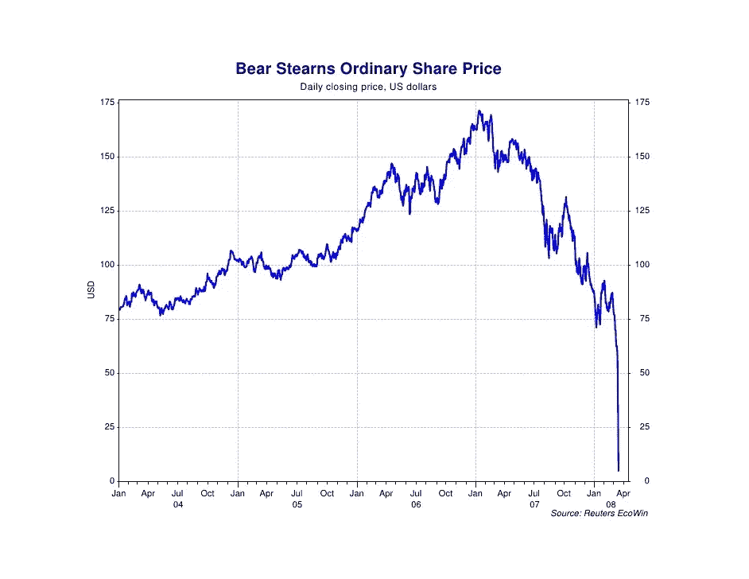

# 投资时为什么需要分散投资

> 原文：<https://medium.datadriveninvestor.com/why-you-need-diversification-when-investing-7b0e840588fc?source=collection_archive---------10----------------------->

Don’t put all your eggs in one basket — illustration by Author.

你听说过“不要把所有的鸡蛋放在一个篮子里”这句话吗？

如果你没有它，意味着不要把你所有的东西都放在一个东西上，因为如果你不小心掉到篮子里，你所有的鸡蛋都会被打破。让你没有鸡蛋。这可比装满鸡蛋的篮子糟糕多了。你篮子里有什么并不重要；希望，梦想，金钱。最好将这些东西分散在多个“篮子”中，以保护它们免受未来任何不可预见的情况。

在投资方面尤其如此。你想通过把钱放入多个不同的篮子来保护你投资的钱。

# 没有多样化是什么样子

投资时人们常犯的一个错误是他们没有分散投资组合。

把你自己带回到 2000 年。你 20 出头，刚刚开始投资。现在想象一个场景，你觉得这只伟大而有声望的银行股贝尔斯登是一个很好的选择。从表面上看，这是一只很棒的股票:良好的基本面、稳定的利润和令人骄傲的历史。该公司成立于 1923 年，致力于华尔街的发展和纽约成为全球最大、最具影响力的股票市场。你认为这是一个可靠的选择，你拿出 5000 美元的存款，尽可能多地购买股票。

直到 2007 年，你的投资都是不错的。2000 年的股价大约是 40 美元，如果你当时投资的话，你的投资就会增长到 170 美元。这意味着你 5000 美元的投资现在值 21250 美元。

当时几乎所有人都不知道，甚至在那里工作的大多数人也不知道接下来会发生什么。

Bear Stearns Stock Price went to zero in 2008\. Image Taken from [Trendfollowing.com.](https://www.trendfollowing.com/2008/03/14/bear-stearns-the-price-didnt-lie-about-direction/)

八年对于投资来说一点都不算长。到 2008 年，你的投资将变得一文不值。

这就是只投资一家公司的危险。你在孤注一掷。

你可以在大多数金融产品上看到这样的免责声明:

> “过去的业绩不能预测未来的回报”

就是这个意思。本质上任何事情都可能发生，而且确实发生了。即使是最稳定、最安全的公司也可能随时被扫地出门。

冠状病毒疫情应该最大限度地提高人们对此的认识。

## 公司股票期权

“没有多元化”的另一种情况是你的公司给你股票期权。

虽然这些计划很棒，我会建议你从这些计划中获得任何好处，但最好在公司股票期权之外拥有投资账户，以利用现有的所有机会。同时降低你的风险。

如果你唯一的股票或基金下跌，你的勤奋购买和持有就没什么可展示的了。

## 风险更小

拥有多元化的投资组合是投资的基础。

这是因为在一年中不同的时间点，不同的行业，不同的地理位置会有不同的回报高峰和低谷。

如果你只有一只股票，而这只股票陷入财务困境，你的投资可能会损失一半价值。

在最糟糕的情况下，如果你持有的是一只股票，它可能会变为零。

分散投资的作用是分散你的风险，这样你就不会受到任何一个事件的影响。

它给你很多篮子鸡蛋，所以如果你掉了一个，你不会失去所有的鸡蛋。

# 那么多元化是什么样子的呢？

这取决于两件事:

*   你的风险承受能力
*   你的投资目标

一旦你知道你对这两种东西的胃口，你就可以开始充实你的投资组合来满足这两种需求。

## 风险承受能力和投资目标

如果你还年轻，20 出头，你可以承受几年回报不那么好的日子。

会有那样的岁月。

但是因为你还年轻，你有足够的时间来恢复。这些年来股票市场的总趋势总是向上的，尽管一路上有一些大的震荡。

如果你能处理一个有点波动的市场，并坚持度过困难时期，你应该是更多股票的一个好投资。这些股票可以比风险较低的产品产生更高的回报。

如果你退休后依靠投资收入生活，你可能会想要一些风险较小的东西。你不希望市场下跌 20%，这意味着你正在努力把食物放在桌子上。

为此，市场上有债券和固定收益产品。这些风险低得多，因此回报也低得多。但如果你想要的只是有保障的收入，那么这些都是适合你的。

对于这两种方法，请注意:

> 在你的风险承受能力和投资目标范围内，你仍然需要分散投资。

对年轻人来说，这意味着更高的风险:

*   来自世界各地的基金(美国、英国、欧盟、日本)。
*   涵盖不同领域且不相关的基金(科技、公用事业、医疗保健等。)
*   投资房地产(房地产投资信托基金、商业和工业房地产基金、酒店房地产等)的基金。)

对于希望降低风险的人来说:

*   来自几个不同国家的债券(英国，美国，德国等。)
*   行业固定利率产品(许多行业的公司债务融资。)

# 多元化投资组合的 3 个原则

## 1.很好的搭配

这意味着你的投资组合应该混合不同类型的投资。把你所有的资本都集中在股票上可能是个坏主意。你可能会得到最好的回报，但是你也很有可能有几年你的账户是负的。此外，谁知道在你的投资生涯中，科技的主导地位是否会持续下去。

看看你可以利用的不同投资工具:

*   [指数基金](https://millennialnetworthjourney.com/what-is-an-index-fund/)
*   [共同基金](https://millennialnetworthjourney.com/what-is-a-mutual-fund/)
*   [房地产投资信托](https://millennialnetworthjourney.com/what-is-a-reit-real-estate-investment-trust/)
*   [债券](https://millennialnetworthjourney.com/what-is-a-bond/)

所有这些列出的投资都可以产生可观的回报，平衡和多样化意味着你的投资可以更好地免受市场变化的影响。

# 2.宏观焦点

不要过于专注于某个特定的行业[指数基金。人们可能很容易看到科技行业的回报，然后全押在一件事情上。但像这样追逐增长意味着你错过了公用事业和消费品等行业稳定公司的收益，这些公司已经为投资者提供了 60 多年的回报。](https://millennialnetworthjourney.com/what-is-an-index-fund/)

还有一件事要小心，就是要确保你买的基金没有重叠。如果你看到三只科技基金看起来都有不错的回报

深入研究你的经纪人提供的投资者文件，看看你投资的基金本身是什么。你可能会惊讶地发现，你在同样的投资上翻倍了。

这适用于不专注于某一特定部门或地理区域。

投资者在投资时倾向于坚持自己的国家，这是可以理解的，但这意味着你可能会错过良好的回报，并使自己依赖于一个国家的回报。世界各地都有一些很好的机会，特别是在未来几年，重点是中国、印度和巴西等发展中市场。

# 3.选择不同的策略

除了投资你的经纪账户，留意其他投资机会也很重要。

比如房地产、企业投资、你自己的事业以及加密货币等新型投资。有了这些东西，知道你在做什么是很重要的。

也许最重要的是，你应该为你的一生做的事情是投资于你自己。

无论是通过知识、课程，还是导师，都要确保你保持对自己的投资，这通常是回报最好的方式。

如果你想跟上我的写作，请考虑订阅我的邮件列表:

 [## 时事通讯注册-千禧净值之旅

### 注册我们的邮件列表，了解我们最新的帖子和深入的投资新闻和分析。我们…

millennialnetworthjourney.com](http://millennialnetworthjourney.com/newsletter-sign-up/)