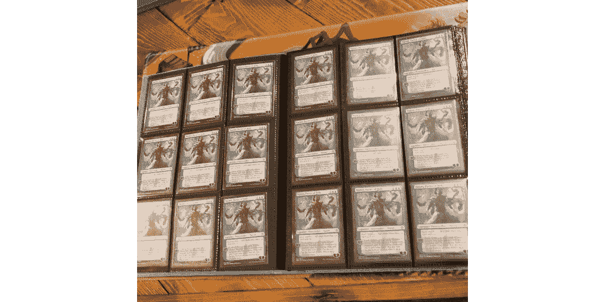

# 为什么你从未放弃魔法:聚会

> 原文：<https://medium.datadriveninvestor.com/why-you-never-quit-magic-the-gathering-5199ec4a459f?source=collection_archive---------3----------------------->

## 战略纸牌游戏，总是让我们回来更多。

Background Image CC0 licensed.

这个假期，我发现我的圣诞清单上除了我想要的浓缩咖啡机之外，还有满满的万智牌卡片和附件，以便在我每天的咖啡因供应上节省一些现金。

免责声明:我与《海岸巫师》没有任何关系，也没有收到任何报酬或激励来写这篇文章。

我出色的未婚夫给我买了另一个终极守卫 Arkhive 400 盒子，用来存放我越来越多的双套现代和先锋卡片，这些卡片是我为我们 LGS(当地游戏商店)的每周活动拼凑的。我还发现我的袜子塞满了爱尔德雷恩升压包王座，和一个花哨的新的布吉板写在魔术游戏中更好地跟踪生命总数。

对于那些不熟悉这款游戏的人来说，万智牌是一款战略卡牌游戏，玩家们在这场智慧、力量和狡猾的战斗中相互较量。从基础水平上学习看起来很容易，而且有一定的深度，会让你不断回来学习。个人玩法总有改进的空间，游戏通过不同格式的形式和玩法为每种类型的玩家提供了一些东西。自 1993 年以来，新的卡牌组定期发布并添加到大量的卡牌池中，游戏中的不同格式为所有技能水平的玩家提供了新的令人兴奋的体验。

> 我们从未真正离开过万智牌，我们只是休息一下。

十多年前，就在我进入高中一年级之前，我开始在阿拉拉街区的碎片中扮演万智牌。自从我开始玩牌以来，我已经收集了大量的标准和现代牌，卖掉了我的全部收藏，几年后开始玩，又买了我已经卖掉的那套牌，甚至更多。与其他玩家交谈，我意识到社区中有一种强大的趋势:作为玩家，我们从未真正离开万智牌，我们只是休息一下。

 [## 数据科学和软件工程哪个更有前途？数据驱动的投资者

### 大约一个月前，当我坐在咖啡馆里为一个客户开发网站时，我发现了这个女人…

www.datadriveninvestor.com](https://www.datadriveninvestor.com/2019/01/23/which-is-more-promising-data-science-or-software-engineering/) 

万智牌总是让我回来更多，即使我不得不休息一会儿，让我的卡收集一点灰尘。就像和一个好朋友重聚一样。你可以抽出一些时间，但是当你重新联系时，很容易从你停止的地方重新开始。幸运的是，我能够比以前玩更多的魔术。

> 在一个有趣的共同爱好上共度的时光是一个极好的额外收获。

在过去的一年里，我教我的未婚夫如何玩游戏，她现在经常带着自己的牌和我一起参加我们当地游戏店的活动。万智牌是一个很棒的活动，我们可以作为情侣一起玩，我们可以在带他们去活动之前试验和磨练新的甲板。一起度过一段有趣的时光，共同的爱好是一个极好的额外收获。我们甚至穿越州界参加重大的多日魔术活动，计划在我们以前没有去过的令人兴奋的新城市度过有趣的周末，玩我们喜欢的游戏，并在晚上体验城市的魅力。

我们主要在纸上玩魔术，主要是现代和先锋。我喜欢每周去我的 LGS 参加活动，体验游戏强大的社交功能。它让我获得我的游戏定位，锻炼我的思维，并与该地区的其他玩家建立新的友谊，这种方式在数字游戏中要困难得多。

还有一个有趣的金融方面(有时可能是一把双刃剑),因为魔法卡拥有真实、有形的价值。对于一些希望保持竞争力的玩家来说，保持魔法是一项昂贵的爱好。玩家交易、购买和出售卡片，游戏有一个强大的二级市场，让你能够在打开随机增强包之外获得任何你想要的卡片。

我发现自己在用手机上的一些应用程序、定制的电子表格和每周报告来跟踪我收集的卡片的价值，这些报告记录了我们收集的卡片中的“赢家”和“输家”。退一步说，这很无聊，但游戏的财务方面给我增添了一层乐趣。我发现自己在寻找方法来降低我的爱好的成本，并在做的时候获得乐趣。

这张卡片会因为即将发行的新卡片而增值吗？

*或者，既然某副牌正在取代一种格式的竞争元，那么另一张牌会不会失去很多价值？*

*为了长期增值，我想投机什么牌，我愿意持有多少张牌？*

A financial ‘speculation’ of mine: Narset, Parter of Veils from War of the Spark. Total value gained since May 2019: 513%

这些是我一直问自己的金融万智牌问题。对我来说，这是一个有趣的爱好，让我更加投入游戏。

我和我的未婚夫经常一起玩万智牌——但是如果我们需要离开一段时间，这种情况可能会改变。如果这真的发生了，有一件事是肯定的:当我们准备好回归的时候，万智牌会张开双臂等着我们。