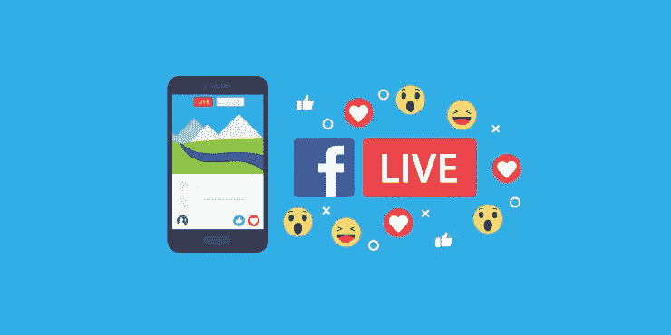

# 为什么你应该做现场直播

> 原文：<https://medium.datadriveninvestor.com/why-you-should-be-doing-live-459d41c63c99?source=collection_archive---------24----------------------->

人们很容易看到围绕社交媒体营销的建议，并觉得这些建议有点过时。关于标签、频率和提供价值，你会得到很多相同的东西，它们往往都集中在三个相同的平台上:脸书、Twitter 和 Instagram。

但是社交媒体营销就像许多其他事情一样，是不断向前发展的。如果你想有大的影响，那么你需要与时俱进，适应变化。这意味着，在这种情况下，为了享受他们提供的独特优势，在直播平台上。

**什么是直播？**

脸书(脸书直播)、YouTube、Instagram 以及 Periscope 和 Meerkat 等专用平台都提供直播功能。在每一种情况下，这都允许您向任何想要登录 feed 并观看的人传输实时视频。他们不仅可以观看，还可以发表评论，然后你可以实时回复。

**为什么这是一件大事**

有很多理由说明做直播是获得更多追随者的好方法，是你应该投资的事情。

我们现在可以深入讨论为什么 Live 在很多方面可能是社交媒体的“未来”。不过现在，我只想说，对你来说，它提供了一种与你的观众交流的独特方式，而没有必须等待帖子或消息被传递的限制。你的听众会觉得他们正在真正了解你的生活方式、你的业务和你的个性，你将能够直接回答他们的问题。

从 AMAs(问我任何问题)，到采访，到产品评论，这是一个非常棒的形式。

你应该参加直播的另一个原因是它是新的。这意味着它是令人兴奋的。更重要的是，这意味着那里没有那么多的竞争。努力在传统形式的社交媒体上获得牵引力？试着上线，你的所有观众都会收到通知(这是脸书和其他平台正在努力推广的)，你会发现没有那么多其他频道在做同样的事情。不会永远那样的，赶紧行动吧！