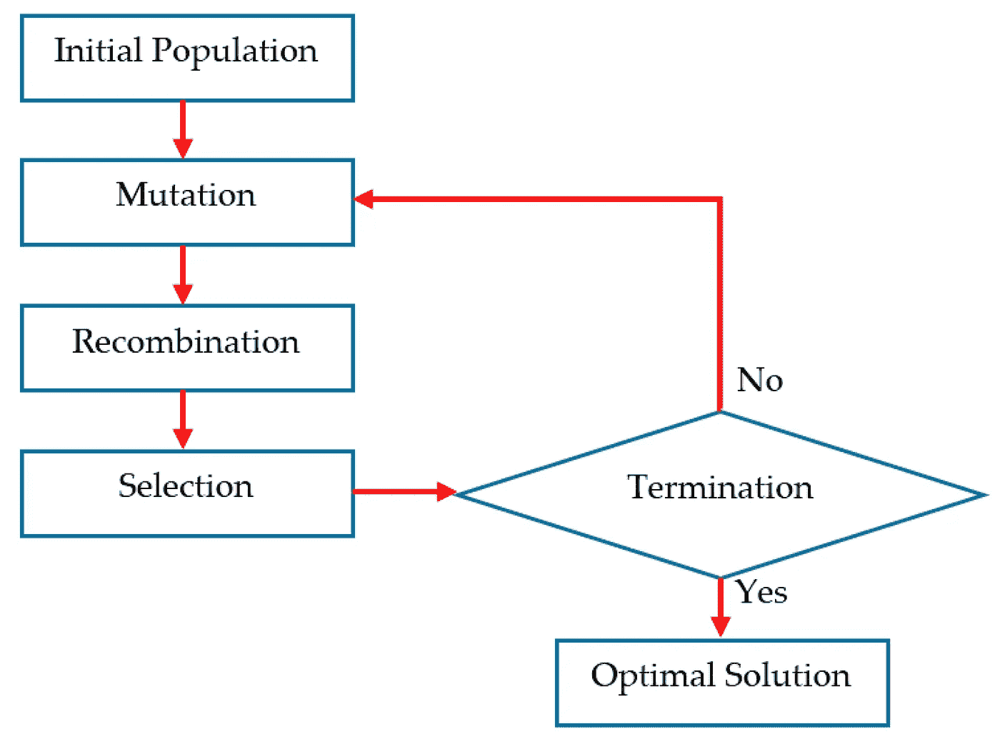
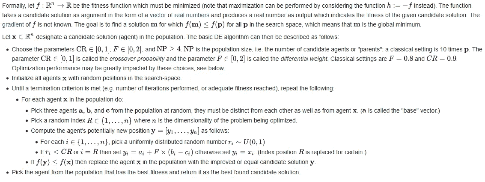
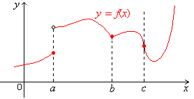
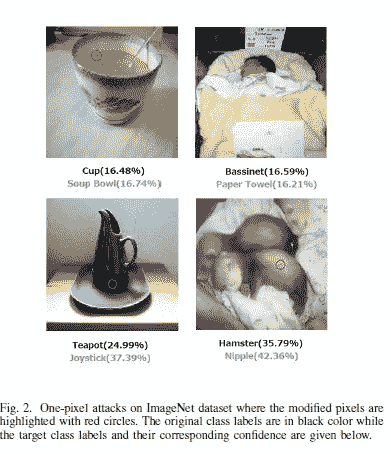

# 为什么您应该使用差分进化来解决优化问题。

> 原文：<https://medium.datadriveninvestor.com/why-you-should-be-using-differential-evolution-for-your-optimization-problems-b3b2ed622c4a?source=collection_archive---------0----------------------->

## 这是什么魔法？

为了帮助我了解您[请填写此调查(匿名)](https://forms.gle/7MfQmKhEhyBTMDUD7)

# 什么是差分进化，它是如何工作的？

用 facy 的话说，它“*是一种方法，它通过* [*迭代*](https://en.wikipedia.org/wiki/Iterative_method) *来优化*)***一个问题，试图针对一个给定的质量度量来改进一个* [*候选解*](https://en.wikipedia.org/wiki/Candidate_solution) *”。*它这样做，优化“*一个问题，通过维护一群候选解，并根据其简单的公式通过组合现有的候选解来创建新的候选解，然后保留在手头的优化问题上具有最佳得分或适合度的任何候选解*”。**

*简而言之，差分进化将遍历每个解决方案。如果它符合标准(例如满足最低分数)，它将被添加到候选解决方案列表中。通过对候选解进行简单的数学运算，可能会找到新的解。当迭代结束时，我们采用得分最高的解决方案(或者我们想要的任何标准)。*

*要构建基于 DE 的优化器，我们可以遵循以下步骤。*

**

*这提供了代码的一个非常高级的视图。这是因为这些步骤中的大多数都是非常依赖于问题的。使用该图作为实施 DE 所需步骤的参考。如果你想建立一个更复杂的基于函数的优化器，下面的说明是完美的*

**

*这些[幻灯片](http://www.iitg.ac.in/rkbc/CE602/CE602/Introduction%20to%20Differential%20Evolution.pdf)对于初学者来说是很好的参考。它们很好地涵盖了基础知识。由 IIT 大学(印度首屈一指的技术学院)的一名教授制作，它们以可操作的方式揭开了这些步骤的神秘面纱。*

* [## 人工智能、深度学习和医疗实践|数据驱动的投资者

### 人工智能和深度神经学习的效用看起来可能是合法和有前途的，特别是…

www.datadriveninvestor.com](https://www.datadriveninvestor.com/2020/06/24/disclosure-and-resolution-program-wont-prevent-physicians-from-practicing-defensive-medicine/) 

或者，我做了一个视频，回顾了 de 以及它为什么超级酷。看看这里。永远记得喜欢、订阅并分享您的任何反馈:) :

# 德的卖点

现在我们已经了解了 DE 背后的基础知识，是时候深入研究这种方法的优缺点了。这将有助于您理解何时 DE 可能是更好的优化协议。

## 范围

Here a,b,c show 3 ways a function can not be differentiable

DE 最大的好处来自于它的灵活性。因为它不计算一个点的梯度，所以不需要可微函数。这是不容忽视的。对于一个可微的函数，它需要在定义域上的每一点都有导数。这需要一个规则的功能，没有弯曲、间隙等。德并不关心这些函数的性质。它们可以很好地处理连续和离散函数。因此，DEs 可以(并且已经)用于优化许多现实世界的问题，并产生了惊人的结果。我将在下一节详细阐述这一点。

## 表演

Keep in mind that Deep Neural Networks take millions of times more resources.

如果没有稳定的表现，这个系列就没有任何意义。而且 DEs 甚至可以**胜过**更昂贵的基于梯度的方法。拿神奇的[一个像素攻击纸](https://arxiv.org/abs/1710.08864)(文章即将推出)。它能够通过**仅改变图像中的一个像素(向左看)来欺骗经过训练对图像进行分类的深度神经网络。**该团队使用差分进化进行优化，因为差分进化“*可以攻击更多类型的 dnn(例如，不可微分的网络或梯度计算困难的网络)。”结果不言自明。*在 Kaggle CIFAR-10 数据集上，只需修改三种常见深度神经网络结构上的一个像素就能发起无针对性攻击，成功率分别为 68:71%、71:66%和 63:53%。”*类似的还有“[差分进化采用新颖的变异和自适应交叉策略来解决大规模全局优化问题](https://www.hindawi.com/journals/acisc/2017/7974218/)”强调了差分进化在现实世界中优化复杂高维问题的用途。该范围允许它用于所有类型的问题。永远记住:**它的计算开销很小。***

## 简单

由于其简单性，差分进化不太关心输入的种类。简单增加了另一个好处。很容易改进。论文已经展示了大量的技术，这些技术可以被引导到差分进化中，以创建擅长特定问题的差分进化优化器。我会在谷歌上搜索与你的特定领域相关的例子，看看可能的技术。我觉得最酷的一个是:“[模拟退火差分进化](https://link.springer.com/chapter/10.1007/978-3-540-74581-5_13#:~:text=Differential%20evolution%20algorithm%20is%20a,differential%20evolution%20algorithm%20is%20proposed.)”

## 处理 DNNs 时的半黑盒

DE 是**不是**一个黑箱算法。运作和过程非常透明。这使得它非常适合跟踪步骤和微调。在处理深度神经网络时，它需要黑盒反馈(概率标签)。然而，这是唯一有一些不透明的情况。

# 最后的想法

DEs 非常强大。它们的受欢迎程度可以归结为一个简单的口号，“低成本，高性能，解决更多种类的问题”。由于它们的低成本，我建议在你的分析中加入 DE，即使你知道你的函数是可微的。由于 DEs 是基于另一个系统，它们可以很好地补充你基于梯度的优化。

# 向我伸出手

查看我在 Medium 上的其他文章。:【https://rb.gy/zn1aiu 

我的 YouTube。这是一个正在进行中的工作哈哈:【https://rb.gy/88iwdd 

在 LinkedIn 上联系我。我们来连线:[https://rb.gy/m5ok2y](https://rb.gy/m5ok2y)

我的推特:[https://twitter.com/Machine01776819](https://twitter.com/Machine01776819)

我的子任务:[https://devanshacc.substack.com/](https://devanshacc.substack.com/)

如果你想和我一起工作，请发邮件给我:devanshverma425@gmail.com

twitch 现场对话:[https://rb.gy/zlhk9y](https://rb.gy/zlhk9y)

获取我的内容更新-insta gram:[https://rb.gy/gmvuy9](https://rb.gy/gmvuy9)

获得罗宾汉的免费股票:[https://join.robinhood.com/fnud75](https://www.youtube.com/redirect?redir_token=QUFFLUhqa0xDdC1jTW9nSU91WXlCSFhEVkJ0emJvN1FaUXxBQ3Jtc0ttWkRObUdfem1DZzIyZElfcXVZNGlVNE1xSUc4aVhSVkxBVGtHMWpmei1lWWVKNzlDUXVJR24ydHBtWG1PSXNaMlBMWDQycnlIVXNMYjJZWjdXcHNZQWNnaFBnQUhCV2dNVERQajFLTTVNMV9NVnA3UQ%3D%3D&q=https%3A%2F%2Fjoin.robinhood.com%2Ffnud75&v=WAYRtSj0ces&event=video_description)

**访问专家视图—** [**订阅 DDI 英特尔**](https://datadriveninvestor.com/ddi-intel)*