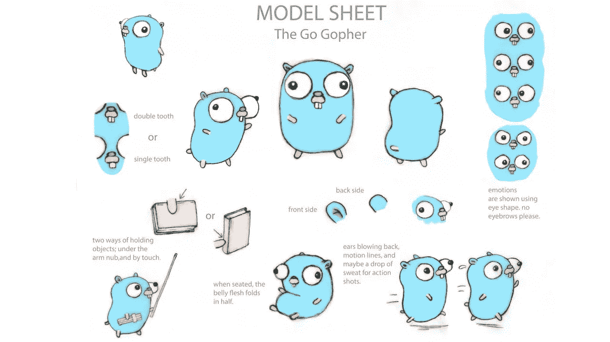
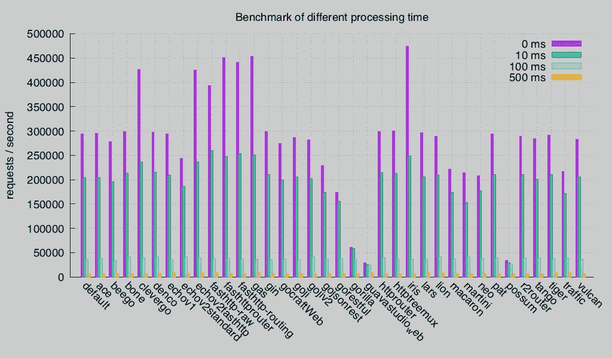

# 为什么要选择 Go lang 而放弃 Python 2021？

> 原文：<https://medium.datadriveninvestor.com/why-you-should-choose-go-lang-and-abandon-python-2020-123d6030b584?source=collection_archive---------0----------------------->

Python 和 Go 你会选哪个？如果你对围棋(Golang)有更深入的了解，你一定会先选择围棋。如果你不确定，你会选择 Python。那我们来讨论一下。选择 Python 合作伙伴，5 个理由让你选择 Go。让我们一起读这篇文章。对！

“Python 非常强大，尤其是 Python 3 具有异步能力，但 GO 将完全取代它在大型企业中的地位……”

如果你真的理解引号，你可以试试 Go 编程语言。我认为 Go 是一种非常简单的编程语言，适应任何应用环境，甚至比 **Javascript** 编程还要简单。这可能就是 GO 编程语言近年来流行的原因。

 [## 2019 年最值得学习的编码语言|数据驱动的投资者

### 在我读大学的那几年，我跳过了很多次夜游去学习 Java，希望有一天它能帮助我在…

www.datadriveninvestor.com](https://www.datadriveninvestor.com/2019/02/21/best-coding-languages-to-learn-in-2019/) 

在本文中，我将从以下几个方面对这两种语言进行比较。这些方面的参数将帮助您确定哪种语言更适合您手头的项目。

*   表演
*   可量测性
*   实际应用
*   执行方式
*   程序库
*   代码可读性

网站 TreeScale.com 主页和 API 是基于一些分析工具的 web 应用程序。这是他们的技术堆栈:

React.js 首页前端

Django Python 主页后端和认证服务

Node.js API 服务

PostgreSQL 数据库，Cassandra 日志系统

自定义容器注册表正在使用 Rust 语言

计算机编程语言

Repustate 几乎完全是一个 Python 存储。他们使用 Django 来实现 API 和网站。所以(目前)为了保持代码一致，使用 Python 实现阿拉伯语情感引擎是合理的。只是对于原型和实现来说，Python 是个不错的选择。它的表达能力很强大，第三方类库等等也很不错。如果你是为了 web 服务，Python 是完美的。但是当你执行底层计算，并且严重依赖哈希表(Python 中的字典类型)进行比较时，一切都变得很慢。我们每秒可以处理大约两到三个阿拉伯文文档，但这太慢了。相比之下，他们的英语情感引擎每秒可以处理大约 500 份文件。

从上面可以看出，基本框架完全是基于微服务和逻辑的分离(前端和后端分离)，甚至是完全不同的技术来实现的。

他们将 API 服务和后端集成到单个项目中的主要原因是，它们在许多地方都是相似的，并且是通过多种语言或技术进行编码的，并且存在大量重复代码。最终，他们需要花费大量时间来个性化 Django 的 API 服务，尤其是在定制 JSON 响应方面。

我感觉当你开发一些普通的应用时，使用 Django 是很棒的，但是当你需要更高的性能和一些个性化的模块时，使用 Django 会让它变得更复杂。

## 为什么选择围棋编程？

1.编译成一个二进制文件

Golang 是一种编译过的语言，Googe 的开发者为此付出了很多努力。它使用静态链接，根据操作系统类型和环境，实际上将所有依赖的库文件和模块组合成一个单一的二进制文件，这也意味着如果你想将后端应用程序编译到你的 Linux 操作系统和基于 X86 的 CPU 中，你只需要将编译后的二进制应用程序下载到服务器，然后后端应用程序就可以工作，这不需要任何依赖文件。

2.静态类型系统

类型系统对于大规模应用非常重要。Python 是一种伟大而有趣的语言，但有时你会看到一些不寻常的异常，因为当你试图将一个变量作为整型变量使用时，结果发现它是一个字符串类型。

Django 会因为这个 def some _ view(request):user _ id = request 而崩溃进程。POST.get ('id '，0)

Go 编译并告诉你这是一个编译器错误，这就是它在愚蠢问题上赢得时间的地方。

3.最佳化

令人惊讶的是，在大多数应用场景下，Go 都比 Python(2 版或 3 版)快。在基准测试游戏中可以看到比较的结果，这当然是不公平的，这取决于应用程序的类型和用户用例。

对于我们的例子，Go 由于它自己的多线程模块和 CPU 可伸缩性而获得了更好的性能。每当我们需要执行一些内部请求的时候，我们都可以使用 Goroutine 分别执行，比 Python 中的线程节省十倍以上的资源消耗。由于这些内置的语言特性，我们可以节省大量的资源(内存和 CPU)。

4.Go 不再需要 web 框架

这对**编程语言**来说是一件非常酷的事情。Go 语言的创造者和社区有许多核心语言支持的内置原生工具，在大多数情况下，你不再需要任何第三方库。例如，它有一个内置的 Http、JSON 和 HTML 模板。你甚至可以构建非常复杂的 API 服务，而不必担心在 Github 上寻找第三方库。

当然，Go 也有许多用于构建 web 项目的库和框架，但我建议您不要使用第三方库来构建您的 web 项目或 API 服务，因为在大多数情况下，使用原生包会让您的生活更轻松。

5.更好的 IDE 支持和调试

当您尝试更改编程语言时，IDE 支持是最重要的考虑因素之一。一个友好的 IDE 平均可以为你节省 80%的编程时间。JetBrains IDEA 的 Go 插件，也提供了其他支持，比如(Webstorm，PHPStorm 等…)。这个插件提供你在项目开发中需要的任何服务。强大的 JetBrains 想法可以让你的发展更加强大。

选择走，还是直接回家？

Mozilla 正在内部转换其庞大的底层日志架构，部分原因是强大的[goro tines]。Go 语言是由 Google 的人设计的，对并发性的支持在设计之初就是重中之重，而不是像各种 Python 解决方案那样在事后才添加。于是我们着手从 Python 切换到 Go。

虽然 Go code 还不是正式推出的产品，但结果非常令人鼓舞。我们现在可以每秒处理一千个文档，使用的内存更少，不需要调试你在 Python 中遇到的问题:难看的多进程/事件/“为什么 Control-C 杀不死进程”。

# 我们为什么喜欢围棋？

任何对编程语言的工作原理(解释型 vs 编译型，动态 vs 静态)有一点了解的人都会说，“切，当然，Go 更快”。是的，我们也可以重写 [**java**](http://www.wmzhe.com/heji/javabiancheng/) 中的一切，我们可以看到类似的、更快的改进，但这并不是 Go 语言胜出的原因。你用 Go 写的代码好像是对的。我不知道是怎么回事，但是代码一旦编译好了(编译速度快)，你就会觉得代码是行得通的(不仅运行起来没有错误，甚至逻辑上是正确的)。我知道这听起来不太靠谱，但确实靠谱。这在冗余性(或非冗余性)方面与 Python 非常相似。它以函数为第一目标，所以函数式编程会比较好理解。当然，go 线程和通道使您的生活更加轻松，您可以从静态类型中获得很大的性能提升，并且可以更精细地控制内存分配，但您不必为语言表现力付出太多。成本。

根据我们的代码统计，在 Go 中重写项目后，我们少写了 64%的代码。

你不需要调试不存在的代码。**代码越少，**错误越少！

最后

Go 为我们提供了极大的灵活性。一种语言可以在所有的用户场景下使用，而且在所有的用户场景下都能很好的工作。在我们的后端和 API 服务中，我们获得了 30%的性能优化。现在我可以实时处理日志，转换成数据库，并通过 Websocket 处理一个或多个服务！这是 Go 语言特性提供的一个非常强大的特性。