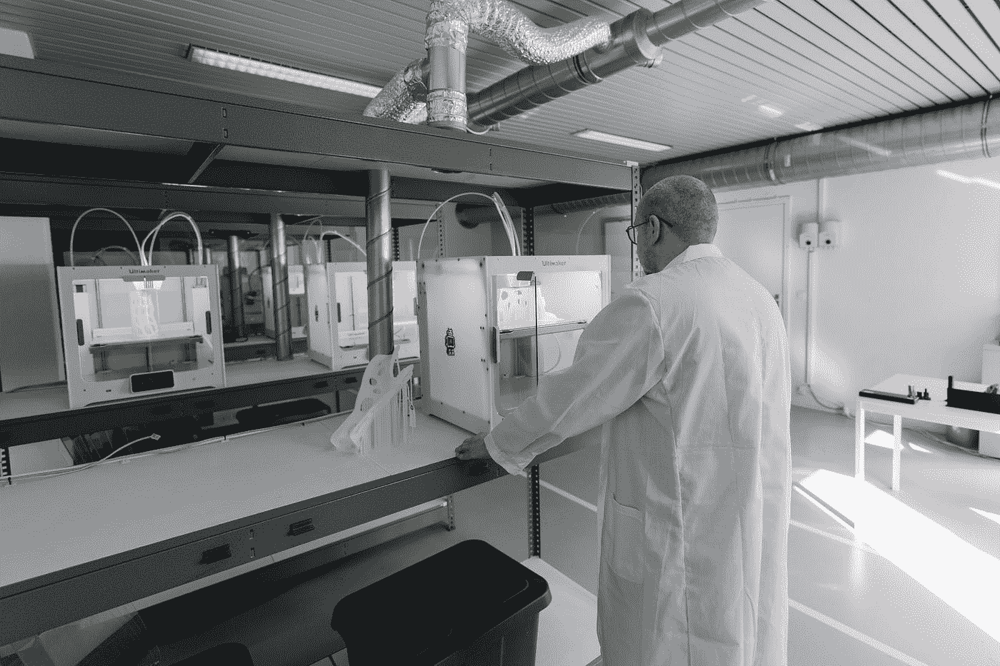

# 为什么您应该投资 3D 打印技术

> 原文：<https://medium.datadriveninvestor.com/why-you-should-invest-in-3d-printing-technologies-1cdf3964d5cd?source=collection_archive---------31----------------------->

## 技术创新的未来在这个部门。你愿意探索吗？

Photo by [Tom Claes](https://unsplash.com/@tomspentys?utm_source=medium&utm_medium=referral) on [Unsplash](https://unsplash.com?utm_source=medium&utm_medium=referral)

一直以来，投资者总是在寻找有前途的行业来投资他们宝贵的资金。我是其中之一，我是说，谁不想多挣一两块钱呢？

从太阳能到 3D 打印，一切都是热门话题。

据经济学家称，2026 年，3D 打印市场将价值近 517.7 亿美元，与预计在同一日期达到相同价格的大麻行业面对面。

想想 3D 打印能做的一切:

*   真实状态:3D 打印房屋——节省成本和时间。
*   零售:鞋设计、家具、蜡铸件和原型。
*   航空航天:以较低的成本生产小批量零件。
*   机器人技术:为机器生产完美的配件。
*   汽车:生产坚固耐用的原型。

这个名单还可以继续下去，但 3D 打印中的这些领域是我最喜欢的。

现在让我们看看股票。

## 这些公司专注于 3D 打印

1.  3D 打印 ETF

股票代码 PRNT 由 ARK Invest 管理，截至周五(2/5/21)，该股票的最新价格为每股 45.65 美元。对我来说，这是一个偷窃，不仅因为价格低，而且因为它在一个地方跟踪不同的 3D 打印公司。

如果你是这个领域的新手，想要投资，这是一个很好的起点，尤其是在你不确定投资哪家公司的时候。

从长期来看，这有可能触及 60 多美元。

2.DDD (3D 系统)

股票代码 DDD 是一家制造 3D 打印机的工程公司，因此，随着需求的增加，利润也会增加。3D 系统的最新价格为 47.95 美元(2/5/21)。

3D Systems 自 1986 年以来一直存在，截至 2017 年的收入为 6.468 亿美元。因此，进一步盈利的空间很大。

3.原型实验室公司

股票代码 PRLB 是另一家专注于生产 3D 打印机的公司。他们向从医药到电子等领域提供产品。

截至 2011 年 2 月 5 日，每股价格为 216.56 美元，远高于 PRNT 和 DDD。

该公司也是方舟投资公司的一部分，总共拥有 300 万股股票。但是，对于价格，我感觉公司被高估了。

## 最终拍摄

T3D 打印行业是一个我们都应该参与的行业，即使它只是一小部分股份或者只是一小笔钱。由于缺乏主流应用，该行业仍未实现应有的腾飞，然而，在未来几年和几十年内，它将是一个冉冉升起的行业。

一如既往，请对我推荐的每只股票进行研究。确保调查财务方面以及公司的盈利能力。*我不是财务顾问。*

如果您想了解其他部门:

 [## 为什么你需要投资⚡️电力行业

### 这是下一件大事，忘掉其他的吧。

medium.com](https://medium.com/datadriveninvestor/why-you-need-to-invest-in-electric-%EF%B8%8F-sectors-eb38b26a2ac9)  [## 为什么你需要投资工程鲑鱼

### 这个行业是下一个大事件吗？让我们找出答案。

medium.com](https://medium.com/datadriveninvestor/why-you-should-invest-in-engineered-salmon-957f9f0bba5c)