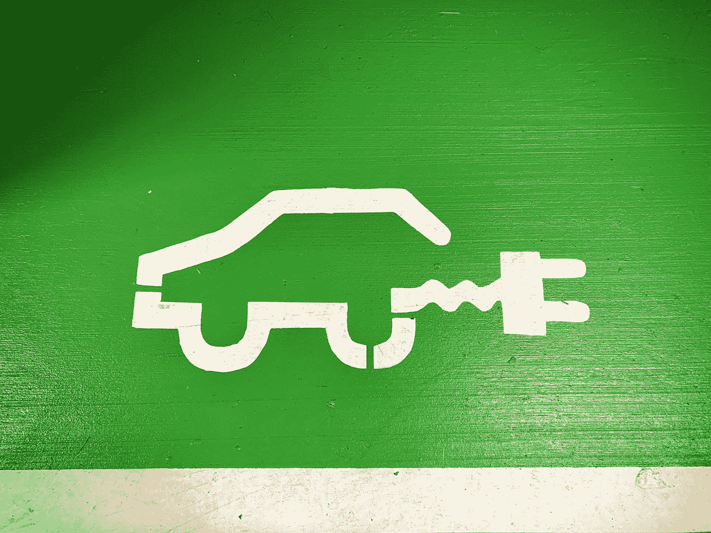
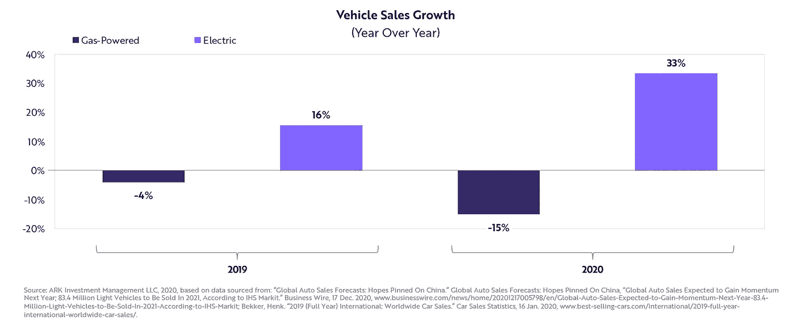
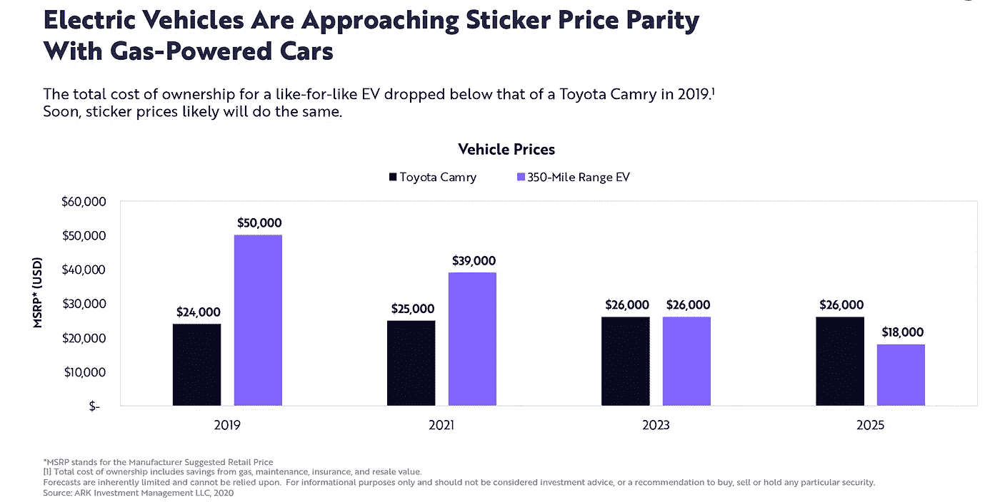
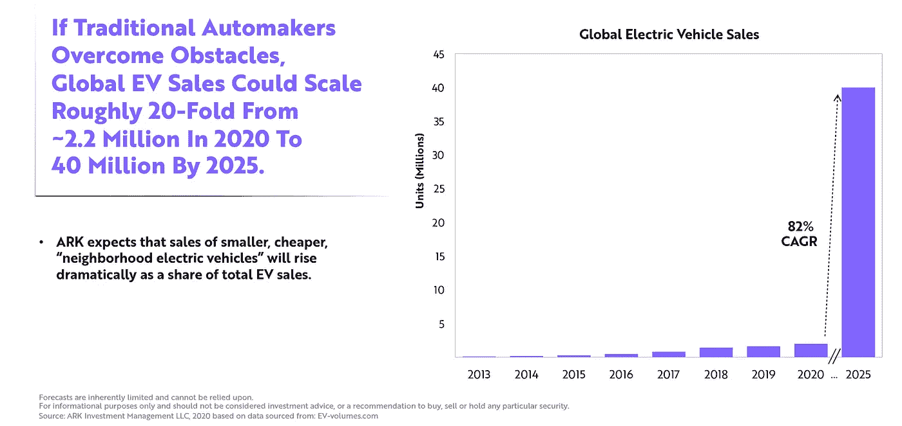
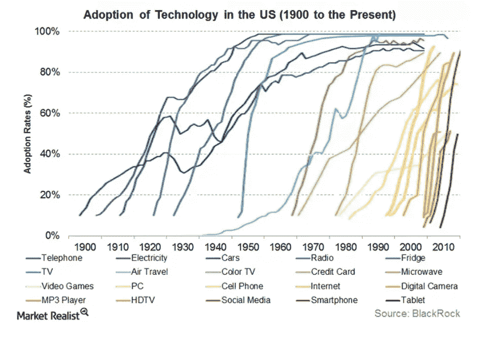

# 为什么你应该投资电动汽车

> 原文：<https://medium.datadriveninvestor.com/why-you-should-invest-in-electric-vehicles-53c1eda1f00c?source=collection_archive---------30----------------------->

## 未来与技术

## 创新电池设计成本的下降和政策支持将加速销售。

Photo by [Ralph Hutter](https://unsplash.com/@pixelfreund?utm_source=medium&utm_medium=referral) on [Unsplash](https://unsplash.com?utm_source=medium&utm_medium=referral)

颠覆性技术的本质决定了它无法实现线性增长。通常需要 150 年才能完成的任务在 20 年内就完成了。所有的科学数据都让我们相信，电动汽车(ev)的采用也是如此。

电动汽车将通过摧毁内燃机行业来颠覆交通行业，并主导汽车市场——比我们想象的要快得多。

就像我们今天看不到马车、晶体管收音机和翻盖手机一样(或者很少看到)，ice 进入灭绝的时间即将到来。

颠覆性技术的历史证据、关于 ice 和电动汽车的市场数据，以及不同级别的政府对电动汽车的政策支持强烈表明，在未来 5 年内，电动汽车的采用和销售需求将呈指数级增长。

在过去两年中，ICEs 的汽车销售增长一直在下降，而电动汽车的销售增长却在上升。

Source: Ark Invest

为了理解为什么会发生这种情况以及我们的发展方向，让我们看看电动汽车颠覆性本质背后的主要原因:

1.  电池成本下降
2.  s 曲线现象
3.  政府的政策支持。

## 电池成本下降

电动车最大的成本部分是它的电池。因此，电池成本的下降对于主流买家买得起电动汽车至关重要。成本也在下降。

赖特定律解释了这一现象:产量每增加一倍，相关成本就会下降一定的百分比。对于电动汽车，据估计，每生产一倍的累计单位，电池成本将下降 28%。

成本的下降可以归功于“学习”和“体验”。当新技术的成本和能力都没有最大化的饱和点出现时，就有大规模发展的空间。随着时间和经验的积累，我们最终会到达那里。电动汽车的电池就在这条路上。

随着锂离子电池成本的下降和内燃机成本的上升，电动汽车的销售增长正在迅速加快。

美国能源信息署[预计到 2022 年将达到 200-400 万台。然而，ARK Invest 认为这一预测过低。相反，他们预计到 2022 年电动汽车的全球销量将达到 1700 万辆，大大超过目前的预测。根据莱特定律，ARK Invest 预测电动汽车的销量将从 2020 年的 220 万辆增长到 2025 年的 4000 万辆，增长约 20 倍。](https://www.eia.gov/)

Source: Ark Invest

这一预测的最大下行风险是传统汽车制造商是否能成功过渡到电动和自动驾驶汽车。

## S 曲线

从历史上看，所有颠覆性技术都遵循“S 曲线”。

理解 S 曲线可以防止意外，并给我们一个工具来保持领先的变化。这条 S 形增长曲线显示了一个行业在突破性技术方面的生命周期。

Source: BlackRock

在上图中，代表“空中旅行”的线最能代表 S 曲线。开始时是线性增长，然后急剧上升，一旦每个人都采用这种做法，最后就趋于平缓。

S 曲线的关键部分是紧随技术早期采用者之后的急剧上升。电动汽车被认为遵循同样的模式。电动汽车的使用将在未来 5 年内急剧上升。

## **政策支持**

世界各地的政府都在制定和执行支持大众向电动汽车过渡的政策。

根据[国际能源署](https://www.iea.org/reports/global-ev-outlook-2020) (IEA)的说法，政府转向各种监管和财政措施可能会逐渐成为电动汽车部署的主要驱动力，为该行业设定明确的目标和长期愿景。

许多监管政策迫使汽车制造商销售更多数量或份额的电动汽车或其他更高效的汽车。例如，如今 60%的全球汽车销售被中国的新能源汽车指令、欧盟二氧化碳排放标准(适用于所有欧盟成员国)或零排放汽车指令(在选定的美国各州和加拿大各省)覆盖。欧盟批准了 2021-30 年汽车和货车的新燃油经济性标准和重型车辆的二氧化碳排放标准(2020-30 年)，并对电动汽车提出了具体要求或奖励。

电动汽车在实现可持续发展的环境目标，减少当地空气污染和应对气候变化方面发挥着关键作用。根据[国际能源署](https://www.iea.org/reports/global-ev-outlook-2020)的数据，在这种情况下，全球电动汽车存量(不包括两轮/三轮汽车)每年增长 36%，到 2030 年达到 2 . 45 亿辆——比今天的水平高出 30 多倍。

**电动汽车革命**是一项颠覆性创新，消费者、制造商和政策制定者似乎都喜欢它的成本效益、创新性和环保性。时候到了。

现在还是投资电动汽车的好时机吗？

是的。

[***Upen Singh***](https://medium.com/about-me-stories/about-me-upen-singh-4d16999f650c)***写的是人、进步、未来。他对改善生活感兴趣。***

他已经游历了 25 个国家，他总是在寻找新的冒险来学习和分享。他拥有西弗吉尼亚大学发展经济学硕士学位。

***他生活在泰国、尼泊尔和美国，不断地旅行。他目前正在尼泊尔偏远的西部参与一个名为***[***Metta Valley***](http://www.mettavalley.org/)***的村庄发展项目。***