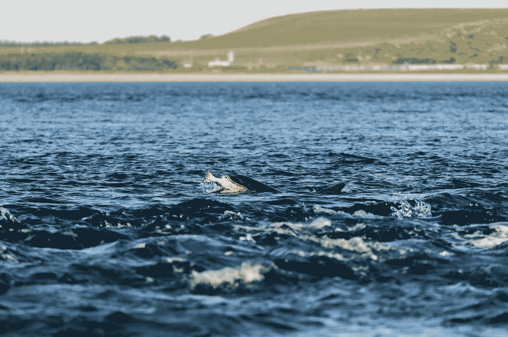
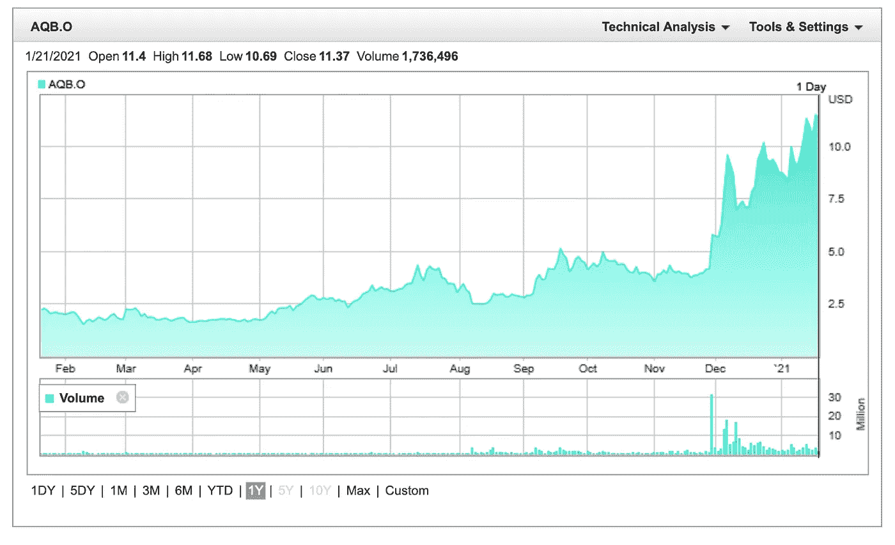

# 为什么你需要投资工程鲑鱼

> 原文：<https://medium.datadriveninvestor.com/why-you-should-invest-in-engineered-salmon-957f9f0bba5c?source=collection_archive---------17----------------------->

## 这个行业是下一个大事件吗？让我们找出答案。

Photo by Ramon Vloon on [Unsplash](https://unsplash.com/photos/Sgdx9qxllcE)

你听说过塑料污染吗？这不是什么新鲜事。

根据海洋保护协会的数据，“每年，800 万公吨的塑料进入我们的海洋，目前估计有 1.5 亿公吨塑料在海洋环境中循环。”

当海洋中循环的塑料分解时，它就变成了微塑料。当这种情况发生时，它会被我们吃的鱼吃掉。所以没错，你每次摄入海鲜都是在吃塑料。

海洋上的塑料是一个在未来几年只会恶化的问题。现在我们知道了这个问题，什么公司正试图针对它？

**这就是 AquaBounty 的用武之地。**

自 1991 年成立以来，AquaBounty 的使命就是开发陆地养殖的工程鲑鱼。这是什么意思？

这种三文鱼是转基因的，与天然三文鱼相比，能够在生命的最初阶段存活下来，并且长得更好。它仍然和大西洋鲑鱼一样美味，但是有更多的优点。

改良三文鱼不含毒素和抗生素。一般是有机的。

随着人们转向少加工食品和清洁能源，这家公司开始受益。

在乔·拜登(Joe Biden)担任总统期间，AquaBounty 有很大可能实现盈利。想到这一点，AquaBounty 提倡清洁的食物消费和更清洁的环境；降低运输过程中的碳足迹。

**现在让我们谈谈钱，这就是你在这里的原因。**

目前，AquaBounty 在纳斯达克以 AQB 的名义公开交易。此时，1 月 21 日，该股交易价格为 11.48 美元，在过去 3 个月中上涨了 7.43 美元。

Screenshot from [AquaBounty.com](https://investors.aquabounty.com/stock-information/stock-quote)

该股有所增长，尤其是在未来几年。随着越来越多的公司动员起来促进更清洁的环境，我可以看到这家公司和消费者发挥着重要作用。

我认为这不仅仅是肉。

**期末笔记**

回到 11 月 30 日，我以 5.91 美元的价格购买了这只股票，到目前为止，它已经涨了一倍多。

只要有一点耐心，你也能获利。

据我所知，我发现公司的使命是创新和高增长潜力。

我不知道，也许这可以成为农业的**苹果。**

**缺点:**

根据纳斯达克的数据，AquaBounty 预计 2021 年的市盈率为-63.53。以及从-13 到-14 的负 ROE(股本回报率)。

这是什么意思？

投资 AquaBounty 会带来巨大的风险。涉及股东不能从他们的投资中获得任何形式的权益或盈利的机会。

当你做研究时，请记住这些事情。你必须知道你的投资组合能承受多大的风险。

*明确一点，我不是理财顾问；以上只是我的看法。在你做任何投资之前做好你的研究。*