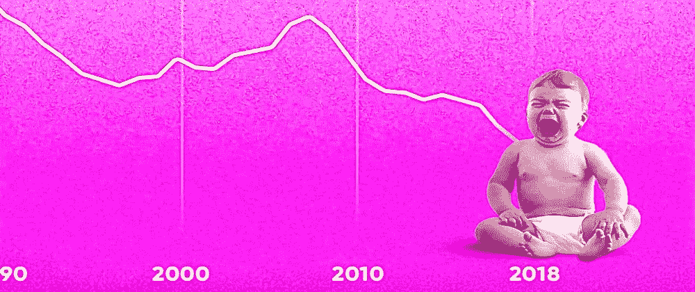
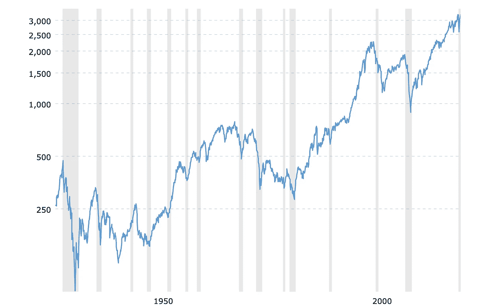

# 为什么你应该投资股票

> 原文：<https://medium.datadriveninvestor.com/why-you-should-invest-in-stocks-a50e591f027b?source=collection_archive---------19----------------------->

source: Photo by Morning Brew on Unsplash

如今，许多收入颇丰的专业人士怀疑投资股票是否值得大费周章。

不幸的是，与此同时，大多数人仍然不太了解金融和投资，尤其是股票市场。

即使是那些加入早期初创企业或大公司并获得适当股票补偿的员工，也不知道未来会如何受益。

> 当我开始对投资机会感兴趣时，我感到恐惧和不安。我以为这只是为金融专家和已经很富有的人准备的。

我大错特错了！

当然，在你深入投资之前，你应该首先教育自己，但实际上，这并没有你想象的那么难。

尤其是当你开始投资股票市场的时候。

# 💰股票增加你的资本

投资股票不是赌博。

> **如果你能定期储蓄并明智地进行长期投资，你就能极大地增加你的资本。**

**然而，如果你破产了，你就不应该投资。**

在此之前，确保你的财务状况良好，你有一笔应急基金来支付三个月左右的费用，以备不时之需。

学习如何从你的开发工资中腾出额外的每月现金用于投资也是有用的，这样你就可以花得更少，投资更多。为此，你可以在这里使用我的 15 大技巧小抄，每月节省更多的钱。

投资是非常有趣的，尽管资本增长，它给你一些聪明的东西去学习，而不是玩电子游戏或看电视节目。

> 大多数投资者发现长期投资对他们的资本总是有利的。

> 例如，投资高增长的新上市股票可能看起来而且肯定是积累财富的好方法。尽管如此，明智的做法是用成熟公司的股票进行投资组合。

> *“不一定要做不平凡的事才能得到不平凡的结果。”—沃伦·巴菲特*

在股票市场中，获取增长资本最方便、最明确的方法是以合理的价格购买业务出色的公司股票；只要他们还在做伟大的生意，就持有他们。

股票投资的另一个令人印象深刻的事情是，你的投资资产是流动的。你可以随时卖掉它们，然后把钱存回你的银行账户。

顺便说一下，我最近创建了一个新的免费迷你课程**,内容是如何利用各种高回报、先进和创新的投资工具每月投资 500 美元并从中获利。**在此获得您的即时访问权限:

 [## 如何投资获利每月 500 美元-仅限严肃投资者

### 10 种行之有效的投资方式每月 500 美元开始独立投资，无需银行、基金和…

seriousinvestorsonly.com](https://seriousinvestorsonly.com/how-to-invest-profitably-500-a-month/) 

# 📈股票历史增长

股票投资有好有坏，这不是什么秘密。

> 去年，有一次股市崩盘，以前也有过股市崩盘、回调和糟糕表现的时期，未来还会有。

尽管如此，美国标准普尔 500 指数在通胀前的历史回报率为 10%-11%，通胀后为 7%-8%。您可以通过在线经纪人或银行账户轻松获得。

总的来说，在过去的 80-100 年里，股票往往会上涨！标准普尔 500 指数— 90 年历史图表:

例如，[如果你在 2010 年投资了 100 美元到 S & P 500 指数，那么在 2019 年 12 月 5 日，它将达到 344 美元。](https://www.visualcapitalist.com/best-performing-stocks-decade/)

> 从历史上看，小盘股投资已被证明比大盘股更有利。

从长远来看，一些小型公司可以成为大型高利润公司，比如在 10-20 年内(加上数字化和科技初创公司，甚至可能需要 5 年)。

因此，如果你决定购买这些股票，并持有一段时间，那么在卖出之后，或者在公司决定支付股息之前，你可能会赚很多钱。

**提示:**寻找并研究 100 家左右的小市值公司；根据你的信念和分析，筛选出最好的 5-10 个，并决定投资其中最受欢迎的 3-5 个。

# 💎具有投资价值的股票

你希望你的股票增值，因为这是你投资资本的增长方式。

> 价值投资意味着首先关注那些能够成长并变得伟大的公司。

基本的价值投资概念非常简单:

*   **你知道公司股票的真实价值**
*   **你在打折时买的**
*   **在这种情况下，你节省了很多钱**
*   **你持有并从中受益**

> 事实上，股票价格可能会发生变化，例如，当市场波动时，即使公司的实际股票价值保持不变。

因为根据市场及其需求，股票会经历较高和较低的时期，导致价格大幅波动。

但这并不能改变这样一个事实，那就是你得到了你的钱。

> **作为投资者，你愿意以低于市场价值的“折扣”购买股票。**

因此，作为购买并长期持有这些价值股的回报，你可以获得丰厚的回报。

从我的十大书单中了解更多关于金融和投资的知识！

 [## 我给投资者的十大金融和投资书籍

### 以下是我最喜欢的 10 本书。我会推荐那些愿意达到财务独立的投资者阅读这些…

medium.com](https://medium.com/datadriveninvestor/my-top-10-finance-and-investment-books-for-investors-df4b21d3a70d) 

# 💸支付股息的股票

根据定义，股息是公司利润的一部分，通常支付给股东。通常，股息是公司收益的合理比例。

> 大公司通常比小公司支付更多的股息。

从逻辑上讲，定期支付股息的股票应该在你的投资组合中。这意味着支付股息的股票现金充裕——根据它们的季度和年度财务报表，它们有稳定的现金流，没有负债。

此外，**股票的分红历史可以在做出理性决策时起到至关重要的作用。这将有助于你了解该公司在过去几年里是否一贯正确地支付股息。**

> 如果股票增长放缓，股息是确保收入的另一种方式。

因为派息公司通常更为成熟、突出和稳定。

# %股票复利

从技术上讲，**公司股票不提供收入保证，因为它们的回报是基于市场价格波动的；此外，他们并不真的应该支付利息。**

尽管如此，有两种方法可以让一家特定公司的股票价值随着你投资的复利而上升:

1.  公司赚了更多的利润，所以投资者愿意掏钱买股票。因此，每股股票价格倾向于以类似复利的速度逐年增长。这意味着，如果股价上涨，可购买的流通股将会减少，但公司总价值不会下降，未来可能会继续上升。
2.  **如果公司开始表现良好，收益丰厚，公司可能会考虑发放股息，其表现类似于你投资的复利。许多好的股票投资每年支付 3-6%的股息，因此复利意味着获得现金股息，并将它们再投资于更多的股票。**

> **复利将时间作为增加回报的最重要因素。因此，只有在长期投资的情况下，复利才会在股市中发挥作用。**

这个想法是，你投资的公司已经或将会盈利并产生股息，使你能够将这些利润再投资到它的业务中。然后，它变得越来越大，并在第二年赚取更多的利润。这就是复利对股票的定义。

# 📊股票使你的投资多样化

分散投资意味着投资不同的股票以降低损失风险。

> “不要把所有的鸡蛋放在一个篮子里”——英国谚语

如果你把所有的钱都投资在一只股票上，或者依赖于一个特定的部门，或者投资于特定的资产，那么如果这些股票表现不好，你很有可能会失去所有的钱。

> 寻求回报时降低风险。

**为了平衡损失并继续赚钱，你必须分散投资股票，而不仅仅是股票。**

如果你有一个永久多样化并定期重新平衡的投资组合，你就不会有高亏损或高收益的时期。相反，从长期来看，你将获得更稳定的资本净增长。

> 你应该线性持有的股票数量取决于满足你的投资目的和目标的需要。

[**聪明的投资者，**](https://amzn.to/3kKLaMy) **表示神奇的数字在 10 到 30 之间。**

与麦哲伦基金的著名基金经理彼得·林奇相反，他一度持有大约 1500 只股票。

记住多元化股票股份可能有资本增长，定期支付现金红利，可以复利，自动再投资。

# 结论

如果你确信并渴望很快开始你的投资之旅，确保你会花时间了解所有的基础知识，然后再把你的积蓄投入股市。

保持开放的心态，阅读关于股票投资的不同资料，接触不同的投资观点也是至关重要的。

> **买那些有你能理解的业务的公司的股票。**

从一个行之有效的投资策略开始对投资者来说投资股票市场是非常必要的。

**你对自己的教育越多，你做出的投资决策就越好，从长远来看，这些决策将是一致的。**

还在吗？太神奇了！非常感谢您的阅读！如果你有兴趣了解更多关于你的投资者个性，你可以在这里试试我的测试。

**感谢您的阅读！**

看看我的一些受欢迎的文章:

 [## 2021 年最值得关注的 IPO 股票

### 投资者和交易员期待的 2021 年最佳 IPO。

medium.com](https://medium.com/datadriveninvestor/best-ipo-stocks-to-watch-in-2021-bad8549cfa98)  [## 如何在波动的股市投资:投资者的 5 个投资策略

### 股市动荡时期对投资者意味着什么？

medium.com](https://medium.com/datadriveninvestor/how-to-invest-in-a-volatile-stock-market-5-investment-strategies-for-investors-134d708a157f)  [## 如何练习交易和投资不亏损

### 使用经纪平台练习交易和投资的最佳方式。

medium.com](https://medium.com/datadriveninvestor/how-to-practice-trading-and-investing-without-losing-money-9d348dde71de) 

*免责声明:作者的观点仅代表其个人观点，不以任何方式构成财务建议。作者发布的任何内容都不构成投资建议，作者发布的任何数据或内容也不应作为任何投资活动的依据。*

*附属信息披露:作为亚马逊的附属信息，我可以从 Amazon.com 的合格购买中赚取佣金。*