# 为什么你应该现在就开始投资

> 原文：<https://medium.datadriveninvestor.com/why-you-should-invest-your-money-right-now-c4d0f0905676?source=collection_archive---------5----------------------->

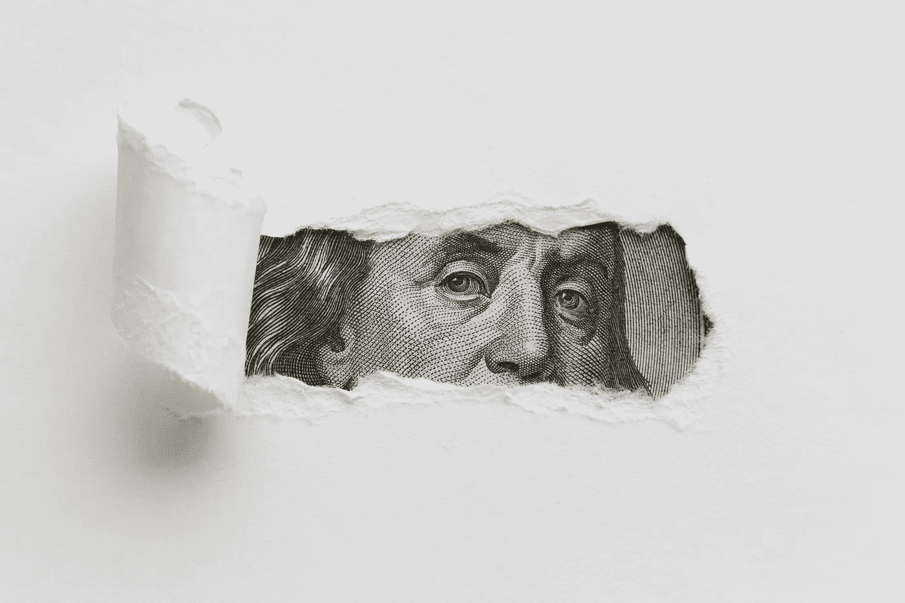

[Designed by Freepik](http://www.freepik.com)

*一篇关于个人投资风险的数据驱动论文*

O 经常有朋友或熟人向我表示担心，他们知道应该投资自己的钱，但对高风险投资的恐惧让他们一直依赖于*安全的东西*。这种惯性源于风险认知与个人经历和预期紧密相连，而个人经历和预期通常根植于市场每日波动或早间新闻提供的短暂反馈回路。

《韦氏词典词典》将风险定义为损失的可能性，而将这种损失的可能性程度定义为波动性。套用霍华德·马克斯(Howard Marks)的话来说，波动性作为一种方便学者得出结论和推断风险的衡量标准，符合要求。然而，如果人们担心资本损失，他们会拒绝投资，但如果他们担心价格会波动上升，他们就不会这样做。这使得波动性不适合个人投资风险的角色，因为它很少或没有给出永久损失的线索。就像丹尼尔·克罗斯比博士一样，我们应该将个人投资风险定义为我们无法过上我们想要的财务生活的可能性。

 [## 算法交易的机器学习|数据驱动的投资者

### 当你的一个朋友在脸书上传你的新海滩照，平台建议给你的脸加上标签，这是…

www.datadriveninvestor.com](https://www.datadriveninvestor.com/2019/01/30/machine-learning-for-stock-market-investing/) 

没有人愿意冒损失金钱的风险，然而每个人都想拥有更多。我将揭示这两种选择不仅是不相互排斥的，而且是如何不赔钱本质上依赖于暴露于让你变得更富有的那种风险。

# 三种不同的风险暴露

以下内容基于一个简单的数据集，涵盖了 55 年(从 1965 年到 2019 年)的通胀率、国债利率和标准普尔 500 回报率，包括股息。

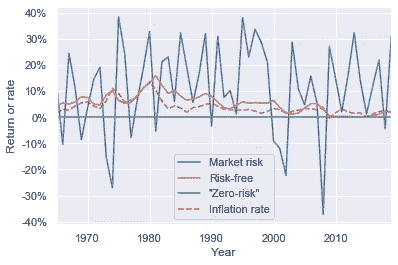

Dataset used for generating the analysis (yearly returns and rates)

为了让讨论更贴近实际，我将实际投资工具转化为它们所提供的风险敞口。国库券是非常短期的美国国债，历史上被认为是无风险利率。投资股票市场提供的超过无风险利率的超额回报通常被称为股权风险溢价。标准普尔 500 指数包括美国 500 家最大的公司，是整个美国股票市场的可靠代表。鉴于这种股权风险溢价，我们将其称为**市场风险**。最后，我们有**“零风险”**，把钱存在支票账户、低收益储蓄账户或床垫下的零波动配置。

# 通货膨胀

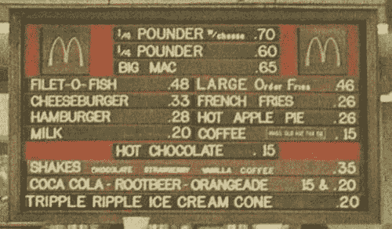

McDonald’s prices in the 1970s

你还记得小时候一个巨无霸的价格吗？今天它的价格是多少？这可能是一个更高的名义价格，但这并不一定意味着它们变得更贵。这就是通货膨胀:商品和服务价格的持续上涨。如果你在 70 年代口袋里有 65 美分，你可以买那个巨无霸，但是如果那些 65 美分一直在你的口袋里直到今天，他们只会买今天 65 美分的东西，你可能会挨饿。65c 的名义价值仍然是 65c，但相对于 70 年代，它们的实际价值(扣除通货膨胀的影响)只有 10c 左右。这相当于说，今天 65c 的购买力相当于 70 年代 10c 的购买力。有足够的证据得出第一个结论:你需要一个至少相当于通货膨胀率的回报率来维持你多年的购买力。

通货膨胀的最大危险是它在短期内是看不见的。尽管如此，多年来的复利将缓慢但肯定会侵蚀掉粗心投资者的购买力。因此，维持我们辛辛苦苦挣来的美元的购买力应该是实现我们渴望的财务生活的逻辑起点。考虑到这一点，接下来的每张图都将代表 10，000 美元的实际美元增长，即经通胀调整后的增长。

# 一年投资

我们首先来看看在我们 1965 年至 2019 年的时间跨度内，任何人暴露于每种风险 1 年可能发生的 55 种假设结果。在第一个图中，每条蓝线显示每一个实例的实际美元增长 10，000 美元，而橙色线表示这些实例的平均值，橙色带表示它们的标准偏差。请注意，三幅图的垂直比例不同。注意到每一项投资的总体趋势就很清楚了。“零风险”投资显示负预期(平均)回报，唯一两次产生正回报的情况是通货膨胀为负(通货紧缩)的两年。否则，投资者以“零风险”持有的每 1 万美元将损失 100 至 1200 美元。

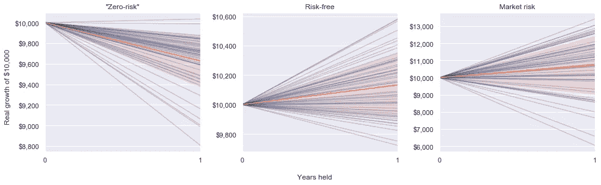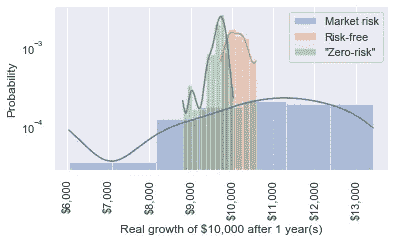

另一方面，无风险投资和市场风险投资都有正的预期收益。尽管市场的预期回报率远高于无风险回报率，但结果的分散程度也要大得多——参见互补的直方图及其分布——这自然会对短期进入市场持保留态度。在一年中，市场投资者每 10，000 美元可能会损失大约 4，000 美元，而保守的投资者由于无风险敞口最多会损失几百美元。后者是由于在某些时期，如过去十年，利率没有跑赢通胀。在这两种情况下，投资者会损失大约 30%的实际价值。

# 5 年和 10 年投资

如果我们扩大投资窗口，那么“零风险”的前景不会更好，恰恰相反。它 100%的时间都在损失实际价值，而且随着时间的推移，损失的幅度越来越大:把钱藏在床垫下 10 年后，投资者可能会损失超过一半的实际初始价值！

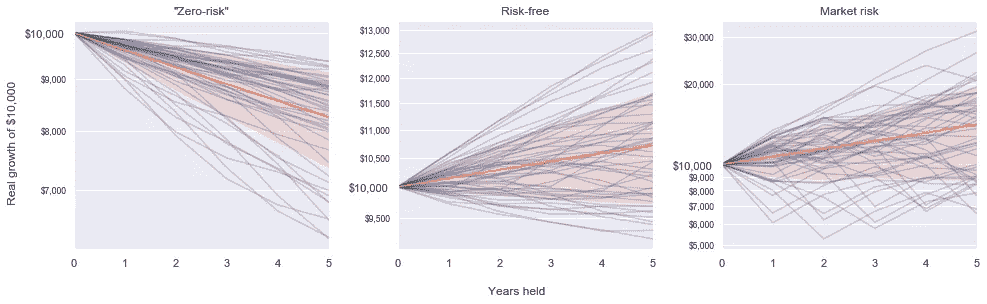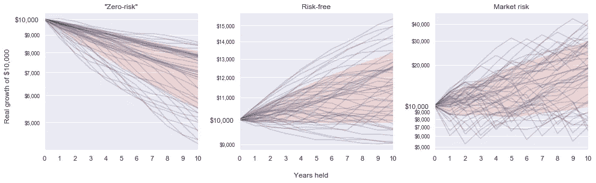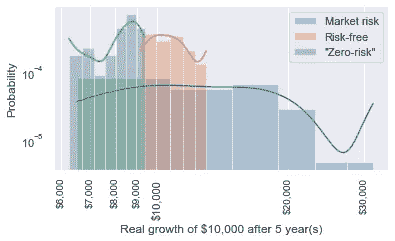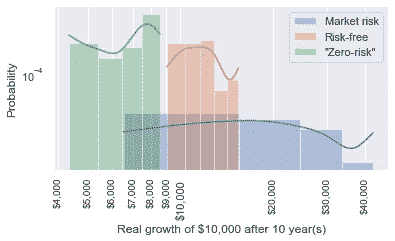

尽管无风险和市场风险投资的最坏情况没有改善，但它们继续提供持续的正预期回报:市场投资者甚至有望在 10 年内将初始投资翻一番。对于这两种风险敞口，在 5 至 10 年的投资期间，损失实际价值的可能性也从 30%降至 20%。还要注意的是，从直方图来看，市场风险敞口的最坏情况正在迅速赶上“零风险”的最好情况和无风险风险敞口的最坏情况。

# 15 年投资

在 15 年的关口，典型的“零风险”投资者应该预计会损失几乎一半的实际投资价值。然而，聪明的投资者在考虑波动性更大的选项时，到达了一个有趣的转折点。

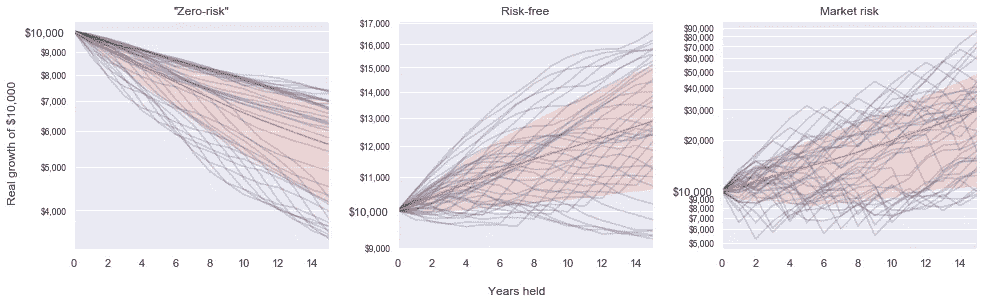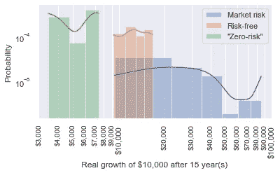

面对市场风险的前景突然看起来比无风险的选择好得多。暴露在市场中损失实际价值的可能性现在几乎不存在——只有 7%对无风险的 15%——如果发生，价值损失可以忽略不计。从好的方面来看，虽然无风险投资者不得不满足于 30%的实际增长，但市场投资者可能会期望积累 200%的巨大实际收益。

# 30 年投资

到目前为止，我认为你可以满怀希望地推断出从如此长期的投资中可以期待什么。你是对的，对于那些把钱藏在远离波动性的地方的人来说，这看起来的确像是一场噩梦:超过本金实际价值的损失高达 80%。

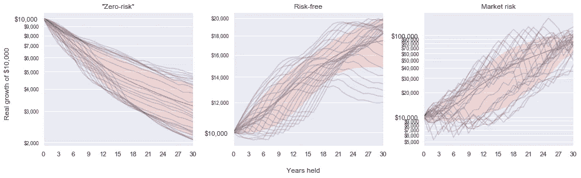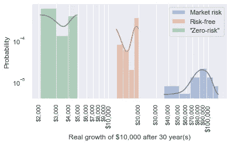

然而，对于聪明的投资者来说，现在应该清楚的是，不在如此长的时间范围内投资于市场是没有意义的。在市场上呆 30 年的最坏情况是实际投资价值翻两番，而这么长时间无风险的最好情况是只翻一倍。请注意，暴露于市场风险的投资者预计会将最初的 10，000 美元变成经通胀调整后的 90，000 美元，实际增长高达 800%!

# 结束语

我们现在意识到，个人投资风险不仅仅取决于投资的波动性和预期回报。它还与这种投资的时间范围密切相关。像股票市场这样不稳定的工具在短期内无疑是有风险的。然而，放弃股票市场存在大量的风险，以机会成本的形式，这将在 15 年左右完全发生。“股市有风险”现在变成了这样一个相对的说法。“放弃股票市场是有风险的”就像一句话一样有效。这完全取决于你的时间范围，因为它可以在三维直方图中以浓缩的形式显示出来。

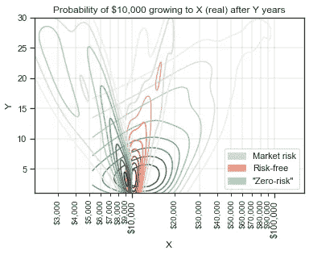

Darker means a higher probability density

不过，有一件事是肯定的。当你不得不决定你想在复合效应的哪一边时，不投资不是一个选项。要么你投资于正预期回报的工具，要么眼睁睁看着你的钱被无情的通货膨胀剃刀慢慢刮光。

> 如果你从中只学到一点，那就是不投资的“零风险”选择是最有风险的，时间是最重要的。你每持有 10，000 美元，每个月会损失大约 30 美元。

## 数据源

*   通货膨胀率:[https://data.oecd.org/price/inflation-cpi.htm](https://data.oecd.org/price/inflation-cpi.htm)
*   国库券回报:[https://data . OECD . org/interest/short-term-interest-rates . htm](https://data.oecd.org/interest/short-term-interest-rates.htm)
*   http://www.moneychimp.com/features/market_cagr.htm[S&P500 归来](http://www.moneychimp.com/features/market_cagr.htm)

## 不是财务建议

本文仅具有教育意义，本文中的信息不作为，也不应被理解或解释为财务建议。我不是财务顾问，也不自称是，文章中的信息不能代替专业的财务建议。尽管我已尽最大努力提供准确和有价值的信息，但这些信息都不应被理解为建议您不要咨询金融专业人士来解决您的特定信息。