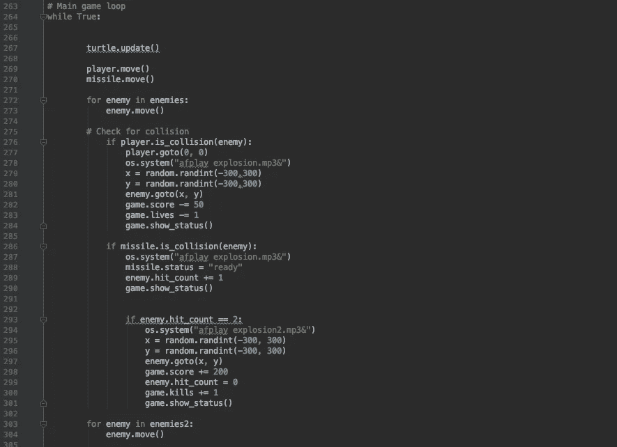

# 为什么你现在应该学习 Python

> 原文：<https://medium.datadriveninvestor.com/why-you-should-learn-python-now-a6d047e3c0c9?source=collection_archive---------8----------------------->

这听起来可能令人望而生畏，但是我将概述为什么你现在应该学习 Python 或任何其他编程语言的 5 个主要原因。这不会花很长时间，我保证读完这篇文章后，你会迫不及待地开始使用这种现在发展最快、最流行的编程语言之一。

Photo by [David Clode](https://unsplash.com/@davidclode?utm_source=unsplash&utm_medium=referral&utm_content=creditCopyText) on [Unsplash](https://unsplash.com/s/photos/python-programming?utm_source=unsplash&utm_medium=referral&utm_content=creditCopyText)

## 1.这比你想象的要容易得多

人们看到“编码”和“编程”这两个词，他们会立即记起计算科学在学校是多么困难，有时在家里自己的计算机上执行相对简单的过程是多么困难。

 [## 2019 年最值得学习的编码语言|数据驱动的投资者

### 在我读大学的那几年，我跳过了很多次夜游去学习 Java，希望有一天它能帮助我在…

www.datadriveninvestor.com](https://www.datadriveninvestor.com/2019/02/21/best-coding-languages-to-learn-in-2019/) 

“我绝对不可能写代码！”你可能会在心里感叹，但老实说，从经验来说，你能做到。只需要你几分钟的时间和少量的努力，你就会看到编程真正的美丽和力量。

## 2.你会赢得那些掌握这门语言的人的尊重

虽然我说过编程比你想象的要容易，但是一旦你开始把事情提高一个档次，它就会变得非常困难。所需的代码行数将开始增加，您将开始遇到一些可能很难甚至似乎不可能解决的问题。可悲的是，这只是野兽的本性，有些事情就是做不到。然而，通过这个反复试验的过程(一次又一次的错误……)，你将开始了解计算机编程的一些基本组成部分，结果你将成为一名更好的程序员。

克服困难是必要的，它会逐渐让你意识到为了让你的电脑完成一些非常简单的任务需要投入多少时间和精力。在过去的某个时候，有人不得不写出数百行代码，以确保你的电脑每天早上都能识别你的密码，这样你的手机才能向正确的人发送短信。如果这次经历没有教会你什么，你会对确保你最喜欢的设备按下按钮就能做你需要的一切所做的工作有一个新的认识。

Some of the code from a basic game I made using Python…

## 3.这是非常值得的

我自己只涉猎过一种语言(Python ),所以我没有很多人那么有权威，他们知道的比我多得多，也比我熟练得多。然而，在我相对较短的编程旅程中只完成了少数几个项目，我可以说这无疑是我在过去一年中所做的最有收获的事情之一。从我最初的“Hello World”到我的第一个计算器项目，一直到我自己可以玩的基本游戏的创建；我喜欢它的每一部分。

每次你按下运行按钮，电脑就按照你正确提供的指令运行，你就会有一种强烈的成就感。这些强有力的微奖励会激励你继续你的项目，它们会让你怀疑；我还能用这些新技能做些什么呢？

## 4.可以免费上手！

这不是一个笑话；你真的可以开始免费学习 Python(或者，如我之前所说，如果你愿意，可以学习许多其他编程语言)。你需要做的就是在网上下载一些免费软件——有很多选择，但我使用 PyCharm，其中有一个免费和付费版本(顺便说一下，这里没有附属关系或付费推广)——然后决定你想如何开始学习！有无数的书籍会带你了解基础知识，但我更喜欢的方法是现代的、通用的演讲剧场:YouTube。

在这里，你会发现数百名创作者拥有数千个视频，这些视频将为你提供开始工作所需的所有工具。您可以进行搜索，直到找到适合您的内容，然后您可以在您选择的任何代码编辑器(指您之前下载的软件的时髦术语)中测试您的知识。这一切都是 100%免费的，这一事实令人难以置信，尽管如果你愿意，你可以付费参加专业课程。有了网上所有的免费资源，没有理由不马上开始！

## 5.最后，它可能非常有用！

不需要计算机科学学位就能意识到，这些语言为普通人带来了一些真正的潜力，让他们的生活变得更轻松。再说一次，互联网是你最好的朋友。一些简单的谷歌搜索会为你提供成千上万的现成项目想法，你可以复制这些想法并将其应用到你自己的生活中，或者你可以从中获得一些灵感，提出你自己的聪明想法。

这种语言的多功能性非常令人印象深刻，您肯定能够发现生活中的一些领域可以受益于一点点 Python。一些伟大的想法包括一个有趣的问答游戏，你可以用它来挑战和打动你的朋友；一个密码生成器，将确保你永远不会被告知你的密码太弱了；我个人最喜欢的——一个非常有用的费用跟踪器。请随意根据自己的需要来调整这些想法，不要害怕从中获得乐趣！没有正确或错误的答案，只有偶尔令人沮丧的错误消息..

Honestly, it is!

所以，如果从这篇文章中只能学到一件事，那就是对编程要有开放的心态。仅仅因为你以前没有计算机方面的经验，并不意味着你现在就不能开始。在当今以技术为中心的世界，学习一些编程只能是一件好事。如果你正在寻找一些有用和有趣的东西放在你的简历上，那么编程语言是一个很好的补充，而且不仅仅是与计算相关的工作！表现出学习新技能的能力和对现代技术中最有趣和最有用的部分的理解，会使你成为未来雇主非常有吸引力的候选人。

所以，今天就投资自己，学点 Python 吧！