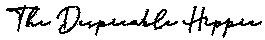

# 为什么你应该听查尔斯·达尔文？

> 原文：<https://medium.datadriveninvestor.com/why-you-should-listen-charles-darwin-c2509a2c992b?source=collection_archive---------9----------------------->

尤其是在我们现在生活的这个时代。

Photo by [Joshua Woroniecki](https://unsplash.com/@joshua_j_woroniecki?utm_source=medium&utm_medium=referral) on [Unsplash](https://unsplash.com?utm_source=medium&utm_medium=referral)

> “幸存下来的不是最强壮的物种，而是最能适应变化的物种。”

新冠肺炎向我们展示了生活是如何快速变化的，我们的经济和生活是如何脆弱，我们看到商人，他们曾经有过良好的生活，从一个时刻到另一个时刻，它结束了。Manifs 发生在世界各地的街道上，因为他们反对关闭机构，没有钱买食物。但这是谁的错呢？

多年来，我们目睹了几次世界危机，这些危机带来了贫困、饥饿、死亡，但出于某种原因，我们人类继续不改变我们的生活方式，直到一种我们肉眼看不见的病毒“袭击”。

 [## 在家工作如何提高我的工作效率|数据驱动型投资者

### 在家工作确实激发了我最大的潜能，让我更有效率。因为在家工作给了我…

www.datadriveninvestor.com](https://www.datadriveninvestor.com/2020/07/29/how-working-from-home-increased-my-productivity/) 

现在，这些是主要的问题:

*   只有一个收入来源是一个人所能拥有的最糟糕的事情；
*   没有一年开销的企业最先面临破产；
*   社会上认为可悲的工作现在受到了重视，因为至少有钱把食物放在桌子上；
*   没有储蓄账户的人现在正在承受后果。
*   最后但并非最不重要的是，物质上的东西无关紧要。

你放心，我不怪你，至少，不完全是，你有些愧疚，但不是全部。你和我都是以一种非正统的方式接受教育的，这种教育形式只是为了维持经济模式，在这种模式中，我们被插入，多年来，*工作 50(或更多)，然后退休几年*。

而且，如果我们以前不相信这一点，疫情是一个戴着白手套的瘾君子……但是，正如*达尔文*所说，谁能很好地适应变化，谁就赢了。

我们不能因为我们所犯的错误而责怪别人，如果我们处于尴尬的境地，我们必须走出困境，并学会不再犯同样的错误。我们应该从错误中吸取教训，不要指望别人来拯救我们。我们是自己的救援船。

[www.thedespicablehippie.com](http://www.thedespicablehippie.com)

## 获得专家观点— [订阅 DDI 英特尔](https://datadriveninvestor.com/ddi-intel)