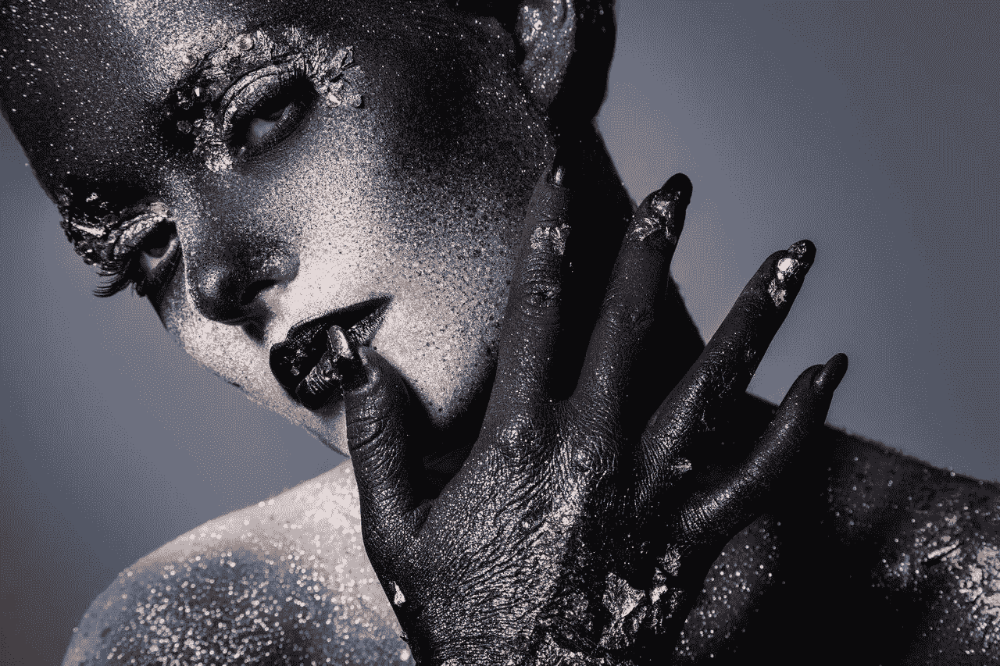
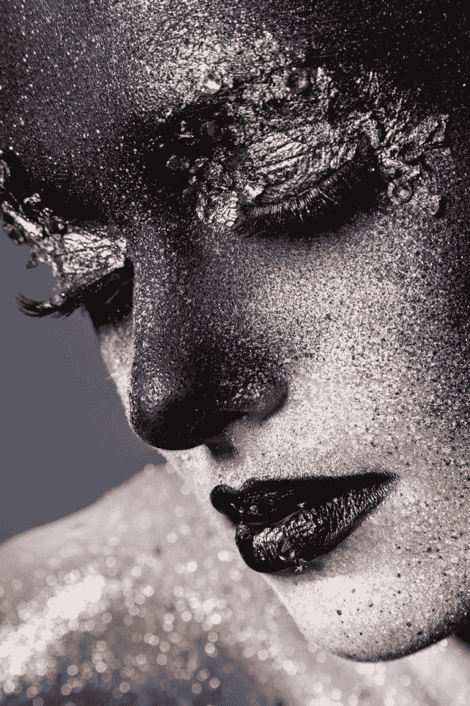
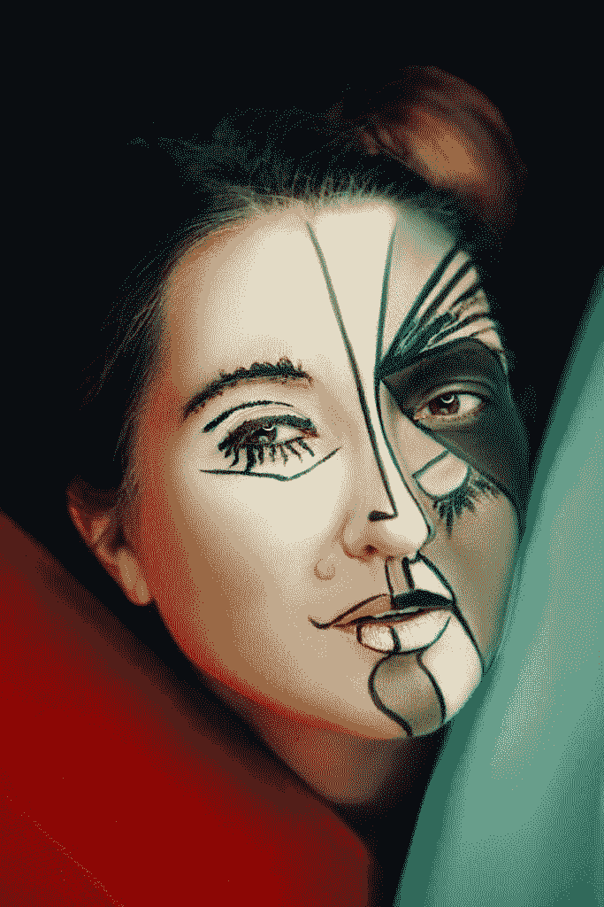

# 为什么你不应该浪费一个好的危机

> 原文：<https://medium.datadriveninvestor.com/why-you-should-never-let-a-good-crisis-go-to-waste-272d975a5938?source=collection_archive---------11----------------------->

Photo by @freepik via freepik.com

# 为什么你不应该浪费一个好的危机

如果你决定接受它，你的任务就是永远不要让一个好的危机白白浪费掉。这篇文章是我试图给你提供一些如何做到这一点的建议。生活是一次旅行，有时道路是美好和愉快的，而其他时候则是崎岖、艰难、危险和最不愉快的。

没有人自愿选择走那条不愉快的路，除了有时候除了走那条路别无选择。想象你在 2020 年的路线上(看起来很像 2020 年)。*2020*路线是那种让你走上它就不寒而栗的道路，危险潜伏在每个角落，没有良好的能见度，它是孤立的，崎岖的，有许多上下坡和意想不到的转弯。自从今年年初电晕危机真正袭击了我们，我们一直在这条路上行驶，它一直很艰难。

今年发生的很多事情都在我们的控制之外。与其担心我们无法改变的事情，不如关注我们能够控制的事情。地平线上总有一线希望，即使我们还看不到。永远不要让好的危机白白浪费。

Photo by @freepik via freepik.com

> *“用中文写，‘危机’这个词由两个字组成。一个代表危险，另一个代表机会”——*
> 
> 约翰·肯尼迪

这篇文章的整个前提是永远不要让一个好的危机白白浪费掉，因为在每一次危机中它们都可能是一个机会。约翰·肯尼迪和中国人非常理解这个概念。一旦你意识到了危险，承认它，镇定你的神经，然后做点什么，最好是以一种让事情向你有利的方向发展的方式。实现这一点的一个方法是将你的精力集中在一个目标、一项任务、一种激情上，一些让你保持心流状态的事情上。这就是你如何找到你的机会，你的一线希望。

# 永远不要让好的危机白白浪费。找到你的激情

生活可能会很忙碌，总觉得有太多事情需要去做。你的待办事项清单上写满了需要你关注的重要事项，(感谢你在今天的重要事项清单上添加了*查看乔安妮·里德的博客*。非常感谢。)问题是，非必要的活动很少出现在那张清单上，即使出现了，这些低优先级的项目也只有在还有时间的情况下才能完成。问题是剩下的时间永远不够。

Photo by @freepik via freepik.com

只不过今年，不一样了。突然间，我们所有人都发现自己有了很多新发现的时间，因为政府命令他们的人民呆在家里，远程工作，在线学习，只在必要的时候才去杂货店(反正也没有别的地方可去，所有的东西都关门了)？永远不要让一个好的危机白白浪费，也不要把自己变成一个沙发土豆来破坏它。

不要躺在沙发上半睡半醒地看电视，而是用你在危机前从未有时间做的活动来填充你的待办事项清单，比如烹饪、健身、园艺、唱歌、绘画、写作、成为 YouTube……只要能点亮你的精神，让你进入心流状态。

 [## 改善之旅始于福祉|数据驱动的投资者

### 一场普遍的健康危机让人们认识到将健康融入工作文化的重要性。过去的陈词滥调已经…

www.datadriveninvestor.com](https://www.datadriveninvestor.com/2020/06/01/journey-of-improvement-starts-with-well-being/) 

# 我如何找到我的激情？

对一些人来说，找到自己的激情很容易，他们生来就知道这是什么；不太容易的是开始并坚持做下去。对于其他人来说，找到他们的激情并不那么明显。问题是很多人认为他们的激情藏在某个地方，也许在一棵树后，或者在一块石头下。事实是，我们的激情来自于先做事，然后把事情做对。我们应该养成把激情注入我们所做的所有事情的习惯。如果我们坚持这样做，总有一天某样东西会比其他东西都突出；这正是我们应该投入更多时间热情去做的事情。这就是全部，做就是了。

Photo by @freepik via freepik.com

有可能因为看不到任何结果，你有热情却仍然感到气馁和泄气。如今的问题是，人们缺乏耐心，他们期待立竿见影的效果。事情不是这样的。在某件事情上取得成功需要努力、汗水、泪水、纪律和耐心。不要关注结果，关注工作本身。追求你喜欢做的事情，每天致力于磨练你的技艺。最终，人们将无法把目光从你身上移开。

如果你仍然感觉冷静，没有激情去创造任何东西，听听哲学家卡尔·荣格的观点，他可能会给你一些启发。

> 如果你没有任何东西可以创造，那么也许你创造了你自己。给一个人的性格赋予风格是一种伟大而罕见的艺术
> 
> *卡尔·荣格*

把自己变成一件艺术品怎么样？也许是你能成为的最健康的人？或者是一个深刻的哲学思想家？当你得到它时，炫耀它。

> *“考虑把你的生活变成一件艺术品。你有自己的开始，也有一段不确定的时间为之努力。你不必成为你是谁，即使你可能对你是谁和你是什么很满意；对你来说，想出比你可能成为的更伟大的东西并不困难；它不一定是什么引人注目的事情，甚至不一定会引起别人的注意。它将是一种你为自己设计的优秀，然后实现它。一些你可以诚实地自我评价并引以为豪的事情。”让你的生活成为一件艺术品！*
> 
> *理查德·泰勒*

# 成为艺术家，创造，创新

Photo by @freepik via freepik.com

[***我是艺人***](https://www.youtube.com/watch?v=MErePZPtvbY&t=3s)

我是一个在想象的火花中游泳的创意创造者

*某种程度上的魔术师，将惊奇的想法变成原创作品*

*每件作品都展示了我的个人历程*

*我的担忧、梦想和抱负，我热爱的一切和我害怕的一切*

我昨天的一切和我明天的一切都清楚地包含在我辉煌的创作中

当你浏览我的作品时，你也在瞥见我的灵魂，因为我创作的每一件作品都是我的一部分

*我踏着自己的节拍，随着自己的节奏狂舞，激情在我的血管里流淌*

*因为情感是我艺术的燃料，某些部分我会保护并留给自己，而其他部分我会与世界分享，*

*我是一盏创造性的明灯，照亮整个宇宙*

我集所有这些于一身，更是一个令人惊叹的、有才华的独特艺术家！

***艺术家***

我亲爱的同伴，这就是你的追求:思考——创造——创新——每天从早到晚。

如果你喜欢这篇文章，你可以在 [Instagram](https://www.instagram.com/author_joanne_reed/) 、 [Pinterest](https://www.pinterest.co.kr/rlreed71/) 或[脸书](https://www.facebook.com/AuthorJoanneReed/)上关注我，或者你也可以喜欢:

我的书《这是你的追求》的音频版本已经推出。请随意查看并使用此[特别促销代码](https://www.audible.com/pd/B08LJQJWRW/?source_code=AUDFPWS0223189MWT-BK-ACX0-219667&ref=acx_bty_BK_ACX0_219667_rh_us)

Joanne Reed The Author
Author of “This Is Your Quest”. You can’t buy happiness but you can buy books. Your mission, should you wish to accept it is to experience happiness

## 访问专家视图— [订阅 DDI 英特尔](https://datadriveninvestor.com/ddi-intel)