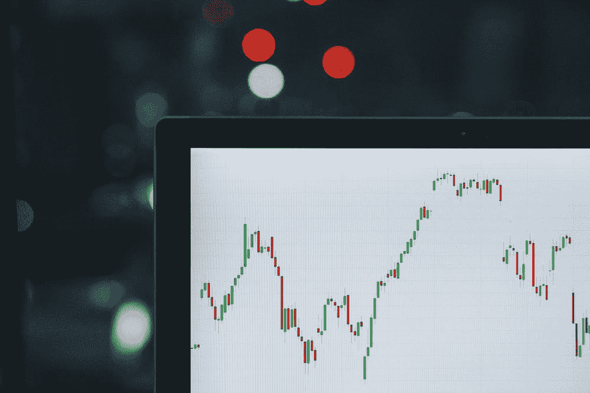
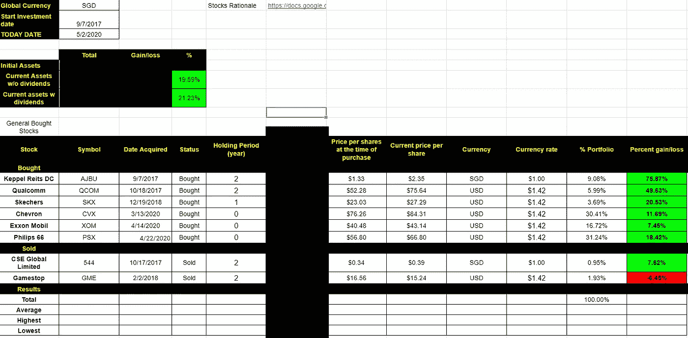
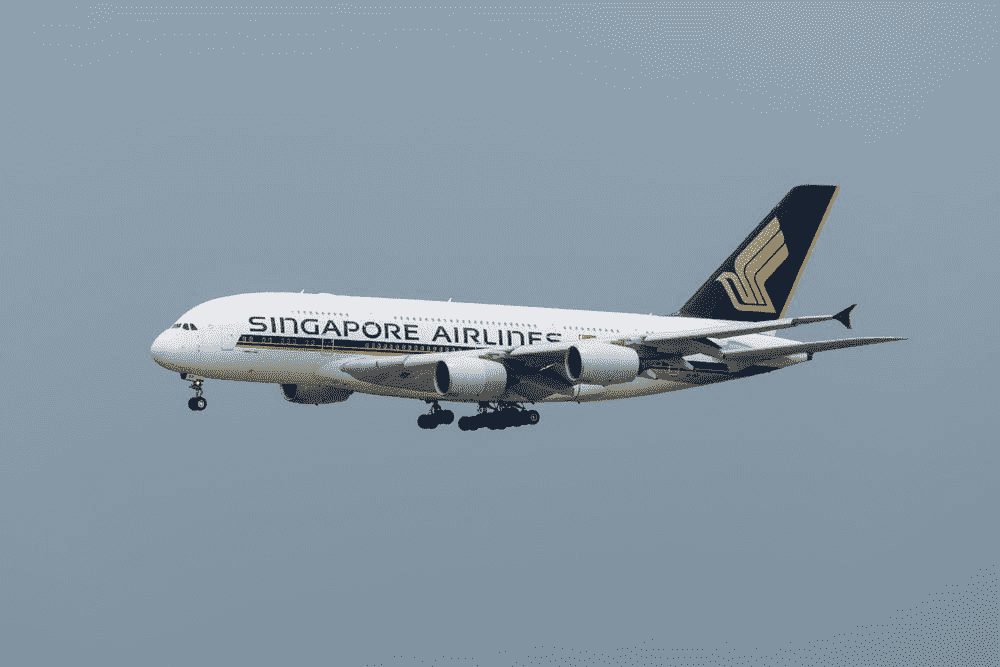
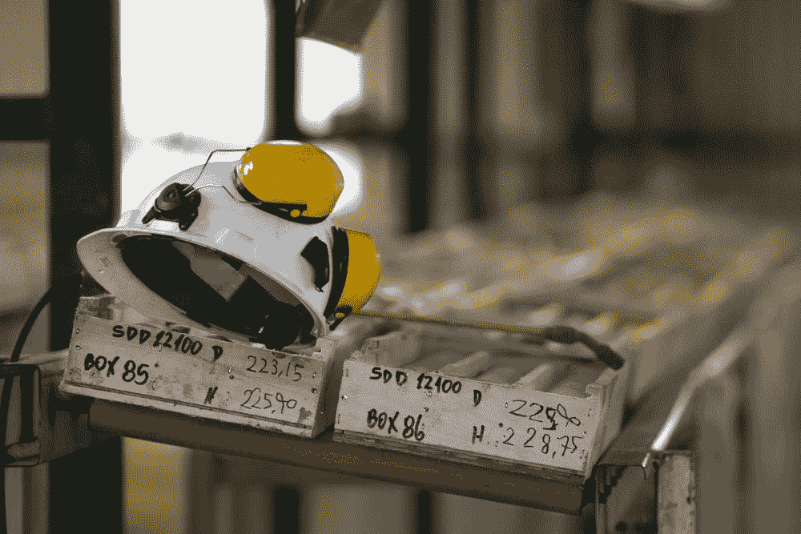
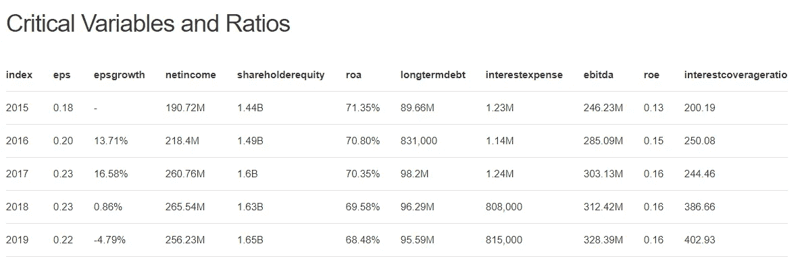
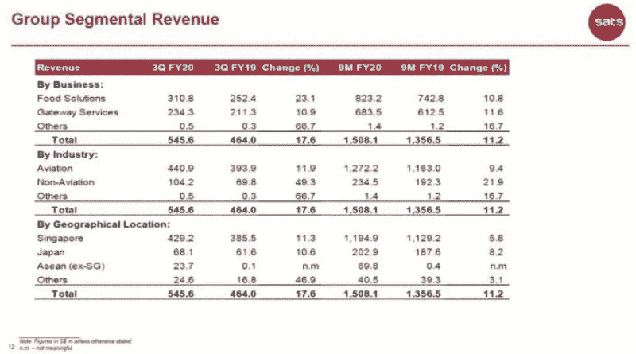

# 为什么你不应该在新冠肺炎期间购买旅游股票

> 原文：<https://medium.datadriveninvestor.com/why-you-should-not-buy-travel-stocks-during-covid-19-5cc0f3599eff?source=collection_archive---------4----------------------->

## 投资数据分析

## sat 的数据驱动分析(SGX: S58):不要买黄金，买鹤嘴锄

Source: [Unsplash](https://unsplash.com/photos/ZzOa5G8hSPI)

# 背景和问题

Current Covid19 Pandemic Stocks Portfolio (overall return = 20%) with Date acquired since 2017

3 月，当世卫组织宣布疫情时，我购买了当前石油投资组合的 60%(埃克森美孚、雪佛龙、菲利普 66 ),这使得股价上涨了约 20%。

然而，由于美国失业前景黯淡，石油经济复苏可能持续更长时间，我希望在新加坡市场和不同行业分散更多投资组合。

我想到的最明显的选择是旅游，即著名的新航(SIA)股票。

 [## 认知计算——一套被广泛认为是……

### 作为它的用户，我们已经习惯了科技。这些天几乎没有什么是司空见惯的…

www.datadriveninvestor.com](https://www.datadriveninvestor.com/2020/02/19/cognitive-computing-a-skill-set-widely-considered-to-be-the-most-vital-manifestation-of-artificial-intelligence/) 

很简单，因为一旦旅游禁令解除，将会有大量的旅游需求涌入。包括你在内的投资者可能会有类似的想法，并跟风投资。

> 但这是个好主意吗？

# 你应该买航空公司的股票吗，比如 SIA？

Source ([Unsplash](https://unsplash.com/photos/vQdyIjWmvLk))

经过考虑，投资旅游和航空公司既有风险又有竞争力:

*   投资旅游业是很容易的事情。许多业余投资者打算将他们的投资分配到这些股票上，认为它们最终会复苏。这使得股票价格昂贵。
*   **旅游业是一个高度服务和资产密集型的行业**。冠状病毒导致他们无薪休假、失业和资产抛售的大规模衰退。可能需要更长时间才能恢复。
*   **提供竞争的可能性:**航空公司可能会通过交易竞争来收回现金流。这使得服务型航空公司处于竞争劣势。
*   **旅行行为变化的可能性。由于公司重新评估他们的旅行预算、远程办公等，旅行需求可能转向低成本旅行。**

因此，我的结论是，像 SIA 这样的旅游类股票的回报，并不能抵消其风险。

# 不要买黄金，买鹤嘴锄

Source [unsplash](https://unsplash.com/photos/WEQBi30jWdM)

> 在淘金热期间，大多数想当矿工的人都赔了钱，但是卖给他们铲子、帐篷和牛仔裤的人却赚了一大笔钱。”—彼得·林奇

## 范式转变

这是生活中通常被忽视的简单一课。

*   当你看到一个男人的伟大时，看看他妻子的性格和支持

> ***她的儿女起来称她有福；她的丈夫也是如此，他称赞她:“许多女人都做得很出色，但你胜过她们所有人。”(***[***prov . 31:28–29***](https://www.esv.org/Prov.%2031%3A28%E2%80%9329/)***)***。

*   当你看到一个成功的零售/电商，先评估它的供应链。

在投资方面，你不应该购买“热门”行业(除非你对它很熟悉)。你应该购买“支持”行业。可悲的是，这些“支持”行业是最常被忽视的。

这就是我在 2017 年加密货币热潮期间购买吉宝 DC 房地产投资信托基金(数据中心)的原因。我从支持加密货币挖矿而不是购买加密货币本身获得了高额利润(75.87%)。

> 价值投资的目标是在无知/恐惧中找到宝藏。

# 那么哪个行业支持旅行呢？

*   新加坡航空食品供应(sat)
*   新加坡飞机工程师(ST 工程)。

由于我更熟悉食品而不是飞机工程，所以我决定在 sat 上做深潜，这样理解起来就简单多了。这允许我减少复杂性和错误，从而降低我的投资风险。

> 规则一:永远不要赔钱
> 
> 规则 2:永远记住规则 1

# 定量评估。

**SATS Ltd (SGX: S58)** 为航空业提供地勤和餐饮服务，如新航(SIA)和其他主要航空公司。

SATS 最近[宣布第四季度收益暴跌 60%到 70%](https://www.straitstimes.com/business/companies-markets/sats-sees-60-70-profit-fall-in-q4-losses-in-following-quarter)这是在疫情中部买入的好机会。

*   *同比每股收益似乎很稳定，尤其是在过去 3 年。*
*   *ROA 值为> 70%时看起来不错*
*   *利息保障率高(> 300)。这意味着 sat 破产的可能性非常小。鉴于有很多能力来缓冲其下跌*
*   净收入和每股收益似乎都在健康增长。没有出现过度的每股收益负增长，每股收益稳定在 0.22
*   *股息不错，为 5.79%。由于现金流强劲，股息没有减少的迹象。*
*   *恢复 80%后的潜在回报(不包括取消旅行禁令后更高的旅行需求)*

# 定性评估(思想实验)？

## sat 能在新冠肺炎生存吗？

Group Segmental Revenue SATS

 [## SATS 有限公司能挺过新冠肺炎危机吗？

### 新冠肺炎继续像野火一样在全球蔓延，截至目前已有近 37 万人感染，1.6 万人死亡

sg.finance.yahoo.com](https://sg.finance.yahoo.com/news/sats-ltd-survive-covid-19-233034275.html) 

有一篇文章专门讲这个。简而言之:

*   **财务状况强于 SIA:** 表现为净现金状况强于 SIA
*   **一部分收入与非航空相关** : 15.5%的收入已经用于非航空行业。
*   **自由现金流生成历史:**sat 表现出持续健康的现金流生成。
*   收购 Monty's Bakehouse : SATS 进行战略性收购，在危机中收购廉价公司。

## 新冠肺炎之后 sat 能很快恢复吗？

沙特运输公司在新加坡垄断飞机餐。这意味着旅游餐饮服务不会有任何价格战。

SATS 依赖于快速消费品(FMCG ),这意味着根据旅行需求，食品需求将始终保持不变。

食品工业的资本支出也很便宜，并且需要较少的劳动力投资。最后，如上所述，沙特德士古公司制定了航空和非航空收入多样化的计划。

由于他们的战略寡头垄断价格持有者，低高质量的劳动力需求，以及商业战略，沙特阿拉伯将在旅行禁令取消后准备就绪。

## 一个有勇无谋的人能参加 sat 考试吗？

> 如果 SATS CEO 搞砸了，能有多糟糕？
> 
> 不会很多。

食物永远是世界上航空公司的必需品，一旦旅行禁令解除，这项业务就无法停止。

请记住，在新加坡，SATS 也保持着寡头垄断，相反，它足够精明，能够在这场危机中收购廉价公司。

总的来说，我不怀疑 sat 会很快恢复。不是热门行业的事实支持了我会取得良好 ROI(投资回报)的信心。

# 总体思路

总的来说，我认为投资 sat 的前景是好的，原因如下:

1.  **不是一个“热门”行业**:在我看来，sat 仍然被忽视，而且很便宜。
2.  **需要相对较低的资本和服务质量支出:**sat 在迅速恢复和扩大旅行需求方面处于独特的地位。
3.  强大的现金流和财务状况:sat 利用更高的流动性来缩减和增加他们的资产。他们有现金流，这使他们能够为大量涌入的旅游需求做好准备。
4.  高度多样化的产业:食物总是有需求的，而且可以很容易地转移到支持任何产业。沙特德士古公司在航空和非航空(医疗保健/餐饮)收入方面都有投资组合 *( > 300)* 。
5.  **精明的管理层:**管理层足够聪明，能够利用他们多年来的支出和收购。一旦旅游禁令解除，他们有充分的计划利用旅游高峰。
6.  **管理有勇无谋的管理能力:** SATS 的生产线上有寡头垄断和健壮的系统。这是一家成熟的公司，已经拥有 10%的多元化。

总的来说，我相信旅行禁令解除后，公司的健康状况会迅速恢复。

索利·德奥·格洛丽亚

# 关于作者

Vincent Tatan 是一名数据和技术爱好者，曾在 Google LLC、Visa Inc .和 Lazada 从事微服务架构、商业智能和分析管道项目[。](https://bit.ly/2I8jkWV.?source=post_page---------------------------)

Vincent 是土生土长的印度尼西亚人，在解决问题方面成绩斐然，擅长全栈开发、数据分析和战略规划。

他一直积极咨询 SMU BI & Analytics Club，指导有抱负的数据科学家和工程师，并为企业开发产品开放他的专业知识。

最后，请通过[**LinkedIn**](http://www.linkedin.com/in/vincenttatan/?source=post_page---------------------------)**[**Medium**](https://medium.com/@vincentkernn?source=post_page---------------------------)**或** [**Youtube 频道**](https://www.youtube.com/user/vincelance1/videos?source=post_page---------------------------) 联系文森特**