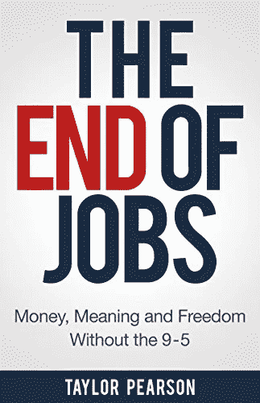

# 为什么你应该读泰勒·皮尔森的《工作的终结》

> 原文：<https://medium.datadriveninvestor.com/why-you-should-read-the-end-of-jobs-by-taylor-pearson-1ab690c7756f?source=collection_archive---------18----------------------->

## 一分钟书评— 10

## 没有朝九晚五的金钱、意义和自由

Photo by [Yolanda Sun](https://unsplash.com/@iyolanda?utm_source=medium&utm_medium=referral) on [Unsplash](https://unsplash.com?utm_source=medium&utm_medium=referral)

泰勒·皮尔逊的《乔布斯的终结》给我敲响了警钟。当我在东英吉利大学和剑桥大学 PKP 项目教授就业能力模块时，我对就业前景做了大量研究。这幅画不好看。由于人工智能和机器学习的进步，许多未来的工作都处于危险之中。

皮尔森认为，我们已经进入了一个创业革命的新时代，成为一名企业家是目前获得有意义的工作和财务自由的最安全的方式。快速的技术进步改变了积累财富和自由的杠杆点。企业家现在有了杠杆，他们可以利用互联网在生活中创造前所未有的财富。

另一方面，中产阶级正在慢慢消亡——工作更努力，收入更少。职业阶梯断了。不幸的是，千禧一代的职业前景并没有变得更好。因此，今天的千禧一代需要像企业家一样思考和行动。

# 以下是本书中讨论的一些关键点:

*   职业规划第一法则:不要规划自己的职业。你不知道会发生什么，所以要做好应急准备。开始一个项目或开展一项业务。
*   自 2000 年以来，世界人口的增长速度是现有工作供给的 2.4 倍。安全的工作现在不再安全了。
*   由于拥有大学学位的人太多，大学学位变得越来越不值钱了。
*   我们正在接近工作的尽头，但我们中的许多人仍然停留在传统的工作模式中。
*   创业是一种可以培养的技能。如果你向新的机会和学习敞开心扉，你就可以投资于你的未来。
*   选择创业企业的学徒期，而不是大公司的安全工作。从长远来看，这些公司工作并不安全。
*   Mediocristan 是一个安全的地方，在那里正常的事情会如期发生。一切都是可以预测的，所以概率很容易计算。工作是安全的，中产阶级是庞大的，主流的做法在这个领域起作用。地中海正在灭绝。所以，你需要丢掉你虚假的安全感。如果你有一份稳定的工作，你确实有一个每年都在增长的潜在风险。你随时都可能被取代。
*   极端主义是一个极端条件盛行的世界。没有什么是可以准确预测的。不太可能发生的事件，比如黑天鹅，经常发生。我们的世界像极端主义者一样运作。你永远不知道会发生什么。冠状病毒、经济危机、英国退出欧盟，还有更多黑天鹅会不断出现。在这样的世界里，每个人都需要像企业家一样思考和行动。
*   如果你想在这个新世界中生存和发展，你需要不断提升你的技能，快速适应技术变化，并建立自己的系统来创造自己的资产。
*   在你的生活中设计适度的波动，这样你才能茁壮成长。缺乏波动性是危险的。选择包含一些风险、变化和挑战的道路。通过这些途径，你可以不断学习，发展自己的能力，并获得持续的反馈。
*   你可以通过向更多人提供不受欢迎的小众商品来获得可观的利润(创业的长尾)。
*   创造新产品比以往任何时候都更容易，更便宜。你不需要资本。你可以在世界任何地方使用免费工具、互联网连接和笔记本电脑开始和经营一项业务。
*   互联网让地理变得无关紧要，每天都在创造新的市场和业务。今天比过去更容易创造财富。
*   人人都是传媒公司。你可以通过你的平台与你的目标市场进行直接有效的沟通。
*   大多数工作将被软件或人工智能取代。当那个时刻到来的时候，你不想成为那个失去工作的人。
*   有三个核心激励因素:金钱、自由和意义。
*   企业家之所以强大，是因为他们能够设计自己和他人的现实。他们不断地问“为什么”或“为什么不”。他们问自己:我的遗产会是什么？他们创造意义和财富。
*   我们获得了前所未有的大量资本、机会和可能性。
*   约束理论和向第四种经济的转变，使得创业成为年轻人和雄心勃勃的人的最高杠杆职业道路。
*   不要问“什么职业适合我？”或者“我如何找到职业？”。相反，你应该问:“我怎样才能变得更抗脆弱、适应性更强、更有企业家精神？”

Image [Source](https://www.amazon.com/End-Jobs-Meaning-9-5-ebook/dp/B010L8SYRG/ref=sr_1_2?dchild=1&keywords=the+end+of+jobs&qid=1613292265&sr=8-2)

# 本书中颇有见地的引文:

> 在一个创造越来越多、工资越来越高的世界里，工作是安全的——在 20 世纪的大部分时间里都是如此。自 1980 年左右以来，情况就不再是这样了。”
> 
> *“由于经济发生了质的和结构性的变化，找工作变得越来越难，风险更大，利润更低。”*
> 
> *“从感恩节火鸡出生的那一天起，它生命中的一切都预示着事情只会变得更好。它是在安全无菌的环境中孵化的。它每天都被照顾和喂养。每一天，这种模式都在重复。它醒来后会找到大量的食物和住处。在 11 月的第四个星期三，当火鸡有最多的历史数据表明它的生活可能会继续改善的时候，它意识到——做一只火鸡并不太好。”*
> 
> 非生物系统、人造系统、现代系统，如经济、我们的商业和职业，都不存在于中等社会。他们住在埃斯特雷马斯坦。考虑结果将如何在放学后分配给这些人。不会像钟形曲线一样分布；它将分布为 80/20 曲线，也称为帕累托分布。”
> 
> 学校系统的建立是为了强化我们生活在一个安全且可预测的世界的信念。这种高斯钟形曲线分布对我们来说很直观。很公平(一个危险的概念)。我们在生活在中等国家的信念下做出了很多人生决定。但我们没有。许多人的净资产在一瞬间翻了一番(或损失殆尽):一家公司上市或宣布破产。一只股票翻了五倍或暴跌。巨大的人造帝国被一个事件推翻了——攻占巴士底狱，签署独立宣言。这些单独的事件就是极端情况下的变化。突然，暴力，无法预料。随着科技的不断发展，我们越来越多地生活在极端的环境中。随着我们周围的世界越来越多地从生物世界转向人造世界，我们的职业和生活越来越极端。随着技术和全球化的不断推进，中产阶级正在消亡。”
> 
> *“有三个主要原因让我们相信，我们正处于就业高峰期，而
> 正接近就业末期:1 .过去十年，通信技术的飞速发展和全球教育水平的提高意味着公司可以在任何地方雇佣任何人。工作越来越多地转移到亚洲、南美和东欧。2.现在，机器(包括硬件和软件)接管蓝领工厂工作的概念已被广泛接受——但现在，它们也越来越多地接管白领知识型工作。3.传统的大学学位——学士、硕士和博士——变得越来越多，这使得它们比以往任何时候都不那么有价值了。”*
> 
> 一些重要的机会，可以清楚地认识到，通常会降临到一个不断寻找和等待的人身上，带着一颗好奇的心，热爱涉及多种变量的诊断。然后，所需要的只是在胜算极其有利的时候，愿意下大赌注，利用过去因谨慎和耐心而获得的资源。”
> 
> 关于所有主动(和创造)的行为，有一个基本的真理，对它的无知扼杀了无数的想法和辉煌的计划:当一个人明确地承诺自己的时候，天意也在移动。各种各样的事情发生来帮助一个人，这些事情本来是不会发生的。这一决定引发了一连串的事件，引发了各种意想不到的事件、会议和物质援助，这是任何人做梦也想不到的。无论你能做什么，或者梦想你能做什么，开始吧。勇敢包含天才、力量和魔力。现在就开始吧。”威廉·哈钦森·默里，《苏格兰喜马拉雅探险队(1951)》
> 
> “1980 年，美国电话电报公司聘请麦肯锡公司——世界上最有声望的管理咨询公司之一——预测 2000 年美国将有多少手机用户。基于他们进行的大型研究，他们预测将有大约 90 万人。实际上大约有 1 亿人。如此接近！只差了九千九百一十万——120 倍。”
> 
> *“你周围的一切你称之为生活的东西都是由不比你聪明的人创造的，你可以改变它，你可以影响它，你可以创造你自己的东西让别人使用。一旦你明白了这一点，你就再也不会和以前一样了。”—史蒂夫·乔布斯*
> 
> *“安德森-霍洛维茨风险投资公司(Andreessen-Horowitz)由马克·安德森和本·霍洛维茨(Ben Horowitz)创办，截至 2014 年 3 月，管理着 40 亿美元的资产，其投资理念是五个字:软件正在吞噬世界。”*
> 
> *“全球化不仅在继续，还在加速。到 2020 年，来自阿根廷、巴西、中国、印度、印度尼西亚、俄罗斯、沙特阿拉伯和南非的 25 至 34 岁拥有高等教育学位的人将比所有经合组织国家(主要是西欧和北美的 34 个国家)多 40%。”*
> 
> 丹·诺里斯(Dan Norris)自己出版的书《7 天创业》(The 7 Day Startup)教企业家如何在一周内识别、构建和测试创业想法
> 
> *“企业家精神是连接、创造和发明系统——无论是企业、人、想法还是流程。作业是遵循他人创建的操作系统的行为。”*
> 
> *—泰勒·皮尔森*

## 法赫里·卡拉卡斯是《自制工作室》的作者。你可以在这里探索更多[。](https://selfmakingstudio.com/)