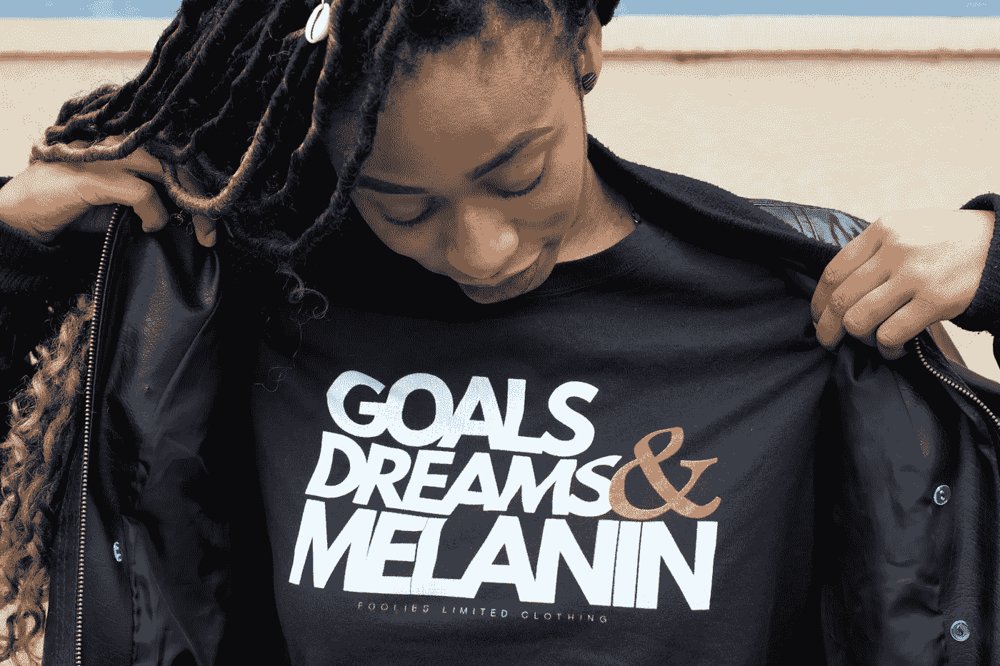
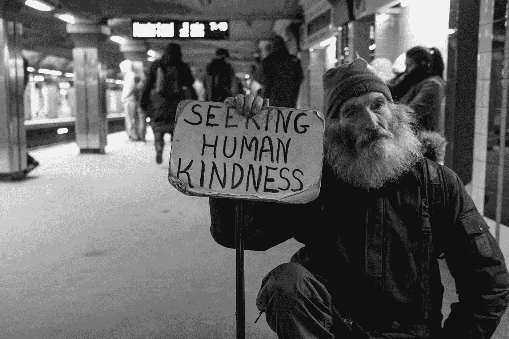

# 为什么即使今年很糟糕，你仍然应该为你的目标而努力

> 原文：<https://medium.datadriveninvestor.com/why-you-should-still-try-for-your-goals-even-though-this-year-sucks-2c165cfe9a3?source=collection_archive---------14----------------------->

继续坚持(二手灵感项目)。

Photo by [Alex Nemo Hanse](https://unsplash.com/@thefoolies?utm_source=unsplash&utm_medium=referral&utm_content=creditCopyText) on [Unsplash](https://unsplash.com/s/photos/goals?utm_source=unsplash&utm_medium=referral&utm_content=creditCopyText)

二手灵感项目从一句激励性的引语开始，在创造性道路蜿蜒的任何地方冒险。

> “从做必要的事情开始；然后做可能的事；突然间，你就在做不可能的事情。”-弗朗西斯·阿西西

你好。你有时间谈谈吗？

你过得怎么样？

等一下。让我更好地表达。你*真的*过得怎么样？说实话。

谢谢你的坦诚。我能感同身受。出于一系列原因，2020 年对几乎所有人来说都很糟糕。

在这场混乱中，我和我认识的任何人一样幸运。毫无疑问，我感谢我的祝福，并同情那些一直在挣扎的人。

尽管如此，我发现自己比平时更加急躁。比我应该的更焦虑。不该惹我生气的鸡毛蒜皮的事，反而觉得比应该的更让人抓狂。最近，我感觉生活就像一个无情的重担重重地压在我的肩膀上。

我猜你也感觉到了。

当我们穿越这个疫情及其余震时，很容易就能确定这个重量的来源。它就在我们面前——传染病、社会动荡、政治不和谐、经济困境以及我们混乱未来的不确定性。

但是还有一个更难识别的因素。我相信这种“重量”很大程度上来自于这样一个事实，即我们都有过相当少的积极的人际交往。

这个诊断的关键词是“阳性”。我不是在谈论社交媒体上的争吵或关于戴口罩的政治化争论。那些对话是最糟糕的。

我说的是建设性的对话和与你家庭以外的人的礼貌交往。请不要坏能量。

所以这里有三个想法，从一个广角镜头到一些更集中的东西。

 [## 在家工作如何提高我的工作效率|数据驱动型投资者

### 在家工作确实激发了我最大的潜能，让我更有效率。因为在家工作给了我…

www.datadriveninvestor.com](https://www.datadriveninvestor.com/2020/07/29/how-working-from-home-increased-my-productivity/) 

# 1.我关心你。

真的。我知道。而不仅仅是“我在乎，因为我想在我的中等统计中获得额外的浏览量和阅读量”这种方式。

我关心你。

我意识到很难辨别我是否真诚。技术是惊人的，但是我们还没有在网上验证同情心。但我想让你知道我明白这不仅仅是为了生存。这是比你我更重要的事情。我们所有人都在一起，寻找摆脱困境的方法。

我们需要这种乐观的愿景来实现。如果说 2020 教会了我什么，那就是我们需要彼此。我们需要社区的安慰。我们需要部落的支持。

Photo by [Matt Collamer](https://unsplash.com/@breakyourboundaries4?utm_source=unsplash&utm_medium=referral&utm_content=creditCopyText) on [Unsplash](https://unsplash.com/s/photos/compassion?utm_source=unsplash&utm_medium=referral&utm_content=creditCopyText)

# 2.我们都应该对彼此更好。

[同情心在犯罪上被低估了。](https://www.skillsyouneed.com/ps/compassion.html)

当你与他人互动时，你只是见证了那一刻——你很少知道他们的背景故事。

你可能会认为某人粗鲁、无情或粗心。他们可能是。他们也可能对找工作感到焦虑。或是生病的父母或孩子。或者拼凑足够的现金以避免被驱逐。

最好假设对方是最好的，并假定他们是无辜的。给他们一点风度，弥补他们此刻没有的风度。格外亲切。

这里有一个关于关心和同情的好主意——它本质上是主动的。也就是说你不能稳扎稳打。你必须迈出第一步。

出去做点好事。自愿帮忙。发送友好的文本。去看看你爱的人。为陌生人开门(当然是保持社交距离)。说点好听的。

善良的行为激发变化，建立积极的势头。这些机会不会落到你头上。但是如果你寻找机会去创造它们，你和这个世界会因此而变得更好。

这引出了我的最后一点。小重点，大思路。

# 3.我觉得你今年还是要努力实现自己的目标。即使你并没有真正感受到。

那是自私的吗？当然是。如果我鼓励你这么做，你成功了，那么我很可能会让你成为我的读者。我是一名兼职作家，虽然我的日常工作是我真正谋生的方式，但在媒体上的成功和其他创造性的努力有助于支持我的家庭。

但是，即使没有我那套老一套的建议，你也应该努力达到目标。

找到一种新的自救方法，并付诸实践。

找个导师。与那些能送你实现梦想的人交往。实际上，如果需要的话。这可能是你全年在 Zoom 上做的最好的事情。

对着镜子重复咒语。暗杀消极的自我对话。掸掉被抛弃的野心，开始行动。

从长计议。全力以赴。

设定小的增量目标。一切都是为了进步，而不是完美。

找到宝藏。

庆祝一下。[设定新目标](https://medium.com/datadriveninvestor/35-beneficial-things-you-should-do-for-yourself-7824dda0c44?source=friends_link&sk=6057dbef7e93b86538a11dc3a146a706)。重复一遍。

当你沉浸在新的晋升、出书、戒毒、改造房屋、健身目标等的荣耀中时，让所有的仇恨者和竞争对手蒙羞。

你知道该怎么做。去做吧。

这个你已经知道了，但我还是要说。这不仅仅是你想要达到的目标。

这是关于即使在近代史上最糟糕的时期也要过好自己的生活。在大众停滞不前，甚至倒退的时候，作为一个人成长。

这就是我所说的，也是我喜欢设定目标的原因。这是关于延伸你的极限和[把不可能变成现实](https://www.youtube.com/watch?v=Wcz_kDCBTBk)。

就是这样。追寻你的梦想，就像他们说了你妈妈的坏话一样。走出去——即使你被关在家里——不计后果地精确攻击你的目标。

跳过毫无新意的“这是失落的一年”的说辞。不要让 2020 年的恐惧成为保持自满的借口。

我支持你。

**阿德里安·s·波特**是一名作家、工程师、顾问和演说家。他写诗歌、短篇小说和各种主题的文章，包括创造力和个人成长。他是诗集《所有错的都觉得是对的》和散文集《至交手册》的作者。在 http://adrianspotter.com/[在线拜访他](http://adrianspotter.com/)。

# **附加文字**

[你真了不起](https://medium.com/datadriveninvestor/you-are-amazing-274651127432?source=friends_link&sk=34312c5fa72f2109d6031c2a4b7c2e4c)

[选择乐观(即使没人乐观)](https://medium.com/datadriveninvestor/choose-optimism-even-when-nobody-else-is-6e41c467c7b9?source=friends_link&sk=e5d927fb83b6298c8f82f2fe28840729)

[李小龙 10 句名言中的成长蓝图](https://medium.com/an-idea/a-blueprint-for-personal-growth-in-10-bruce-lee-quotes-d310ce653dc8?source=friends_link&sk=e163cd4119275fdcab88a14b8e1c5f8d)

**获取专家观点—** [**订阅 DDI 英特尔**](https://datadriveninvestor.com/ddi-intel)