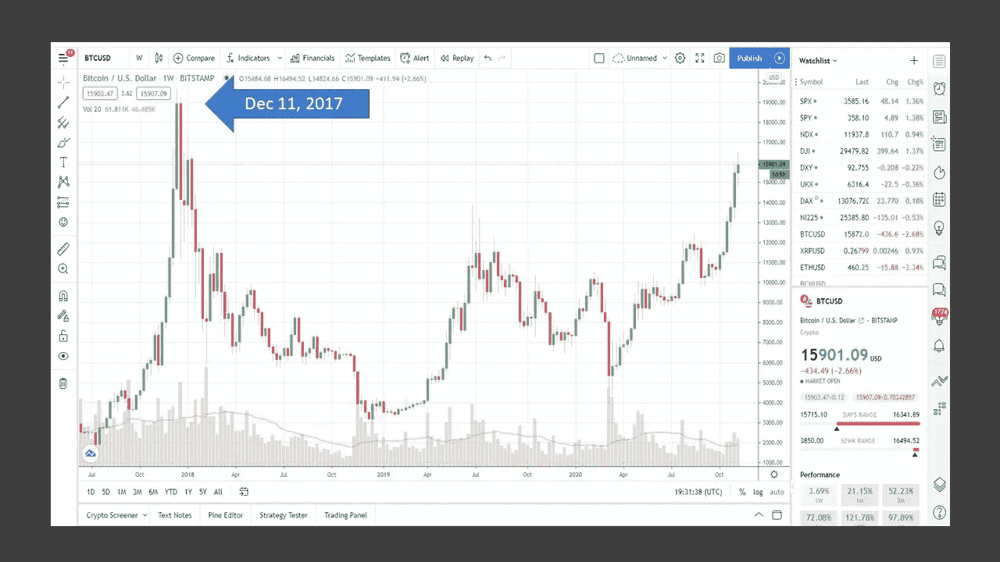
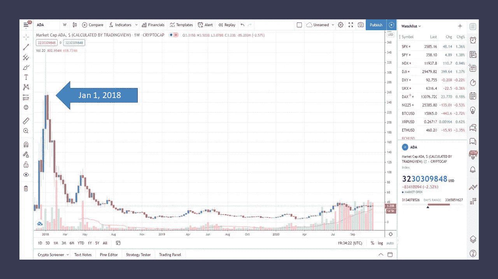
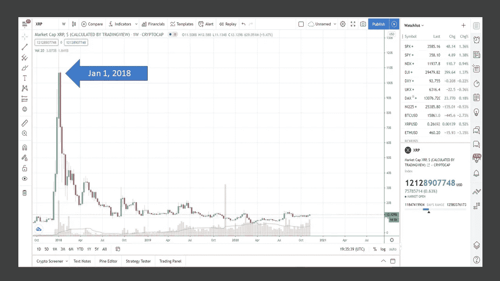

# 如果你想赚几百万，为什么你应该停止购买比特币

> 原文：<https://medium.datadriveninvestor.com/why-you-should-stop-buying-bitcoin-if-you-want-to-make-millions-694f88ab2038?source=collection_archive---------3----------------------->

## 你需要知道为什么你应该买你的代用币来获得 100 倍的回报

Photo by [Andrea Piacquadio](https://www.pexels.com/@olly?utm_content=attributionCopyText&utm_medium=referral&utm_source=pexels) from [Pexels](https://www.pexels.com/photo/woman-in-black-and-white-polka-dots-dress-sitting-on-chair-3783834/?utm_content=attributionCopyText&utm_medium=referral&utm_source=pexels)

随着价格持续上涨，每个人都在争相购买比特币。在过去的几个月里，我一直避免向比特币中投入更多资金，而是购买替代币。一旦比特币达到顶峰(可能很快就会达到)，替代币就会开始行动。

如果你有 16000 美元买一个比特币，那就买吧。大多数人的银行账户里都没有 16000 美元。即使你想用美元平均成本购买比特币，当你投资了 16000 美元时，比特币的价格只会更高。

不要误会，我拥有比特币，并不是说你不应该拥有比特币。我试图启发你明智地使用你的钱投资于加密货币市场。加密货币既可以赚钱，也可以赔钱。

要想在这个市场上获得最大回报，你必须聪明地投资。16000 美元买比特币，如果你买得起也没问题。在比特币 4000 美元的时候买入，情况就不同了。一切都与时机和你拥有加密货币的目标有关。一些加密货币比其他的要好。

# 不要等太久才买到 100 倍的代用币

> 我们聚集在这里的真正原因是当前的金融体系已经过时了。
> 
> 查理·施雷姆

在比特币崩溃之前，2017 年 12 月比特币达到历史最高水平之后，Altcoin 季节到来。在这之后的几周内，几个替代硬币也在崩溃前达到了历史最高水平。同样的事件很可能再次发生。如果你能计算时间，你可以卖掉比特币，投资替代币。这是可能的，但加密货币市场以闪电般的速度快速发展。如果你眨眼，你可能会错过牛市的变化。

在 2017 年 12 月 11 日比特币达到顶峰后，随着投资者锁定利润，比特币的价格开始降温。几周内，随着许多加密货币创下历史新高，altcoin 季节开始运行。

**比特币(BTC)在上一轮牛市中。**

Screenshot from Tradingview

**卡尔达诺(ADA)在最后一次奔牛。**

Screenshot from Tradingview

**上次牛市中的瑞波(XRP)。**

Screenshot from Tradingview

这是几年前比特币、卡达诺、瑞波达到的高点。

比特币在 2017 年 12 月 18 日达到 20089 美元的历史高点。

卡尔达诺在 2018 年 1 月 4 日达到了 1.33 美元的历史高点。

Ripple 在 2018 年 1 月 4 日达到 3.84 美元的历史高点。

一个月之内，加密货币都创新高。然后你就有了你人类的情感——**怀疑、兴奋、恐惧、**和**希望**同时出现。你的情绪会影响你的判断。这就是为什么你需要有一个明确的游戏计划，并提醒自己不要太贪心。你可能会在几秒钟内损失数千甚至全部投资。

> 拿走你的利润。

在上次牛市中，我和你一样。我是加密货币的新手，没有出售的计划。回想起来，我不会做任何不同的事。我进入加密货币市场较晚，因为牛市开始了。对我来说，如果卖掉，我可能会亏钱。

这一次，我准备好了。当比特币下滑、替代币开始起飞的第一个迹象出现时，我会采取行动。最好你有自己的笔记和图表。确保你坚持你的游戏计划。你的情绪和激动很容易影响你的判断。

就像比特币的发展速度一样，替代币的发展速度也会一样快，甚至可能更快。正如我提到的，不要贪婪地希望 altcoins 在下一轮牛市中走高。准备好销售。

> 拿走你的利润。

下一轮牛市将是一个值得记住的时刻，就像上一轮牛市是在 2017-18 年一样。这一次情况有所不同。有更多的投资者和金融机构在玩这个游戏。上次嘲笑加密货币的一些人这次也在玩。接着，持怀疑态度的人再次站在一边，称比特币是老鼠药。

你准备好迎接下一轮牛市了吗？

查看我关于加密货币的其他文章。

 [## 如何通过一个简单的步骤让您的数百万加密货币变得更快

### 从 HODL 到摇摆交易可能是关键

medium.com](https://medium.com/the-capital/how-to-make-your-millions-in-cryptocurrencies-faster-with-one-simple-step-f012e5122b51)  [## 2020 年投资比特币入门指南

### 到 2020 年，这项投资将增长 50%以上，你应该知道

medium.com](https://medium.com/illumination/the-beginners-guide-to-investing-in-bitcoin-in-2020-cafca3b73fbb)  [## 我打算如何在加密货币市场赚上百万

### 一步一步的过程，你可以很容易地遵循

medium.com](https://medium.com/the-capital/how-i-plan-to-make-millions-in-the-cryptocurrency-market-421478b22cdb) 

注:作者拥有比特币和加密货币。

参考资料:

[货币市场上限](https://coinmarketcap.com/)

[交易视图](https://www.tradingview.com/)

[**汤姆·汉迪**](https://medium.com/@tomhandy1) 是 Medium 上的顶级作家，前 Quora 作家，也是两个孩子的父亲。他从军队退役，并在几个非营利委员会任职。你可以在推特 [@tomhandy1](http://www.twitter.com/tomhandy1) 上找到他。

本文仅供参考。不应将其视为财务或法律建议。并非所有信息都是准确的。在做出任何重大财务决定之前，请咨询财务专家。