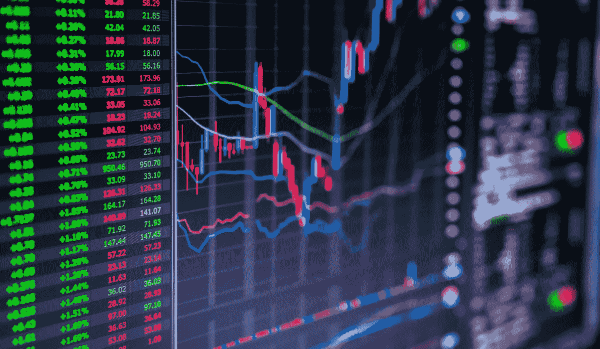

# 为什么你不应该日内交易

> 原文：<https://medium.datadriveninvestor.com/why-you-shouldnt-day-trade-b970f2baf1f0?source=collection_archive---------1----------------------->

## 这听起来很诱人，但实际上并不可行

日内交易可以帮助你利用全天的股价波动来获得比买入并持有更大的回报。

这种技巧需要准确把握市场时机，以利用股价波动。你可以日内交易股票，寻找一些上涨和下跌的可能性，或者你可以交易期权，增加双方的赌注。

然而，我要建议大多数人远离日内交易。不是每个人都适合的，股市还有其他的赚钱方式。

不做日内交易的第一个主要原因是大多数日内交易者实际上都亏损了。事实上，大约 80%的日内交易者如本文所述以净亏损结束。

 [## 为什么 80%的日内交易者亏损

### 我最近在一个较大的公共交易平台上看到一个非常可怕的统计数据。

medium.com](https://medium.com/@marklyck/why-80-of-day-traders-lose-money-78d51b10fe25) 

成功几率低的投资工具并不十分诱人。但是假设你相信你是 20%日内交易者中的一员。概率法则表明一些日内交易者会达到这种状态。

即使这样，完全追求这条路线也没有意义……除非这是你的全职收入。

对于日内交易者来说，你不能只做一笔交易，然后就停止检查你的投资组合。如果你每天交易股票或每周交易期权，你会过于频繁地检查你的投资组合。

这也是我转向长期期权的原因之一，比如卖出 2022 年 1 月到期的 Roku 看跌期权，更多地关注现金担保看跌期权，而不是备兑看涨期权(对于我持有 100 股的大多数股票，我更愿意持有这些股票)。

日间交易时间会干扰你的工作时间。东部时间上午 9:30 到下午 4 点，你无法完全集中精力，而且你还会关注下班后的运动。

如果你所有的钱都是从股票市场赚来的，而且它能支付账单，你就可以投入那么多时间。然而，如果你的投资组合有几个收入来源，你需要关注这些收入来源。

不要只考虑如何在你的投资组合中获得额外的 5%的回报，要考虑如何增加 5%的收入。这将增加每月对你的投资组合的贡献，这将随着时间的推移复合。

在股票市场上，很少有什么比期权交易对你有利，你的收入瞬间翻倍更令人兴奋的了。但这种结果在过程中会带来风险，而且更依赖于股价走势，而非公司基本面。

记住，日内交易不是你唯一的选择。你可以投资红利股、指数基金和成长股。也可以投资房地产，利用杠杆优势。你可以选择一个长期租户，或者使用 Airbnb 来填满你的房产，这样你就不用担心长期租户了。房地产比股票市场更令人头疼，但对于喜欢这种投资方式的人来说，它是一种投资选择。投入血汗资本和利用房地产相关杠杆的能力是非常有益的。

如果你发现自己每天经常查看自己的股票投资组合，看看自己的交易进展如何，问问自己是否真的从中赚到了足够的钱。

还有一个更重要的问题…你能持续赚到那样的钱吗？如果你对这个问题的回答是肯定的，那么你做日内交易的时间还不够长。

我不时交易期权，但我等待有吸引力的机会，而不是为了交易而交易。如果我找不到合适的机会，我可以几周不交易期权…我对此很高兴。

日内交易对一些人有用，但对我们大多数人来说…没那么有用。

[***想学习如何投资股市赚钱？确保你订阅了我的 YouTube 频道***](http://bit.ly/2W4ag01)