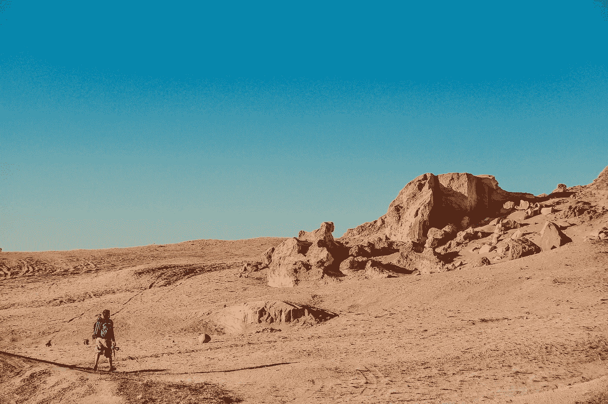

# 为什么你不应该独自旅行

> 原文：<https://medium.datadriveninvestor.com/why-you-shouldnt-travel-solo-aa29f3ff898c?source=collection_archive---------13----------------------->

你意识到你一直生活在谎言中

Photo by [Andrew Ly](https://unsplash.com/@nineteen?utm_source=medium&utm_medium=referral) on [Unsplash](https://unsplash.com?utm_source=medium&utm_medium=referral)

独自旅行是一种社交媒体时尚，我感到非常焦虑。

这是我对自己说的，第一次独自旅行的第一个晚上，一个人坐在那里害怕。我坐在阿姆斯特丹旅馆的一个酒吧里，等着和 T2 交朋友。相反，我只是坐在一个角落里。

我在 Instagram 上看到的所有那些人们与来自世界各地的一群人一起玩乐的照片感觉都像是谎言。

*也许我有问题*。自我怀疑，最终的破坏者，爬了进来。

我独自去过九个国家，这完全出乎我的意料。

# 社交媒体设定了一个错误的优先顺序

它告诉你，人们总是穿着最好的衣服，有着完美的发型和化妆，在高端场所享受他们的生活。它让旅行看起来像度假，而不是探险。

当我开始在 18 天内去 6 个国家旅行的时候，没有漂亮的衣服。

我的大部分照片都装在一件黑色的超干夹克里，这让我免受零下的严寒。我用手机方便地拍摄照片，而不是雇佣专业摄影师来向世界展示我有多开心。

欧洲和澳大利亚的大多数廉价航空公司都向你收取托运行李的费用，所以现在你必须把你的生活装进一个 20 公斤重的包里。
还有，你会走很多路。扔掉高跟鞋和长裙，换上舒适的衣服。

我在冬天旅行，所以想象一半的重量和空间只留给夹克和鞋子。

## 亲 Tip

轻装旅行不仅更便宜，而且对你的身体更好。

例如，欧洲的许多住宿都在旧建筑里，没有电梯，也没有人帮你拿包。带着东西，你会没事的，带着你去三楼。

我为 18 天的旅行准备的行李大概是这样的:

*   2 件纯黑+ 2 件纯白 t 恤
*   瓦尔默斯
*   7 双内穿；2 只袜子
*   1 条牛仔裤，2 条牛仔裤
*   3 条围巾，为我朴素的 t 恤衫增添色彩
*   2 件休闲连衣裙
*   各 1 双黑白鞋

# 你意识到你一直生活在谎言中

*人很粗鲁。*

出门在外你并不安全，外面有很多犯罪活动。

人们会利用局外人。

这些都是我告诉亲近的人我要去冒险旅行时听到的事情。作为参考，我在我的城市时不时会参加派对直到深夜。

**但是独自一人在另一个国家会被认为是进入了一个可怕的恐怖世界。**

如果你像我一样来自一个发展中国家，那么在你自己的祖国发生任何犯罪的可能性比在国外更大。

可悲的是，我们把对其他地方的人的感知局限于我们在电影中看到的或在新闻中听到的。

说到底，和你我一样，他们也是人。他们喜欢在旅途中与他人友好互动。当地人以尽其所能帮助游客为荣。**外面的世界很美好。**你只需要改变感知的角度。

## 亲 Tip

遵循**基本安全规范**，这样可以尽最大努力不招惹麻烦。

*   天黑的时候不要一个人
*   倾听你的直觉。当一个人或一个地方感觉不对的时候，走出去。
*   让您的家人/朋友了解您的住宿和国际号码。
*   当大量饮酒时，如果你不在住处，试着和一群人在一起，而不是一个人。
*   一定要从你的旅舍了解某些地方的安全——当地人最了解这些地方。

 [## 健身房 10 年的 10 条人生经验|数据驱动的投资者

### 走错一步，他们就会掉下去。两位登山者优雅地回到了地面。他们在那里…

www.datadriveninvestor.com](https://www.datadriveninvestor.com/2020/02/03/10-life-lessons-from-10-years-in-the-gym/) 

# 你并不孤单

多么矛盾的一次*单人旅行，*不是吗？

我只有在参观博物馆和美术馆的时候才是一个人。你并不孤单，因为如果你独自旅行，你会住在旅社或旅行，在那里你会交到朋友。

旅馆/外部组织也安排酒吧爬行或观光旅游，在那里你可以和其他旅行者一起闲逛。

简而言之，**只有当你想成为**的时候，你才是真正的孤独。这就是它的美妙之处，不是吗？

## 亲 Tip

预订安排聚会、旅游和观光等活动的旅馆。

免费的(基于小费的)徒步旅行也是结识他人的好方法。我还建议向你的旅馆询问建议的酒吧爬行和旅游，因为他们比谷歌更了解这个地方。

# 你觉得自己渺小

Photo by [Victor He](https://unsplash.com/@victorhwn725?utm_source=medium&utm_medium=referral) on [Unsplash](https://unsplash.com?utm_source=medium&utm_medium=referral)

你醒来后感觉糟透了，因为你有一整天充满压力的会议。你等待周末最终放松。周日晚上，你已经开始感到不安，因为明天是周一。

周一，你在社交媒体上放了一张标题为*周一忧郁的照片。*

当你只有在开心的时候才会真正开心，比如庆祝或活动时，这个循环会一次又一次地重复。

独自旅行会让你觉得自己是这个广阔世界的一小部分。每天困扰我们的事情不值得我们担心。

在这个大千世界里，你觉得自己是如此的渺小。

## 亲 Tip

每天腾出时间坐下来，什么也不做。只是观察、思考、吸收。

重要的是在这个*时刻，*反思你的感受以及你如何找到你所处的位置。

我还建议写日记或收集明信片，任何你能在多年后重现记忆的东西。

# 独自旅行基本上是一系列令人震惊的故事

我遇到一个叙利亚人，他向我讲述了他在叙利亚经历的难民危机。和很多人在一个木筏上是什么感觉，希望看到一片可以接纳他们的土地。

我遇到一个来自新西兰的女人，她在女友出轨后独自驾车穿越欧洲。

我遇到一个美国人，他去布达佩斯度假。他现在在一家著名的招待所工作，在那里他的工作包括每周参加几个晚上的派对，每天与来自世界各地的人见面。

每一天都充满了刺激的故事。尽管分享的经历可能与你不同，但我们所有人的情感是相同的。
这就是我们成为人类的原因，对吗？

## 亲 Tip

**与没有背景的人接触**。

不要去评判他们，让他们通过自己的故事为自己增添色彩。

这个社会教导我们根据人们的外表来判断他们。试着克制自己，看看会发生什么。

# 最后

如果有人问我是否应该用一大笔积蓄独自旅行，我会毫不犹豫地说是。

在某些日子里，你会感到害怕和焦虑。当我独自一人坐在阿姆斯特丹的那个房间角落里时，我实际上谷歌了一下*为什么人们独自旅行*，只为了遇到那些和我共度余生的了不起的人。他们想让我做一些我从未做过的事情，所以我一直记得我独自旅行的第一个晚上…我们最后去了脱衣舞俱乐部。

多年后，当我回首往事时，没有什么比在未知的土地上做一个未知的人更让我激动的了——以及从那里发掘经历的旅程。

## 外卖食品

以下是你独自旅行时的一些经历:

1.  你意识到独自旅行和你在社交媒体上看到的完全不同。
2.  所有那些你被告知的关于外面世界的事情都被证明是谎言。
3.  独自旅行并不意味着你会孤单一人。只有当你想孤独的时候，你才会孤独。
4.  你会看到世界有多大，而不是觉得你的问题是一个沉重的负担。
5.  每天都是一个新的故事——去分享和吸收。

**访问专家视图—** [**订阅 DDI 英特尔**](https://datadriveninvestor.com/ddi-intel)