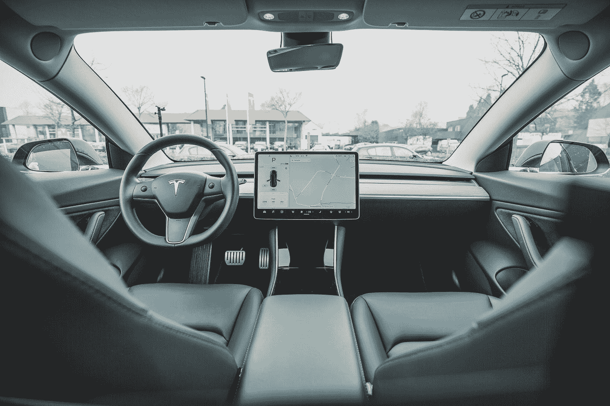
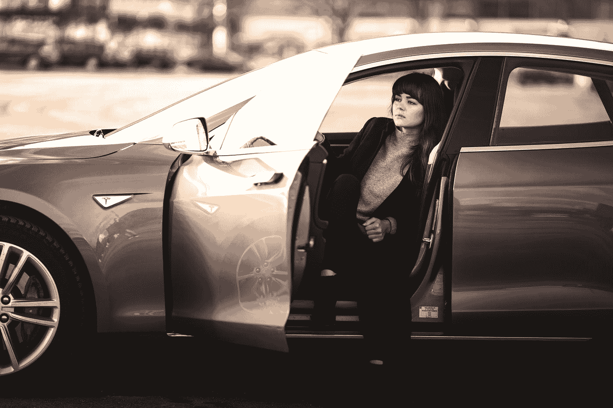

# 为什么你再也不会开车了:你需要知道的一切

> 原文：<https://medium.datadriveninvestor.com/why-youll-never-drive-a-car-anymore-everything-you-need-to-know-7301a973dd0d?source=collection_archive---------3----------------------->

## 无人驾驶汽车革命会比你想象的更快地把钱装进你的口袋。

Photo by [Bram Van Oost](https://unsplash.com/@ort?utm_source=medium&utm_medium=referral) on [Unsplash](https://unsplash.com?utm_source=medium&utm_medium=referral)

> 我非常有信心实现完全自主，并在明年(2021 年)向特斯拉客户群发布。——埃隆·马斯克在本周的一次采访中

我喜欢埃隆·马斯克的一点是，他真的想让世界变得更好。在这次采访中，他开始说:

> 你应该从未来往后看，问问[特斯拉](https://bit.ly/3oqDX50)的根本好处是什么。它应该是特斯拉加速可持续能源优势的多少年。

事实是，我们人类昨天就必须拥有可持续能源，而不是明天。否则我们自己的生存将受到威胁。

我们可能已经听腻了这种说法。但是在我们改变之前，我们会继续听下去。

这不是因为伊隆试图通过 [SpaceX](https://bit.ly/2JMTZXU) 让我们去火星，你不应该给下一代留下改变范式的遗产。

除非你想让你的儿女看着你这一代人说:*你应该为自己感到羞耻。你怎么能摧毁我们赖以生存的世界？没有祖先的森林、干净的河流、珊瑚礁或干净的空气供我们繁衍。*

特斯拉的 Model S 于 2008 年首次发布。每个汽车公司都嘲笑埃隆，说他疯了。由电池驱动的汽车。他们告诉他，他永远不会成功。尽管他们不知道伊隆的第一个愿望是拯救地球。

2020 年，每个汽车公司都想从特斯拉分一杯羹。当他们嘲笑特斯拉的时候，他们意识到他们应该在 10 年前开始投资电池技术。

当时没有人知道技术颠覆、技术融合或垂直整合意味着什么。

没有人，除了埃隆·马斯克。

从拯救地球的简单原则出发，马斯克开始了一次重大转变。像深度学习、人工智能、机器人合作、自动驾驶这样的东西，对大多数汽车行业来说都是陌生的概念。

对特斯拉和其他一些科技公司来说都不是。

我们所知的世界将会经历一场深刻的变革。

这些新技术的颠覆才刚刚开始。他们将彻底改变我们的生活，让它变得更好。

让我告诉你怎么做。

Photo by [Taneli Lahtinen](https://unsplash.com/@tanelah?utm_source=medium&utm_medium=referral) on [Unsplash](https://unsplash.com?utm_source=medium&utm_medium=referral)

# 创新是将变化视为机遇而非威胁的能力

1921 年广播电台的数量是 5 个。1923 年跃升至 525。到 1924 年底，已售出 200 多万台可播放的收音机。

技术中断具有强大的复合效应。

特斯拉将其总产量从 2017 年的约 12 万辆增加到 2018 年的 35 万辆。

当两个千兆工厂正在建设中，一个在德克萨斯州的奥斯汀，另一个在德国的柏林，第三个在上海即将完工。

2019 年，特斯拉的交付量达到 367，000 至 368，000 辆。尽管有疫情，但它将在 2020 年超过 50 万台。

特斯拉的产量预计在 2023 年达到 400 万辆。还在上升。

在我们的星球上，每天有近 20 亿辆汽车在行驶。向大气中排放一氧化碳。我们呼吸的空气。同样的大气能够保护我们免受紫外线的伤害。

你不必爱特斯拉。

不过，我相信你爱地球，对吧？

从商业角度来看，最糟糕的情况是，埃隆·马斯克(Elon Musk)将作为让大规模生产电动汽车成为可能和可持续发展的人而被人们铭记。

如果人们买福特、奥迪或丰田，那很好。就我个人而言，我认为这不会是同样的经历。但是我知道什么？

重要的是改变即将到来。以更环保的方式。

工业革命是很久以前的事了。是时候保护我们最有价值的资产了。

我们的星球。

Photo by [Cleyton Ewerton](https://unsplash.com/@cleytonewerton?utm_source=medium&utm_medium=referral) on [Unsplash](https://unsplash.com?utm_source=medium&utm_medium=referral)

# 儿子，你的引擎很好，但是你的手不在方向盘上

你能做想象你在未来的练习吗？也许 2030 年就可以了。

自动驾驶汽车遍地都是。你通过电话订购这些车辆中的一辆来接你，并把你留在你想去的任何地方。

当汽车自动行驶时，没有人看路。人们知道自动驾驶技术比司机能保护他们 100 倍。

所以，这就是新常态。如果你有自己的车，你只需支付一小部分费用。你不需要支付安全或汽车维修费用。你不需要车库来停车。

别人为你治疗了所有这些东西。

运输变成了一种服务，而不是所有权。

好消息是，你将节省金钱和时间，并增加对交通中分心和人为错误的保护。

通常情况下，一辆车的使用时间大约是每周 10 到 12 个小时。但是如果你有一辆可以自动驾驶的汽车，那么最有可能的是一辆自动驾驶汽车一周可以行驶 55 到 60 个小时。

自动驾驶汽车将替代 12 辆内燃机汽车，提供相同的服务(运送人员和货物)。

正如埃隆所说，两件事情中的一件将会发生。车辆数量会减少，交通会减少。或者因为旅行会更便宜，人们会更频繁地使用这些服务。

然而，保守的观点是，一辆机器人出租车将替代 5 辆内燃机汽车。

路上的车少了，交通就少了。

随着机器人出租车行业的发展，城市的面貌将会发生巨大的变化。人们会花更少的钱去更多的地方旅行。

我相信购物中心将会重组。剧院、体育馆、游乐园，一切都将因更便宜的交通系统而不同。

空闲时间将是另一个优势。你将有更多的时间和你的朋友和家人在一起。

新的范例将会出现。旧的将会消失。

有一件事我很确定。

我们已经在朝着一个更加平衡的星球前进，也许是朝着人类在大自然母亲面前的一种救赎前进。

希望就是这个词。

谢谢你，

努诺