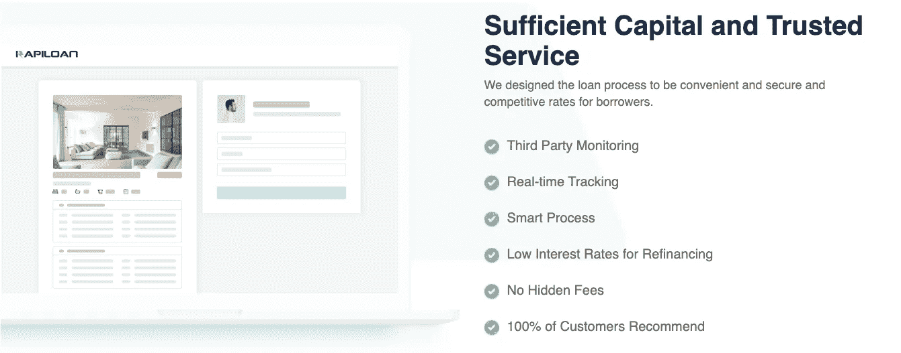

# 为什么 COVID19 之后您仍然需要过渡性贷款，以及从哪里获得贷款？

> 原文：<https://medium.datadriveninvestor.com/why-youll-still-need-a-bridge-loan-after-covid19-and-where-to-get-one-6b7a9841c399?source=collection_archive---------10----------------------->

新冠肺炎的经济影响仍在显现。J.C.Penny 和 J.Crew 等零售商正在申请破产，失业索赔正在上升。就连优步和 Airbnb 这样的科技巨星在过去几天里也解雇了数千名人才。

随着总体收入水平受到打击，房地产活动似乎有所降温。卖家和买家都处于“观望”模式，让疫情的效应发挥出来。Redfin 的数据显示，与 COVID19 之前相比，购房需求下降了 15%，抵押贷款申请较上年下降了 20%。

然而，市场降温并不一定意味着你作为一个潜在的购房者会过得更轻松。多年来，美国房地产市场一直严重缺乏*，在疫情期间，情况变得更加糟糕。Redfin 数据还显示，房屋上市量创下 5 年来的新低，美国全国房地产经纪人协会(NAR)证实，待售房屋总量比去年下降了 10%。*

**

*Photo: Wall Street Journal*

*那么这意味着什么呢？*

*首先，在一些市场上，你会实际看到房价 ***上涨*** 。例如，根据 Re/Max 的数据，中西部地区的房价表现出最强劲的年增长率，约为 10%。*

*第二，即使在价格下降的地区，由于供应短缺和之前观望的买家被压抑的需求，你仍将与 ***多个报价竞争。****

## *因此，在投标时，你仍然需要一笔短期的过渡性贷款(T21)来提高你的竞争力，就像回到正常时期一样，尤其是在主要市场。*

*对于那些刚刚接触购房游戏的人来说，这里有一本关于 ***过渡性贷款的入门书——什么是***、如何运作**，以及最重要的**在哪里可以找到它**。***

# ***什么是过桥贷款？***

***这是一种为购房者提供的短期融资工具。主要是当买家缺乏资金购买新的房产时，而不必先出售以前拥有的房产。***

***通常你会发现，在竞争激烈的市场中，当全现金报价具有压倒性优势时，以及当从银行获得抵押贷款批准可能存在复杂情况时，这种方法非常有用。(想想你能排除的所有“意外情况”……天哪。)***

# ***过桥贷款如何运作？***

***获得过桥贷款的过程通常比其他贷款快很多*。申请通常不超过 2-3 天，交易可在 1-2 周内完成。****

****贷款偿还期一般为 ***12-18 个月*** ，利率一般为贷款价值的***8-10%****加***1.5-3%***的开办费。你可以申请的最高贷款额一般约为房产总价值的 60-80%，被称为 LTV 比率。*****

# ****哪里可以获得过桥贷款？****

****这是一个非常棘手的问题。****

****因为这个过程是如此的敏捷和灵活(也由于隐含的金融风险)，银行和其他抵押贷款机构一般不会向购房者提供过渡性贷款。所以最好的资源往往是私人贷款机构。****

****这些私人贷款机构非常注重区域，就像房地产经纪人一样，因为他们需要非常了解当地社区，以便更好地提供服务和管理风险。****

****但这也意味着他们很难找到。谷歌搜索在监管这些本地服务提供商方面往往很糟糕，Yelp 在私人贷款机构中的渗透率仍然很低，因为这些并不是严格意义上的基于位置的服务。所以你最好的资源很可能是你的经纪人，或者是最近买房的朋友的口碑。****

# ******一个现实生活中的例子******

****作为一个住在旧金山湾区的中国人，我经常从我的中国朋友那里听到他们在洛杉矶/圣地亚哥地区、西雅图地区和旧金山湾区买房的经历。****

****有趣的是，在过去的几年里，我的几个朋友都使用过专门针对西海岸这些主要房地产市场的快速贷款。****

********

****[Rapiloan Website](http://rapiloan.com)****

****Rapiloan 是他们的代理人推荐给他们的。过程非常 ***精简******透明*** 通过网络界面，条款相比他们找到的其他贷款提供者非常有吸引力。****

*   *******利率*** 通常始于*8%，在正常范围的低端 8–10%。*****
*   ********发行费*** 一般为*的 1.5%，同样，在 1.5-3%区间的低端。******
*   ******LTV 比可低至 ***70%*** ，在 60-80%范围内。******
*   ****他们的贷款在 ***48 小时*** 内获批，在***7-10 天*** *内关闭。*****

****我的一些朋友比规定的 12 个月期限提前偿还了贷款，他们没有像其他一些私人贷款人可能收取的任何*罚款。我的一些朋友甚至设法用他们在海外的资产和房产作为贷款的抵押。*****

*****因此，如果你在西海岸，并且正在买房，那么绝对值得从 [**Rapiloan**](http://rapiloan.com) 获取报价来测试一下。*****

*****希望你们在疫情期间保持健康，并祝你们找房子好运！*****