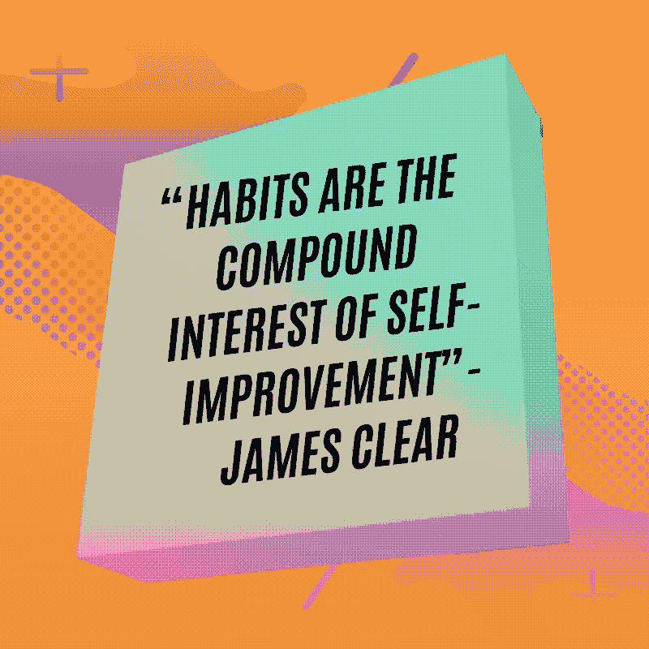
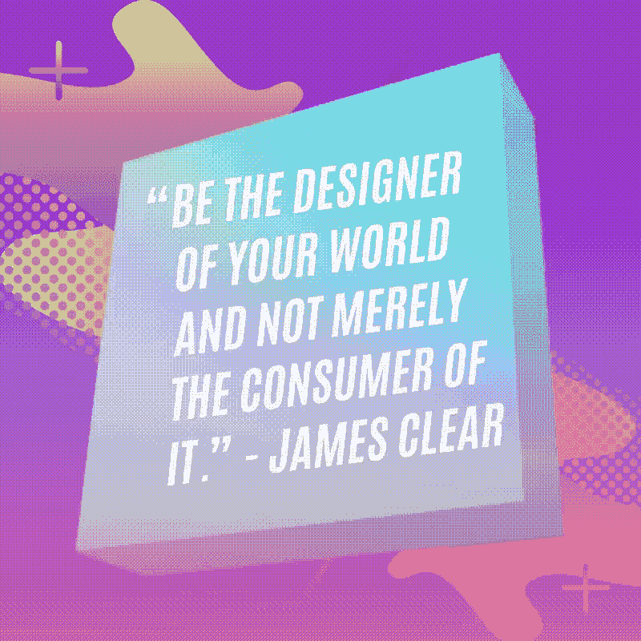
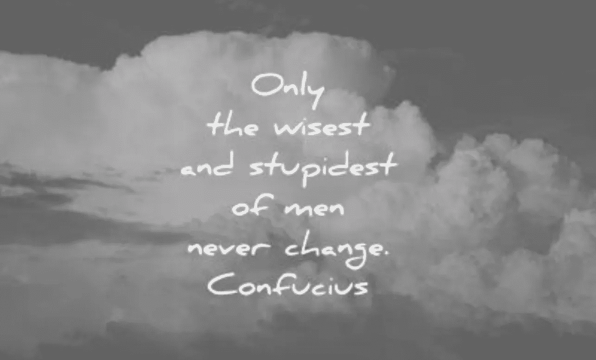
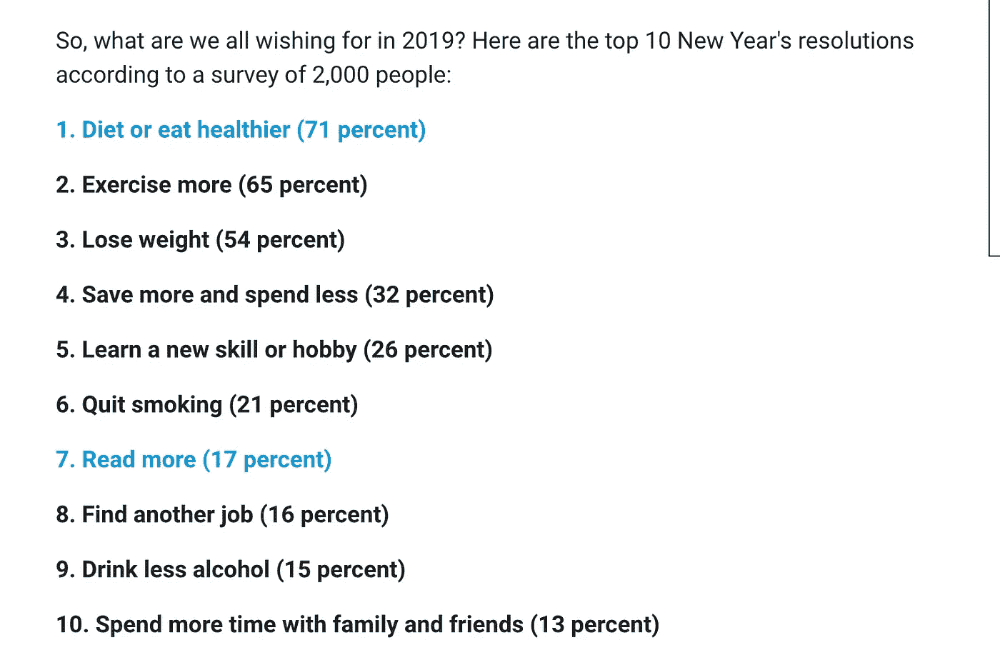
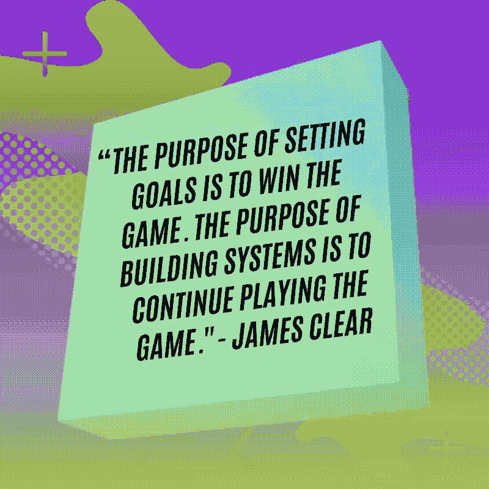

# 实现 2020 年新年决心和目标的 7 种方式

> 原文：<https://medium.datadriveninvestor.com/why-your-2020-new-year-resolution-list-and-life-goals-might-suck-6dd0e63ef6b?source=collection_archive---------11----------------------->

## 一个职业运动员为什么世界上 50%的地方没有达到我们的新年决心清单和目标

> "我们应该在我们不打算坐的树荫下种树。"-匿名僧侣

H 你见过秃鹰宝宝第一次飞行吗？你知道那些美丽的鸟只有十分之一能飞起来吗？

> 你有没有觉得你的生活目标和新年决心很糟糕？

幸运的是，我一直在吮吸(和摇摆)生活目标和新年决心。以下是我攀登职业篮球山峰的宝贵经验。

 [## 成功生活的 25 种自我提升方式|数据驱动型投资者

### “我活得越多，我学到的就越多。我学得越多，意识到的越多，知道的就越少。”―米切尔·莱格兰德时间……

www.datadriveninvestor.com](https://www.datadriveninvestor.com/2019/03/12/25-self-improvement-ways-for-a-successful-life/) 

## 1.失败不是结束，而是开始

幸运的是，人类不会像秃鹰宝宝一样失败。

我们不会在失败、跌倒或为实现目标而挣扎时死去，即使我们觉得勇气在《勇敢的心》中展现出来。

“自由自在！”

抱歉。

我跑题了。

具有讽刺意味的是，只有当你能够维持你的财务、精神、健身、生活方式和人际关系目标时，自由才会到来。在我年轻的大学和高中篮球运动员生涯中，我梦想成为一名职业运动员。目标成为我生活中每一部分。我开始设定***目标——即*具体、可测量、可实现、相关和及时的*目标——这样我就可以实现成为职业运动员的梦想。***

*这就是我所做的对我有用的事情:*

## *2.让你的详细的日常系统成为你目标中最重要的部分*

*不要把一年分成 12 个月，而是把目标分成 12 周。每周，你应该能够写清楚，简洁，详细你将在第一周到第十二周做什么。我以前达到目标的专业系统是这样的:*

> *第 1 周:*
> 
> *早上 6:00–7:00。每周早上练习四次篮球*
> 
> *上午 8:00-开始上学*
> 
> *下午 12:00–下午 1:00。午餐时间优化我的运球常规*
> 
> *下午 3:00–4:00。放学后进行 300 次游戏拍摄*
> 
> *每周可测量:每周与我认识的最好的球员打四次 1v1。*
> 
> *每周可测量:每周两次在每个开放的健身房守护最好的球员*
> 
> *第 2 周*
> 
> *添加晚上 8:00-9:00 的篮球电影学习*
> 
> *第 3 周*
> 
> *在第 12 周之前完成一本关于世界上最好的篮球运动员的自传*
> 
> *第 4 周*
> 
> *每周可测量:每周增加一天速度、敏捷和快速训练或个人发展调节训练*
> 
> *第 5 周*
> 
> *….更大的*

*在商界，你可以效仿沃伦·巴菲特。在初创企业中，你可以复制马克·库班的最佳实践。在人际关系中，你可以仿效约翰·戈特曼。*

*总有一个更高版本的你在那里，有数百万人在帮助你，或者通过复制，偷窃，或者模仿。*

## *3.问问你自己，“谁在乎？”*

*你的系统或目标背后的个人意义越多，你就越有可能实现它。*

*这可能意味着养活你的家人。做最好的自己。热爱你的工作、爱好或好奇心。它可能是关于吃得好，睡得好，爱得好，以及在你做的每件事上都更有效率。即使当我的职业篮球生涯结束时，由于我缺乏自我意识，我的新年决心清单也在不断变化。我意识到神奇之处在于运用个人意义(爱情的力量，而不是意志的力量，杰伊·谢蒂说)并为自己制定每日行动计划。*

*即使是最雄心勃勃的目标或没有个人意义的系统也会失败。当我从职业篮球赛中退役，飘渺的名声、声望、地位、设定目标的惯例和金钱枯竭，经历了一些加勒比岛的跳跃、精神探索、两次失败的工作、三个新的州和多个国家……我开始问一些常见的存在主义问题，什么给我带来了意义:*

> *“特雷弗，你现在想要什么？为什么希望这个目标实现？为什么我在乎这个就需要牺牲，对其他事情说不？”*

## *4.成功、快乐、满足或富有成效的一个方法是每天为一项事业而工作*

*打完篮球后，我无法回答这些存在主义的问题。每个人在从工作到事业、从工作到退休、从关系到婚姻的转变过程中都会经历这个阶段。*

*无论我们看到还是知道，变化都在发生。如果你能找到一个原因，你会更快乐，更有成效，更有可能达到你的目标。*

**

## *5.不要让别人创造你的命运*

> *”“我不是你想的那个人；我不是我认为的那个人；我想你认为我是谁，我就是谁。”—库利*

*这他妈的太难了。我知道，我知道，别说脏话了，特雷弗。35 岁时，甚至在 35 岁之前，我意识到我生活、设计和创造我一生的工作是基于我从其他人——朋友、仇恨者、嫉妒型的人——在我周围所做的事情中对自己的认识。我需要摆脱社会对我的印象。我需要培养和设计一种更有自我意识的生活，一种基于习惯和自我控制的生活，并创造一个值得我在生活中的最高目标或愿望的系统。*

*对我来说没有什么其他的了。我想实现自我——成为宇宙希望我成为的样子，而不是社会希望我成为的样子。*

> *问题是，大多数千禧一代、大学毕业生和婴儿潮一代不知道当他们从过去的样子转变过来时，他们想成为什么样的人。*

**

*你知道你的优势吗？好奇心？需求？欲望？目标？弱点？幻觉？*

*什么会阻止你实现你的 SMART 目标？谁会试图阻止你？你一天中有哪些时间可以为你的目标和愿景创造时间？*

*从 2015 年到 2019 年，我的新年决心清单和生活目标没有经常发生。我忘了魔法酱是真的。我没有作出任何真正的深思熟虑或内在的意义，因为…*

> *我成了社会的消费者，而不是命运的创造者。*

*我没有理由。视觉。激情。我做了别人认为我应该做的事情。然而，我知道我为我真正关心的事业工作得更努力、更长久、更有激情！*

> *找到你的目标意味着你必须在需要的时候改变方向…*

## *6.这意味着知道什么时候退出*

*随着我 35 岁的职业运动员身份开始消失，我的内在和外在生活开始停滞和混乱，我开始尝试新事物。其中一些是我喜欢的。*

*有些，我讨厌。*

*我喜欢整天写作。为了在纽约工作而朝九晚五地在隔间里工作，我讨厌。插在我气管里的饲管社会引起了焦虑。脑雾。抑郁症。担心。依恋。我太专注于得到一个我并不真正想要的结果。因此，有一段时间，我放弃了努力。成为我在乎的人。我漂浮着。徘徊。当我最终沉沦到谷底时，自我厌恶成了常态。我放弃了任何涉及学习、挫折、尴尬、挑战或逆境的事情。*

*然而，辞职正是我应该早点做的事情。*

*放弃并不是我所能做的最糟糕的事情——这并不是听那些告诉我要向我真正在乎的未来倾斜的耳语…*

*你会崛起的。你会掉下去的。你会成长。你会学到的。你会适应的。这是生活、商业、关系和寻找可持续和平的循环。*

## *7.为自己设定更好的 SMART 目标*

> ***一个普通美国人的 2019 年新年决心列表:***

**

*photocredit: Inc.com*

*我说放弃这些低劣的、模糊的、可能毫无意义的目标。为什么要吃得更健康或者节食？为什么要多运动？为什么要多打球？为什么要戒烟或者减肥？*

*这些健身目标背后的具体含义是什么？谁来衡量你锻炼的动力？在接下来的 90 天里，实际上可以实现什么？当你想做大事时，从小处着手。为什么这个目标或愿景对你有意义？你每天什么时候做？每周吗？在你达到最终目标之前，一年要练习多少次？*

> *只有 8%的人坚持我们最好的新年决心清单！*

*我们中的大多数人可能会成为世界上 50%的人，他们甚至不能带着他们生命中最重要的决心、目标或对更好生活的愿景度过 1 月 31 日。*

*我们又回到了拖延的状态。我们的懒惰。我们制定制度的短视做法。所以，为了纪念微小的失败，我说现在就退出，把苹果甜菜汤排毒食谱束之高阁。把壁球球拍或跑鞋藏回壁橱里。停止设定你的 5 点闹钟，让我们用一个新的**智能**框架来设定目标和新年决心。让我们更深入地写下“为什么”我们需要健康。为什么我们需要一个健身社区。为什么我们需要花时间写日记，想出我们的下一个愿景、职业或生活。我们应该戒掉自己不在乎做的屎(除非有我们附加的意义)。2020 年，让我们创造自己的命运，不要消费社会喂给我们的东西。让你的目标成为一个符合你生活方式的系统，看着你的生活蒸蒸日上。记住，失败不是结束，而是开始。*

**

## *感谢阅读，[特雷弗·霍夫曼](https://medium.com/u/5e7157084b29?source=post_page-----6dd0e63ef6b--------------------------------)*