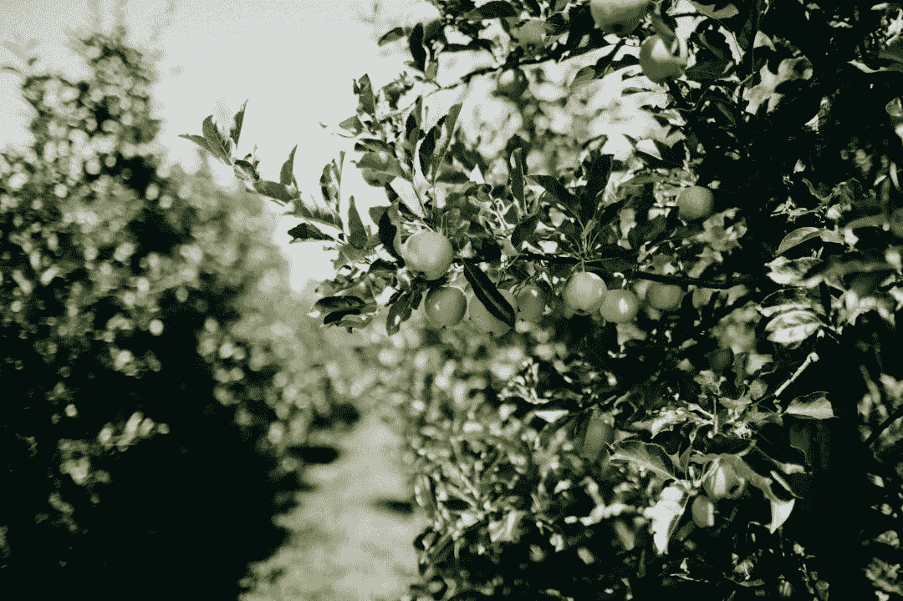

# 为什么您的数据就像一个苹果酒企业！

> 原文：<https://medium.datadriveninvestor.com/why-your-data-is-like-cider-56395e54db94?source=collection_archive---------13----------------------->

你知道为什么你的数据像苹果酒生意吗？？作为一个数据领导者，或者事实上，任何业务的领导者，你应该！

不是从酗酒的角度，而是从它完美地反映了每个企业在其数据上所面临的挑战的角度。

这就是为什么我相信一个企业可以从苹果酒的生产中学到很多关于它的数据。

*让我解释一下……*

我在汤顿长大；萨默塞特郡，农民口音的耕耘者，Scrumpy 苹果酒的故乡。

这是最后一点，我想在这里建立。为什么？因为它从根本上与理解您业务中的数据有关。

作为一名数据领导者，我的部分职责是帮助企业了解什么是数据以及我们为什么需要利用数据，即明智地使用数据来产生可操作的见解，也称为数据素养。不可避免地，有些人会比其他人更快地理解这一点，但除非所有人都知道要努力实现什么，否则成功的速度会更慢。

它在思考这样一个问题:**,我如何以一种每个人都能理解的方式来表达我们数据的力量，以及明智地使用它的必要性？**‘那我想到了下面这个比喻:

- *利用你的数据就像酿造苹果酒一样。*

想象一下这个:

-你拥有一家苹果酒公司，有一个工厂和四个果园。

-果园被铁丝网围着

-工厂内部有一台旧式生产压机

-每天都有员工来手动操作机器

该公司的产品是用当地苹果酿造的手工苹果酒，受到了少数精选顾客的大力支持。

在这一点上，你要么已经失去了兴趣并停止阅读(哦，好吧),要么好奇想知道更多，并仍然与我在一起…谢谢！

 [## 员工敬业度:你信任谁？数据驱动的投资者

### 收集员工数据是一件值得信任的事情。当机密信息被证明不是…

www.datadriveninvestor.com](https://www.datadriveninvestor.com/2020/03/10/human-resources-needs-employee-trust-when-collecting-their-data/) 

**使用这个类比，让我带您了解任何业务中的数据应用。**

***首先*** ，工厂代表你的数据基础；数据平台，如果你愿意，你持有的数据的主要或中央存储库。

***其次*** ，每个果园代表一个业务单位、部门或子公司——都是同一业务的一部分，但执行特定的角色。

对此最简单的解释是每个果园生产不同类型的苹果:史密斯奶奶、嘎拉、粉红女士等。它们都是苹果，但形式不同。

这完美地反映了各部门产生的数据；其核心都是数据，但同时又是不同的。把它想象成结构化的、半结构化的、非结构化的，以及这些类别中每一种的多种变体。

***第三个*** ，铁丝网代表你数据周围的安全。在这个例子中，有一个栅栏，但它充满了漏洞，很容易导航。

我希望你们的安全协议不要这么差，但企业经常会错误地认为，我们有*一些*安全措施，所以我们会没事的。'

我敢肯定，如果您询问您的数据保护官(DPO)，他或她会告诉您，业务需要在每个环节都受到保护。事实上，协议只需出错一次，潜在的巨大后果就会显现(通常声誉会首先受到影响)。

第四，媒体反映了你们技术基础设施的质量。老式手压机代表了公司必须执行日常活动的遗产或技术债务。

通常情况下，这种设备需要更换，但价格昂贵，通常被企业视为不合适。事实是，这里缺乏投资会阻碍收入增长，从而产生虚假经济，但许多人意识到这一点时已经太晚了。

员工代表你的。任何企业都拥有的最有价值的资源。

是的，数据是一种有价值的(通常是未开发的)资源，但是如果没有合适的人分享你的观点，你的数据将仍然是…未开发的。

记住所有这些，让我带你看一下生产过程:

酿造苹果酒从苹果开始；查找、整理和存储。如果你的数据是一个苹果，我对你的问题是:*‘你知道所有的苹果在哪里吗？’*

我在这里的假设是，答案将是“不”。

是的，苹果长在树上，但它们并不都呆在那里！一些倒下了，其他的可能藏在灌木丛中，或者掉进了沟里。找到所有的苹果可能是一个真正的努力，尤其是如果这是一个手工过程。

这和你的数据一模一样！

有些部门会知道自己的数据在哪里；别人不会。

领导者面临的一个重大挑战是识别和花费精力来记录苹果在哪里，以及重复整理它们。

当然，你不想每次需要更多的苹果时都要重复一个手工密集型的过程吧？！

***要点*** :确保你能记录下你所有的苹果在哪里，以及整理它们的步骤。这样做一次，你将会在将来节省无数的时间去重新寻找它们。

**第二:**一旦我们确定了苹果在哪里，我们需要将它们整合到生产流程中——这涉及到质量检查流程，也称为数据治理。

把发霉或碰伤的苹果放进出版社是不明智的，同样的道理，把质量差的数据放进我们的中央资料库也是不明智的。

如果没有一个可靠的、可重复的质量检测过程，生产出来的苹果酒质量会有很大的差异。如果真的很差，我们可能会因此失去客户！

因此，知道要寻找什么和应用于检查苹果的标准将在未来带来回报。从数据角度来看，在日期字段或日期中输入 41/07/2019 会产生显著的连锁效应，即使相关负责人不会立即感觉到。

*:最初建立强有力的质量控制可能需要时间，但通过未来的补救(以及潜在的声誉损害)节省的时间要多得多。*

***三:**一旦合适的苹果经过整理和质量检测，将苹果变成苹果酒的生产过程就开始了。最初，苹果被分类、干燥，然后进入压榨机。从这里开始，目前的过程包括工人转动老式苹果压榨机的手柄来挤压和榨汁苹果。这是一项非常耗费体力的工作。*

*是的，果汁是生产的，但是苹果的投入与果汁产出的比率很可能远远低于我们的竞争对手。这可以通过一项基准测试工作得到证实。*

*我们可以称之为我们的 ETL(提取转换加载)过程。*

*通过维护(内部和外部合同)、变通办法和战术修正来维护机器的工作每月都在增加。比特币价格的下跌使得比特币的开采成本高于 1 比特币的价值，同样，数据开发也是如此。*

*目标应该永远是“少花钱多办事”。*

*是的，这是一个过度使用的口号，但我们如何尽可能地提高生产力，而不花费不必要的劳动时间只是“转动把手”的精神。原因是这种努力没有产生收入或成本节约；这纯粹是一笔开支。*

*用这个例子，答案似乎是显而易见的:用最新的现代技术取代手动压力机。但许多企业似乎没有将这两者联系起来。*

*苹果酒正在生产，但生产的努力却被掩盖了。作为一名顾客，只要他们得到他们所支付的东西，没有人会在乎这个过程有多艰难。定制的豪华车是另一个例子:客户在支付额外费用后，仍会在合理的时间内对汽车进行改装，而不管生产过程中付出了多少努力。*

*因此，用一种现代工具来代替手动压榨机是有意义的，这种工具可以在没有任何人工参与的情况下对苹果进行分类、榨汁并扔掉种子。*

*在数据世界中，使用市场领先的解决方案，如亚马逊、谷歌和微软基于云的技术，利用这一功能的机会可以以很小的成本实现。*

*成本来自于在专家的帮助下(必要时)实现新的工具包所花费的时间和精力。*

*我们不会试图安装一个新的锅炉而不雇佣一个合格的气体人，所以为什么企业认为更换一个老旧的有气质的锅炉可以靠我们自己实现。*

****外卖* :** 用现代化的适用系统替换旧系统的决定拖得越久，解决方案就会变得越痛苦和昂贵——同时承认由于生产力的浪费而存在潜在收入的损失。*

***四:**这个谜题的最后一块是员工进来操作手动机器。他们每天都来，因为他们喜欢为本土苹果酒公司工作；但是挫折感很快就会产生，因为他们不能很好地完成工作。*

*他们被旧机器(或遗留系统)束缚住了手脚，不管他们周围的工作有多巧妙。*

*为了让你的员工发挥最大的作用，他们需要被“买入”；从远景和方向的角度来看。*

*如果你致力于投资他们，通过让他们参与决策过程(为一家新的出版社)，带他们踏上旅程(为什么我们要这样做)，然后给他们成功的工具(为新的工具包进行培训)，生产力水平将不可避免地提高。*

*我现在想指出，我与数据领导者领域的大多数人不同。*

*我在这里不是要告诉你一个框架有多好，或者一项新的技术可以解决你所有的问题(这永远不会是真的，无论供应商的销售有多么吸引人！).不——我是你的人民需要成为焦点的强烈拥护者。*

*如果你的组织中没有(合适的)人，无论技术或控制有多好，它们都不会被充分利用。*

*这听起来可能有点夸张，但却是事实。*

*确保你的员工支持你的事业将会比在一个新的软件应用中穿鞋获得更大的回报。*

*几年前，我的一个好朋友在伦敦一家非常高档的珠宝品牌工作，她讲述了营销总监如何说服董事会更换 SAP(财务系统)的故事。主要原因是它限制了营销团队销售更多的高级珠宝。首先，这是一个荒唐的建议，但最终还是做出了决定，并以高昂的代价引进了 SAP 的竞争对手。*

*不用说，12 个月后，新系统的收入并没有直接大幅增加(成功标准没有预先定义，这没有帮助！).反思这种情况，高级管理层慢慢意识到系统不是问题，能够使用系统才是问题！*

*很简单，负责使用该系统的团队没有经过充分的培训。*

*其结果是，花费巨大，实现的实际利益却很少。该公司没有在员工身上投资:去了解真正的驱动力是什么。相反，他们选择把钱扔在问题上，而忽略了对他们的人的投资。*

*一切都是相互联系的:就像身体一样，企业是一个系统的系统。*

*我目前正在写一本书来更详细地解释这一点和其他人的见解，所以在这里就不深究了。*

****外卖* :** 尽快带上你的人踏上我们的旅程。不这样做的机会成本将远远超过让他们接受的痛苦。你需要你的人民来支持你的事业。不理解他们和他们的司机，意味着你将作为一个企业遭受损失。*

*五:苹果酒生产的最后一个环节是装瓶。将所有原料放入顾客可以使用的格式中的过程。*

*同样，瓶装苹果酒使消费者易于消化，将你的数据转换成易于使用和‘消化’的格式也同样重要。*

*“数据素养”在企业中越来越受欢迎，因为认识到拥有和理解数据是一回事，但用它来帮助论证某个特定观点(很好地)则是另一回事。*

*鉴于苹果酒的生产过程应该是明确的和可重复的，使用旧的机器和非标准化的苹果原料，意味着每一批生产的苹果酒都是不同的。*

*结果呢？一种战术上的修正，使它尝起来符合要求。*

*战术上的解决办法可能是添加更多的糖，减少酒精含量或增加防腐剂。不管需要采取什么措施，都要对输出进行调整。所以当下一批生产出来，味道不符合要求的时候，就需要战术修复了。*

*这种方法可能发生在很多很多场合。*

*让我们将此应用到您的数据中…*

*在整理和存储您的业务数据时，需要将其输出给最终用户。随后出现的问题是，数据不是用户需要或理解的格式。因此，增加了一个战术修正来纠正这个问题。*

*任务完成了吗？没有。*

*下一次需要一个文件时，系统会丢弃该数据，但同样不是所需的格式。但这一次，最初的修复并不完全奏效。因此，添加了另一个策略修正(在初始策略修正的基础上)来生成所需的文件。*

*这一过程在整个企业中多次重复。它给本来可以避免的过程增加了不必要的时间和精力。*

*与其不断修正输出，为什么不修正输入呢？*解决一次，解决好。**

*通过花费精力来纠正输入，你不仅解决了根本原因，还在过程中提高了质量。因此，当需要错误或调整时，通过在源系统中这样做，意味着数据流在下游将是正确的。*

*这似乎是显而易见的，但往往被忽视…被视为太困难，太耗时或太昂贵。*

*这很好，但是业务将永远受到系统限制的束缚！*

****外卖:*** 在一个战术修正上增加一个战术修正只会使问题复杂化，尤其是当关注点是输出而不是输入的时候。这可能会延迟、影响和阻碍企业的生产力，而你可能并不总是意识到这一点！*

*我们现在已经完成了苹果酒的生产，应该可以坐下来享受我们的劳动成果了。你可能已经猜到了，事情没那么简单！*

***结论:**讲述这个故事的目的是为了强调您可能不知道您的数据在哪里，也不知道最有效的流程，但是您越是拖延解决问题，只会导致更多的问题。*

*从我的角度来看，我会首先关注您的员工:定义愿景和战略，了解他们的关注点和愿望，并让他们直接参与到这一旅程的创建中。*

*不仅相关的每个人都知道你想要达到的目标和你要去的地方，而且你的数据需求也变得相当容易。*

*我留给你的问题是:'*你是为了长期投资，承受现在的痛苦以实现增长，还是着眼于短期收益以获得快速的&不可持续的收入增长？*’*

*我不会告诉你我认为你应该做什么…*

**原载于*[*https://www.linkedin.com*](https://www.linkedin.com/pulse/why-your-data-like-cider-brendan-ellis/)*。**