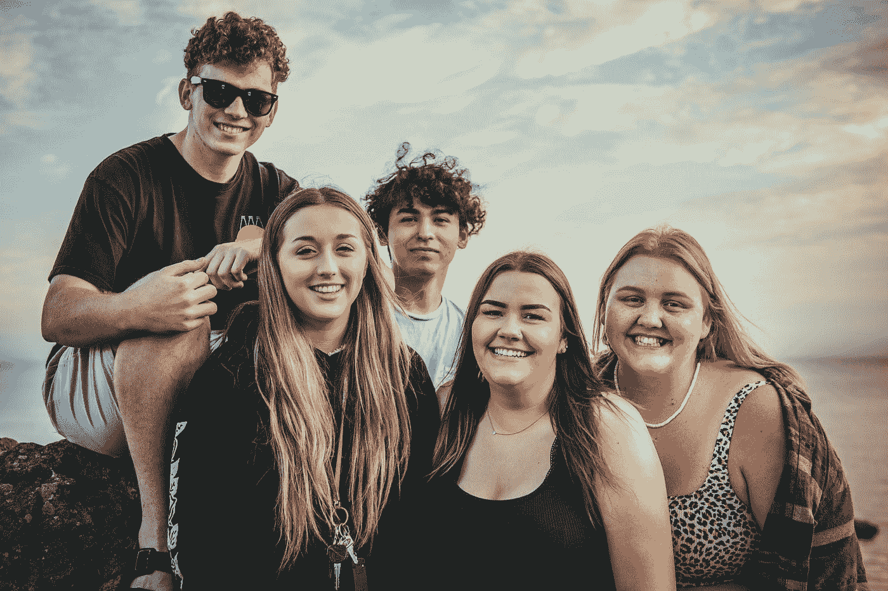

# 为什么你的朋友可能会阻碍你过上最好的生活，该怎么办

> 原文：<https://medium.datadriveninvestor.com/why-your-friends-might-be-holding-you-back-from-living-your-best-life-and-what-to-do-about-it-33b25efb5f4a?source=collection_archive---------26----------------------->

Photo by [Tim Mossholder](https://unsplash.com/@timmossholder?utm_source=medium&utm_medium=referral) on [Unsplash](https://unsplash.com?utm_source=medium&utm_medium=referral)

你听说你是你交往的五个人中的平均水平，你害怕得要死；也许你的朋友不能帮你到达你想去的地方。你想成为最好的自己，但在内心深处，你知道你没有和合适的人在一起，所以你留在原地。

你留下来是因为走出你的舒适区去认识新的人会让你害怕，或者你不想付出努力。

所以，你在那里，为自己感到难过，再次知道如果你周围有一个更健康的社区，你会更容易实现你想要的目标，并且对自己感到更快乐。

当你对自己所处的环境感到厌倦，并承诺要对生活做出重大改变时，如果你开始表现得与众不同，人们往往会抨击你。你开始意识到你为自己形成的新价值观可能与你当前的团队不一致。

现在是时候决定什么对你最好了。做出艰难的选择，也许和那些没有给你的生活增加任何价值的朋友或者那些只会吸走你的能量的朋友说再见。

但是朋友是你生活中必不可少的一部分。如果你找到了好朋友，他们会把你举起来，帮你走上正确的方向；好朋友会支持你，当你感觉不适时会在你身边，会真心对你的项目感兴趣，会帮助你实现梦想。

当他们认为事情进展不顺利时，他们会诚实地与你沟通，他们会尊重你的时间。和你欣赏的朋友出去玩是很重要的，这些朋友激励你成为最好的自己。

***朋友不仅仅是分享悲伤和痛苦。***

朋友是享受和创造经历的关键，也是我们强大的体现。朋友是一个空间，在那里我们可以再次成为孩子，并感觉到我们的归属。最重要的是，朋友必须帮助我们成长，因为如果你们不一起成长，你就很难成为你一直希望成为的人。

看到一些人从你的生活中消失是很难的，但是当你有一个支持你的社区时，生活会好得多，你每天都互相帮助，带来最好的自己。

以下是我最终接受的一些事实

 [## 健身房 10 年的 10 条人生经验|数据驱动的投资者

### 走错一步，他们就会掉下去。两位登山者优雅地回到了地面。他们在那里…

www.datadriveninvestor.com](https://www.datadriveninvestor.com/2020/02/03/10-life-lessons-from-10-years-in-the-gym/) 

# 你应该放弃你热爱的有毒友谊，你知道它不会给你的生活增加价值

这听起来很残酷，但如果你爱自己，你会意识到有时你爱的朋友没有为他们的梦想而奋斗，或者只是没有带来任何有趣的东西。你们没有一起成长或互相支持，尽管你们可能在一起很开心，但每次你看到他们，你都会对自己的感觉更糟。

# 找到激励你和令你钦佩的朋友

当你开始和你钦佩并鼓励你的人一起出去玩时，这可以激励你变得更好，你甚至可以询问他们的成就或他们是如何走到今天的。你会看到人们朝着特定的目标努力，追逐自己的梦想，这让你也找到了追求自己想要的东西的动力和勇气。

# 在友谊方面，学会相信你的直觉

会有一个内在的声音告诉你什么时候值得和某些人交往，什么时候不值得。会有一个内在的声音引导你，你必须相信告诉你的东西。你可能会发现自己被某些类型的朋友所吸引，但他们可能并不适合你的生活，你必须接受这一点。

友谊是我们生活中美好而重要的一部分。我们需要仔细选择它们。

和爱自己的人做朋友，因为这些人会提升你，他们会让你看到在你认为黑暗的地方有光明。接受好朋友进入你的生活，和他们一起拥抱成长。

## 访问专家视图— [订阅 DDI 英特尔](https://datadriveninvestor.com/ddi-intel)