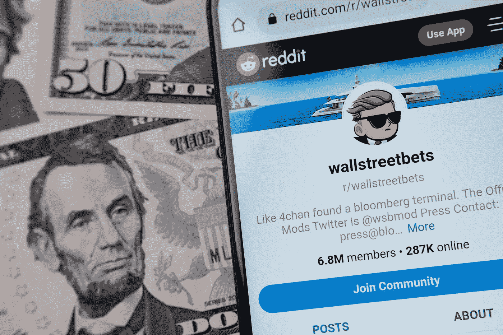

# 为什么你对 r/wallstreetbets (WSB)的看法是错误的

> 原文：<https://medium.datadriveninvestor.com/why-youre-wrong-about-r-wallstreetbets-wsb-dd56f1904559?source=collection_archive---------10----------------------->

Image by Shutterstock

## 为什么 r/wallstreetbets 值得深入思考，为什么它以你意想不到的方式如此重要

如果你最近一直在关注金融界，你一定不会错过人们谈论最多的(也是最重要的！)这种现象充斥了过去一周的头条新闻、中场休息节目和分析师采访。

鉴于 r/wallstreetbets(简称 WSB)在撰写本文时已经吸引了近 700 万会员，或许你甚至参与了我只能大胆地称之为 2008 年金融危机以来最重要的金融现象。对于那些还蒙在鼓里的人，我想邀请你们仔细看看这里的或者在这里阅读许多关于 WSB [的文章中的一篇。](https://edition.cnn.com/2021/01/29/investing/wallstreetbets-reddit-culture/index.html)

许多人，尤其是华尔街分析师，将 WSB 称为一群“千禧一代”、“向对冲基金复仇的散户”、“迷因交易者”，或者是我个人最喜欢的“体育健将”。多么雄辩地说。这些都与事实相去甚远。

参加这个运动的成员中有千禧一代吗？绝对的。在 2008 年金融危机中，当华尔街银行和银行家、他们的家人或爱人失去房子和工作时，这一运动的一些成员会为他们接受政府救助感到难过吗？绝对的。WSB 有很多迷因可以传播吗？绝对的。参加这个运动的人是不是也有一部分人在体育上下注？我想是的。但是，在过去的一周里，媒体已经看到了大量的这些描述，没有一个接近于描述，更不用说理解，工作中的真实现象。

从现象本身的本质来看，甚至还有对富裕、有权势的个人表示承认和支持这些运动的反应。从 Elon Musk 到 Chamath Palihapitiya，很多人都在推特上提到或谈论过 WSB，既有被问及的，也有主动的。他们的行为迅速激起了市场操纵和不负责任的呼声。在最奇特的爆发中，华尔街自己要求更多的监管和更严格的监督，这可能是历史上的第一次。

当试图理解真正发生的事情，WSB 到底是什么，以及它将对金融界产生什么影响(如果有的话)希望在未来几年或几十年，媒体的描述，对市场操纵的大声疾呼以及对责任和监管的呼吁只是噪音。这种噪音无助于理解 WSB 现象的深层原因以及由此可能导致的一切后果。要理解这一点，你必须看得更深。深得多。

理解 WSB 的一个很好的起点是实际阅读 WSB。这仍然是媒体和华尔街做得太少的事情。我不是指浏览 Reddit 论坛。我的意思是真正地阅读和理解它。深深地。仅仅花几个小时在 WSB 上就会有所帮助。

当你在 WSB 呆上几个小时，你就会明白 WSB 是一个更大的世界的一部分。比 WSB 本身更深刻的东西。应该清楚的是，WSB 有一些人不能被称为“体育高手”或“迷因交易者”，但他们对特定公司、其产品、市场和未来前景进行了广泛、深入的尽职调查，并得出了自己的结论，即与这些公司相关的头寸。

应该清楚的是，有一些人只是喜欢成为运动的一部分，只是简单地跟随其他人在做什么。

最清楚的是，WSB 不是为了复仇。这与对冲基金无关。也不是关于在 WSB 论坛上讨论的具体公司。WSB 从根本上讲是民主的。金融民主。自市场存在以来，民主在金融界一直难以捉摸。在金融市场上，信息的获取、参与的能力以及可支配的资本总是对华尔街有利。

具有讽刺意味的是，在将 WSB 推到风口浪尖的一系列事件中，之前的一环是 Robinhood 的崛起，这是进入一个世界的垫脚石之一，在这个世界中，金融像许多其他以前封闭的生态系统一样，现在已经民主化，robin hood 是 WSB 许多人现在讨厌的交易应用程序。

罗宾汉和 WSB 一样，都代表着金融民主化的进程。在过去的十年里，在技术的帮助下，同样的民主化席卷了许多行业；从拼车使纽约的出租车牌照垄断民主化，到电子商务和 DTC(直接面向消费者)商业模式使商业和零售民主化。

这场争取金融民主的运动与之前的许多运动没有什么不同。从法国大革命到争取种族公正和平等的运动，大群人总是聚集在一起支持他们认为足够重要的事业。这一次，它直接指向了金融界。

未能认识到任何运动的真实面目，在历史上一直是既定的存在方式、当前事物秩序的标志。我们看到的来自华尔街、银行、对冲基金和分析师对这一运动的反驳正是如此。未能认识到金融民主运动将对市场和世界产生的真正影响。

与任何运动一样，WSB 作为金融民主运动的一个体现是有代价的。不像争取种族公正的运动或法国大革命那样，代价是真实的人的生命，希望在这场运动中，代价的程度仅限于资本。我们只能希望那些积极参与这场运动的人能够理解这一点。不管消息来源多么虚伪，来自华尔街的警告说，有人将被留下“背黑锅”，这是真的。

WSB 会走多远？会持续多久？没有一个人能回答这个问题。但无论作为金融民主运动最新代表的 WSB 的命运如何，这场运动本身才刚刚开始。

> 声明:我只是这一切的一个观察者。我不是财务顾问，以上任何一条都不应被理解为财务建议。我既没有参与讨论，也不是 WSB 论坛的成员。