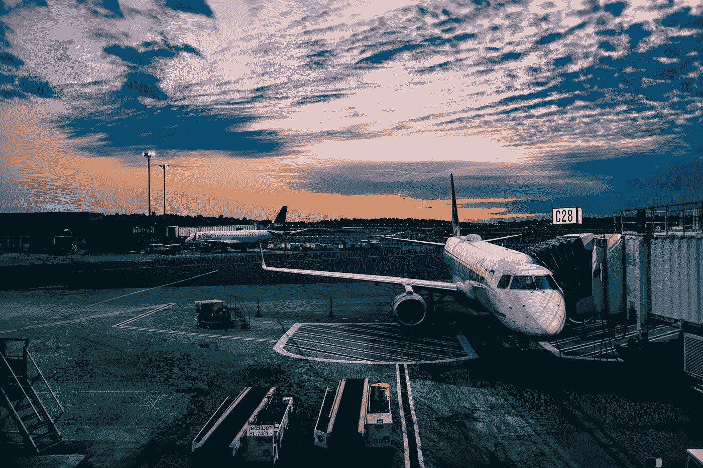
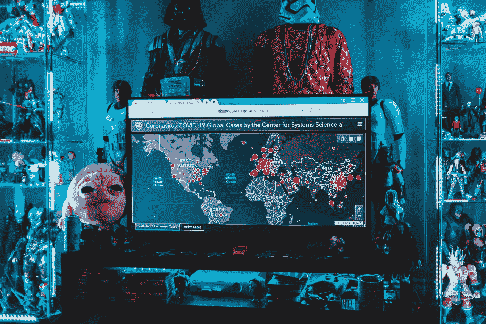

# 2021 年会是旅行回归正常的一年吗？

> 原文：<https://medium.datadriveninvestor.com/will-2021-be-the-year-that-travel-returns-to-normal-75c8a219e9f7?source=collection_archive---------23----------------------->

## 国际旅行并不顺利，但是节省了很多旅行费用，看起来效率更高

Photo by [Ashim D’Silva](https://unsplash.com/@randomlies?utm_source=unsplash&utm_medium=referral&utm_content=creditCopyText) on [Unsplash](https://unsplash.com/s/photos/travel-ban?utm_source=unsplash&utm_medium=referral&utm_content=creditCopyText)

去年10 月，一批来自世界各地的短期商学院培训班的四十余名企业高管如期抵达瑞士某商学院。他们的课程将持续四周。尽管环球旅行仍然困难重重，但这些国家的商业精英仍然如期而至。学校很快给他们做了新冠肺炎核酸检测，结果显示两名学生新冠肺炎病毒呈阳性。这些学生只能在酒店自我隔离，进行远程学习，然后才能回到校园，直到回国。

如果把所有的面授课程都改成网络课程，无论是互动性还是交流性都会大打折扣，但如果在非常时期继续获得面授机会，那将是一种近乎冒险的奢侈。

这也是很多服务行业面临的困境。国际旅行受阻的困境是因为疫情，但不会因为疫情消失而消失。据世界旅游和旅行协会统计，去年商务旅行占该行业 7.5 万亿欧元总收入的 21%。

> **“如果没有去年定下的这个培训机会，今年下半年可能就不会出国了。一位沙特阿拉伯企业高管描述了这一情况。**

他说，他过去常常与世界各地的同事见面和交流，并与学习小组一起工作。讨论商业案例很常见，但今年类似的机会感觉异常珍贵。不可否认，过去无论是论坛还是行业会议，最值得期待的饭局和课后聚会，现在都没有了。这种机会甚至现在的餐厅和商场都关门了，让旅行的意义少了很多。

**对于这些曾经将国际旅行视为生活重要组成部分的商业精英来说，今年是痛苦的一年。同时，他们也习惯了新常态的网上办公。他认为，即使疫情结束，该公司也不会立即回到过去那种满世界飞的状态，而是会更好地权衡健康、成本和必要性等多重因素。**

国际旅行并不顺利，但是节省了很多旅行费用，看起来效率更高。

例如，由于疫情，今年圣诞季欧洲许多玩具零售品牌的采购经理也停止了一年一度的中国采购玩具之旅。如果是按照惯例，一些大型玩具零售店的采购经理会去广州展销会或工厂实地看样品，挑选当年圣诞季最畅销的玩具品种。

Photo by [Victor He](https://unsplash.com/@victorhwn725?utm_source=medium&utm_medium=referral) on [Unsplash](https://unsplash.com?utm_source=medium&utm_medium=referral)

但去年各门店的圣诞采购会，几乎都是通过视频会议进行的，有时间差。在屏幕上选择和协商样品，然后通过发送样品进行选择。虽然远程采购总有一些不愉快的惊喜，但也解决了采购的问题，节省了不少差旅费。

这就好比之前网购巨头[亚马逊](http://amazon.com)宣布，今年他们停止了 110 万员工的宽容，一举节省了近 8.5 亿的差旅费。除了国内游，国内游也受到了很大影响。在过去的半年中，许多欧美跨国公司的差旅预算发生了巨大的变化，今年的差旅预算将只有疫情前水平的一半。

> 比尔·盖茨预测，商务旅行和办公室工作都不会回到疫情爆发前的水平

这位曾经的世界首富预言，疫情结束后，一半的国际商务旅行将不复存在，三分之一的办公时间将改为在家或偏远地区。现在，互联网巨头如[推特](http://twitter.com)和[脸书](http://facebook.com)已经声明他们的全球员工可能永久在家工作。作为“在家工作”的代价，员工可以用略少的工资搬出昂贵的硅谷。

**就连比尔盖茨的** [**微软的**](http://microsoft.com) **也计划采用混合办公和远程办公的方式。**

比尔·盖茨还提到了人与人之间见面机会突然减少的负面影响:在过去的一年里因为没有机会认识不同的人，他没有结交任何新朋友。

这也是很多商业机构所担心的:即使互联网可以解决大部分问题，但人与人之间仍然有很多互联网无论如何都无法替代的面对面接触。

正如一位朋友所说，一个成功的商务会议总会有茶歇和自由交流时间，以促进更有效的沟通，但在网络会议中基本很难做到这一点。仍然有许多商务会议在世界的不同角落举行。会议的化学反应、气氛、习俗，都是网上会议无法体会的。

Photo by [Erik Mclean](https://unsplash.com/@introspectivedsgn?utm_source=unsplash&utm_medium=referral&utm_content=creditCopyText) on [Unsplash](https://unsplash.com/s/photos/covid?utm_source=unsplash&utm_medium=referral&utm_content=creditCopyText)

> **“所以我们也看到东亚国家之间的跨区域航空公务舱客流开始恢复，但是经济舱客流增长没有那么快。”一家瑞士奢侈品集团的高管。**

在探索了如何通过电商卖出更多奢侈品，打通了销售渠道之后，我发现关键环节还是提货和用户体验。归根结底，就是要完成一个销售闭环，要有一个能和客户面对面沟通的人。

专业销售还是不可替代的。因此，他认为，疫情过后，公差必然会回归，但由于部分工作被远程取代，短时间内的公差绝不会像以前那样频繁。

## **归根结底**

大家还是希望国际旅行能重回正轨，不管是国际私人旅行还是商务旅行。目前的行业预期是，旅游业将比商务旅行更早复苏，因为商务旅行受更多条件的限制，无法回到正轨。

根据美国银行 2020 年 10 月底发布的分析报告，宽容可以带来 3340 亿美元的收入，但至少在 2023 年底或 2024 年之前，宽容旅行很难恢复到疫情前的水平。

*在美国，美国银行调查的 83%的公司预计将在 2021 年再次出差。*

达美航空首席执行官埃德·巴斯蒂安表示，达美航空的商务旅行收入下降了 85%。

> **他直言，“我不认为商务旅行会像人们预期的那样迅速复苏。只是不知道一切是否还在继续。会回到过去。”**

**联合航空公司首席执行官 Scott Kirby** 预计商务旅行不会在 2024 年前恢复到疫情爆发前的水平。

**西南航空首席执行官加里·凯利(Gary c . Kelly)**也预测整体收入将下降 70%，占游客总数三分之一的商务旅行收入预计将下降 90%。

与 **Ed Bastian** 不同的是，虽然凯利认为民航业将超过危机前的水平，但他不确定这将在何时发生。

不管每个公司的商业策略如何，国家间边界的自由化将是恢复国际旅行的先决条件。

**澳大利亚澳航首席执行官艾伦·乔伊斯的**提议引起轩然大波。为了促进国际旅行尽快回到过去，Joyce 认为，新的新冠肺炎疫苗可以被设定为国际旅行的必要条件。澳大利亚在疫情初期就关闭了边境，要求从海外回国的人接受隔离，甚至在国内也要隔离。

由于这场流行病，该公司报告每年损失约 14.6 亿美元。像德国汉莎航空公司、英国航空公司和法国航空公司一样，国际航空公司急切地期待在此时恢复正常的国际旅行。如果所有航空公司都能同意所有游客登机前都要出示疫苗接种证明，或许各国的国际边界也能尽快放开。

**但是一个大问题是各国如何就疫苗接种达成共识？**

澳大利亚可能会采取强制接种措施，但这只是国家政策。欧洲和美国的许多国家仍然无法决定如何强制居民接种疫苗。因此，如何保证足够多的人接种疫苗将成为全球旅行的惯例。这是一个难以克服的问题。

不管疫苗接种或核酸检测是不是登机的必要条件，未来的国际旅行在很长一段时间内都会比过去复杂，甚至会让人紧张。同时，在未来，它将适应未来网络和物理办公室的紧密结合。

*与国际航空一起改变的将是从餐饮到住宿、会展的整个产业链。*