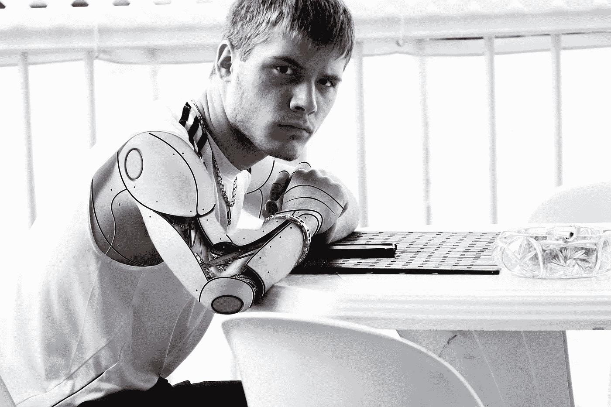
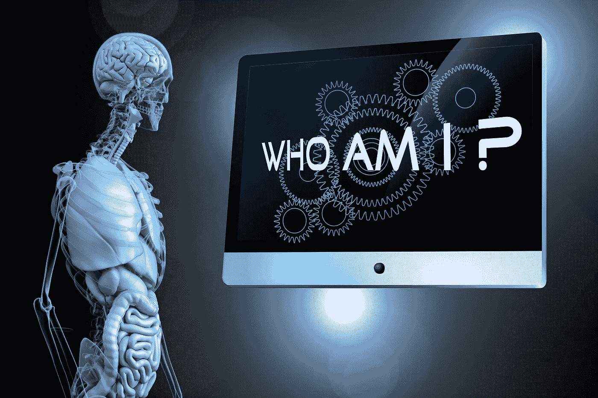

# AI 会抢你的饭碗吗？

> 原文：<https://medium.datadriveninvestor.com/will-ai-take-your-job-b28c8c458633?source=collection_archive---------27----------------------->

## 有些工作只有人类有能力去做

Image by [rony michaud](https://pixabay.com/users/ronymichaud-647623/?utm_source=link-attribution&utm_medium=referral&utm_campaign=image&utm_content=629046) from [Pixabay](https://pixabay.com/?utm_source=link-attribution&utm_medium=referral&utm_campaign=image&utm_content=629046)

在近年来，随着人工智能技术的发展，纯电动无人车的发布不断出现在我们的视野中。很多人担心，一旦人工智能技术改变配送和出行行业为常态，会不会造成现有劳动力失业？

事实上，这种担忧并不新鲜。在 2016 年 [**AlphaGO**](https://deepmind.com/research/case-studies/alphago-the-story-so-far) 击败人类顶尖棋手之后，对机器取代人类的恐惧达到了顶峰。

牛津大学的一份研究报告，预测了 2033 年人工智能的替代率:**电话销售人员 99%** 、保险代理人 **99%** 、体育裁判 **98%** 。

收银员 **97%** 厨师 **96%** 服务员 **94%** 律师 **94%** 导游 **91%** 面包师 **89%** 公交车司机 **89%** 建筑工人 **88%** 兽医 **86%** 保安**80**

> **所有行业的总体替代率为 47%**

这些岗位有一个共同的特点:标准化程度高，规则性强，体力劳动居多。

 [## 孤儿如何在世界各地注射天花疫苗

### 你可能不知道世界上第一次全球疫苗接种运动发生在两百年前，疫苗在…

medium.com](https://medium.com/datadriveninvestor/how-orphans-took-the-smallpox-vaccine-around-the-world-dfb47159b49) 

**其实，**这些岗位由机器来完成并不一定是坏事。2020 年 [**《外卖骑手被困在体制内》**](https://www.rayradar.com/2020/09/09/takeaway-riders-are-trapped-in-the-system-amazon-expresss-mobile-phone-is-tied-to-a-tree/#:~:text=On%20September%208%2C%20people%20magazine,exploded%20the%20circle%20of%20friends.&text=In%20September%202018%2C%20Guangzhou%20traffic,which%20were%20meituan%2C%20ranking%20second.) 一文引起了人们对资本利用算法压榨劳动者的担忧。

**在目前的算法背景下，**外卖骑手与死神赛跑，与交警比赛，与红灯交友。如果机器人代替送餐员送餐，用大数据计算红灯和机车的路线，**这种困境能否在理想状态下解决？**技术发展的目标不就是把人类从低级重复劳动中解放出来，让人类释放创造力，实现个人和社会价值的提升吗？

繁重的工作由机器完成，人类享受科技发展的成果。这是每个人都向往的理想社会。

**有人可能会问，如果工作被机器人抢了，送货员和司机怎么办？**

在互联网送餐平台和出行平台出现之前，中国的送餐员和共享汽车司机远比现在少。他们可能是其他行业的从业者。

因为新技术、新平台的出现，他们被优厚的待遇所吸引，从落后变得落后。中国的小城市已经走出来，成为大城市建设中的一员。

他们对这个行业不忠诚。一旦有更高收入的工作机会出现，转行是很自然的选择。如果人工智能技术完全改变未来人类社会的经济形态，未来的职业将更加注重劳动力的软技能，如领导力、人际交往能力、逻辑思维、主动学习、创造力等。

人类的每一次重大进步都会淘汰一部分人，我们不能因为害怕失业而拒绝前进。

Image by [Gerd Altmann](https://pixabay.com/users/geralt-9301/?utm_source=link-attribution&utm_medium=referral&utm_campaign=image&utm_content=2326348) from [Pixabay](https://pixabay.com/?utm_source=link-attribution&utm_medium=referral&utm_campaign=image&utm_content=2326348)

> 此外，人工智能也有其局限性

它不能从事需要大量经验和创造力的职业，如医生、设计师和画家。人工智能的本质是用过去的大量历史数据来近似人类的经验。它的优势在于能够存储大量数据，并使用优化的算法快速计算。

 [## 爆炸之后:布拉沃城堡的幸存者

### 从第二次世界大战结束时的两次巨响，到福岛核电站事故，这是疯狂的…

medium.com](https://medium.com/datadriveninvestor/after-the-bomb-survivors-of-castle-bravo-159f6f5cd579) 

**然而，与人脑相比，** **人工智能一点也不智能**

人工智能无法对其他事物举一反三，无法突破自身的数据和算法框架。所以现在的人工智能只能算是弱人工智能，是指专注于并且只能解决特定领域问题的人工智能，没有自我意识；而与之对应的强人工智能是指能做所有人类任务的人工智能。

**有一种自主感**

许多科学家不相信人类能够制造出自主机器人。虽然科技公司一直在宣传机器人的作用，但我们仍然处于弱人工智能时代，应用场景有很强的局限性。

**比如**机器人送快递仅限于特定区域或者高度数字化的城市，道路平坦，区域有限，路线固定。而中国幅员辽阔，地形复杂，即使未来机器人送货可以全面推进，也只能从数字化程度高的城市开始，慢慢下沉到三四线城市，这可能需要相当长的时间和相当大的硬件成本。

# 最后

纯电动无人车已经上市，但是目前的自动驾驶效果确实差强人意。一般自动等级达到第三**等级 L3，** **这意味着无人车仍然需要驾驶员驾驶，**自动驾驶系统只能用于辅助驾驶功能。

无人车完全实现民用，完全取代司机这个职业，为时尚早。

在可预见的未来，机器不可能完全取代人类的工作。

我们更愿意相信机器和人类协作完成复杂的任务。劳动可以彰显人的价值，激发人的创造力，增强人的学习能力。

*即使在生产力很高的社会，也不可能完全依靠机器进行劳动。*