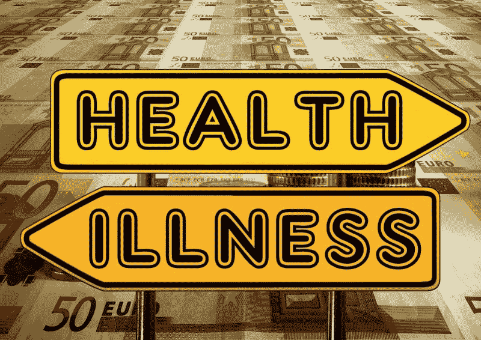
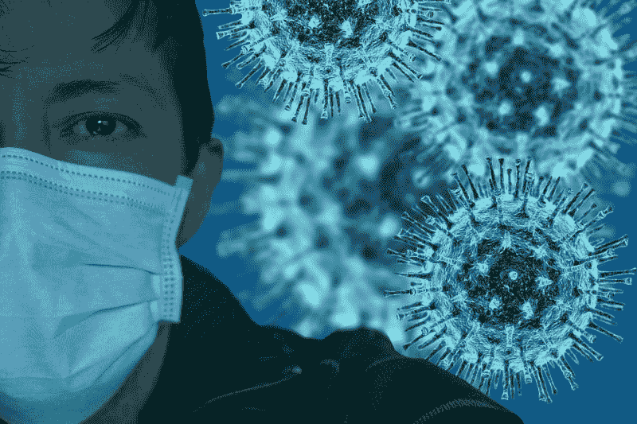
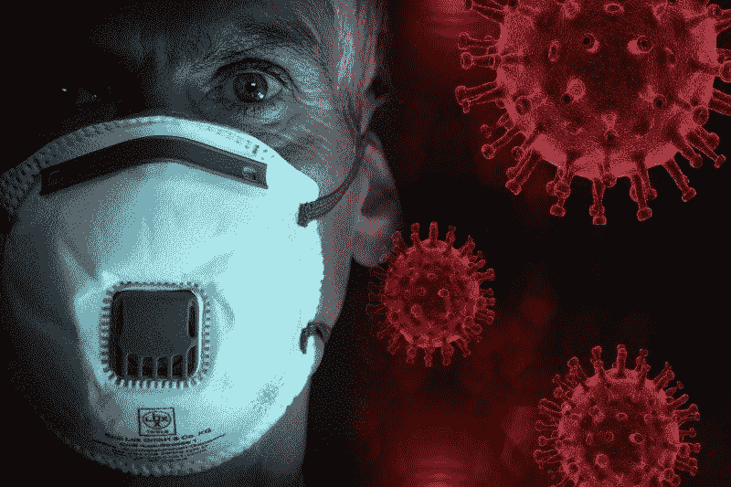

# 美国的医疗保险体系会崩溃吗？—市场疯人院

> 原文：<https://medium.datadriveninvestor.com/will-americas-health-insurance-system-collapse-market-mad-house-6df3aa442c8f?source=collection_archive---------5----------------------->

冠状病毒可能导致美国医疗保险公司的崩溃，并使数千万人无法支付医疗费用。

例如，一家健康保险公司 **UnitedHealth Group Inc .(纽约证券交易所:UNH)** 在 2018 年服务了 5000 万人，扣除漫谈。此外，联合健康集团在 2018 年为 620 万人提供了医疗福利。此外，UnitedHealth 在 2018 年运营了 55 家医院和 275 家诊所和门诊中心。

我想知道如果联合健康公司资金耗尽或倒闭，那些人会怎么样？让我担心的不仅仅是联合健康保险公司，**Cigna Corp(NYSE:CI)**17 个州的医疗保险优势计划和华盛顿州 DC 以及 50 个州的医疗保险处方药计划。

如果 Cigna 倒闭，数百万美国人可能会失去获得处方药的机会，以及支付救命医疗费用的能力。因此，如果健康保险公司倒闭，人们可能会丧命。

# 健康保险公司大到不能倒吗？

乐观主义者会说医疗保险公司太大、太强大而不能倒闭。值得注意的是，**联合健康(纽约证券交易所代码:UNH)** 在 2020 年 3 月 31 日报告的季度总利润为 157.35 亿美元，季度收入为 644.21 亿美元。

然而，看跌者会说，我们以前听过这种说法。请记住，大到不能倒的巨型银行在 2007 年和 2008 年都倒闭了。

银行倒闭是因为一场灾难；抵押贷款危机。打他们。现在，联合健康等健康保险公司可能面临冠状病毒形式的类似噩梦。

2020 年 4 月 23 日，Worldometers 冠状病毒感染了 848，717 名美国人。此外，截至 2020 年 4 月 23 日，Worldometers 冠状病毒已导致 47，659 名美国人死亡。

# 冠状病毒如何让健康保险公司破产

由于住院费用高昂，冠状病毒可能会使医疗保险公司破产。

*纽约时报【2020 年 4 月 9 日，医生在纽约收治了 18279 名冠状病毒患者。与此同时，Debt.org 的平均住院费用为每天 3949 美元，总住院费用为 15734 美元。利用 Debt.org 的数据，我估计让 18，279 名纽约冠状病毒患者住院可能需要 2.78 亿美元。因此，我认为，如果我们在全国范围内爆发类似的冠状病毒，保险公司可能会没钱。*

令人震惊的是，联邦政府将为未参保者支付冠状病毒治疗费用，但不会为参保者支付。因此，健康保险公司面临着破产或不支付冠状病毒费用的选择。

# 冠状病毒可能使数百万美国人破产

令人不安的是，私人健康保险公司并没有承诺支付冠状病毒的治疗费用。然而，保险公司将免除冠状病毒检测费用。

因此，由于冠状病毒，数十万或数百万美国人可能面临巨额的医院账单。此外，如果医疗保险公司拒绝支付冠状病毒费用，数十家医院可能面临破产。

因为冠状病毒攻击整个身体，我们可能要支付很长一段时间的高额健康保险费。例如，中国医生发现新冠肺炎会损害肺、心脏、肾脏和其他器官。除此之外，医生推测导致新冠肺炎的新型冠状病毒病毒可能因为恐惧而潜伏在体内，并导致未来的医疗问题。

因此，未来几十年，数百万美国人可能需要昂贵的医疗服务。令人不安的是，2020 年 4 月 23 日，848，717 名美国人感染了冠状病毒。

因此，我认为医疗保险公司将不得不在某个时候限制冠状病毒的覆盖范围。然而，大多数冠状病毒受害者将没有钱支付他们所需的治疗费用。

# 冠状病毒将导致全民医保

因此，我认为联邦政府将不得不支付所有冠状病毒的账单。因此，我相信冠状病毒会迫使国会扩大医疗保险以覆盖所有美国人。

然而，许多国会共和党人和民主党人出于许多原因反对全民医保。另一方面，公众对医疗保险费用的愤怒改变了许多国会的想法。

全民医保终将到来，因为我看不出如果冠状病毒让数百万人破产，美国经济将如何运转。而且那些破产的人大部分都可以投票，他们会把气出在政客身上。

# 全民医保如何加速冠状病毒的复苏

幸运的是，我有办法使用全民医疗保险来防止高额冠状病毒费用摧毁经济。

国会可以颁布由民主党总统候选人乔·拜登(特拉华州民主党人)推动的[公共选择](https://joebiden.com/healthcare/)。在[公共选择](https://www.vox.com/2019/7/16/20694598/joe-biden-health-care-plan-public-option)下，政府提供了一个纳税人出资的健康计划，所有公民都可以购买。

例如，国会可以让所有美国人不分年龄，每月支付 100 美元的保费，就有资格享受医疗保险。这些，可以有保险来支付任何冠状病毒的医疗费用。

例如，国会可以让所有美国人不分年龄，每月支付 100 美元的保费，就有资格享受医疗保险。这些，可以有保险来支付任何冠状病毒的医疗费用。

# 联合健康保险公司如何从公共选择中获利

例如，UnitedHealth 可以创造一种混合产品，将医疗保险和附加保险结合起来。具体来说，UnitedHealth 可以提供一个涵盖所有药费和医疗保险的计划。

值得注意的是，UnitedHealth 已经提供了[医疗保险优势](https://www.uhccommunityplan.com/learn-about-medicare/medicare-part-d)计划。在 Medicare Advantage 计划中，UnitedHealth 和 Medicare 都支付医疗费用。具体而言，Medicare Advantage 计划包括 Medicare A 部分(医院保险)、Medicare B 部分(医疗保险)和 Medicare D 部分(处方药计划)。

因此，如果国会实施公共选择，联合医疗保险公司可以从中获利。我怀疑国会实施公共选择只是时间问题。

# 为什么我们需要健康保险的公共选择

美国需要一个公共选择作为私人健康保险系统的备份。解释一下，如果私人健康保险公司倒闭或大量裁员，美国人可以转向公共选择。

因此，公共选择类似于联邦存款保险公司(FDIC)的存款保险。澄清一下，联邦存款保险公司大多数银行账户和一些投资账户的金额高达 25 万美元。

我们可以改革医疗保险制度，覆盖通常由医疗保险制度覆盖的所有医疗保险费用。因此，如果私人健康保险不能支付，医疗保险可以发挥作用。例如，如果你去了急诊室，而你的保险没有支付，医疗保险可以。

此外，他们可以修改公共选项，为未参保者提供免费医疗保险，而不是医疗补助。因此，各州可以省钱，因为联邦政府管理医疗保险，而各州管理医疗补助。

此外，我们可以让医疗保健提供者能够为没有保险的人所产生的医疗费用开出医疗保险账单。为了解释，医疗保险可以联系未投保的人，让他们选择支付医疗费用或注册医疗保险。

# 联合健康是一项好的投资吗？

**联合健康(NYSE: UNI)** 在冠状病毒之前就赚钱了。例如，截至 2020 年 3 月 31 日，联合健康公司报告季度营业收入为 49.96 亿美元，季度共同净收入为 33.82 亿美元。

令人印象深刻的是，UnitedHealth 报告截至 2020 年 3 月 31 日的季度期末现金流为 215.69 亿美元，融资现金流为 93.03 亿美元，运营现金流为 29.43 亿美元。因此，联合健康是一家现金充裕的公司。

截至 2020 年 3 月 31 日，联合健康集团拥有 244.45 亿美元的现金和短期投资。除此之外，UnitedHealth 同日公布的总资产为 1890.67 亿美元，总负债为 1292.04 亿美元。

吸引人的是**联合健康集团(NYSE: UNI)** 的股票在 2020 年 3 月 13 日支付了 1.08 美元的季度股息。总体而言，Dividend.com 联合健康公司实现了 10 年的股息增长，股息收益率为 1.58%，年化派息为 4.32 美元，派息率为 26.6%。

因此，在新冠肺炎疫情爆发前，联合健康是一项不错的投资。然而，我认为缺乏一个支持私人健康保险计划的公共选择给了联合健康一个低的安全边际。因此，我认为市场先生在 2020 年 4 月 23 日高估了联合健康公司的股价至 285.33 美元。

*原载于 2020 年 4 月 23 日 https://marketmadhouse.com***。**