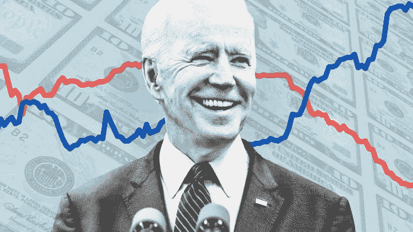
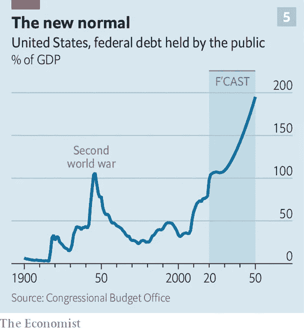
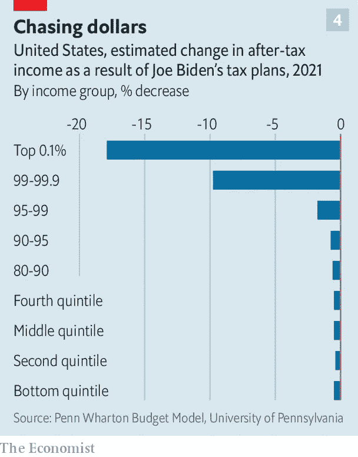
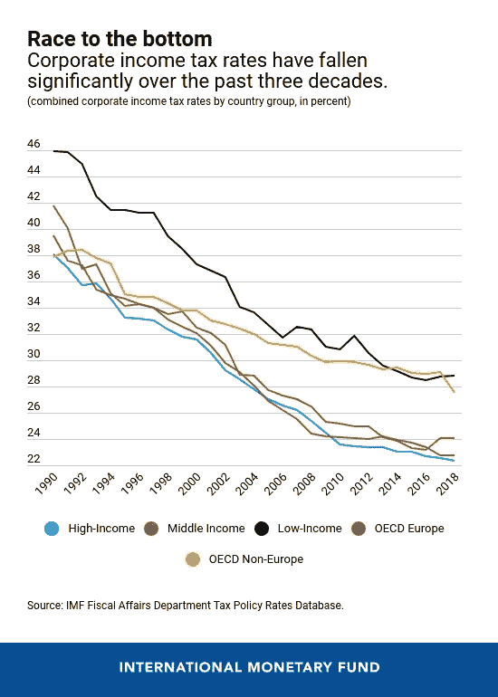

# 拜登会让美国再次伟大吗？算是吧。

> 原文：<https://medium.datadriveninvestor.com/will-biden-make-america-great-again-kind-of-705ca939b834?source=collection_archive---------34----------------------->

## 看看当选总统的美国经济计划

Image Credit: Financial Times/Getty Images

当乔·拜登在 1 月 20 日就职时，他将继承美国历史上可能最严重的经济状况。带领国家走出冠状病毒引发的衰退将是一项前所未有的任务。他还将负责解决美国潜在的经济问题，如气候变化、医疗保健、学生债务和不平等。

他任命珍妮特·耶伦为财政部长。她在政界和华尔街广受欢迎，作为学术经济学家和美联储主席，她有着丰富的经验。与拜登政府的整体一致，我们可以期待她是一个实用主义者，而不是激进分子。

拜登曾领导美国从 2008 年金融危机中复苏，因此他熟悉经济风险。作为 2009 年美国复苏和再投资法案的一部分，这位前副总统监督了 8000 亿美元刺激计划的支出情况和支出方式。因此，他可能也准备好领导经济从冠状病毒中复苏。下面是我试图概述和评价他的经济战略。

# 财政政策

拜登提议将年度公共支出增加 GDP 的 3%。这远没有伯尼·桑德斯和伊丽莎白·沃伦建议的那么激进。他们将分别增加 23%和 16%的年度公共支出。

此外，拜登作为愿意谈判而不是空想家的中间派的本性将意味着政府支出的实际增长甚至会比他所提议的更少，特别是如果共和党通过在佐治亚州的决选中获胜来保持对参议院的控制。因此，他的支出建议是现实的，不太可能在政治或经济上动摇国家。

他真正想把钱花在哪里很重要。拜登最大的支出提案类别是基础设施，10 年内支出 2.39 万亿美元。学校现代化，修复破旧的道路、桥梁和铁路，改善农村宽带接入都在日程上。其中很多都有“绿色”元素:比如，投资公共交通，提高电力行业的能效。

我完全支持这一切。基础设施投资严重不足，而基础设施对长期经济增长至关重要。研究表明，它对生产率的解释力最大。但拜登将要求 40%的支出必须惠及弱势群体，并且必须给予国内供应商优惠待遇。虽然这种组合将在政治上帮助这位前副总统，但它可能不是最有效的经济手段。

这一气候友好型基础设施支出将被纳入一项更广泛的 2 至 3 万亿美元的冠状病毒刺激法案，该法案还将包括进一步的失业福利，对州和地方政府的现金支持，以及对小企业的经济支持。尽管随着新冠肺炎疫苗的推广，美国经济将恢复正常，但这些仍然是必需品。

也有条款保证美国作为世界创新中心的地位。在过去 60 年左右的时间里，R&D 的政府投资从占 GDP 的 1.5%下降到了 0.7%。拜登计划通过向 5G 研究投资数百亿美元和向可再生技术投资 4000 亿美元来扭转这一趋势。再加上他修复美国摇摇欲坠的传统基础设施的计划，这可能会改善美国的长期增长前景。

Image Credit: The Economist

考虑到乔·拜登计划通过借贷支付大部分支出，他对赤字的冷漠令人担忧。拜登没有稳定国家债务的规定，如果不加以控制，到 2050 年，债务将翻一番，达到 GDP 的 200%。如果(或当)利率上升，这可能会损害生活水平，因为偿债变得过于繁重。

虽然不清楚债务应该增长到什么程度，但肯定有必要对此感到担忧。高水平的政府债务会降低经济抵御冲击(如冠状病毒)的能力。世界银行声称，债务与 GDP 比率每增加 77%,年 GDP 增长率就会比正常情况下低 0.017 个百分点。虽然这看起来微不足道，但在债务与 GDP 比率为 200%的情况下，这相当于年 GDP 增长率降低了 2 个百分点。这可能会让美国陷入停滞，几十年后，相当于大量累积经济产出的损失。

# 税收和收入

不过，至少拜登的部分支出将来自增税。宾夕法尼亚大学沃顿商学院(Wharton School at the University of Pennsylvania)预测，拜登的税收政策将降低所有美国人的税后收入——对收入最低的 90%的人来说，降幅非常小(通过间接减税)，但对收入最高的 10%的人来说，降幅更大。

由于边际税率提高，收入最高的 1%和 0.1%的人的收入将分别下降 10%和 18%，他们为资本利得支付的税收将与他们为收入支付的税收相似。所有这些都将控制美国日益加剧的不平等。虽然这对美国富人来说似乎是毁灭性的，但它真正能做的只是将他们支付的税收水平降至大多数西方国家的平均水平。这将是一项长期需要的改革。

Image Credit: The Economist

拜登计划的另一个组成部分是 15 美元的联邦最低工资。一段时间以来，一直有人呼吁这样做，主要是比拜登更左倾的人。最低工资目前是每小时 7.25 美元，也许在联邦一级应该略高一些。这可以减少不平等，提高社会最贫困人口的生活水平。然而，对美国大部分地区来说，涨到 15 美元是不明智的。诚然，最低工资的提高并没有像自由市场论者所宣称的那样导致显著的失业。然而，在大规模失业时期，将最低工资提高一倍以上是不明智的。例如，在农村地区，这样的工资率既不可行也没有必要。

每小时 15 美元的强制工资率在一些地方肯定是有意义的:加利福尼亚、纽约、华盛顿和马萨诸塞州只是通过立法将其就业市场过渡到最低工资 15 美元的州中的一部分。因此，虽然我并不明确反对提高最低工资，即使是提高到这个水平，但这样做的决定应该由各州做出，而不是由联邦政府做出。

# 对企业的影响

拜登希望取消特朗普的企业减税政策，并努力填补税收制度的漏洞。后者尤其需要，尽管这无论如何都不是一项容易的任务。然而，我更怀疑前者的功效。

如果拜登兑现将公司税从 21%提高到 28%的承诺，公司利润将下降 12%左右。公司利润下降的前景将削弱股票市场，从而降低人们投资和退休基金的价值。由于传统储蓄工具的回报微不足道，这将伤害拜登声称希望帮助的中产阶级。

虽然 28%的税率不像奥巴马的公司税率那样严重，但考虑到经合组织的公司税率刚刚超过 20%，这仍然是相当高的。然而，由于上述漏洞，有效的公司税率将更接近经合组织的水平，但这对中小企业来说毫无意义，因为它们没有必要的资金来利用这些漏洞。保持特朗普 21%的税率符合他们的利益，特别是在危险的商业环境下。

Image Credit: International Monetary Fund

一些人会争辩说，由于特朗普的减税并没有带来他们承诺的投资增加，拜登的更高公司利润税率没有问题。然而，我建议最好的解决办法是对中小型企业征收 21%的税率，对大公司征收同样的税率，条件是它们将一定数额的利润进行再投资。如果做不到这一点，将导致 28%的较高比率。

虽然我认为拜登的商业税政策有点过于繁重，但他在其他方面对企业过于友好。他似乎会在任期内继续拖着美国过时的反垄断机制。这将延续产业日益集中、竞争逐渐减弱的趋势。

正如沃伦提议的那样，拜登特别不愿意探索拆分大型科技公司的复杂性(值得一提的是，拜登的竞选搭档卡玛拉·哈里斯在担任加州司法部长时，对硅谷并不特别苛刻)。拜登需要改革美国陈旧的反垄断机构，以保护消费者并保持高水平的创新和效率。

# 健康和教育

尽管拜登的基础设施计划很有希望，但我不指望他能解决美国医疗和教育的系统性问题。几十年来，美国的医疗支出和学生债务一直在上升，即使在拜登担任总统期间，也没有停止的迹象。

美国每年人均花费近 12，000 美元用于医疗保健，对于许多人来说，医疗保健费用根本无法承受。乔·拜登将会有所帮助——他主要寻求通过为更多的人提供公共医疗保险，并将医疗保险的资格年龄从 65 岁降低到 60 岁来美化奥巴马的平价医疗法案。然而，像奥巴马医改一样，这可能会提高其他所有人的价格。他的计划也没有解决美国医疗市场的系统性和结构性问题——高成本和低效率。

拜登似乎也在给教育领域的一条断腿上绷带。美国学生的累积债务为 1.64 万亿美元，比大多数国家的 GDP 总和还要多。拜登提议取消每人 1 万美元的债务，对年收入低于 12.5 万美元的人完全免除学费相关的债务，只要他们上过公立大学或哈佛商学院。

这一救助计划将受到该国年轻人的欢迎，但同样，它未能纠正高等教育中的普遍问题——浪费和不合理的高成本，而投资回报却很少。政府买单并不能解决问题。

教育部门的先天问题更少，因此拜登的政策，尽管看起来像他对高等教育系统的修正一样肤浅，但在这里会很有帮助。他希望提供更多的联邦 K-12 资金，并增加教师的工资。这将由他的早期儿童提案来补充:免费学前教育和儿童保育税收抵免。这符合他为中产阶级提供社会流动性的愿望，从长期来看，这将提高美国的人力资本，同时在短期内让父母为经济做出贡献。

# 气候变化

Photo by [Alev Takil](https://unsplash.com/@alevtakil?utm_source=medium&utm_medium=referral) on [Unsplash](https://unsplash.com/?utm_source=medium&utm_medium=referral)

虽然拜登声称他将放弃化石燃料补贴(这是一个长期需要的举措)，但他更担心使用碳税。尽管他的加强监管、重新加入巴黎气候协议以及投资绿色技术和基础设施的环境政策会有所帮助，但碳税将是一个更有效、更优雅的解决方案(正如我在这里讨论的)。

同样令人担忧的是，他似乎没有想到核能是可再生能源的垫脚石。无论如何，应对气候变化是拜登先生的坚定议程，这是即将离任的总统所不能说的。

当选总统就职后，他将致力于到 2035 年使电力部门碳中和，到 2050 年使整个经济碳中和。他计划主要通过恢复奥巴马时代的煤炭立法，为采用绿色选项提供税收抵免，禁止新的石油钻探许可，以及确保贸易和基础设施计划始终有环境因素与之相关。这些都是令人满意的政策。

批评者会说拜登的计划没有野心——我可能是其中之一。然而，必须承认，这些政策是现实中能够在国会获得通过的最佳气候计划。

# 贸易和移民

拜登和特朗普在许多问题上存在分歧，但在贸易问题上他们有共同点。拜登支持跨太平洋伙伴关系(Trans-Pacific Partnership)和美国管理认证协会，乍看之下，他似乎比川普更支持自由贸易。但更仔细的研究表明，他将坚持特朗普的许多关税，并在更大程度上坚持他的“对中国强硬”立场:他将坚持对华为的禁令，并继续保持美国对与中国的技术贸易的警惕。

拜登的计划中还有其他保护主义因素，这些因素将提高政府和消费者的成本以及低效率水平，尽管它们可能有助于维持和发展美国工业:

*   迫使供应链变得更加本土化
*   “购买美国货”政府采购计划
*   坚持只有美国的钢铁可以用于运输/基础设施项目。
*   坚持只有美国船只可以用于国内港对港贸易

我更支持前副总统的移民政策。[作为移民](https://medium.com/discourse/stronger-borders-dont-mean-stronger-economies-57baa55389f0)的支持者，我欢迎他结束边境家庭分离、增加年度难民接纳、为无证移民提供获得公民身份的途径的意图。对美国经济前景更为关键的是，他将增加技术工人的签证数量，这将确保美国继续拥有世界上最优秀的人才。

# 裁决

冠状病毒引发的经济衰退摧毁了 GDP 的 8%,在此之后重建经济绝非易事。很少有人能够完美地管理复苏的复杂性，同时改革美国的系统性经济缺陷。

我对拜登更积极的基础设施和气候政策的计划尤其充满希望。但正如政治中的一贯情况，拜登可能会失去投票给他的人的支持，因为他需要在自己的立场上做出妥协。由于实际的政治限制，他也可能只执行他的几个主要想法。

我并不完全赞同他的所有经济政策，他也不太可能改变大多数美国人的生活体验。但我承认，乔·拜登领导下的美国将朝着正确的方向迈出一步。他只会让美国再次变得伟大。

**进入专家视角—** [**订阅 DDI 英特尔**](https://datadriveninvestor.com/ddi-intel)