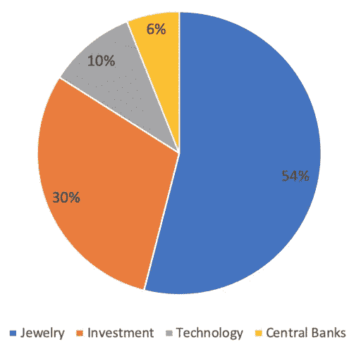

# 比特币是新的黄金吗？

> 原文：<https://medium.datadriveninvestor.com/will-bitcoin-steal-golds-thunder-751cef4e0bf8?source=collection_archive---------18----------------------->

## 比特币与黄金:利弊

如果你错过了，华尔街最热门的辩论是比特币作为通胀对冲工具是否会与黄金竞争。

摩根大通分析师[最近强调数据](https://news.bitcoin.com/jpmorgan-gold-etfs-bitcoin/)表明投资者开始抛弃黄金转而投资比特币。

我们现在看到了一些有趣的东西。

**比特币正在吞噬世界，它是目前最主要的资产。**

因此，让我们首先评估比特币与黄金之争最重要的利弊，从比特币作为“数字黄金”的**优势开始。**

# **优点**

## 容易出售

因为比特币完全是数字的，它可以很容易地转移给另一个用户，并以美元或欧元的价值出售。你可以使用二维码亲自发送你的比特币，也可以使用将你与买家数字化连接的交换服务。正如贝莱德首席投资官里克·里德(Rick Rieder)在最近的一次采访中告诉美国消费者新闻与商业频道，交易比特币“比传递一根金条要实用得多。”

## 有利的人口统计

世界已经变了。你我身处地球上不同的地方，却能瞬间读懂这篇文章。几个世纪以来，黄金曾经是替代金融体系的唯一答案。但是我们现在生活在数字时代。年轻一代是数字原生代。他们希望存储、交易和使用数字商品和资产。**比特币是千禧一代的新避风港。**

## 可证明的稀缺性

稀缺性是问题的一大部分。虽然黄金在理论上是稀缺的，但比特币是可证明的稀缺。人们普遍认为黄金供应很少。美国地质调查局估计大约有 57，000 吨黄金有待开采。但他们的估计只考虑了已探明储量。可能或尚未发现的储量是未知的。

但是，在比特币中，你可以证明确切的供应量。永远只会有**2100 万** **比特币。目前**每天只生产 **900 枚比特币。你可以在真实的区块链上验证它，这是不可改变的。比特币的稀缺性是程序化的、透明的、可证明的。毫无疑问，**比特币的稀缺性优于黄金。****

# 骗局

## 五千年的历史

有利于黄金的主要因素是它有 5000 年的历史。一些黄金支持者认为，比特币甚至不应该与黄金存在于同一个句子中。数百年来，黄金一直主导着避险资产领域。比特币只有十几年的历史。**不管是好是坏，黄金可能还会存在很多代。**

 [## 完美的加密交易策略|数据驱动的投资者

### 如果你在交易游戏中已经有一段时间了，你可能听说过“支点”和“VWAP”前者听起来像…

www.datadriveninvestor.com](https://www.datadriveninvestor.com/2020/08/31/the-perfect-crypto-trading-strategy/) 

## 实际用途

黄金有两大特点。它是一种**避险投资，也是一种奢侈品**。50%的黄金需求来自于**首饰。**此外，它还用于许多其他应用，如**牙科** **和** **电子**。黄金是贵金属之王，它有明确的用途和需求，即使不是避险投资。

## 稳定性和耐用性

黄金是 11 万亿美元的资产，而比特币的市值约为 4200 亿美元。与比特币相比，它的波动性更小，也更容易被全球投资者接受。黄金有许多稳定资产的属性。即使在政府试图取缔黄金期间，黄金的价值仍然很高。同样，黄金是一种惰性金属，永不腐蚀，历久弥新。黄金有潜力在下一次世界末日中幸存下来。

总之，比特币和黄金都为过度印钞的问题提供了解决方案。

他们都在不同的时间为不同的人工作，他们相辅相成。

由于比特币目前正在抢走黄金的风头，**它足够聪明，可以同时拥有两者。**

如果你喜欢这篇文章，请在左下角“鼓掌”50 次，这样会有更多人分享。你可以随时关注我的[*Twitter*](https://twitter.com/RasVasilisin)*和*[*LinkedIn*](https://www.linkedin.com/in/rastislav-ras-vasilisin-11bb5819/)*，别忘了订阅我们发给全球 15，000 多名投资者的*[*Virtuse News*](https://www.virtuse.com/)*。*

## 访问专家视图— [订阅 DDI 英特尔](https://datadriveninvestor.com/ddi-intel)