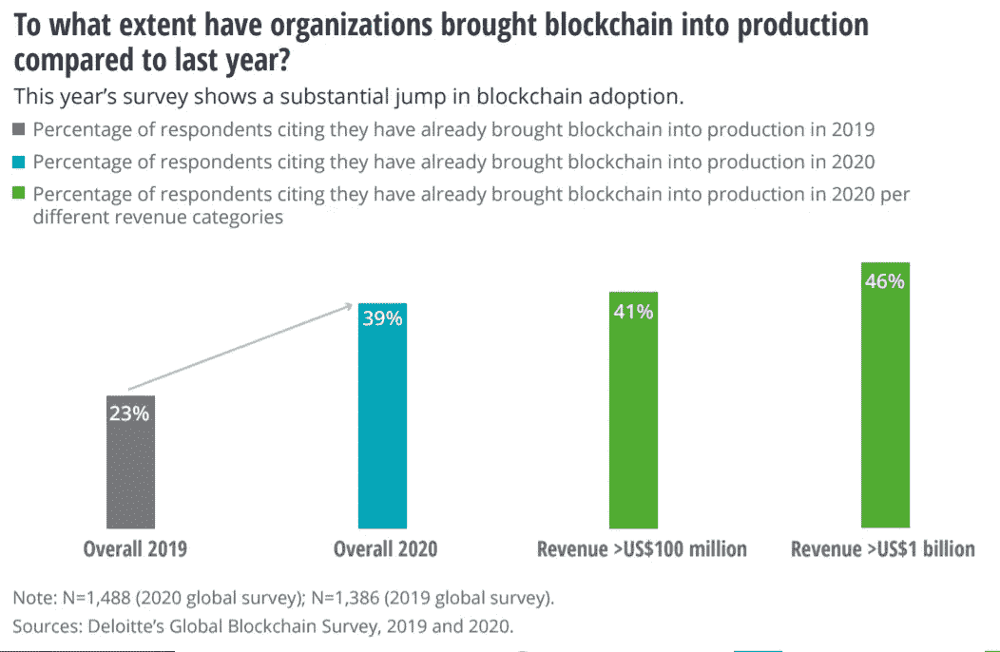
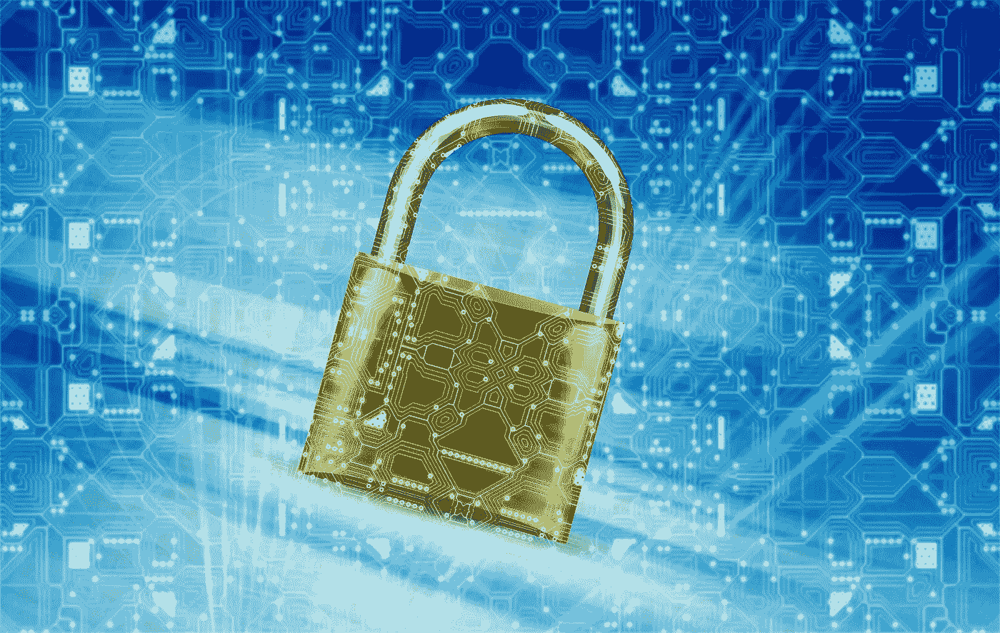

# 区块链技术会带来信任革命吗？

> 原文：<https://medium.datadriveninvestor.com/will-blockchain-technology-revolutionize-trust-25e53816450d?source=collection_archive---------16----------------------->

## **复杂协同信息系统的区块链治理**

Blockchain Technology Complex Information Systems Voting Image by [Tumisu](https://pixabay.com/users/tumisu-148124/?utm_source=link-attribution&utm_medium=referral&utm_campaign=image&utm_content=4745282) from [Pixabay](https://pixabay.com/?utm_source=link-attribution&utm_medium=referral&utm_campaign=image&utm_content=4745282)

在过去的几年里，我们已经看到区块链技术的主流观点从一种时尚和仅用于加密货币到跨行业的革命性和改变游戏规则。

[德勤 2018 年区块链调查](https://www2.deloitte.com/content/dam/Deloitte/cz/Documents/financial-services/cz-2018-deloitte-global-blockchain-survey.pdf)发现，区块链科技是许多公司的优先投资，95%的受访者计划在不久的将来投资 1000 万美元或更多。全球商业领袖关注这一点的原因是，智能合同显示了改善跨许多行业的复杂协作信息系统的治理的能力。

根据[德勤(Deloitte)2019 年的调查](https://www2.deloitte.com/content/dam/Deloitte/se/Documents/risk/DI_2019-global-blockchain-survey.pdf)，53%接受调查的全球高管表示，区块链技术和智能合同现在是他们的五大战略优先事项之一，智能合同被视为一个主要元素。

> 虽然区块链曾被归类为技术实验，但它现在代表了影响整个组织的真正变革力量。德勤 2020 年全球区块链调查

[德勤(Deloitte)的 2020 年全球区块链调查](https://www2.deloitte.com/us/en/insights/topics/understanding-blockchain-potential/global-blockchain-survey.html)显示，全球对这项技术的认识更加深刻，它正从一项实验性技术转变为组织的真正战略优先事项。

[Deloitte’s 2020 Global Blockchain Survey](https://www2.deloitte.com/us/en/insights/topics/understanding-blockchain-potential/global-blockchain-survey.html) — Image Source: Deloitte

> *区块链治理:* [*简单来说，“治理”就是每个用户或参与者都同意遵循的结构。*](https://blockgeeks.com/guides/what-is-blockchain-governance-ultimate-beginners-guide/)

区块链治理是一项创新，可以预见地解决世界商业和社会信息系统(包括信任)中大量长期存在的问题和低效问题。这有效地将区块链和智能合同技术置于全球发展的前沿。

***为什么区块链治理在复杂的协同信息系统中有如此广泛的潜力***

智能合同和区块链治理技术的价值在于该技术能够实现流程自动化、建立信任并消除对第三方中介行为的需求。

随着智能合同和区块链理工大学的实施，各行业的互动和流程可能会变得更加简化，并实现更高水平的效率和生产力，从而从中受益。

这可以通过集成智能合同和针对交易、管理交互和信息跟踪的行业特定需求来实现。智能合约可以被编程为自动执行各种检查和控制风格的任务、身份验证任务和基于信任的操作。

提供高标准的智能合同；底层的区块链加密也将显著提高这些进程的安全级别。

作为如何在应用中发挥作用的一个例子:物联网越来越多地由智能合同电网管理。这些保护了网络和各个组件，同时允许元素以受控/预定的方式相互交互。这有助于防止可能发生的各种最糟糕的情况，例如黑客远程指挥运输贵重货物的自动驾驶卡车改变路线。

Blockchain Governance Image by [Jan Alexander](https://pixabay.com/users/janbaby-3005373/?utm_source=link-attribution&utm_medium=referral&utm_campaign=image&utm_content=2168233) from [Pixabay](https://pixabay.com/?utm_source=link-attribution&utm_medium=referral&utm_campaign=image&utm_content=2168233)

**可能受到区块链治理积极影响的行业和领域**

许多行业和领域都有可能利用区块链技术、智能合约和加密来改善复杂的协作治理、安全性、功能性和效率。

其中包括以下内容。

**投票系统**

由于欺诈的可能性，投票系统的流程中存在效率低下的因素，例如需要重新计票。

由智能合同管理的投票系统可以收集和验证个人信息，并安全地计算和跟踪投票。加密元素增加了当前投票系统可能无法访问的安全层。

**网络安全**

网络安全行业是智能合同和区块链加密技术可能应用的另一个领域。

作为该技术能力的证明，值得一提的是，美国国防部正在试验将区块链技术作为一种可能的网络安全解决方案。

**供应链**

供应链是使用智能合同能够带来大规模积极变化的领域之一。供应链传统上充满了沟通、信任、管理和中介问题——所有这些都是智能合同能够并且正在解决的问题。

正因为如此，根据世界经济论坛发布的白皮书,贸易流和供应链中的区块链技术在最近的活动中被揭示为一个紧迫的探索主题。

利益相关者渴望简化与日常交易相关的复杂性，并获得技术带来的潜在收益。其中包括:

*   运营效率的显著提高
*   更少的争议
*   更好的沟通
*   更高的系统弹性
*   对更少资源的需求
*   供应链合作伙伴之间的高度信任
*   错误和差异的减少

由于供应链非常需要当前问题的解决方案，他们可能会率先使用区块链技术来测试复杂的协作治理。

**保险**

保险业是另一个许多人期望看到区块链技术被广泛采用来管理客户和索赔的领域。

根据[发表的关于区块链在这一领域的潜力的研究](https://www.researchgate.net/publication/323298791_Blockchain_and_Smart_Contracts_for_Insurance_Is_the_Technology_Mature_Enough),尽管这项技术还很年轻，但它已经成功应用于某些用例中。

智能合约和区块链理工大学能给该行业带来的两大好处是:

*   通过自动化加快索赔过程
*   运营成本的降低

区块链技术和智能合同也有可能存储和提供数据的分散访问，如与其他保险公司的索赔历史，医疗历史和犯下的违规行为。保险公司可以利用这些数据自动准确地计算新客户的保费。

**建筑**

智能合约的一个属性是，它们可以促进商品和服务的安全支付，很像托管服务，但没有第三方。

这是因为在满足某些预先确定的条件之前，合同不会释放付款，从而充当自动化和安全的“中介”和安全组件。

[根据研究](https://www.researchgate.net/publication/329363162_Smart_Contracts_in_Construction_Industry)，智能合同的这一属性赋予了该技术在建筑领域的巨大价值，在建筑领域，大多数问题都是由未支付的定金/分期付款或未完成的工作引起的。

**文案授权**

由于区块链技术发展的可能性，版权许可是未来可能转型的众多行业中的另一个。

[根据公布的分析](https://academic.oup.com/ijlit/article/26/4/311/5106727)，尽管在该领域使用智能合同存在一定的限制，但有可能开发出能够简化文案和许可流程并使其更加透明的应用程序。

**区块链治理在跨行业复杂协作信息系统中的应用前景**

由于区块链治理通过使用智能合同带来了多重和变革性的好处，预计这一技术的采用将快速增长。创新和发展正以复合速度发展，随着技术针对不同的使用情况而定制，新的应用不断被发现。

我们今天能肯定地说未来将会是“我们信任的区块链”吗我们将拭目以待德勤在其 2021 年报告中的报告。

[螺旋营销&公关](http://www.spinspirational.com/)

Linkedin 上的奥黛丽·奈斯比特

[@ audreynesbit 11 在推特上](https://twitter.com/AudreyNesbitt11)