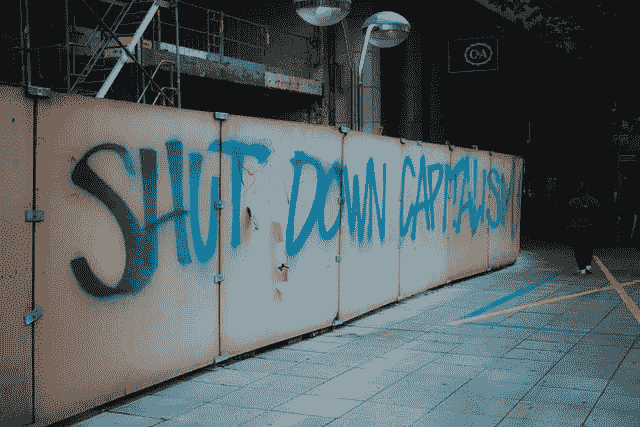

# 资本主义会崩溃吗？

> 原文：<https://medium.datadriveninvestor.com/will-capitalism-collapse-edbe539c4e50?source=collection_archive---------10----------------------->

通过技术、全球化和起义的联系，资本主义正在快速变化

Thanks to Marcel Stauss on Unsplash

## 概述

资本主义会垮台吗？

我认为真正的问题是它是否会先于其他一切崩溃。随着我们的城市着火，昆虫和其他野生动物灭绝，更严重的风暴，饥荒，洪水，火灾，以及对选举过程中被盗的恐惧，看看双塔如何倒塌将是有趣的。以及按什么顺序。

我认为，我们应该更加担心蜂群衰竭失调症。因为很明显，没有食物，我们都会受苦。

过去几周，全球爆发了要求平等和结束警察暴力的抗议活动。世界各地都存在着关于僵化的本土主义和民粹主义国家的紧张局势，由于疫情、洪水、火灾、饥荒甚至对核战争的恐惧而造成的收入和经济损失。全球化和资本主义在这些问题中扮演了怎样的角色是最重要的。

 [## 资本主义中的人类和人工智能|数据驱动的投资者

### 变老的令人惊讶的好处是发现那些引起年轻一代兴趣并经常吓到他们的问题…

www.datadriveninvestor.com](https://www.datadriveninvestor.com/2020/04/16/human-and-artificial-intelligence-in-capitalism/) 

右翼人士要求更多的自由市场和减少监管，而左翼人士则关注航空公司和波音公司。他们观察到，放松管制带来了灾难，随之而来的是自然资源的污染和退化。

平衡很难找到，一旦找到总是岌岌可危。

## 贪婪，还是贫穷？

我认为，人们必须区分资本主义和贪婪的资本主义。第一个可以调整成服从。我对我们大多数人在第二种情况下幸存不抱太大希望:贪婪的资本主义。

贪婪是一个奇怪的词。但它确实让人想起了可以想象的资本主义最糟糕的事情:为了利润而污染世界。殖民和征服。为了短期利益掠夺我们最美丽的地方和资源。宣扬不平等、性别歧视和种族主义，因为如果你能分裂，那么征服就很容易。当使用分而治之的策略时，几乎不需要任何进一步的刺激就可以完成。

历史学家说，希特勒统治世界的辉煌计划就像分而治之一样简单。他知道制造替罪羊，告诉你的人总有人比你差，每次都管用。然后他所要做的就是让反战的人与支持战争的“让我们征服一切”的人开战。

有些人会注意到，当今世界的领导人包括一些不介意拿走火灾和洪水后剩下的任何东西的独裁主义者。

正如历史所证明的那样，人民的声音最终会响起来，要求满足他们的需求。

## 全球化和公平工资的终结

如果贪婪的资本主义战胜了公平的资本主义，世界各地的人们将会看到类似于血汗工厂中的合法奴隶制，以及解除管制的工厂。富裕国家可能会利用政治意愿和财富来控制市场。但是，如果可以针对民主代表制调整控制，或者在北欧等一些地方修改社会主义，全世界的工薪阶层就可以发展获得代表制所需的影响力和收入。

财富差距、种族主义和性别歧视在威权国家大行其道，但这样的政权总是摇摇欲坠，因为暴君很少赢得人民的心。近年来，随着川普和英国退出欧盟的崛起，我们看到移民身份也在其中发挥了作用。世界必须在每一代人中保持警惕，以便形成必要的约束，保持工资和权力的均衡发展。

某种形式的利益相关者资本主义可能会发展和蔓延。

## 交叉世界正在演变

相当多的人注意到，工业化本身是建立在有色人种和通过殖民窃取土著土地的基础上的。这在现代社会不再被庆祝，而是被羞辱。这是一个与世界前所未见的非常不同的视角。

在世界各地，受气候危机、贫困和失去机会影响最大的人们走上街头，争取人权和环境权利。这些全球示威的规模不断增加。仅在本周，LGBTQ 们就在最高法院的判决中取得了胜利，美国的梦想家们庆祝了 DACA 的裁决，该裁决允许儿童时期被带入美国的个人获得公民身份。黑人的命也是命已经影响了全国不情愿的市议会和警察部队去发展和改进。随着越来越多的边缘化群体坚持自己的主张，他们和他们的世界肯定会影响哪种资本主义——如果有的话——的出现。

很明显，在危险的十字路口，贪婪、权力和政策会撞倒那些只想诚实工作一天的行人。在这些危险的十字路口，我们还会发现贫穷、医疗保健不足、不平等以及前面提到的种族主义和性别歧视。

肯定有办法创造一个更美好的世界。

## 可能的世界

为了重组对每个人都有用的资本主义，我们需要有远见的企业家，他们不仅仅是在游戏中攫取他们能攫取的所有战利品。我们需要那些希望重返工作岗位、对自己的贡献得到认可感到满意的员工。绿色新政和后疫情计划，如果设计得当，可以带来巨大的好处，不仅仅是生活工资工作，还可以创造技术、教育、新的绿色基础设施、绿色能源和农业可持续性。

现在，在一个疫情世界，我们必须有足够的远见和创造力，不仅要生存，而且要繁荣。

如果你发现绿色新政对你敏感的耳朵来说很刺耳，那就想出一个更好的计划。把它命名为 Poffaloo dee doo，或者你喜欢的任何名字。但不管它被称为什么，它所带来的繁荣对于拯救民主资本主义至关重要，或者允许它转变为利益相关者资本主义。伟大的想法是伟大变革的必要条件。关键是，直到我们开始在我们这个时代的所有这些十字路口向两边看，我们确实是在一条非常危险的道路上。

我想这是 2014 年宇宙的最后一集，受欢迎的天体物理学家尼尔·德格拉斯·泰森驾驶他的想象宇宙飞船穿越一个绿色的大都市。他发现新的工作和基础设施减轻了气候危机最糟糕的方面。他发现这座绿色、繁荣的城市布满了垂直花园和无污染交通工具。生物多样性在那里蓬勃发展，因为各种各样的种族和性别多样性也是如此。泰森博士探索了让经济为我们服务，而不是让我们为它工作的许多方法。

我还没有看到全新的宇宙，因为我刚刚在这篇文章的研究中发现。

伟大的思想、创新和发明、作为与不作为以及被说服的人，都是创造真正的公平、平等和平等主义资本主义所需要的。甚至改良的社会主义也没有被排除在起草之外。

现在，在一个疫情世界和充满挑战的星球上，我们必须有足够的远见和创造力，不仅要生存，还要繁荣。

**访问专家视图—** [**订阅 DDI 英特尔**](https://datadriveninvestor.com/ddi-intel)