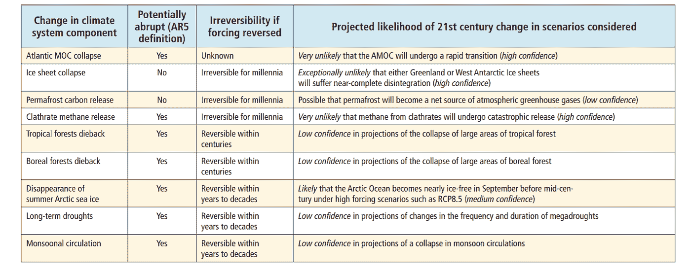
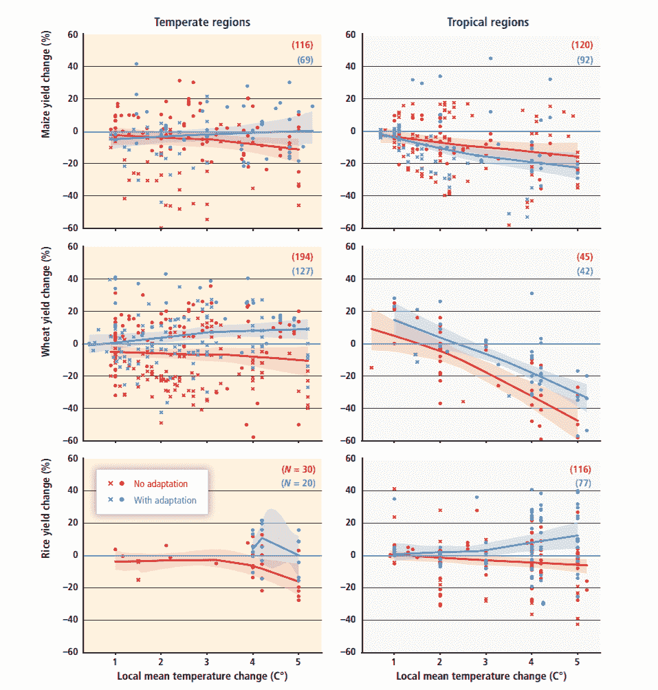

# 气候变化会导致人类灭绝吗？

> 原文：<https://medium.datadriveninvestor.com/will-climate-change-cause-humans-to-go-extinct-341035698193?source=collection_archive---------4----------------------->

*简答和长答。*

简短的回答是:可能不会。

冗长的回答:

可能不会，但是我们不知道我们不知道的。目前，我们知道的不多。

# 我们先明确一下什么是存在风险。

这是一种导致人类灭绝的风险，就像恐龙灭绝一样。这并不等同于过去的世界大战、流行病和大流行甚至文明崩溃。这是整个人类被消灭，或者没有未来的机会，或者一个非常暗淡的未来，就像《1984》这样的反乌托邦小说中出现的那样。

托比 odd 在他的新书《T2 悬崖》中概述了人类在 21 世纪面临的潜在生存风险，这相当于人类将灭绝的几率为六分之一，相当于掷骰子。

这是我们从不同原因走向灭绝的概率分析:

*   自然灾害的风险(小行星、超级火山等的总风险)。) :万分之一
*   自然发生的流行病的风险:万分之一
*   核战争的风险:千分之一
*   气候变化的风险:千分之一
*   工程大流行的风险:1/30
*   来自未校准的通用人工智能的风险:十分之一
*   不可预见的人为风险:1/30

总体风险:六分之一

*如需详细分析，可在本书* [*这里*](https://www.amazon.com/Precipice-Existential-Risk-Future-Humanity-ebook/dp/B07V9GHKYP/ref=sr_1_1_sspa?dchild=1&keywords=the+precipice&qid=1598690799&sr=8-1-spons&psc=1&spLa=ZW5jcnlwdGVkUXVhbGlmaWVyPUEyMkdaRVcwT1NHUjlBJmVuY3J5cHRlZElkPUEwNTkxOTY4MTRBU0RCMzA4VE1RQyZlbmNyeXB0ZWRBZElkPUEwMTkyMzQxMlhGRzdMQVpRV1RQMyZ3aWRnZXROYW1lPXNwX2F0ZiZhY3Rpb249Y2xpY2tSZWRpcmVjdCZkb05vdExvZ0NsaWNrPXRydWU=) *。链接不是附属的，我只是真的很喜欢这本书。*

基于这项总结了大约 15 年研究的分析，气候变化不是我们最大的担忧。如果你真的担心人类灭绝，你应该致力于防止不结盟的通用人工智能(重要 100 倍)，或防止工程疫情(重要 30 倍)。

但是为什么气候变化在列表中的位置如此之低呢？这难道不是 21 世纪最直接的危险之一吗？如果我们现在不采取行动，不是会有灾难性的后果吗？

是的，是的，是的。但是我们还需要打开更多的东西。

Will this dystopian be humanity future?

# 为什么气候变化(可能)不是一个生存风险

首先，托比·Ord 仍然承认气候变化是一个存在风险的千分之一的几率，所以这个几率不是零。但是低到可以忽略不计。

虽然 Ord 在他的分析中没有深入，但在这份非常详细的文件中，研究员约翰·霍尔斯特德讨论了气候变化成为生存风险的所有潜在方式，并估计了它发生的可能性。使用[平衡气候敏感性](https://en.wikipedia.org/wiki/Climate_sensitivity#Equilibrium_climate_sensitivity)和[地球系统敏感性](https://en.wikipedia.org/wiki/Climate_sensitivity#Earth_system_sensitivity)测量，他检查了关键的临界点，如永久冻土碳释放和甲烷释放，物种大灭绝的影响，海洋酸化，热应力，水压力，作物减产和海平面上升。

在所有与气候系统反馈循环和临界点相关的情景中，尤其是那些几千年不可逆的情景中，与人为因素相比，温度的升高实际上可以忽略不计(例如， [以目前的速度](https://doi.org/10.1038/nature14338.)到 2300 年，永久冻土只会导致 0.42 摄氏度的上升，或者根据我们对以前气候时代发生的事情的了解，这种情况不太可能发生(例如，尽管甲烷笼形物能够[释放 500 亿吨](https://doi.org/10.1038/499401a.)碳，并导致 [1.75 摄氏度](http://climatemodels.uchicago.edu/slugulator/)的上升，但这可能需要几个世纪到几千年的时间，在此期间，人类可能有足够的时间来适应和减轻这种影响)。

Summary of key feedback loops and tipping points. Source: IPCC, *Climate Change: The Physical Science Basis*, 526.

还考虑了存在威胁的其他间接威胁，但发现不太可能。在过去，物种已经适应了更高的温度变化，古生物学表明，大规模灭绝的主要原因往往是由于 T2 火山爆发，而不仅仅是二氧化碳的增加。到本世纪末，海平面将上升 1 米，这是可以控制和适应的。同样，热压力会更频繁，但已经有了像空调这样的适应措施，水压力可以通过海水淡化来解决。与此同时，IPCC 模型在变暖 5 度时模拟的作物产量一般会在-20%到+10%的范围内变化。此外，由于基因编辑等技术，储存、物流和运输的改进以减少食物浪费，我们可以预计产量会增加。

Crop yield change prediction by IPCC. Source: IPCC, *Climate Change 2014: Impacts, Adaptation, and Vulnerability: Summary for Policymakers* (Cambridge University Press, 2014), 498.

# 这不全是黑白的

这并不是说气候变化不会令人担忧。到 2100 年，由于热浪、干旱和洪水，它的致命性可能是新冠肺炎的 5 倍，更不用说造成成千上万的气候难民了。

> *到 2060 年，气候变化可能会像新冠肺炎一样致命，到 2100 年，它可能会致命五倍。—比尔·盖茨*

这并不是说它不会导致灭绝。首先，在所有的气候模型中都有很多不确定性，特别是尾部风险，也就是说，如果气温上升 6 度或更多。虽然上升 6 度听起来像是一个遥远的未来，但如果我们在空气中达到 700 ppm 的二氧化碳(这是我们根据当前政策目前的目标[，我们有十分之一的机会](https://doi.org/10.1038/nature18307.)[可能会变暖 6 摄氏度。](http://IPCC, 84.)

此外，即使从物理科学的角度来看，气候变化不会导致生存风险，但它会导致大规模的间接风险，如大规模移民、政治冲突和骚乱。因此，气候变化可能不会直接导致人类灭绝，但与气候变化相关并由气候变化加速的政治动荡可能会导致一场毁灭人类的核战争。或者它可能导致国家间的敌意，阻止合作集中于其他重要的风险，如工程大流行或不结盟的人工智能。

因此，气候变化可能不是一个生存风险，但它应该被视为一个生存风险因素:它的存在可能不会直接导致人类灭绝，但会增加人类灭绝的机会。想想就害怕。

# 对此该怎么办

除了快速脱碳、快速电气化、碳隔离和储存方法的技术和发展等显而易见的答案，以及我在这里列出的其他答案之外，当谈到气候敏感性的尾部风险时，研究尤其缺乏，而且许多关键的反馈回路仍然存在不确定性。托比·Ord 在他的书中列出了可能有用的潜在研究领域:

*   失控温室效应或潮湿温室效应的可能性
*   了解永久冻土和甲烷笼形反馈
*   了解云反馈
*   表征气候敏感性的右尾
*   提高我们对极端变暖的理解
*   在世界粮食供应能力极端和持久下降的情况下，投资于粮食替代品

如果说疫情教会了我们什么的话，那就是我们的系统是多么脆弱，我们是多么依赖自然的力量。如果人类想继续成为自然系统的一部分，我们需要尊重它们，向它们学习，并与之合作。否则，我们付出的代价可能是我们整个物种的存在。

*如果你想进一步了解这个话题，* [*本文档*](https://docs.google.com/document/d/1qmHh-cshTCMT8LX0Y5wSQm8FMBhaxhQ8OlOeRLkXIF0/edit) *和* [*气候冲击*](https://www.amazon.com/Climate-Shock-Economic-Consequences-Hotter/dp/0691171327/ref=sr_1_1?dchild=1&keywords=climate+shock&qid=1598691919&sr=8-1) *是一个极好的开始。*