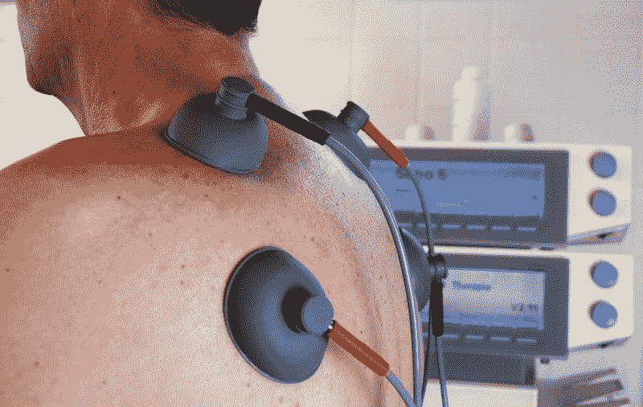
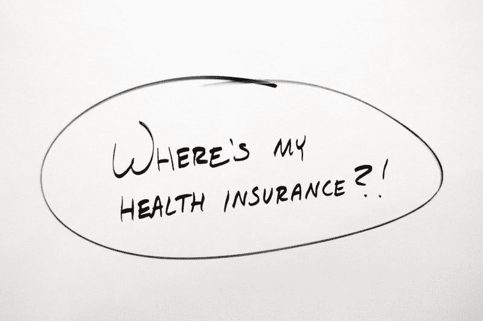
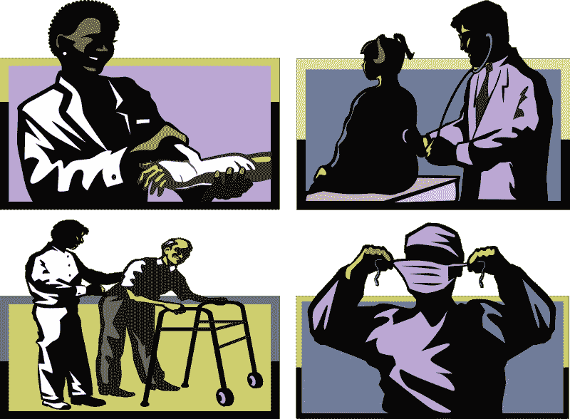

# 冠状病毒会杀死 Anthem 等健康保险公司吗？—市场疯人院

> 原文：<https://medium.datadriveninvestor.com/will-coronavirus-kill-anthem-and-other-health-insurance-companies-market-mad-house-235092f56b8e?source=collection_archive---------18----------------------->

奇怪的是，冠状病毒可以杀死健康保险公司，如 Anthem Inc .(纽约证券交易所代码:ANTM) 。

疫情冠状病毒可能从两个方面伤害 Anthem。首先，冠状病毒医疗费用可能迫使 Anthem 将保费提高 40%，*沙龙*。我认为这样的增加可能会导致许多人取消医疗保险，减少 Anthem 的利润。

为了解释这一点，保险公司将保费建立在医疗成本的基础上。冠状病毒患者需要昂贵的治疗，包括呼吸机和前往重症监护病房(ICU)。Covid 跟踪项目估计，2020 年 4 月 6 日，超过 41，000 名美国人因冠状病毒住院，*巴伦的*。

此外，巴伦称，30%的新冠肺炎患者需要住院治疗。2020 年 4 月 5 日，约翰·霍普金斯冠状病毒资源估计权威机构报告美国有 26000 例。因此，医生每天可能需要收治多达 7，800 人。我估计 26000 的 30%就是 7800。

# 为什么冠状病毒能摧毁 Anthem

冠状病毒对 Anthem(纽约证券交易所:ANTM) 可能是致命的，因为该公司的健康保险计划服务于 7900 万人。此外，Anthem 声称有 4100 万人参加了其蓝十字/蓝盾健康保险计划。

哥伦比亚广播公司新闻，Anthem 的财政处于危险之中，因为哈佛大学流行病学家马克·李普西奇 40%到 70%的人会感染新冠肺炎。如果 Lipsitch 是正确的，Anthem 的 40%到 70%的投保人会感染冠状病毒。此外，其中 30%的人需要住院治疗。

在最坏的情况下，多达 1659 万 Anthem 保单持有人可能需要住院治疗冠状病毒。详细来说，我的计算器估计 7900 万的 70%是 5530 万，5530 万的 30%是 1659 万。

 [## 冠状病毒；惊慌失措；字里行间的 z |数据驱动的投资者

### 围绕冠状病毒的话题；更准确地说，新冠肺炎几乎占据了整个新闻预报的头条…

www.datadriveninvestor.com](https://www.datadriveninvestor.com/2020/03/23/coronavirus-a-to-panic-z-between-the-lines/) 

因此，冠状病毒成本可能会立即抹去 Anthem 在 2019 年 12 月 31 日报告的 259.88 亿美元的现金和短期投资。因此，Anthem 可能会从一家拥有 774.53 亿美元资产的现金充裕的保险公司一夜之间破产。解释一下，Anthem 在 2019 年最后一天的总资产为 774.53 亿美元。

# Anthem 在冠状病毒时代能赚钱吗？

在冠状病毒之前，Anthem 是一家状态非常好的公司。例如，在截至 2019 年 12 月 31 日的季度中，Stockrow Anthem 的收入增长率为 17.26%。

令人印象深刻的是，在截至 2019 年 12 月 31 日的季度，Anthem 的收入为 274.07 亿美元，毛利润为 48.75 亿美元。此外，Anthem 报告 2019 年 12 月 31 日的共同净收入为 9.34 亿美元，营业收入为 12.91 亿美元。

此外，Anthem 报告的投资现金流为 7.23 亿美元，运营现金流为 13.27 亿美元，截至 2019 年 12 月 31 日的期末现金流为 7.47 亿美元。因此，冠状病毒成本可能会在几天内耗尽 Anthem 的所有现金流。

因此，2020 年 3 月 13 日支付的 95₵股息可能是很长一段时间内的最后一次。Anthem 可能会在一夜之间从一只派息不错的股票变成一个废人。

# Anthem 是冠状病毒注定的吗？

有趣的是，迄今为止，市场先生忽略了 Anthem 对冠状病毒的脆弱性。例如，Anthem 的股价从 2020 年 3 月 9 日的 269.82 美元跌至 2020 年 4 月 7 日的 232.09 美元。有趣的是，Anthem 的股价在 2020 年 4 月 9 日上涨至 242.46 美元。

因此，Anthem 保留了它的大部分价值。然而，我认为消灭 Anthem 只需要几周的高额冠状病毒护理费用。

因此，Anthem(纽约证券交易所代码:ANTM) 的唯一救星是联邦政府承担所有冠状病毒治疗费用。联邦政府将为未投保的冠状病毒患者支付医疗费用，但不会帮助保险公司 *Axios* 。

奇怪的是，保险公司不允许为冠状病毒治疗向患者收费。然而，山姆大叔将为冠状病毒护理支付的金额尚不清楚。因此，我们可能会看到 Anthem 崩溃，需要联邦政府的救助。不幸的是，我认为这样的救助在政治上是不可能的，因为健康保险公司不受欢迎。

# 美国最高法院如何伤害 Anthem

具有讽刺意味的是，美国最高法院可能会像冠状病毒一样对 Anthem 不利。解释一下，最高法院将审理两起可能终结奥巴马医改的案件。

在*加州诉得克萨斯州*和*美国众议院诉得克萨斯州*中，原告认为患者保护与平价医疗法案违宪，因为国会废除了奥巴马医改税。因此，这些案件中原告的判决可能会终结所有的奥巴马医改。

Anthem 可能会受到伤害，因为纳税人对出售 Anthem 计划的奥巴马医改交易所的支持可能会终止。此外，资助许多 Anthem 计划的医疗补助扩张可能会结束。值得注意的是，Anthem 在以下州提供医疗补助计划。

# 你应该抛售你的健康保险股票吗？

冠状病毒和最高法院展示了黑天鹅事件如何摧毁最安全的股票。

因此，冠状病毒说明了为什么每个投资者都需要分散投资组合。澄清一下，多样化意味着你需要拥有几种股票。例如，科技股、保险公司、金融公司和工业的组合。

冠状病毒表明，不存在所谓的安全股票。“黑天鹅”可以用意外事件摧毁任何股票。Anthem(纽约证券交易所:ANTM) 表明黑天鹅可以抹去任何股票的价值。因此，现在可能是抛售一些健康保险股票的好时机。

*原载于 2020 年 4 月 9 日*[*【https://marketmadhouse.com】*](https://marketmadhouse.com/will-coronavirus-kill-anthem-and-other-health-insurance-companies/)*。*