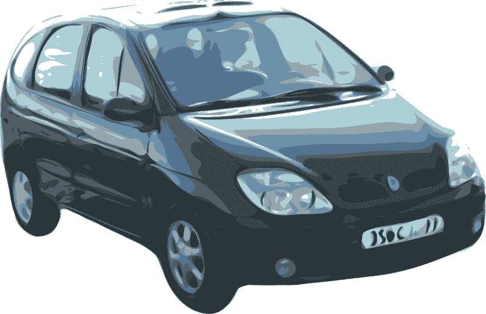

# 冠状病毒会杀死租车公司吗？—市场疯人院

> 原文：<https://medium.datadriveninvestor.com/will-coronavirus-kill-car-rental-companies-market-mad-house-b6ce5bf7aaca?source=collection_archive---------3----------------------->

我们都知道冠状病毒会对航空公司和拼车运营商等运输股造成严重破坏。但是像安飞士预算集团(纳斯达克代码:car)和 T2 赫兹(纽约证券交易所代码:HTZ)这样的汽车租赁公司呢？

航空旅行的大幅下降和假期的冻结将损害汽车租赁公司。然而，在疫情期间，Avis-Budget 或 Hertz 可能有一些赚钱的方法。

首先，与航空公司 Avis-Budget 和 Hertz 经营车辆不同，它们可以向公众销售。因此，这些组织仍然可以通过汽车销售获得一些现金。

第二，一些旅行者会开租来的汽车，而不是乘飞机或火车。毕竟，当你一个人在车里时，保持社交距离是很容易的。然而，在火车、飞机或公共汽车上保持社交距离是很困难的。因此，一些通常乘飞机或火车的人可能会因为害怕新冠肺炎而开出租汽车。

# 汽车租赁股下跌

然而，市场先生对汽车租赁股没有多少信心。**赫兹全球控股公司(NYSE: HTZ)** 股价从 2020 年 3 月 4 日的 12.11 美元跌至 2020 年 4 月 3 日的 4.79 美元。然而，赫兹在 2020 年 4 月 8 日涨到了 5.99 美元。

同样，**安飞士(NASDAQ: CAR)** 股价从 2020 年 3 月 4 日的 30.55 美元跌至 2020 年 4 月 3 日的 10.58 美元，但在 2020 年 4 月 8 日涨至 14.38 美元。因此，每个汽车租赁巨头在一个月内损失了三分之二的价值。这将激起价值投资者的兴趣。

请记住，这些公司拥有大型基础设施和车队。此外，我认为 Avis-Budget 通过其短期汽车租赁或汽车共享服务，在不断下降的汽车拥有量上处于有利地位。

 [## 利用股市相关性的最佳方式|数据驱动的投资者

### 当阿尔弗雷德·温斯洛·琼斯开创了世界上第一个“对冲”基金(后来“d”被去掉了)时，他让其他投资者大吃一惊…

www.datadriveninvestor.com](https://www.datadriveninvestor.com/2020/02/02/the-best-way-to-use-stock-market-correlations/) 

# Avis-Budget 如何通过 Zipcar 从冠状病毒中获利

具体来说，Zipcar 将车辆放在街道和停车场，人们可以短期租用。事实上，你可以只花 15 分钟就租到一辆 Zipcar。

因此，人们可以使用 Zipcar 车辆进行跑腿和短途旅行，通常可以呼叫优步或乘坐公共汽车、地铁或轻轨。在冠状病毒时代，Zipcar 提供了在城镇周围移动的能力，很少与人接触或接触新冠肺炎。

例如，一个纽约人可以使用 Zipcar 去好市多(纽约证券交易所代码:COST) 。值得注意的是，Zipcar 在波士顿和纽约等遭受重创的城市拥有许多车辆。

Avis-Budget 的一个明显的冠状病毒策略是将其机场和其他租赁设施中的许多车辆转换为 Zipcar 租赁。因此，Avis-Budget 仍然可以在大部分航班停飞的情况下从其机队中赚钱。

# Avis Budget 有什么未来价值？

除了 Zipcar， **Avis-Budget (NASDAQ: CAR)** 正在参与 Waymo 在凤凰城地区和其他地区的自动驾驶护理实验。

解释一下，就是 **Alphabet 旗下【纳斯达克股票代码:GOOG】**的自动驾驶汽车实验。Avis-Budget 集团正在为**菲亚特-克莱斯勒(NYSE: FCAU)** 小型货车提供服务，Waymo 正在使用这些小型货车测试其自动驾驶汽车技术。因此，Avis-Budget 拥有自动驾驶汽车的经验。

我认为自驾短期租赁或拼车是 Avis-Budget 的未来。未来，您将通过 Avis-Budget 的应用程序订购车辆。车辆将离开 Avis-Budget 办公室，自动开到您的位置并接您。一旦乘坐结束，车辆返回 Avis-Budget 位置。

短期租车限制一个明显的优势；在未来的流行病中没有人类接触。此外，Avis-Budget 货车可以通过将杂货拖到你家来进行无接触送货。在家里，你可以从货车上拿食品杂货，或者机器人可以把订单带给你。**福特(NYSE: F)** 和 Agility Robotics 就是这样的机器人。

# Avis-Budget 的现值是多少？

上个季度，Avis-Budget Group(NASDAQ:CAR)报告了不断增长的收入和可观的毛利。

具体而言，Stockrow Avis-Budget 在截至 2019 年 12 月 31 日的季度中，收入增长率为 5.46%。令人印象深刻的是，Avis-Budget 在 21.62 亿美元的季度收入中获得了 9.98 亿美元的毛利。

相比之下，Avis-Budget 报告同一季度的共同净收入为 1.42 亿美元，营业收入仅为 3600 万美元。与此同时，Avis-Budget 报告同一季度的运营现金流为 6.55 亿美元，投资现金流为 2.86 亿美元，期末现金流为 1.92 亿美元。

此外，Avis-Budget 在 2019 年结束时的现金和短期投资为 6.96 亿美元，总资产为 231.26 亿美元。然而，市场先生在 2020 年 4 月 6 日以每股 11.68 美元的价格购买了汽车。

然而，对于普通投资者来说，Avis-Budget 是一只可疑的股票，因为它不支付股息。然而，我认为 Avis Budget 为如此便宜的股票提供了很高的安全边际，因为价格很低。

# 赫兹有什么价值？

相比之下，**赫兹全球控股有限公司(HTZ)** 在 2020 年 4 月 8 日的股价为每股 5.99 美元。但是，我觉得赫兹的价值不如 Avis。

特别是，赫兹在短期租赁方面不太活跃，但该公司在自动驾驶车辆方面表现出了一些活力。然而，赫兹的努力比较低调，赫兹一直避免与 Waymo 等行业领导者合作。

目前，赫兹的赚钱潜力类似于 Avis-Budget。例如，赫兹报告称，截至 2019 年 12 月 31 日，其季度收入为 23.25 亿美元，毛利为 9.85 亿美元。

此外，赫兹报告季度营业收入为 6800 万美元，同一天普通净亏损为-1.18 亿美元。此外，赫兹报告 2019 年第四季度的运营现金流为 6.67 亿美元，投资现金流为 10.67 亿美元，期末现金流为 6.65 亿美元。

最后，截至 2019 年 12 月 31 日，赫兹的现金和短期投资为 13.6 亿美元，资产为 246.27 亿美元。因此，赫兹以较低的股价提供了很多价值。

与 Avis-Budget 类似，赫兹不支付股息。然而，股息的缺乏表明赫兹正在将其现金再投资于该公司。

# 租车是价值投资吗？

如果你正在寻找冠状病毒时代的廉价价值投资，租车公司可能是一个不错的选择。

汽车租赁股很便宜，但它们有赚钱的历史，许多资源管理可以适应从流行病中获利。例如，Avis-Budget 可以部署庞大的 Zipcars 车队，在城市中提供短期运输服务。

因此，任何在今天的股票市场寻找便宜货的人都需要探索汽车租赁的世界。

*原载于 2020 年 4 月 8 日*[*【https://marketmadhouse.com】*](https://marketmadhouse.com/will-coronavirus-kill-car-rental-companies/)*。*