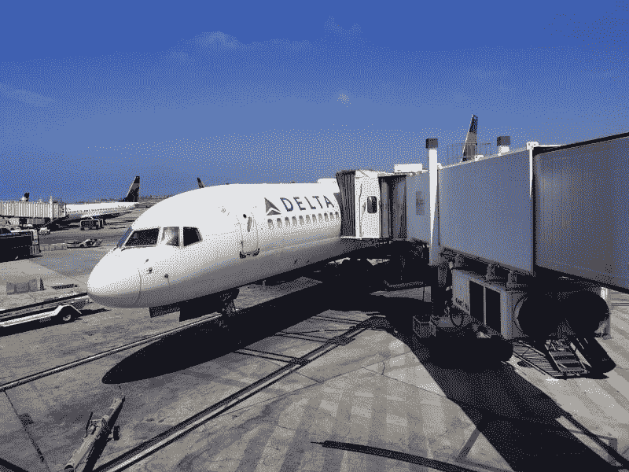
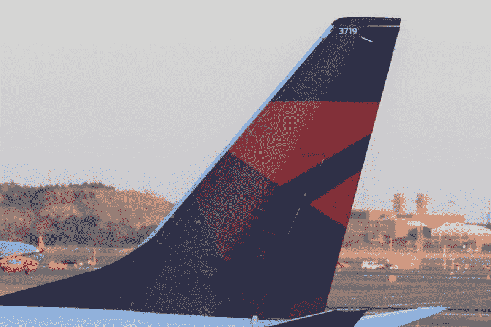

# 冠状病毒会杀死达美航空吗？—市场疯人院

> 原文：<https://medium.datadriveninvestor.com/will-coronavirus-kill-delta-airlines-market-mad-house-75c07efdd1f6?source=collection_archive---------21----------------------->

没有一家公司比达美航空公司更容易受到冠状病毒的攻击。

值得注意的是，达美航空的股价从 2020 年 3 月 2 日的 47.16 美元跌至 2020 年 4 月 3 日的 21.92 美元。令人震惊的是，达美航空的股价在 2020 年 3 月 20 日暴跌至 21.35 美元，随后出现小幅反弹。

冠状病毒威胁着达美航空的生存，因为家庭订单、边境关闭、[社交距离](https://www.nytimes.com/2020/03/29/world/coronavirus-live-news-updates.html)和隔离威胁。几十个国家关闭了边境，实施了旅行禁令。

关闭边境的国家包括:加拿大、智利、美国、中国、印度、日本、马来西亚、菲律宾、澳大利亚、新西兰、以色列、欧盟大部分国家、俄罗斯、瑞士和土耳其，*《纽约时报》*。此外，许多国家禁止或限制外国航班。此外，据英国广播公司报道，美国总统唐纳德·j·特朗普(R-Florida)探索了在纽约州进行冠状病毒检疫的可能性。

# 冠状病毒如何杀死达美航空

旅行限制威胁着达美航空，因为它提供数百个航班飞往 60 个国家的 300 多个目的地。

值得注意的是，达美停飞了 300 多架飞机；其 910 架飞机机队中，大约 30%的飞机*飞行全球*。此外，达美航空计划在未来几个月削减 40%的运力，即 40%的盈利能力。特别是，达美航空计划终止所有飞往欧洲大陆的航班。

 [## 投资区块链前要问的三个简单问题(也是一个困难的问题)|数据…

### 现在是了解区块链的最佳时机。不同货币之间的增长率，比如…

www.datadriveninvestor.com](https://www.datadriveninvestor.com/2020/03/12/three-simple-questions-and-one-difficult-one-to-ask-before-investing-in-a-blockchain/) 

为了节省资金，达美航空公司将推迟飞机交付，削减可自由支配的支出，并向员工提供自愿无薪休假，首席执行官埃德·巴斯迪安于 2020 年 3 月 13 日宣布。结果，达美航空发现自己因为冠状病毒而无法赚钱。

# 达美有多少钱？

可悲的是，达美航空在新冠肺炎·疫情袭击前表现良好。事实上，达美航空在 2019 年 12 月 31 日报告的季度收入为 114.39 亿美元。

此外，达美航空在 2019 年最后一个季度实现了 41.48 亿美元的毛利和 41.48 亿美元的营业收入。这使得达美航空的净收入为 47.67 亿美元，运营现金流为 9.57 亿美元，2019 年最后三个月的期末现金流为 10.32 亿美元。值得注意的是，达美航空同期的融资现金流为 8.42 亿美元。

最后，达美航空在 2020 年 12 月 31 日有 28.82 亿美元的现金和短期投资，总资产为 645.32 亿美元。因此，我认为达美航空是去年增长潜力很大的好股票。有趣的是，达美航空在 2019 年 12 月 31 日报告了 6.49%的收入增长率。

# 达美航空是物超所值的投资吗？

沃伦·巴菲特是德尔塔的忠实信徒。伯克希尔哈撒韦公司(纽约证券交易所代码:BRK。A) 在 2019 年底拥有 DAL 的已发行股份， *Guru Focus* 。详细来说，**伯克希尔哈撒韦公司(纽约证券交易所代码:BRK。B)** 于 2020 年 12 月 31 日拥有 70，910.456 股达美股份。

鉴于这一数据，我不得不怀疑伯克希尔·哈撒韦公司是否会利用疫情收购更多的达美航空公司，或者全部达美航空公司。媒体猜测巴菲特正在寻找一笔大的收购。我认为达美航空公司可能会被收购。

值得注意的是，Macrotrends 估计达美航空在 2020 年 4 月 2 日的市值为 145.2 亿美元。与此同时，*巴伦的*伯克希尔·哈撒韦在 2019 年底拥有 1250 亿美元的现金和等价物。

我认为巴菲特的兴趣表明达美航空有价值潜力，DAL 现在很便宜。然而，我的结论是，由于冠状病毒，达美航空公司没有安全边际。

# 德尔塔有什么价值？

理论上，由于其 910 飞机机队和航空专业知识，达美航空有很大的潜在价值。但是，该值取决于几种可能性，包括:

首先，冠状病毒疫情将不得不迅速结束。流行病学家认为疫情将结束 81%的人口对新冠肺炎产生“群体免疫”，*科学新闻*。人群可能需要三个月才能获得群体免疫。

此外，在世界不同地区发展群体免疫需要不同的时间。鉴于这一数据，我认为最早需要六到八个月才能恢复正常旅行。因此，达美航空将不得不在长达 9 个月的时间里让其大部分飞机停飞。

# 德尔塔没有安全边际

其次，政府允许正常的航空旅行快速恢复。就我个人而言，我看不到任何地方的主要政治领导人会冒险恢复正常旅行。

我的猜测是，无论唐纳德·j·特朗普总统(佛罗里达州共和党)连任的可能性有多大，这种恐惧都是由回归正常的机会所产生的。因此，我认为特朗普至少在一年内不会允许正常旅行。

第三，冠状病毒将不得不快速终结。鉴于流行病学家的计算，我不认为冠状病毒或其产生的恐惧会提前结束。

第四，公众对冠状病毒的恐惧必须完全平息，正常的旅行才能恢复。我的预测是，恐惧将增长到荒谬的程度，而不是消退。记住，记者、官僚、政客和其他害虫可以通过膨胀冠状病毒恐惧来赚很多钱和增加他们的权力。

第五，不会有其他流行病。这种可能性不大，因为我认为媒体会过分夸大任何未来的疾病爆发。政客、记者和其他人煽动疫情的恐惧会让情况变得更糟。

在这种情况下，我认为航空旅行最早也要三到四年才能恢复到目前的水平。因此，达美航空可能会亏损数年。

# 三角洲被冠状病毒毁灭了

归根结底，德尔塔可能会被冠状病毒毁灭。如果达美股价很快跌破 10 美元，该公司将被迫出售自己，可能是出售给伯克希尔哈撒韦公司，我不会感到意外。

伯克希尔可以收购达美航空，因为它的飞机可以作为电子商务巨头的货运机，如亚马逊(纳斯达克股票代码:AMZN)T1 和 T2 沃尔玛(纽约证券交易所股票代码:WMT)T3。亚马逊和沃尔玛的生意都很红火，因为许多人不敢去购物。值得注意的是，亚马逊计划雇佣 10 万名员工来应对冠状病毒、 *The Verge* 。

然而，将客机改装成货运机需要花费大量资金。因此，我认为德尔塔将不得不便宜；伯克希尔哈撒韦公司可能会以每股不到 10 美元的价格收购它。

此外，我看不出达美航空如何能够继续支付其在 2020 年 2 月 19 日提供的 40.25₵股息。我预测达美的分红会结束。

因此，我建议投资者在可预见的未来远离达美航空。我认为德尔塔注定要失败，不会为任何人赚钱，除了伯克希尔哈撒韦公司。

*原载于 2020 年 4 月 3 日 https://marketmadhouse.com**的* [*。*](https://marketmadhouse.com/will-coronavirus-kill-delta-airlines/)