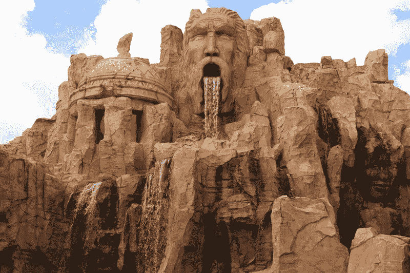

# 冠状病毒会杀死迪士尼吗？—市场疯人院

> 原文：<https://medium.datadriveninvestor.com/will-coronavirus-kill-disney-market-mad-house-204e5732711c?source=collection_archive---------15----------------------->

愤世嫉俗者在问冠状病毒会杀死迪士尼吗，因为他们正在重新开放迪士尼世界和迪士尼乐园。

华特·迪士尼世界将于 2020 年 7 月 11 日重新开放，*《奥兰多哨兵报》* [报道](https://www.orlandosentinel.com/business/tourism/os-bz-coronavirus-disney-world-reopens-20200711-rtlaj7w25vaefezztycvo6zrgm-story.html)。CNET 声称，迪士尼乐园将于 2020 年 7 月 17 日重新开放。EPCOT 和好莱坞工作室将于 2020 年 7 月 15 日重新开放。此外，他们可能会在 2020 年 7 月 23 日重新开放迪士尼乐园酒店。

2020 年 7 月 17 日在 CNET 重新开放。EPCOT 和好莱坞工作室将于 2020 年 7 月 15 日重新开放。此外，他们可能会在 2020 年 7 月 23 日重新开放迪士尼乐园酒店。

迪士尼试图通过面具要求、社交距离、电子门票、虚拟队列以及限制游行和其他活动来保护游客。然而，这些措施有其局限性。例如，奥兰多哨兵报声称电子票务系统崩溃，迫使迪士尼不得不在迪士尼世界排长队。

 [## 股票回购以及为什么我们都要为此买单。数据驱动的投资者

### 我们在创纪录的债务负担、地缘政治紧张局势、选举和气候战争的背景下进入 2020 年。连 3 个都没有…

www.datadriveninvestor.com](https://www.datadriveninvestor.com/2020/04/08/stock-buybacks-and-why-we-all-pay-for-them/) 

# 迪士尼在拿灾难赌博

为了解释这一点，佛罗里达州卫生部于 2020 年 7 月 12 日报告了 15，299 例新的冠状病毒病例。因此， [Clickorlando](https://www.clickorlando.com/news/local/2020/07/12/more-than-10000-covid-19-cases-reported-as-walt-disney-world-reopens-to-public/) 估计，在 2020 年 7 月 12 日，11.25%的佛罗里达人新冠肺炎病毒检测呈阳性。

为了解释这一点，佛罗里达州卫生部于 2020 年 7 月 12 日报告了 15，299 例新的冠状病毒病例。因此， [Clickorlando](https://www.clickorlando.com/news/local/2020/07/12/more-than-10000-covid-19-cases-reported-as-walt-disney-world-reopens-to-public/) 估计在 2020 年 7 月 12 日，11.25%的佛罗里达人被检测为新冠肺炎阳性。

在这种情况下，我无法想象任何负责任的政府会允许其公民进入佛罗里达州奥兰治县的华特·迪士尼世界大厦。事实上，IBM 的沃森人工智能(AI)估计，2020 年 7 月 12 日，佛罗里达州奥兰治县有 18004 例确诊的冠状病毒病例。

此外，沃森估计，在 2020 年 7 月 5 日至 7 月 12 日的几周内，奥兰多确诊的冠状病毒病例数量增长了 28.2%。因此，迪士尼正在重新开放冠状病毒热点地区的一个主要旅游景点。因此，重新开放迪士尼世界毫无意义。

可以预见的是，互联网正在嘲笑开幕式，其特点是在一个巨大的塑料泡沫中的米老鼠等景点。令人震惊的是，迪士尼正试图用一段广受嘲讽的蒙面员工恳求“客人”重返迪士尼世界的视频来吸引游客。市场观察对比了这段视频，它让迪士尼世界看起来像一部恐怖电影。

# 游客不会很快去参观迪士尼度假区

我预计在这种情况下，华特·迪士尼世界将无法吸引足够的游客来支付其运营成本。

迪士尼度假区严重依赖国际游客。然而，冠状病毒旅行限制覆盖全球 93%的人口，*《纽约时报》* [算](https://www.nytimes.com/article/coronavirus-travel-restrictions.html)。例如，日本禁止包括美国在内的 76 个国家的游客入境。

因此，日本游客和他们的信用卡不会很快去美国迪士尼度假区。相比之下，他们在 2020 年 7 月 1 日重新开放了东京迪士尼乐园和迪士尼海洋度假村。

我认为没有一个负责任的政府会允许其公民在下一年去美国旅游。外国政府会隔离美国，因为美国在冠状病毒方面领先世界。

世界计量机构估计，到 2020 年 7 月 15 日，美国冠状病毒病例总数将达到 358 万。相比之下，冠状病毒病例数第二高的是巴西，在那里他们发现了 193.9 万例病例。因此，美国是游客会避开的冠状病毒热点。

# 迪士尼能对度假村做些什么？

我想知道为什么迪士尼要重新开放美国的度假村。我无法想象迪士尼在美国的度假区会很快赚到足够的钱来支付他们的费用。

因此，迪士尼将不得不从其他业务中转移资金，借钱，或获得政府援助，以资助其度假村的运营。此外，在公园处理冠状病毒将分散首席执行官 Bob Chapek 对迪士尼核心业务:娱乐的注意力。

我认为更好的解决办法是为关闭的度假村找到其他用途。例如，他们可以在迪斯尼乐园或迪斯尼世界拍摄下一部《复仇者联盟》或《美国队长》电影。

同样，他们可以在度假胜地拍摄迪斯尼电视节目。特别是，他们可以在[星系边缘](https://www.nytimes.com/article/coronavirus-travel-restrictions.html)星球大战景点拍摄*曼达罗兰*的场景。迪士尼可以通过将公园出租给其他电影公司拍摄来赚钱。

主题公园可能是拍摄的好地方，因为它们很容易封闭。因此，你可以让任何有冠状病毒症状的人远离演职人员。

# 迪士尼的冠状病毒噩梦

我认为**迪士尼(NYSE: DIS)** 因为公园重新开放而面临三场冠状病毒噩梦。

首先，感染冠状病毒的游客可以起诉迪士尼。具体来说，法院尚未就冠状病毒责任或政府给予企业免于新冠肺炎诉讼的努力做出裁决。因此，迪士尼可能面临冠状病毒的巨大诉讼。

其次，如果一名儿童在参观迪士尼公园后死于冠状病毒，迪士尼将面临一场公关噩梦。请记住，迪士尼宣传自己是一个安全、家庭友好的环境。如果孩子们和他们的祖父母在游览了地球上最快乐的地方后死去，这种形象将无法维持。

第三，冠状病毒可能引发政治反弹，从而摧毁迪士尼公园。如果迪士尼乐园或迪士尼世界成为冠状病毒热点，政府将面临关闭这些公园的压力。

迪士尼想做州长派国民警卫队关闭其公园的噩梦吗？类似地，唐纳德·j·特朗普(R-Florida)总统也面临着在选举年对冠状病毒采取措施的政治压力。

# 迪士尼的政治噩梦

唐纳德在冠状病毒问题上表现强硬的一个绝妙方法是派遣海军陆战队关闭迪士尼。特朗普可以通过攻击一家庞大的媒体公司和通过追逐迪士尼保护儿童免受冠状病毒感染来获得政治分数。

此外，佛罗里达州是一个战场州，有数百万老年居民害怕冠状病毒。特朗普将在 11 月需要这些老年选民，因此他将有动力去追踪任何传播冠状病毒的组织。

需要记住的是，特朗普将希望确保老年选民在 11 月投票时的安全。实现这个目标的一个方法是关闭像佛罗里达这样的州的旅游业。

对迪士尼来说，最糟糕的政治噩梦可能是针对冠状病毒传播者的民众行动或治安维持会。例如，一群持枪者或激进的母亲关闭了迪斯尼世界来保护他们的家人。

如果武装的义务警员在公园门口与警察或迪斯尼保安发生冲突，没有人会愿意带家人去迪斯尼世界。如果把迪斯尼公园视为战区，很少有外国游客会带着家人去阿纳海姆或奥兰多。

# 迪士尼赚钱了吗？

我认为**迪士尼(NYSE: DIS)** 拥有战胜冠状病毒的资源。例如，迪士尼在截至 2020 年 3 月 31 日的季度收入为 180.09 亿美元，毛利为 60.91 亿美元。

然而，这些数字低于 2019 年 12 月 31 日的季度毛利 78.42 亿美元和季度收入 208.58 亿美元。此外，迪士尼 2020 年前三个月的季度营业收入从 26.91 亿美元降至 12.25 亿美元。

戏剧性的是，迪士尼的季度共同净收入从 2019 年 12 月 31 日的 21.07 亿美元降至 4 月的 4.6 亿美元。我认为这些数字表明迪士尼在 2020 年的前三个月因冠状病毒而亏损。

# 迪士尼有多少现金？

相反，**华特·迪士尼公司(纽约证券交易所代码:DIS)** 正在产生更多的现金。例如，迪士尼报告 2020 年 3 月 31 日的运营现金流为 31.57 亿美元。

该运营现金流从 2019 年底的 16.3 亿美元增长。此外，迪士尼的期末现金流从 2019 年底的 68.74 亿美元增长到 2020 年 3 月的 68.74 亿美元。

不幸的是，我认为迪士尼借了很多钱。为了解释迪士尼在 2019 年 12 月 31 日报告了 11.7 亿美元的融资现金流。2020 年 3 月 31 日，融资现金流增至 54.99 亿美元。

融资现金流显示了公司通过出售债务筹集的资金。因此，我认为迪士尼是在借钱来支付部分费用。

相比之下，迪士尼的现金和短期投资从 2019 年新年前夕的 68.33 亿美元增长到 2020 年 3 月 31 日的 143.39 亿美元。因此，迪士尼仍然是一家现金充裕的公司。

# 迪士尼有什么价值？

我认为**迪士尼**提供了巨大的价值。例如，迪士尼报告 2020 年 3 月 31 日的总资产为 2062.94 亿美元。此外，迪士尼的资产从 2019 年 12 月 31 日的 2009.48 亿美元增长。

我认为迪士尼最大的资产之一是迪士尼+流媒体服务。迪士尼声称迪士尼+在 2020 年 5 月 4 日拥有 5450 万用户，[美国消费者新闻与商业频道报道](https://marketmadhouse.com/will-coronavirus-kill-disney/#:~:text=Disney%20announced%20Tuesday%20that%20it,subscribers%20as%20of%20March%2028.)。这一数字从 2020 年 4 月 8 日的 5000 多万增加到现在的 1000 多万。

此外，迪士尼的另一个流媒体服务 Hulu 在 2020 年第一季度拥有 3210 万用户。美国消费者新闻与商业频道声称，这个数字比 2020 年最后一个季度的 3040 万有所增加。此外，迪士尼的体育流媒体服务 ESPN+在 2020 年 5 月拥有 790 万用户，这一数字比 3 月份的 660 万有所增长。

因此，迪士尼在 2020 年 5 月拥有 945 亿流媒体用户。因此，迪士尼有一项快速增长的业务来取代主题公园和影院上映的电影。

相比之下，**网飞(纳斯达克股票代码:NFLX)** 在 2020 年 5 月拥有 1.829 亿用户。我认为这些数字表明迪斯尼可以和网飞竞争。

# 迪士尼的中国赌注有了回报

奇怪的是，我认为冠状病毒证明了迪士尼在中国的巨大赌注是正确的。例如，上海迪士尼乐园于 2020 年 5 月 11 日重新开放。

因此，迪士尼在上海度假区投资 55 亿美元显得很明智。相比之下，迪士尼乐园和迪士尼世界将于 2020 年 7 月重新开放，而巴黎迪士尼乐园可能于 7 月 15 日重新开放。

因此，迪士尼在上海度假区投资 55 亿美元显得很明智。相比之下，迪士尼乐园和迪士尼世界将于 2020 年 7 月重新开放，而巴黎迪士尼乐园可能于 7 月 15 日重新开放。

此外，世界计量机构估计，截至 2020 年 7 月 15 日，中国仅报告了 83，611 例冠状病毒病例。此外，中国的冠状病毒病例以每天 6 例的速度增长，而美国在 2020 年 7 月 15 日经历了 35241 例新病例。

因此，迪士尼在这个全球最大的抗新冠肺炎经济体中投入巨资。因此，如果冠状病毒导致美国经济瘫痪(事实也确实如此)，迪士尼可以在中国赚钱。

例如，2019 年中国票房为 79.75 亿美元，[票房 Mojo 估计](https://www.boxofficemojo.com/year/?area=CN)。然而，这一数字比 2018 年下降了 10.4%，当时电影在中国票房收入为 89.01 亿美元。

此外，迪士尼电影(2012 年的《复仇者联盟》原版*)已经八年没有在中国票房高居榜首了。然而，我认为迪士尼押注中国是明智的，因为中国似乎能抵御冠状病毒。*

# 迪士尼强大的安全系数

因此，我认为迪士尼是一个安全的价值投资，因为他们分散了投资。为了解释这一点，华特·迪士尼公司(NYSE: DIS) 在世界上最大的经济体美国和中华人民共和国之间划分其业务。

因此，我认为市场先生在 2020 年 7 月 15 日将迪士尼定价为 121.28 美元是合理的。然而，投资者需要理解迪士尼在其乐园中承担的巨大风险。

然而，我认为，尽管冠状病毒给迪士尼乐园带来了危险，但中国的投资给迪士尼带来了很大的安全边际。因此，我预测，即使迪士尼乐园和迪士尼世界灭亡，迪士尼也不会被冠状病毒感染。

*原载于 2020 年 7 月 15 日 https://marketmadhouse.com**的* [*。*](https://marketmadhouse.com/will-coronavirus-kill-disney/)

**进入专家视图—** [**订阅 DDI 英特尔**](https://datadriveninvestor.com/ddi-intel)